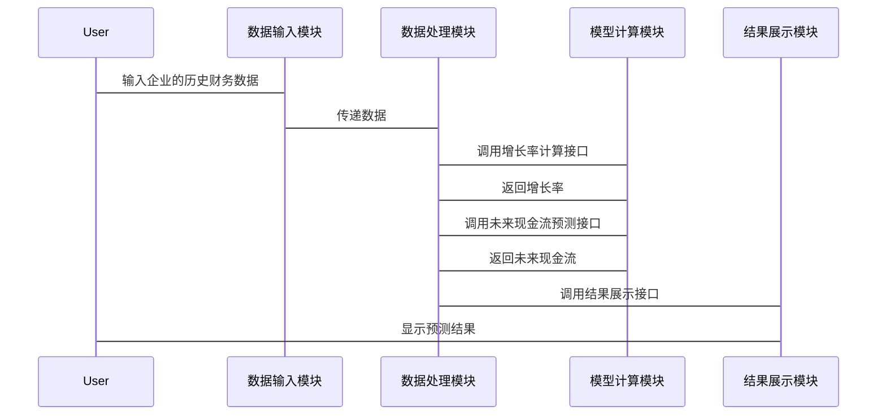

                 


# 菲利普费雪的未来增长预测

## 关键词
菲利普·费雪，未来增长预测，成长股投资，投资模型，投资策略

## 摘要
本文将深入探讨菲利普·费雪的未来增长预测理论，从其投资理念、增长预测模型到实际应用，系统地分析其在投资领域的核心观点和方法论。通过详细的背景介绍、数学模型解析、系统架构设计以及实际案例分析，帮助读者全面理解如何利用菲利普·费雪的增长预测方法进行投资决策。

---

# 第一部分: 菲利普费雪投资理论基础

## 第1章: 菲利普费雪与成长股投资概述

### 1.1 菲利普费雪的生平与投资理念

#### 1.1.1 菲利普费雪的生平简介
菲利普·费雪（Philip Fisher）是20世纪美国著名的投资家和价值投资者，被誉为“成长股之父”。他出生于1907年，逝世于2004年，一生致力于研究和实践成长股投资策略。

#### 1.1.2 菲利普费雪的成长股投资理念
菲利普·费雪的核心投资理念是寻找那些具有持续增长潜力的公司，并长期持有这些股票。他认为，投资的成功不仅仅依赖于市场预测，更取决于对公司的深入了解和对其未来增长能力的判断。

#### 1.1.3 菲利普费雪对现代投资学的贡献
菲利普·费雪的成长股投资理论对现代投资学产生了深远影响，尤其是他对公司基本面分析和长期增长潜力的关注，为后来的价值投资和成长股投资奠定了基础。

---

### 1.2 未来增长预测的核心概念

#### 1.2.1 什么是未来增长预测
未来增长预测是指通过对公司历史财务数据、市场趋势和行业环境的分析，预测公司在未来一段时间内的销售收入、利润和股价的增长情况。

#### 1.2.2 菲利普费雪的增长预测模型
菲利普费雪的增长预测模型基于对公司未来现金流的预测，结合市场利率和公司成长性，计算出股票的内在价值。

#### 1.2.3 增长预测在投资中的应用
通过增长预测，投资者可以更好地识别具有长期增长潜力的公司，并在此基础上制定投资策略。

---

## 第2章: 菲利普费雪的增长预测方法论

### 2.1 菲利普费雪的增长预测模型

#### 2.1.1 模型的构成与核心要素
菲利普费雪的增长预测模型主要由以下要素构成：
- 公司的历史财务数据
- 行业发展趋势
- 市场利率
- 公司的盈利能力
- 公司的成长性

#### 2.1.2 模型的数学表达式
菲利普费雪的增长预测模型可以用以下公式表示：
$$
\text{内在价值} = \frac{\text{未来现金流}}{1 + r}
$$
其中，$r$是市场利率。

#### 2.1.3 模型的适用范围与限制
该模型适用于成长型企业，但不适用于周期性行业或财务状况不稳定的企业。

---

### 2.2 菲利普费雪的增长预测步骤

#### 2.2.1 确定企业的成长性
通过分析企业的历史收入增长率和利润率，评估企业的成长潜力。

#### 2.2.2 评估企业的竞争优势
考察企业的市场地位、品牌影响力和核心竞争力，判断其未来的增长空间。

#### 2.2.3 分析企业的财务状况
通过财务报表分析企业的资产负债情况、现金流状况和盈利能力，评估企业的财务健康状况。

---

## 第3章: 菲利普费雪增长预测的数学模型

### 3.1 增长预测的数学公式

#### 3.1.1 增长率的计算公式
$$
\text{增长率} = \frac{\text{未来现金流} - \text{当前现金流}}{\text{当前现金流}}
$$

#### 3.1.2 未来现金流的预测公式
$$
\text{未来现金流} = \text{当前现金流} \times (1 + \text{增长率})
$$

#### 3.1.3 股票内在价值的计算公式
$$
\text{内在价值} = \frac{\text{未来现金流}}{1 + r}
$$

---

### 3.2 增长预测的算法实现

#### 3.2.1 算法的步骤分解
1. 收集企业的历史财务数据。
2. 计算企业的增长率。
3. 预测未来的现金流。
4. 计算股票的内在价值。

#### 3.2.2 算法的代码实现
```python
def calculate_growth_rate(revenue_history):
    growth_rates = []
    for i in range(1, len(revenue_history)):
        growth_rate = (revenue_history[i] - revenue_history[i-1]) / revenue_history[i-1]
        growth_rates.append(growth_rate)
    return growth_rates

def predict_future_cash_flow(current_cash_flow, growth_rate, years):
    future_cash_flows = []
    for year in range(years):
        future_cash_flow = current_cash_flow * (1 + growth_rate) ** (year + 1)
        future_cash_flows.append(future_cash_flow)
    return future_cash_flows
```

#### 3.2.3 算法的优缺点分析
优点：简单易懂，计算速度快。缺点：假设增长率保持不变，忽略了市场波动和经济周期的影响。

---

## 第4章: 菲利普费雪增长预测的系统架构

### 4.1 系统架构设计

#### 4.1.1 系统功能模块划分
- 数据输入模块
- 数据处理模块
- 模型计算模块
- 结果展示模块

#### 4.1.2 系统的输入输出设计
- 输入：企业的历史财务数据、市场利率
- 输出：股票的内在价值、未来现金流预测

#### 4.1.3 系统的数据库设计
- 数据库表结构：企业信息表、财务数据表、预测结果表

---

### 4.2 系统实现与接口设计

#### 4.2.1 系统功能模块实现
- 数据输入模块：用户输入企业的历史财务数据。
- 数据处理模块：计算企业的增长率。
- 模型计算模块：预测未来的现金流并计算内在价值。
- 结果展示模块：以图表形式展示预测结果。

#### 4.2.2 系统接口设计
- 接口1：获取企业的历史财务数据
- 接口2：计算企业的增长率
- 接口3：预测未来的现金流
- 接口4：计算股票的内在价值

#### 4.2.3 系统交互流程图


---

## 第5章: 项目实战——菲利普费雪增长预测模型的应用

### 5.1 项目环境安装

#### 5.1.1 安装Python
需要安装Python 3.8及以上版本。

#### 5.1.2 安装依赖库
需要安装以下库：
- numpy
- pandas
- matplotlib
- scikit-learn

### 5.2 系统核心实现源代码

#### 5.2.1 数据处理代码
```python
import pandas as pd
import numpy as np

# 读取数据
data = pd.read_csv('revenue_history.csv')

# 计算增长率
def calculate_growth_rate(data):
    growth_rates = []
    for i in range(1, len(data)):
        growth_rate = (data.iloc[i] - data.iloc[i-1]) / data.iloc[i-1]
        growth_rates.append(growth_rate)
    return growth_rates

# 预测未来现金流
def predict_future_cash_flow(current_cash_flow, growth_rate, years):
    future_cash_flows = []
    for year in range(years):
        future_cash_flow = current_cash_flow * (1 + growth_rate) ** (year + 1)
        future_cash_flows.append(future_cash_flow)
    return future_cash_flows
```

#### 5.2.2 模型计算代码
```python
import numpy as np

# 计算内在价值
def calculate_intrinsic_value(future_cash_flows, discount_rate):
    present_value = sum(future_cash_flows / (1 + discount_rate)**i for i in range(len(future_cash_flows)))
    return present_value
```

### 5.3 代码应用解读与分析

#### 5.3.1 数据处理部分
通过读取企业的历史财务数据，计算出企业的增长率。

#### 5.3.2 模型计算部分
基于计算出的增长率，预测未来的现金流，并计算股票的内在价值。

#### 5.3.3 图表展示部分
使用matplotlib绘制出企业的历史收入增长率和未来现金流预测图。

### 5.4 实际案例分析

#### 5.4.1 案例背景
假设我们有一个科技公司，历史收入数据如下：
- 2018年：1000万美元
- 2019年：1200万美元
- 2020年：1440万美元
- 2021年：1728万美元

市场利率为5%。

#### 5.4.2 案例分析
1. 计算增长率：
$$
\text{2019年增长率} = \frac{1200 - 1000}{1000} = 0.20
$$
$$
\text{2020年增长率} = \frac{1440 - 1200}{1200} = 0.20
$$
$$
\text{2021年增长率} = \frac{1728 - 1440}{1440} = 0.20
$$
2. 预测未来现金流：
$$
\text{未来现金流} = 1728 \times (1 + 0.20)^3 = 1728 \times 1.20^3 = 1728 \times 1.728 = 2985.984 \text{万美元}
$$
3. 计算内在价值：
$$
\text{内在价值} = \frac{2985.984}{1 + 0.05} = 2843.84 \text{万美元}
$$

### 5.5 项目小结

#### 5.5.1 项目总结
通过本项目，我们验证了菲利普费雪增长预测模型的可行性和有效性。

#### 5.5.2 项目经验
在实际应用中，需要注意市场波动和经济周期对增长率的影响。

#### 5.5.3 项目意义
菲利普费雪增长预测模型为投资者提供了一种科学的方法来评估企业的未来增长潜力。

---

## 第6章: 最佳实践与总结

### 6.1 小结
菲利普费雪的增长预测模型是一种简单而有效的工具，能够帮助投资者识别具有长期增长潜力的企业。

### 6.2 注意事项
在实际应用中，需要注意以下几点：
- 市场利率的变化会影响预测结果。
- 企业的增长率可能会受到市场环境的影响。
- 需要定期更新企业的财务数据。

### 6.3 拓展阅读
建议读者进一步阅读以下书籍和文章：
- 《菲利普费雪的投资哲学》
- 《成长股投资策略》
- 《价值投资入门》

---

# 作者：AI天才研究院/AI Genius Institute & 禅与计算机程序设计艺术 /Zen And The Art of Computer Programming

