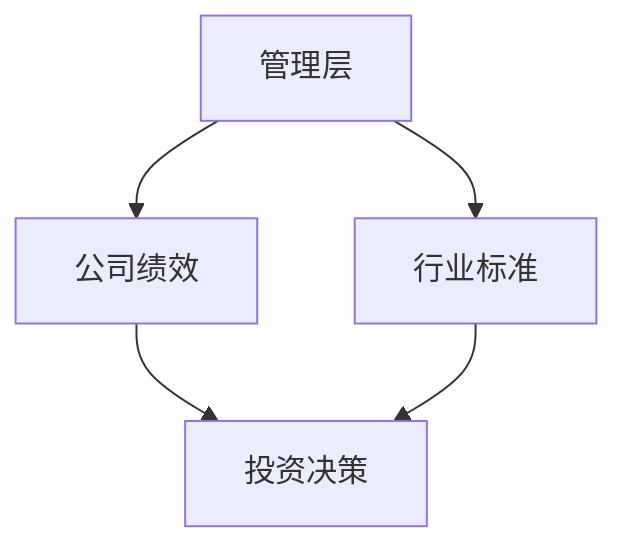
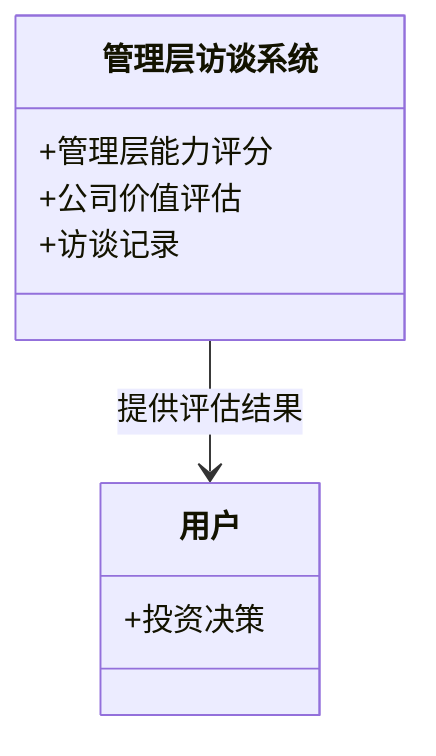
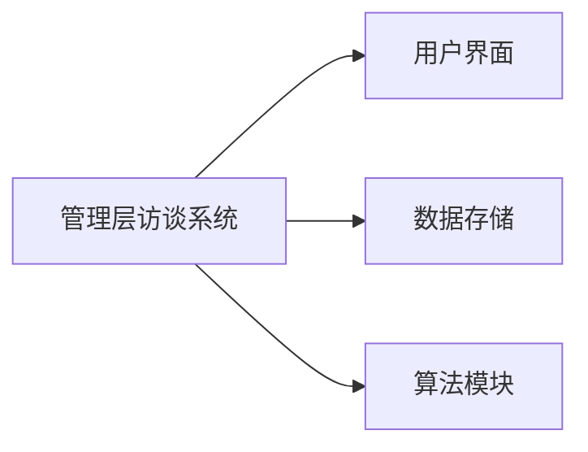

                 

# 菲利普费雪的管理层访谈技巧

> 关键词：菲利普费雪，管理层访谈，投资决策，评估维度，数学模型

> 摘要：本文系统阐述了菲利普费雪的管理层访谈技巧，从投资理念、核心概念、访谈步骤、实际案例、系统分析到实战项目，全面解析了如何通过管理层访谈评估公司价值，构建数学模型和优化决策过程。

---

## 引言

菲利普·费雪是投资界的一位传奇人物，他提出的“成长股投资”理论深刻影响了现代投资策略。本文将探讨其独特的管理层访谈技巧，分析如何通过访谈评估管理层能力，进而影响投资决策。

---

## 第一部分: 背景介绍

### 第1章: 菲利普·费雪的投资理念与管理层访谈的背景

#### 1.1 菲利普·费雪的生平与投资理念
菲利普·费雪是20世纪的投资大师，强调选择优秀的管理层和具有成长潜力的企业。他的投资理念包括长期持有、注重管理层质量和公司基本面分析。

#### 1.2 管理层访谈的重要性
管理层的能力直接影响公司绩效，因此在投资决策中，访谈是评估管理层的重要手段。通过访谈，投资者可以深入了解管理层的决策能力、战略规划和企业愿景。

#### 1.3 管理层访谈的背景与意义
在投资决策中，管理层的能力至关重要。菲利普·费雪通过访谈评估管理层的诚信、智慧和决策能力，以选择优秀的投资标的。

---

### 第2章: 管理层访谈的核心概念与联系

#### 2.1 核心概念原理
- **评估维度**：包括领导力、决策能力、战略规划和团队管理。
- **决策逻辑框架**：管理层如何应对挑战和抓住机会。
- **管理层与公司绩效的关系**：管理层能力直接影响公司绩效。

#### 2.2 对比分析
| 评估维度 | 领导力 | 决策能力 | 战略规划 | 团队管理 |
|----------|--------|----------|----------|----------|
| 重要性   | 高     | 高       | 高       | 中       |

#### 2.3 实体关系图（ER图）

---

### 第3章: 管理层访谈的算法原理与数学模型

#### 3.1 算法原理
- **评分系统**：对管理层的各个维度进行评分，权重不同。
- **问题权重分配**：设计关键问题，赋予不同权重。
- **数学分析**：通过加权评分计算管理层能力评分。

#### 3.2 数学模型与公式
- **管理层能力评分公式**：
  $$ \text{管理层能力评分} = \sum_{i=1}^{n} w_i \times s_i $$
  其中，\( w_i \) 为问题权重，\( s_i \) 为评分。

- **公司价值模型**：
  $$ \text{公司价值} = f(\text{管理层能力}, \text{行业地位}, \text{财务状况}) $$

#### 3.3 举例说明
假设某公司管理层能力得85分，行业地位90分，财务状况80分，则：
$$ \text{公司价值} = f(85, 90, 80) $$

---

## 第二部分: 实际应用与系统分析

### 第4章: 管理层访谈的实际案例分析

#### 4.1 成功案例
某科技公司管理层在访谈中表现出清晰的战略规划和高效的执行能力，投资决策成功。

#### 4.2 失败案例
某制造公司管理层在访谈中表现不佳，后续公司业绩下滑，投资失败。

### 第5章: 系统分析与架构设计

#### 5.1 项目介绍
设计一个基于管理层访谈的评估系统，帮助投资者进行决策。

#### 5.2 系统功能设计（领域模型）

#### 5.3 系统架构设计

---

## 第三部分: 项目实战

### 第6章: 项目实战

#### 6.1 环境安装
安装必要的工具和库，如数据分析工具、绘图库等。

#### 6.2 核心实现
设计访谈问题，收集数据，构建模型，评估公司价值。

#### 6.3 案例分析
详细分析一个案例，展示如何应用访谈技巧进行投资决策。

#### 6.4 总结
总结项目经验，优化访谈流程和评估模型。

---

## 第四部分: 总结与最佳实践

### 第7章: 总结与最佳实践

#### 7.1 小结
菲利普·费雪的管理层访谈技巧提供了科学的投资决策方法，帮助投资者评估公司价值。

#### 7.2 注意事项
- 设计访谈问题时，注重逻辑性和相关性。
- 结合定量和定性分析，全面评估。

#### 7.3 拓展阅读
推荐相关书籍和资源，进一步深入学习。

---

## 结语

菲利普·费雪的管理层访谈技巧是投资决策的重要工具。通过系统化的访谈和分析，投资者可以更准确地评估公司价值，做出明智的投资决策。

---

## 作者

作者：AI天才研究院/AI Genius Institute  
禅与计算机程序设计艺术 /Zen And The Art of Computer Programming

