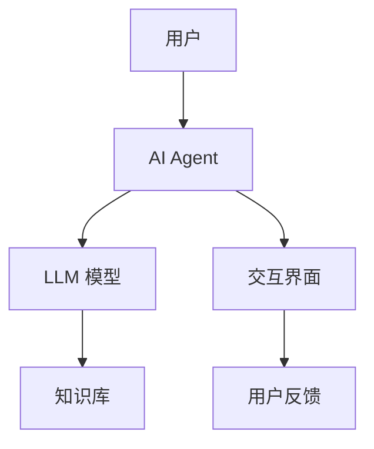
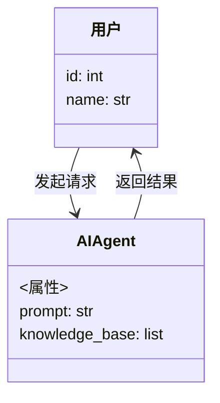
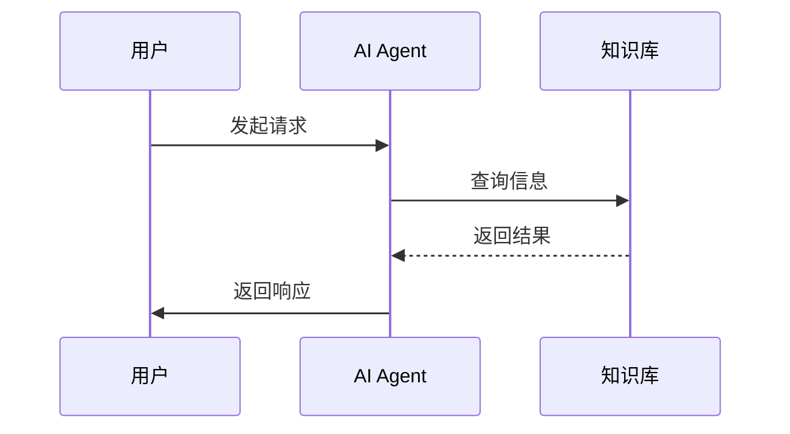

                 


# 虚拟助手 AI Agent：打造基于 LLM 的数字人

> 关键词：虚拟助手 AI Agent，LLM，数字人，自然语言处理，系统架构，项目实战

> 摘要：本文将详细介绍如何基于大语言模型（LLM）打造虚拟助手 AI Agent，并构建数字人系统。文章从背景、核心概念、算法原理、系统架构到项目实战，全面解析打造基于 LLM 的数字人的过程。

---

# 第1章: 虚拟助手 AI Agent 的背景介绍

## 1.1 问题背景与问题描述

### 1.1.1 传统虚拟助手的局限性

传统的虚拟助手，如早期的语音助手，主要依赖于预设的规则和关键词匹配，功能相对单一，难以处理复杂对话和上下文理解。

### 1.1.2 基于 LLM 的 AI Agent 的变革

随着大语言模型（LLM）的发展，AI Agent 能够通过上下文理解、多轮对话和知识推理，提供更智能的服务。

### 1.1.3 问题解决的路径与目标

通过结合 NLP、机器学习和知识图谱，打造一个能够理解、推理和执行复杂任务的 AI Agent。

### 1.1.4 问题的边界与外延

AI Agent 的能力边界包括上下文理解、多轮对话、知识推理和任务执行。数字人概念的外延涵盖虚拟形象、语音交互和多模态交互。

## 1.2 核心概念与组成要素

### 1.2.1 AI Agent 的核心要素

包括自然语言处理、知识图谱、对话管理、推理引擎和执行模块。

### 1.2.2 数字人的功能模块

涵盖用户识别、交互界面、NLP 处理、推理引擎、知识库和执行模块。

### 1.2.3 交互方式的多样性

支持文本、语音、视觉等多种交互方式，提升用户体验。

## 1.3 本章小结

本章介绍了 AI Agent 的背景、核心概念和组成要素，为后续内容打下基础。

---

# 第2章: AI Agent 的核心概念与联系

## 2.1 核心概念原理

### 2.1.1 LLM 的基本原理

大语言模型通过大量数据训练，生成与上下文相关联的文本。

### 2.1.2 AI Agent 的工作流程

包括用户输入、解析、推理、生成和反馈优化。

## 2.2 核心概念对比表

### 表2.1: 各种 AI Agent 模型的优缺点对比

| 模型 | 优点 | 缺点 |
|------|------|------|
| 基于规则的 | 实现简单 | 功能有限 |
| 基于关键词匹配的 | 速度快 | 精度低 |
| 基于 LLM 的 | 功能强大 | 资源消耗高 |

## 2.3 ER 实体关系图



## 2.4 本章小结

本章详细讲解了 AI Agent 的核心概念和与各部分的联系。

---

# 第3章: AI Agent 的算法原理

## 3.1 算法原理概述

### 3.1.1 LLM 的训练流程

包括数据预处理、模型选择、训练优化等步骤。

### 3.1.2 推理过程的数学模型

使用交叉熵损失函数，公式为：$$\text{loss} = -\frac{1}{N}\sum_{i=1}^{N}\sum_{j=1}^{M} y_{ij}\log p(y_{ij})$$

## 3.2 算法实现代码

### 3.2.1 训练代码示例

```python
import tensorflow as tf

def loss_function(real, pred):
    cross_entropy = tf.nn.sparse_softmax_cross_entropy_with_logits(
        labels=real, logits=pred)
    return tf.reduce_mean(cross_entropy)
```

### 3.2.2 推理代码示例

```python
def generate_response(prompt):
    model = load_model('llm_model.h5')
    response = model.generate_response(prompt)
    return response
```

## 3.3 本章小结

本章通过数学公式和代码示例，详细讲解了 AI Agent 的算法原理。

---

# 第4章: 系统分析与架构设计

## 4.1 问题场景介绍

数字人系统用于提供智能客服、个人助手等服务。

## 4.2 系统功能设计

### 4.2.1 领域模型设计



### 4.2.2 系统架构设计


## 4.3 系统接口设计

### 4.3.1 接口设计

提供 RESTful API，支持 POST 请求，处理用户输入。

### 4.3.2 交互流程设计



## 4.4 本章小结

本章详细描述了数字人系统的架构设计和接口设计。

---

# 第5章: 项目实战

## 5.1 环境搭建与开发工具

### 5.1.1 开发环境

安装 Python、TensorFlow、Keras、Flask 等工具。

## 5.2 核心代码实现

### 5.2.1 NLP 模型训练

```python
import tensorflow as tf
from tensorflow.keras import layers

model = tf.keras.Sequential()
model.add(layers.Embedding(input_dim=1000, output_dim=50))
model.add(layers.LSTM(64))
model.add(layers.Dense(1, activation='sigmoid'))
model.compile(optimizer='adam', loss='binary_crossentropy', metrics=['accuracy'])
```

### 5.2.2 API 接口实现

```python
from flask import Flask, request, jsonify

app = Flask(__name__)

@app.route('/api/prompt', methods=['POST'])
def process_prompt():
    data = request.json
    prompt = data['prompt']
    response = generate_response(prompt)
    return jsonify({'response': response})
```

## 5.3 代码解读与分析

详细解读训练和推理代码，分析模型结构和训练过程。

## 5.4 项目小结

总结项目实现过程中的经验教训，强调代码优化和性能调优的重要性。

---

# 第6章: 最佳实践与总结

## 6.1 小结与注意事项

### 6.1.1 数据质量的重要性

确保训练数据的多样性和准确性。

### 6.1.2 模型调优的技巧

包括参数调整、数据增强和模型剪枝。

## 6.2 注意事项

部署时需考虑安全性、隐私保护和性能优化。

## 6.3 未来展望

探讨 AI Agent 的发展方向，包括多模态交互和增强学习。

## 6.4 参考文献与扩展阅读

推荐相关书籍和论文，供读者深入学习。

---

作者：AI天才研究院 & 禅与计算机程序设计艺术

---

通过以上内容，我们全面解析了基于 LLM 打造 AI Agent 的过程，从理论到实践，为读者提供了详尽的指导。希望这篇文章能帮助您更好地理解并实现数字人系统。

