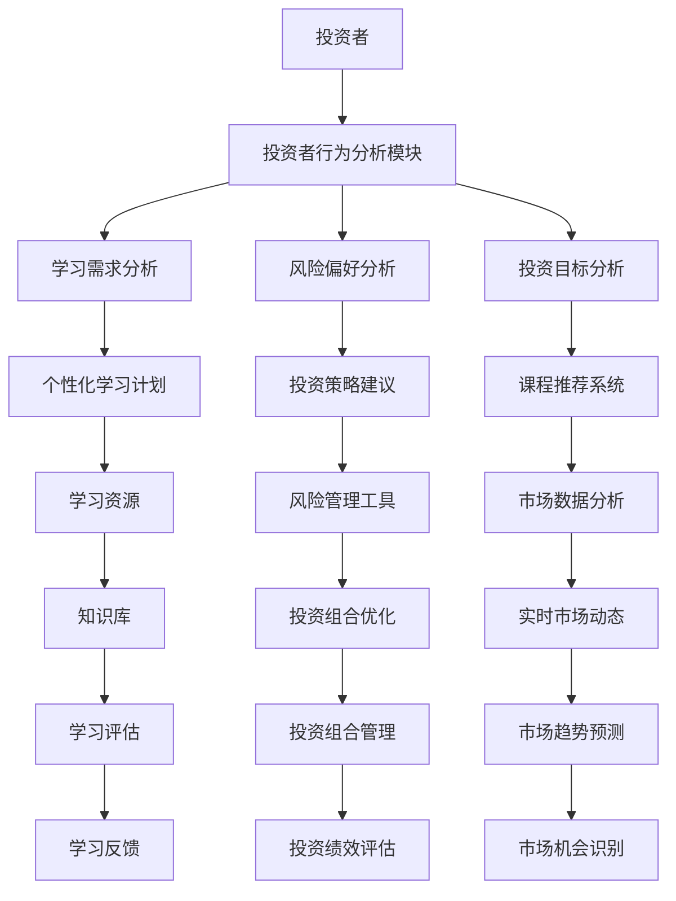

                 


# 融合AI技术的新一代投资理财教育平台

> 关键词：AI技术、投资理财教育、教育平台、机器学习、自然语言处理、系统架构

> 摘要：本文探讨了如何将人工智能技术融合到投资理财教育平台中，构建一个智能化、个性化的学习系统。通过分析AI技术在投资者行为分析、课程推荐、市场数据处理等方面的应用，结合系统架构设计和实际案例，展示了如何利用AI技术提升投资理财教育的效率和效果。

---

## 第一部分：背景与概念

### 第1章：投资理财教育的数字化转型

#### 1.1 问题背景与现状

投资理财教育是帮助个人和机构投资者提升金融知识和投资能力的重要领域。然而，传统投资理财教育模式存在以下问题：

- **内容标准化不足**：传统课程通常基于固定教材，难以根据学员的个性化需求进行调整。
- **互动性低**：学员与教师之间的互动有限，难以实时解决学员的个性化问题。
- **数据驱动不足**：传统教学依赖教师的经验，缺乏系统化、数据化的方法。

此外，随着金融市场的复杂化和投资者需求的多样化，传统的教学模式难以满足现代投资者的需求。例如，投资者需要实时的市场数据分析、个性化的投资策略建议以及灵活的学习方式。

#### 1.2 AI技术在投资理财教育中的应用前景

AI技术的快速发展为投资理财教育带来了新的可能性。通过AI技术，可以实现以下目标：

- **个性化学习路径**：根据学员的投资目标、风险承受能力和知识水平，提供个性化的学习计划。
- **实时市场分析**：利用自然语言处理和机器学习技术，实时分析市场动态并提供投资建议。
- **互动式学习体验**：通过智能语音助手和虚拟现实技术，提供沉浸式的学习体验。

### 第2章：核心概念与技术原理

#### 2.1 投资者行为分析模块

投资者行为分析是个性化学习路径的核心。通过分析投资者的行为数据，可以了解投资者的投资习惯、风险偏好和知识水平，从而为投资者提供个性化的学习建议。

#### 2.2 AI驱动的课程推荐系统

课程推荐系统是投资理财教育平台的重要组成部分。通过分析学员的学习需求和市场动态，系统可以推荐最适合的课程内容。

---

## 第二部分：系统架构与设计

### 第3章：系统架构设计

#### 3.1 系统功能模块设计

系统功能模块设计是投资理财教育平台的核心。通过设计投资者行为分析模块、课程推荐系统、实时市场数据分析模块等，可以为投资者提供全面的学习支持。

#### 3.2 系统架构图

以下是系统的架构图：



---

## 第三部分：AI技术的核心应用

### 第4章：机器学习算法在投资理财教育中的应用

#### 4.1 投资组合优化算法

投资组合优化是投资理财的重要组成部分。通过机器学习算法，可以实现基于风险偏好的投资组合优化。

- **算法原理**：基于强化学习的投资组合优化算法。
- **数学模型**：$$ max \sum_{i=1}^{n} w_i r_i - \lambda \sum_{i=1}^{n} w_i^2 $$

---

## 第四部分：系统实现与案例分析

### 第5章：系统实现与代码解读

#### 5.1 投资组合优化算法的实现

以下是投资组合优化算法的实现代码：

```python
import numpy as np
import pandas as pd
from sklearn.model_selection import train_test_split
from sklearn.linear_model import LinearRegression

# 数据预处理
data = pd.read_csv('market_data.csv')
X = data[['return', 'volatility']]
y = data['risk_assessment']
X_train, X_test, y_train, y_test = train_test_split(X, y, test_size=0.2, random_state=42)

# 模型训练
model = LinearRegression()
model.fit(X_train, y_train)

# 模型预测
y_pred = model.predict(X_test)
print('预测结果:', y_pred)
print('真实结果:', y_test)
print('均方误差:', np.mean((y_pred - y_test)**2))
```

---

## 第五部分：总结与展望

### 第6章：总结与未来展望

#### 6.1 平台建设的意义与价值

投资理财教育平台的建设不仅提升了投资者的学习体验，还为金融机构和教育机构提供了新的发展模式。通过AI技术的应用，投资理财教育将更加个性化、数据化和智能化。

---

作者：AI天才研究院/AI Genius Institute & 禅与计算机程序设计艺术 /Zen And The Art of Computer Programming

---

这篇文章通过详细阐述AI技术在投资理财教育中的应用，展示了如何构建一个智能化的投资理财教育平台。从背景分析到系统设计，再到案例分析，文章全面覆盖了投资理财教育领域的各个方面。通过具体的技术实现和代码示例，读者可以深入了解AI技术如何赋能投资理财教育。

