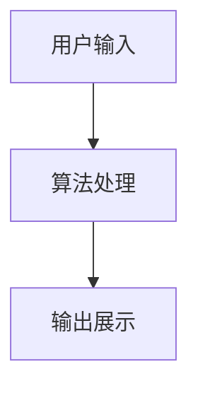

                 


# 视觉艺术领域的AI Agent创作工具

## 关键词
- AI Agent
- 视觉艺术
- 创作工具
- 人工智能
- 软件架构

## 摘要
本文探讨了AI Agent在视觉艺术创作中的应用，从基本概念到算法原理，再到系统设计和实际案例，全面分析了AI Agent创作工具的优势和实现方法。通过详细的系统架构和项目实战，展示了如何利用AI技术提升视觉艺术创作的效率和质量。

---

## 第一部分: AI Agent与视觉艺术的结合

### 第1章: AI Agent的基本概念

#### 1.1 AI Agent的定义与特点
- **AI Agent**：智能体，能够感知环境并采取行动以实现目标。
- **特点**：
  - 智能性：基于数据和算法做出决策。
  - 可交互性：与用户或其他系统进行交互。
  - 可解释性：用户能够理解其决策过程。

#### 1.2 视觉艺术的定义与范围
- **视觉艺术**：通过视觉媒介表达创意和情感，包括绘画、摄影、设计等。
- **范围**：从传统艺术到数字艺术，涵盖平面设计、3D建模、动画等领域。

### 第2章: AI Agent在视觉艺术中的应用

#### 2.1 AI Agent在艺术创作中的作用
- **辅助创作**：帮助艺术家生成灵感和设计草图。
- **自动化处理**：自动优化色彩、构图等技术细节。
- **个性化推荐**：根据用户喜好推荐艺术风格和创作工具。

#### 2.2 视觉艺术创作中的痛点
- **效率低下**：传统创作过程耗时且复杂。
- **资源不足**：艺术家需要大量工具和数据支持。
- **不确定性**：创作过程受主观因素影响较大。

---

## 第二部分: AI Agent创作工具的算法原理

### 第3章: 基于生成对抗网络的图像生成

#### 3.1 生成对抗网络（GAN）原理
- **生成器**：通过深度神经网络生成图像。
- **判别器**：判断生成图像与真实图像的区别。
- **对抗训练**：生成器和判别器互相改进，最终生成逼真的图像。

#### 3.2 GAN在视觉艺术中的应用
- **案例分析**：生成抽象画、数字艺术作品等。

### 第4章: 基于强化学习的创作优化

#### 4.1 强化学习原理
- **策略网络**：制定创作步骤的策略。
- **奖励机制**：根据创作结果给予反馈，优化策略。

#### 4.2 强化学习在艺术创作中的应用
- **优化构图**：通过算法优化画面布局和色彩搭配。

---

## 第三部分: 系统设计与实现

### 第5章: 系统架构设计

#### 5.1 系统功能模块
- **用户输入模块**：接收创作需求和参数。
- **算法处理模块**：执行图像生成和优化。
- **输出展示模块**：展示生成的艺术作品。

#### 5.2 系统架构图


### 第6章: 项目实战

#### 6.1 环境安装
- **工具安装**：安装Python、TensorFlow、Keras等库。
- **依赖管理**：使用虚拟环境管理依赖项。

#### 6.2 核心代码实现
```python
import tensorflow as tf
from tensorflow.keras import layers

# 定义生成器
def build_generator():
    model = tf.keras.Sequential()
    model.add(layers.Dense(256, activation='relu', input_dim=100))
    model.add(layers.Reshape((16, 16, 1)))
    model.add(layers.Conv2DTranspose(16, (4,4), strides=(2,2), padding='same', activation='relu'))
    model.add(layers.Conv2DTranspose(8, (4,4), strides=(2,2), padding='same', activation='relu'))
    model.add(layers.Conv2DTranspose(3, (4,4), strides=(2,2), padding='same', activation='sigmoid'))
    return model

# 定义判别器
def build_discriminator():
    model = tf.keras.Sequential()
    model.add(layers.Conv2D(8, (4,4), strides=(2,2), padding='same', activation='relu', input_shape=(64,64,3)))
    model.add(layers.Conv2D(16, (4,4), strides=(2,2), padding='same', activation='relu'))
    model.add(layers.Flatten())
    model.add(layers.Dense(1, activation='sigmoid'))
    return model
```

#### 6.3 案例分析
- **案例1**：生成抽象画。
- **案例2**：优化摄影作品的构图。

---

## 第四部分: 应用与展望

### 第7章: 视觉艺术领域的AI Agent应用

#### 7.1 实际应用案例
- **数字艺术创作**：生成数字绘画和插图。
- **艺术教育**：辅助学生学习和创作。

#### 7.2 未来发展趋势
- **多模态融合**：结合文本、图像等多种数据源。
- **实时互动**：实现更自然的人机交互。

---

## 作者
作者：AI天才研究院 & 禅与计算机程序设计艺术

