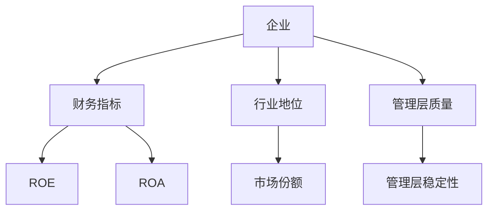
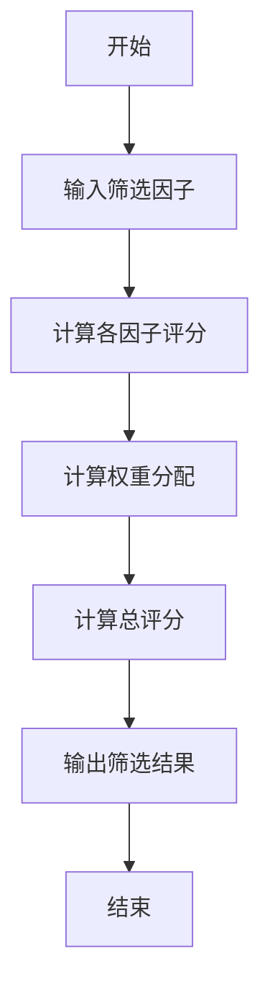
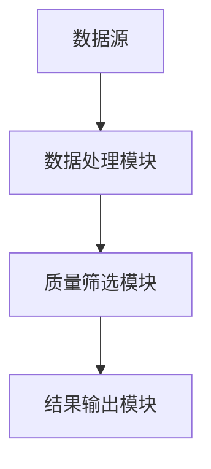

                 


# 詹姆斯·奥肖内西的价值投资者的质量筛选

> 关键词：价值投资、质量筛选、多因子模型、财务指标、投资策略

> 摘要：本文详细探讨了詹姆斯·奥肖内西的价值投资理念中的质量筛选方法，从核心概念、算法原理、系统架构到项目实战，全面解析了如何通过质量筛选实现价值投资的目标。通过理论与实践相结合，帮助读者掌握高质量的投资策略。

---

## 第1章 价值投资与质量筛选概述

### 1.1 价值投资的核心理念

#### 1.1.1 价值投资的定义与起源
价值投资是一种以低于内在价值的价格买入优质股票的投资策略，其核心理念是寻找市场先生的错误定价。这种方法起源于本杰明·格雷厄姆的学生——沃伦·巴菲特，而詹姆斯·奥肖内西则是价值投资领域的另一位重要实践者。他强调，投资的核心是理解企业的真实价值，而不是市场的短期波动。

#### 1.1.2 质量筛选在价值投资中的重要性
质量筛选是价值投资的关键步骤之一。通过筛选高质量的公司，投资者可以降低风险，提高投资组合的稳定性。奥肖内西的质量筛选方法注重企业的财务健康、行业地位和管理层质量，这些因素共同决定了企业的长期价值。

#### 1.1.3 质量筛选的基本原则与目标
- **基本原则**：
  1. 稳定的盈利能力：企业应具备持续的盈利能力和较高的ROE（净资产收益率）。
  2. 健康的财务状况：低负债率、合理的流动比率和速动比率。
  3. 强大的行业地位：市场领导者或具有竞争优势的公司。
  4. 优秀的管理层：管理层应具备诚信和卓越的经营能力。
- **目标**：
  1. 筛选出具备长期增长潜力的公司。
  2. 降低投资风险，避免亏损企业。
  3. 提高投资组合的整体回报率。

---

### 1.2 质量筛选的核心概念

#### 1.2.1 质量筛选的定义与特征
质量筛选是一种通过多维度分析，识别出具备高质量特征的企业的过程。其特征包括：
- **多维度性**：结合财务指标、行业地位、管理层质量等多方面因素。
- **长期导向**：关注企业的长期价值，而非短期市场波动。
- **定性与定量结合**：既有定量的财务指标分析，也有定性的行业地位和管理层评估。

#### 1.2.2 质量筛选的核心要素与维度
- **财务指标**：
  - 净利润率（Net Profit Margin）
  - 资产回报率（ROA）
  - 净资产收益率（ROE）
  - 负债率
- **行业地位**：
  - 市场份额
  - 行业排名
  - 竞争优势
- **管理层质量**：
  - 管理层稳定性
  - 企业治理结构
  - 管理层决策历史

#### 1.2.3 质量筛选与价值投资的关系
质量筛选是价值投资的核心步骤之一。通过筛选高质量的企业，投资者可以更好地识别出具备长期增长潜力的公司，从而实现超额收益。

---

### 1.3 价值投资者的质量筛选方法

#### 1.3.1 基于财务指标的质量筛选
- **筛选标准**：
  - 净利润持续增长
  - ROE高于行业平均水平
  - 负债率低于50%
- **案例分析**：
  某公司过去5年的ROE分别为15%、16%、14%、18%、17%，表现出稳定的盈利能力。

#### 1.3.2 基于行业分析的质量筛选
- **筛选标准**：
  - 行业增长空间大
  - 市场份额稳定
  - 行业集中度高
- **案例分析**：
  某行业前三名的公司市场份额分别为35%、25%、20%，显示出较强的行业地位。

#### 1.3.3 基于管理层质量的质量筛选
- **筛选标准**：
  - 管理层无重大违规记录
  - 企业治理结构完善
  - 管理层具备长期任职经历

---

## 第2章 质量筛选的核心概念与联系

### 2.1 质量筛选的核心原理

#### 2.1.1 质量筛选的理论基础
质量筛选基于基本面分析，强调通过对企业财务状况、行业地位和管理层质量的深入分析，识别出具备长期竞争优势的企业。

#### 2.1.2 质量筛选的关键要素
- 财务健康：低负债率、高ROE
- 行业地位：市场份额、竞争优势
- 管理层质量：诚信、能力

#### 2.1.3 质量筛选的逻辑框架
1. 确定筛选目标：寻找具备长期竞争优势的企业。
2. 设定筛选标准：结合财务指标、行业地位和管理层质量。
3. 筛选与评估：通过多维度分析，筛选出符合条件的企业。

---

### 2.2 核心概念对比分析

#### 2.2.1 质量筛选与数量筛选的对比
- **质量筛选**：关注企业的内在价值，注重长期竞争优势。
- **数量筛选**：基于数量化指标，可能忽视企业基本面。

#### 2.2.2 质量筛选与价值评估的对比
- **质量筛选**：筛选出具备高质量特征的企业。
- **价值评估**：计算企业的内在价值，确定其合理价格。

#### 2.2.3 质量筛选与风险评估的对比
- **质量筛选**：降低投资风险，通过筛选高质量企业。
- **风险评估**：分析企业的财务风险、行业风险等。

---

### 2.3 质量筛选的ER实体关系图



---

## 第3章 质量筛选的算法原理与数学模型

### 3.1 质量筛选的算法原理

#### 3.1.1 质量筛选的多因子模型
- **因子选择**：ROE、ROA、负债率、市场份额。
- **权重分配**：根据因子的重要性分配权重，例如ROE和ROA各占40%，负债率和市场份额各占10%。

#### 3.1.2 质量筛选的权重分配
$$
\text{权重分配} = \begin{cases}
\text{ROE} & 40\% \\
\text{ROA} & 40\% \\
\text{负债率} & 10\% \\
\text{市场份额} & 10\% \\
\end{cases}
$$

#### 3.1.3 质量筛选的评分系统
$$
\text{总评分} = w_{ROE} \times f_{ROE} + w_{ROA} \times f_{ROA} + w_{负债率} \times f_{负债率} + w_{市场份额} \times f_{市场份额}
$$
其中，\( w \) 表示权重，\( f \) 表示评分。

---

### 3.2 质量筛选的数学模型

#### 3.2.1 质量筛选的评分公式
$$
\text{总评分} = \sum_{i=1}^{4} w_i \times f_i
$$
其中，\( w_i \) 为第 \( i \) 个因子的权重，\( f_i \) 为评分。

#### 3.2.2 质量筛选的优化模型
$$
\max \sum_{i=1}^{4} w_i \times f_i
$$
受制于：
$$
\sum_{i=1}^{4} w_i = 1
$$

---

### 3.3 质量筛选的算法流程图



---

## 第4章 质量筛选的系统分析与架构设计

### 4.1 系统分析

#### 4.1.1 问题场景介绍
- **问题**：如何通过多维度分析，筛选出具备高质量特征的企业？
- **目标**：设计一个基于多因子模型的质量筛选系统。

#### 4.1.2 项目目标与范围
- **目标**：开发一个自动化质量筛选系统。
- **范围**：涵盖财务指标、行业地位、管理层质量三个维度。

#### 4.1.3 系统功能需求
- 数据收集模块：收集企业的财务数据、行业数据和管理层信息。
- 数据处理模块：清洗、转换和存储数据。
- 质量筛选模块：基于多因子模型计算企业评分。
- 结果输出模块：展示筛选结果并生成报告。

---

### 4.2 系统架构设计

#### 4.2.1 系统架构图



#### 4.2.2 模块功能说明

##### 数据处理模块
- 数据清洗：去除无效数据。
- 数据转换：将数据转换为可分析格式。
- 数据存储：将数据存储到数据库中。

##### 质量筛选模块
- 因子计算：计算ROE、ROA、负债率和市场份额。
- 权重分配：根据权重计算企业评分。
- 评分输出：输出企业的总评分。

##### 结果输出模块
- 结果展示：展示企业的评分结果。
- 报告生成：生成质量筛选报告。
- 数据导出：将结果导出为Excel或PDF格式。

---

## 第5章 项目实战

### 5.1 环境安装

#### 5.1.1 安装Python
```bash
python --version
pip install --upgrade pip
```

#### 5.1.2 安装依赖库
```bash
pip install pandas numpy matplotlib
```

---

### 5.2 系统核心实现源代码

#### 5.2.1 数据收集模块
```python
import pandas as pd

def collect_data():
    # 假设数据存储在Excel文件中
    df = pd.read_excel('companies.xlsx')
    return df
```

#### 5.2.2 数据处理模块
```python
def process_data(df):
    # 清洗数据
    df.dropna(inplace=True)
    df['ROE'] = df['净利润'] / df['净资产']
    df['ROA'] = df['净利润'] / df['总资产']
    return df
```

#### 5.2.3 质量筛选模块
```python
def quality_screening(df):
    # 权重分配
    weights = {'ROE': 0.4, 'ROA': 0.4, '负债率': 0.1, '市场份额': 0.1}
    # 计算评分
    df['总评分'] = df['ROE'] * weights['ROE'] + df['ROA'] * weights['ROA'] + df['负债率'] * weights['负债率'] + df['市场份额'] * weights['市场份额']
    return df
```

#### 5.2.4 结果输出模块
```python
def output_results(df):
    # 展示结果
    print(df[['公司名称', '总评分']].head())
    # 生成报告
    df.to_excel('筛选结果.xlsx', index=False)
```

---

### 5.3 实际案例分析

#### 5.3.1 数据收集
假设我们有以下公司数据：
| 公司名称 | 净利润 | 净资产 | 总资产 | 负债率 | 市场份额 |
|----------|--------|--------|--------|--------|----------|
| A公司    | 100    | 500    | 800    | 30%    | 35%      |
| B公司    | 80     | 400    | 600    | 20%    | 25%      |
| C公司    | 90     | 450    | 700    | 25%    | 20%      |

#### 5.3.2 数据处理
```python
df = collect_data()
df = process_data(df)
```

#### 5.3.3 质量筛选
```python
df = quality_screening(df)
```

#### 5.3.4 结果输出
```python
output_results(df)
```

---

### 5.4 项目小结

- **项目目标**：通过多因子模型筛选出高质量的企业。
- **实现步骤**：数据收集、数据处理、质量筛选和结果输出。
- **结果展示**：生成筛选结果并导出报告。

---

## 第6章 最佳实践与小结

### 6.1 最佳实践

#### 6.1.1 数据来源的可靠性
确保数据来源可靠，避免错误数据影响筛选结果。

#### 6.1.2 权重调整的灵活性
根据市场变化和企业特点，灵活调整各因子的权重。

#### 6.1.3 持续优化
定期更新数据和调整筛选模型，以适应市场变化。

---

### 6.2 小结

通过本文的详细讲解，读者可以掌握詹姆斯·奥肖内西的质量筛选方法，并能够将其应用于实际投资中。质量筛选是一种科学的投资方法，通过多维度分析，帮助投资者识别出具备长期竞争优势的企业。

---

## 作者

作者：AI天才研究院/AI Genius Institute & 禅与计算机程序设计艺术 /Zen And The Art of Computer Programming

