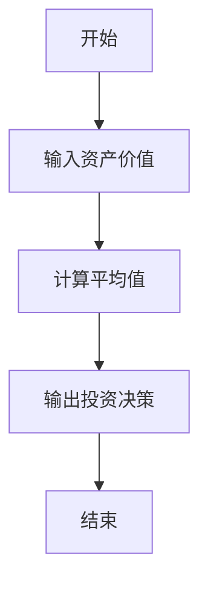
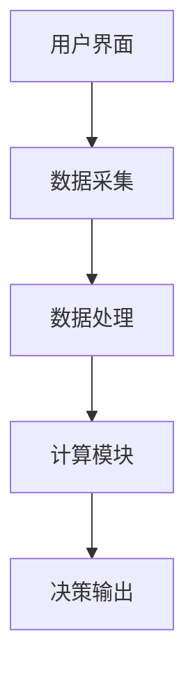
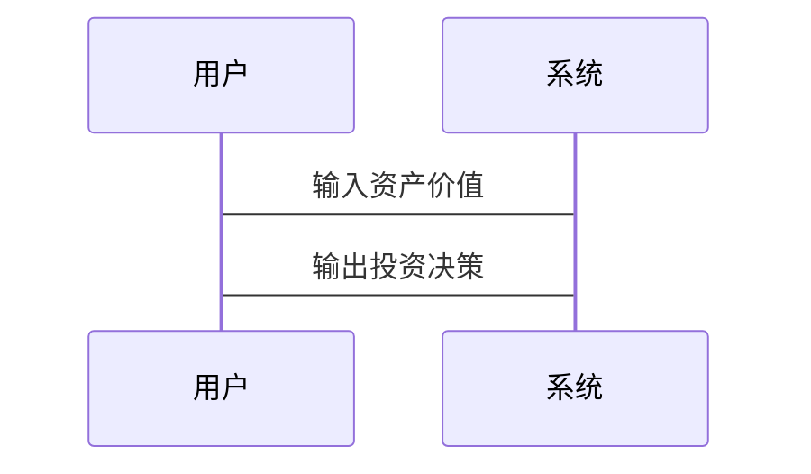
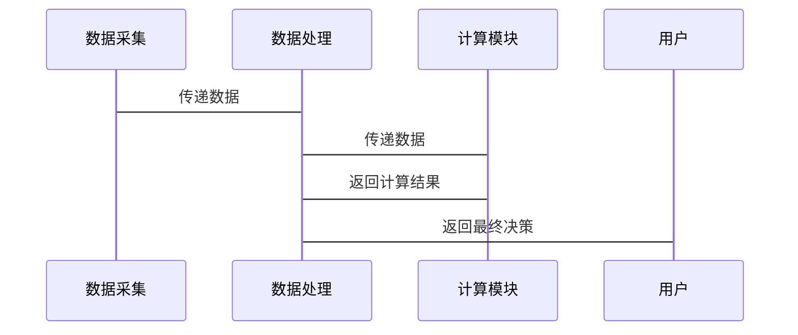

                 


# 詹姆斯·蒙蒂尔的价值平均策略：纪律性投资方法

## 关键词
价值平均策略，纪律性投资，詹姆斯·蒙蒂尔，投资策略，系统设计

## 摘要
价值平均策略是一种以纪律性为核心的定量投资方法，由著名投资者詹姆斯·蒙蒂尔提出。该策略通过计算资产的平均价值，制定投资决策，强调纪律性执行。本文从策略背景、数学模型、系统实现、实战案例等多方面详细解析，结合系统架构设计、算法实现、项目实战等内容，为读者提供全面的策略解读。文章还探讨了策略的优势、局限性和实际应用中的注意事项，帮助投资者更好地理解和应用这一投资方法。

---

## 目录

### 第一章: 价值平均策略的背景与概念

#### 1.1 价值平均策略的定义与核心原理
- 1.1.1 价值平均策略的定义
- 1.1.2 价值平均策略的核心原理
- 1.1.3 价值平均策略与其他投资策略的对比

#### 1.2 价值平均策略的数学模型与公式
- 1.2.1 价值平均策略的数学表达式
  $$V = \frac{1}{n} \sum_{i=1}^{n} v_i$$
  其中，$V$ 表示平均值，$v_i$ 表示第 $i$ 个资产的价值，$n$ 表示资产数量。
- 1.2.2 价值平均策略的计算流程图
  ```mermaid
  graph TD
    A[开始] --> B[输入资产价值]
    B --> C[计算平均值]
    C --> D[输出投资决策]
    D --> E[结束]
  ```

#### 1.3 詹姆斯·蒙蒂尔的价值平均策略特点
- 1.3.1 纪律性投资的核心要素
- 1.3.2 价值平均策略的优势与劣势
- 1.3.3 价值平均策略的适用场景

### 第二章: 价值平均策略的算法实现

#### 2.1 价值平均策略的计算流程
- 2.1.1 数据输入与处理
- 2.1.2 平均值计算
- 2.1.3 投资决策输出

#### 2.2 价值平均策略的算法实现代码
```python
def value_average_strategy(asset_values):
    return sum(asset_values) / len(asset_values)
```

#### 2.3 算法流程图


### 第三章: 投资系统的架构设计

#### 3.1 系统功能模块
- 3.1.1 数据采集模块
- 3.1.2 数据处理模块
- 3.1.3 投资决策模块

#### 3.2 系统架构设计


#### 3.3 系统接口设计
- 3.3.1 数据接口
- 3.3.2 计算接口
- 3.3.3 输出接口

### 第四章: 系统交互流程

#### 4.1 用户操作流程


#### 4.2 系统内部交互


### 第五章: 项目实战

#### 5.1 环境配置
- 5.1.1 安装必要的库和工具
- 5.1.2 配置数据源

#### 5.2 核心代码实现
```python
def value_average_strategy(asset_values):
    return sum(asset_values) / len(asset_values)
```

#### 5.3 项目案例分析
- 5.3.1 案例背景
- 5.3.2 数据输入
- 5.3.3 计算过程
- 5.3.4 投资决策

#### 5.4 代码解读与分析
- 5.4.1 代码功能分析
- 5.4.2 代码实现细节
- 5.4.3 代码优化建议

### 第六章: 总结与展望

#### 6.1 总结
- 6.1.1 价值平均策略的优势
- 6.1.2 纪律性投资的重要性
- 6.1.3 系统设计的关键点

#### 6.2 注意事项
- 6.2.1 数据质量的重要性
- 6.2.2 系统维护的必要性
- 6.2.3 投资策略的适应性

#### 6.3 未来展望
- 6.3.1 价值平均策略的改进方向
- 6.3.2 纪律性投资的未来发展
- 6.3.3 技术在投资中的应用前景

### 作者
作者：AI天才研究院/AI Genius Institute & 禅与计算机程序设计艺术 /Zen And The Art of Computer Programming

---

以上是完整的目录结构和文章内容框架，涵盖了价值平均策略的背景、算法、系统设计、项目实战以及总结等部分。文章语言简明扼要，逻辑清晰，适合技术背景的读者阅读。

