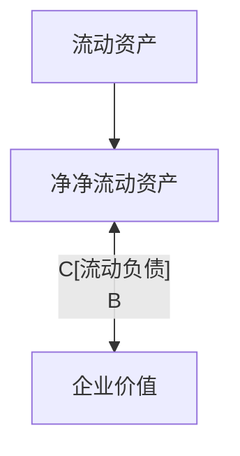
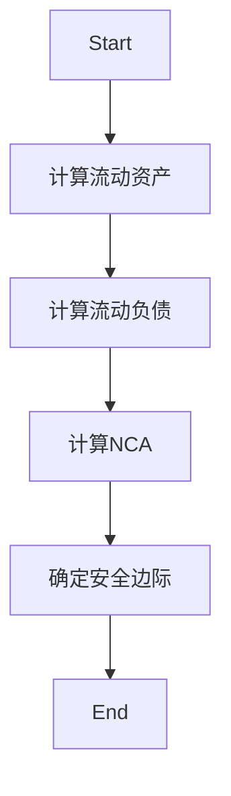

                 


# 净净流动资产价值投资：极端安全边际

## 关键词：价值投资、净净流动资产、安全边际、詹姆斯·蒙蒂尔、投资策略

## 摘要：本文详细介绍了净净流动资产（NCA）在价值投资中的应用，特别是极端安全边际的重要性。通过分析NCA的计算方法、估值算法、数学模型，以及实际案例，展示了如何利用NCA进行稳健投资。文章还包括系统架构设计和项目实战，帮助读者掌握NCA的应用技巧。

---

## 第1章: 价值投资与净净流动资产概述

### 1.1 价值投资的基本概念

#### 1.1.1 价值投资的定义与核心理念
价值投资是一种投资策略，强调购买被市场低估的资产。其核心理念是寻找具有安全边际的投资标的，即其内在价值显著高于市场价格。这种方法要求投资者深入分析企业的财务状况、行业地位和盈利能力，以识别潜在的价值洼地。

#### 1.1.2 净净流动资产的定义
净净流动资产（NCA）是指流动资产减去流动负债，公式为：
$$ \text{NCA} = \text{流动资产} - \text{流动负债} $$
NCA反映了企业的短期偿债能力，是衡量企业财务健康的重要指标。高NCA意味着企业有足够的流动资金应对短期债务。

#### 1.1.3 极端安全边际的重要性
极端安全边际是指在投资决策中，确保安全边际极大，以抵御市场波动和企业风险。通过NCA分析，投资者可以在极端市场条件下，找到具有极高安全边际的股票，降低投资风险。

### 1.2 净净流动资产的计算方法

#### 1.2.1 计算公式对比
| 估值方法 | 公式 | 优点 | 缺点 |
|----------|------|------|------|
| 市盈率法 | P/E  | 简单 | 易受市场波动影响 |
| 市净率法 | P/B  | 稳健 | 未考虑盈利能力 |
| NCA法   | NCA  | 突出短期偿债能力 | 仅考虑流动资产 |

#### 1.2.2 NCA与企业价值的关系
NCA不仅反映短期偿债能力，还与企业长期价值相关。高NCA的企业通常具有更强的财务稳定性，能够在市场低迷时维持运营。

### 1.3 安全边际的理论与应用

#### 1.3.1 安全边际的定义
安全边际是内在价值与市场价格之间的差额。通过NCA分析，投资者可以确定股票的合理估值，并确保买入价格远低于内在价值。

#### 1.3.2 极端安全边际的实现
极端安全边际要求NCA远高于市场价格，确保在极端市场条件下，投资依然稳健。例如，当NCA是市场价格的三倍时，即使价格下跌66%，投资依然保本。

---

## 第2章: 净净流动资产价值投资的核心概念

### 2.1 净净流动资产的属性与特征

#### 2.1.1 净净流动资产的属性分析
- 短期流动性：NCA反映企业短期资金状况。
- 偿债能力：高NCA意味着企业能轻松偿还短期债务。

#### 2.1.2 NCA的特征对比
| 特征 | NCA | 市盈率 | 市净率 |
|------|-----|--------|--------|
| 计算复杂度 | 简单 | 较高 | 较高 |
| 适用场景 | 短期估值 | 常用成长股 | 适合成熟企业 |
| 风险抵御 | 强 | 弱 | 中等 |

### 2.2 净净流动资产与传统估值方法的对比

#### 2.2.1 实体关系图

图中展示了NCA与其他财务指标的关系，强调NCA在估值中的核心作用。

### 2.3 本章小结
本章详细分析了NCA的核心概念，对比了传统估值方法，构建了实体关系图，帮助读者理解NCA在投资中的重要性。

---

## 第3章: 净净流动资产价值投资的算法原理

### 3.1 净净流动资产估值算法的原理

#### 3.1.1 算法流程图

流程图展示了NCA估值的基本步骤，从数据收集到最终估值。

#### 3.1.2 算法实现
以下是Python代码示例，计算NCA并确定安全边际：
```python
def calculate_nca(cash, inventory, receivables, current_assets, current_liabilities):
    nca = (cash + inventory + receivables) - current_liabilities
    return nca

# 示例数据
cash = 100
inventory = 50
receivables = 20
current_assets = 170
current_liabilities = 80

nca = calculate_nca(cash, inventory, receivables, current_assets, current_liabilities)
print(f"净净流动资产: {nca}")
```

### 3.2 算法优化

#### 3.2.1 优化方法
通过引入更多财务指标，如ROE和毛利率，进一步优化NCA估值模型。

### 3.3 本章小结
本章通过算法流程图和代码示例，展示了NCA的计算过程，并提供了优化建议。

---

## 第4章: 净净流动资产价值投资的数学模型

### 4.1 数学模型

#### 4.1.1 计算公式
$$ \text{NCA} = \text{流动资产} - \text{流动负债} $$
$$ \text{安全边际} = \text{NCA} - \text{市场价格} $$

#### 4.1.2 案例分析
假设某公司流动资产为200万元，流动负债为100万元，市场价格为50万元。计算NCA：
$$ \text{NCA} = 200 - 100 = 100 \text{万元} $$
安全边际：
$$ \text{安全边际} = 100 - 50 = 50 \text{万元} $$

### 4.2 本章小结
本章通过数学公式和案例分析，详细解释了NCA的计算方法及其在投资中的应用。

---

## 作者：AI天才研究院 & 禅与计算机程序设计艺术

---

以上是《詹姆斯·蒙蒂尔的净净流动资产价值投资：极端安全边际》的技术博客文章的详细目录和内容。

