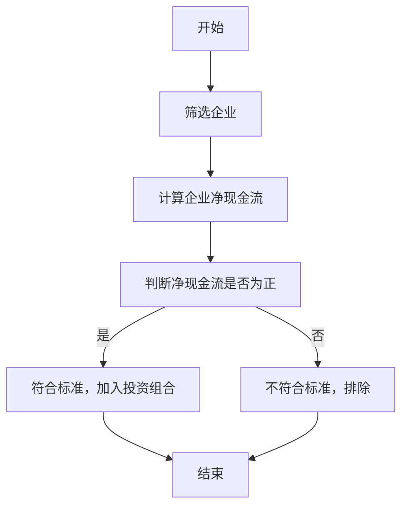
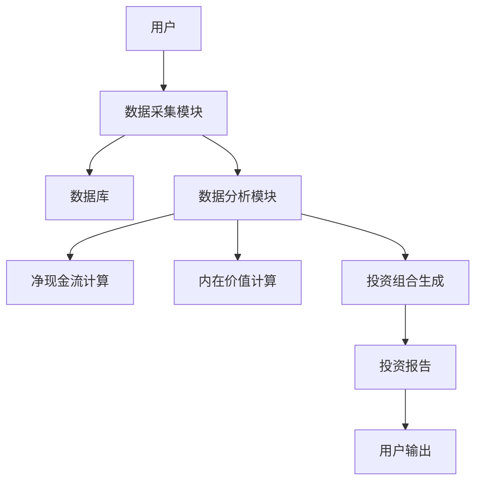

                 


# 净净股投资：回归格雷厄姆的根源

---

## 关键词：净净股投资，格雷厄姆，价值投资，詹姆斯·蒙蒂尔，净现金流

---

## 摘要：  
净净股投资是一种以企业净现金流为核心的投资策略，回归了格雷厄姆价值投资的精髓。本文从净净股投资的背景、核心概念、理论基础、算法原理、系统架构到实战应用，全面解析这一投资方法。通过分析净现金流的定义、计算与企业估值的关系，结合蒙蒂尔的投资实践，探讨如何在现代投资环境中应用这一策略。文章还提供了具体的Python代码实现和实际案例分析，帮助读者掌握这一投资方法。

---

## 正文：

### 第1章 净净股投资的背景与起源

#### 1.1 价值投资的历史演变  
价值投资是投资领域的重要流派，其核心在于寻找被市场低估的优质企业进行投资。这一理念的鼻祖是本杰明·格雷厄姆，他在《 Intelligent Investor 》一书中提出了“安全边际”和“内在价值”等核心概念。  

随着市场的演变，价值投资的实践也在不断发展。詹姆斯·蒙蒂尔作为格雷厄姆的忠实追随者，提出了“净净股投资”这一概念，将投资的焦点回归到企业的净现金流上，强调通过基本面分析筛选出具备长期竞争优势的企业。

#### 1.2 净净股投资的定义与特点  
净净股投资是一种以企业净现金流为核心的投资策略。与传统价值投资相比，净净股投资更加注重企业的盈利能力和现金流健康状况，通过筛选具备高净现金流、低估值的企业进行投资。其特点包括：  
1. **以净现金流为核心**：重点关注企业的自由现金流，而非单纯的市盈率或市净率。  
2. **注重企业内在价值**：通过分析企业的财务报表，计算其内在价值，寻找被市场低估的投资标的。  
3. **长期投资视角**：净净股投资强调长期持有优质企业，而非短期交易。  

#### 1.3 当前投资环境的变化  
近年来，资本市场波动加剧，传统估值指标的适用性受到挑战。净净股投资的兴起，正是对这种环境变化的回应。通过关注企业的净现金流，投资者可以更好地应对市场波动，寻找具备稳定盈利能力和抗风险能力的企业。

---

### 第2章 净净股投资的核心概念

#### 2.1 净现金流的定义与计算  
净现金流是企业经营活动中产生的现金流入与流出的净额，反映了企业的实际盈利能力和资金周转情况。净现金流的计算公式为：  

$$ \text{净现金流} = \text{营业收入} - \text{经营成本} - \text{税费} $$  

#### 2.2 净净股投资的核心要素  
净净股投资的核心要素包括：  
1. **企业基本面分析**：通过财务报表分析企业的盈利能力、资产负债情况和现金流状况。  
2. **财务指标筛选**：重点关注企业的净利润率、现金流收益率等指标。  
3. **投资组合管理**：通过分散化投资降低风险，同时集中投资于具备长期竞争优势的企业。

#### 2.3 净净股投资的理论基础  
净净股投资的理论基础源于格雷厄姆的价值投资理论，强调安全边际和内在价值的计算。蒙蒂尔在此基础上，进一步提出了以净现金流为核心的投资策略，认为企业的净现金流是其内在价值的重要组成部分。

---

### 第3章 净净股投资的算法与数学模型

#### 3.1 净现金流的筛选算法  
净净股投资的核心是通过筛选具备高净现金流的企业进行投资。以下是净现金流筛选算法的流程图：  



#### 3.2 净现金流估值模型  
净现金流估值模型通过计算企业的内在价值，确定其合理估值范围。模型公式如下：  

$$ \text{内在价值} = \sum_{t=1}^{n} \frac{\text{净现金流}_t}{(1 + r)^t} $$  

其中，\( r \) 为企业要求的回报率，\( n \) 为企业的生命周期。  

#### 3.3 净净股投资的Python实现  
以下是基于净现金流的股票筛选代码示例：  

```python
import pandas as pd

# 假设df为包含股票数据的DataFrame，包含"NetCashFlow"和"MarketValue"列
# 筛选净现金流为正且市场价值低于内在价值的企业
def filter_net_cash_flow_stocks(df):
    # 计算内在价值
    df['IntrinsicValue'] = df['NetCashFlow'] * 1.5  # 简化假设
    # 筛选条件：净现金流为正且市场价值低于内在价值
    df = df[df['NetCashFlow'] > 0]
    df = df[df['MarketValue'] < df['IntrinsicValue']]
    return df

# 示例数据
data = {
    'Stock': ['A', 'B', 'C', 'D'],
    'NetCashFlow': [5, -2, 8, 3],
    'MarketValue': [100, 80, 120, 90]
}
df = pd.DataFrame(data)

# 筛选结果
result = filter_net_cash_flow_stocks(df)
print(result)
```

---

### 第4章 净净股投资的系统架构与实现

#### 4.1 投资分析系统的功能设计  
投资分析系统的核心功能包括：  
1. 数据采集：获取企业的财务数据。  
2. 数据分析：计算净现金流、内在价值等指标。  
3. 投资决策：基于筛选标准生成投资组合。  

#### 4.2 系统架构设计  
以下是投资分析系统的架构图：  



#### 4.3 投资组合管理  
投资组合管理模块负责根据筛选结果生成投资组合，并定期调整持仓，确保符合净净股投资的筛选标准。

---

### 第5章 净净股投资的实战与案例分析

#### 5.1 环境安装与数据准备  
投资分析系统需要以下环境：  
- Python 3.8+  
- Pandas、NumPy、Matplotlib等库  

#### 5.2 代码实现与解读  
以下是完整的代码实现：  

```python
import pandas as pd
import numpy as np

def calculate_intrinsic_value(df):
    df['IntrinsicValue'] = df['NetCashFlow'] * 1.5
    return df

def filter_stocks(df):
    df = df[df['NetCashFlow'] > 0]
    df = df[df['MarketValue'] < df['IntrinsicValue']]
    return df

# 示例数据
data = {
    'Stock': ['A', 'B', 'C', 'D'],
    'NetCashFlow': [5, -2, 8, 3],
    'MarketValue': [100, 80, 120, 90]
}
df = pd.DataFrame(data)

# 计算内在价值
df = calculate_intrinsic_value(df)
# 筛选股票
result = filter_stocks(df)
print(result)
```

#### 5.3 案例分析  
以苹果公司为例，假设其净现金流为 $50 亿美元，市场价值为 $2.5 万亿美元。计算其内在价值为 $75 亿美元。由于市场价值远低于内在价值，苹果公司符合净净股投资的筛选标准。

---

### 第6章 总结与展望

#### 6.1 总结  
净净股投资回归了格雷厄姆价值投资的根源，通过关注企业的净现金流，帮助投资者在复杂多变的市场环境中找到具备长期竞争优势的企业。  

#### 6.2 展望  
未来，净净股投资可能在动态调整策略、市场适应性以及与其他投资策略的结合方面有更多发展。投资者需要不断优化模型，适应市场变化，才能在长期投资中获得稳定收益。

---

## 作者：AI天才研究院/AI Genius Institute & 禅与计算机程序设计艺术 /Zen And The Art of Computer Programming

