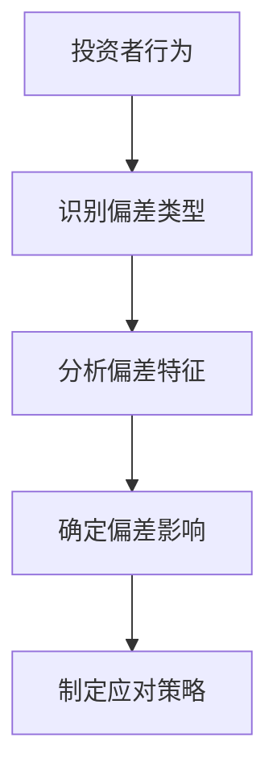
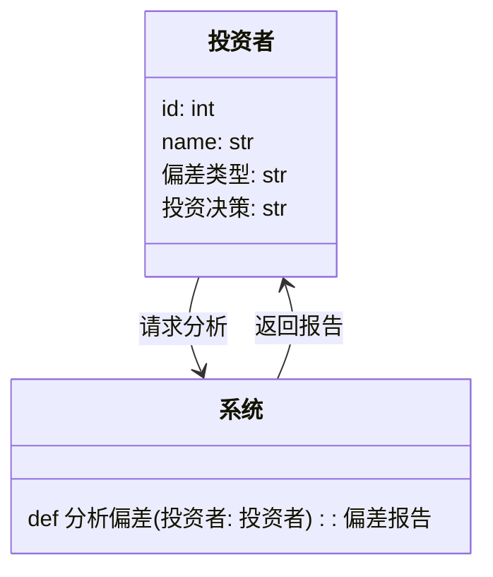

                 


# 詹姆斯·蒙蒂尔的投资者心理偏差分析

---

## 关键词：投资者心理偏差、行为金融学、蒙蒂尔理论、认知偏差、行为偏差、情绪偏差

---

## 摘要

本文深入分析了詹姆斯·蒙蒂尔提出的投资者心理偏差理论，探讨了这些偏差如何影响投资决策，并提供了系统的分析方法和应对策略。通过结合行为金融学的理论框架，本文详细阐述了认知偏差、情绪偏差和行为偏差的分类、原理及相互作用，并通过算法、数学模型和系统架构的方法，为识别和应对这些偏差提供了实践指导。最终，本文旨在帮助投资者更好地理解自身心理偏差，从而做出更理性的投资决策。

---

## 正文

### 第一部分：背景介绍

#### 1.1 心理偏差的定义与重要性

心理偏差是指个体在认知、情感和行为过程中产生的系统性偏离客观事实的倾向。在投资领域，心理偏差尤其重要，因为它们直接影响投资者的决策过程，可能导致非理性的投资行为，进而影响投资绩效。

#### 1.2 投资者心理偏差的分类

投资者心理偏差主要分为以下三类：

- **认知偏差**：源于个体对信息处理的系统性错误，例如确认偏差、选择性记忆偏差等。
- **情绪偏差**：与投资者的情感波动相关，例如贪婪、恐惧等情绪导致的非理性决策。
- **行为偏差**：表现为投资者在实际操作中的不当行为，例如过度交易、从众行为等。

#### 1.3 投资者心理偏差的影响

心理偏差可能导致以下问题：

- **决策失误**：投资者可能基于错误的信息或情绪化的判断做出错误的投资决策。
- **市场波动**：大量投资者的非理性行为可能导致市场的过度波动。
- **长期绩效损失**：持续的偏差行为可能导致投资者错失长期收益或承受不必要的损失。

---

### 第二部分：核心概念与联系

#### 2.1 心理偏差的原理

心理偏差的形成源于人类认知的局限性和情感的复杂性。投资者在面对不确定性和复杂信息时，容易受到认知框架、情绪波动和社会环境的影响，从而产生偏差。

#### 2.2 心理偏差的特征对比

以下是常见心理偏差的特征对比表：

| 偏差类型     | 描述                                                                 | 示例场景                     |
|--------------|----------------------------------------------------------------------|------------------------------|
| 确认偏差     | 倾向于寻找支持已有观点的信息，忽视相反信息。                     | 投资者只关注利好消息，忽略利空信息。 |
| 过度自信偏差 | 过高估计自己的能力或判断的准确性。                               | 投资者认为自己能够准确预测市场走势。 |
| 惧怕损失偏差 | 更加关注潜在损失，而非同等规模的潜在收益。                     | 投资者更倾向于避免亏损，而非追求收益。 |
| 从众偏差     | 因跟随大众行为而做出决策，忽视自身判断。                       | 投资者盲目跟风，导致市场泡沫。     |

#### 2.3 心理偏差的ER实体关系图

以下是心理偏差的ER实体关系图：

```mermaid
er
    actor: 投资者
    deviation: 心理偏差
    decision: 投资决策
    behavior: 投资行为
    attribute: 偏差类型
    relationship: -
    actor -[1..n]-> decision: 做出
    decision -[1..n]-> behavior: 引发
    deviation -[1..n]-> attribute: 具有
    actor -[1..n]-> deviation: 受到影响
```

---

### 第三部分：算法原理

#### 3.1 心理偏差的识别流程

以下是心理偏差的识别流程图：



#### 3.2 心理偏差的分析算法

以下是用于分析心理偏差的Python代码示例：

```python
def identify_bias(decision, context,情绪):
    """
    根据决策、上下文和情绪，识别投资者的心理偏差。
    """
    if decision == '从众':
        return '从众偏差'
    elif情绪 == '过度恐惧':
        return '惧怕损失偏差'
    else:
        return '其他偏差'

# 示例应用
decision = '从众'
context = '市场上涨'
情绪 = '过度恐惧'
bias = identify_bias(decision, context, 情绪)
print(f'识别的偏差类型为：{bias}')
```

#### 3.3 心理偏差的数学模型

以下是心理偏差的数学模型：

- **理性决策模型**：
  $$ V_{\text{理性}} = \sum_{i=1}^{n} w_i \cdot v_i $$
  其中，\( w_i \) 是第 \( i \) 个因素的权重，\( v_i \) 是第 \( i \) 个因素的效用值。

- **非理性决策模型**：
  $$ V_{\text{非理性}} = \sum_{i=1}^{n} w_i \cdot v_i + \epsilon $$
  其中，\( \epsilon \) 是心理偏差引入的误差项。

---

### 第四部分：系统分析与架构设计

#### 4.1 系统功能设计

以下是系统功能设计的类图：



#### 4.2 系统架构设计

以下是系统架构设计的架构图：


---

### 第五部分：项目实战

#### 5.1 环境安装

需要安装以下工具：

- Python 3.x
- Mermaid工具链
- LaTeX编辑器（如TeX Live）

#### 5.2 系统核心实现

以下是核心实现代码：

```python
def analyze_behavior(bias_type):
    """
    根据偏差类型，分析投资者行为。
    """
    if bias_type == '从众偏差':
        return '从众交易'
    elif bias_type == '惧怕损失偏差':
        return '止损过早'
    else:
        return '其他行为'

# 示例应用
bias_type = '从众偏差'
behavior = analyze_behavior(bias_type)
print(f'分析结果：{behavior}')
```

#### 5.3 实际案例分析

假设某投资者在市场下跌时，由于惧怕损失，迅速卖出股票，导致亏损。通过分析，发现其受到“惧怕损失偏差”的影响。系统建议其调整心态，避免过度反应。

---

### 第六部分：最佳实践

#### 6.1 小结

本文系统分析了投资者心理偏差的理论与实践，结合算法、数学模型和系统架构，为识别和应对心理偏差提供了全面的解决方案。

#### 6.2 注意事项

- 定期自我反思，识别潜在的心理偏差。
- 采用技术工具辅助决策，减少情绪干扰。
- 学习行为金融学知识，增强理性判断能力。

#### 6.3 拓展阅读

- 詹姆斯·蒙蒂尔的《心理学与投资》
- 行为金融学经典文献

---

## 作者

作者：AI天才研究院/AI Genius Institute  
& 禅与计算机程序设计艺术/Zen And The Art of Computer Programming

