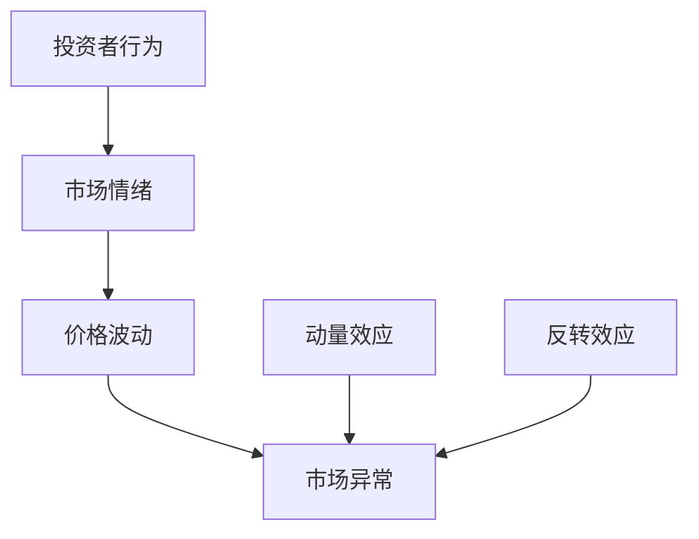
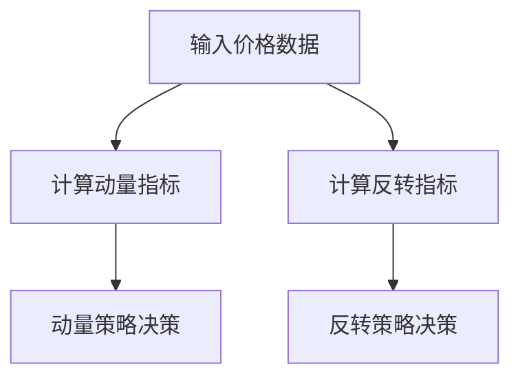
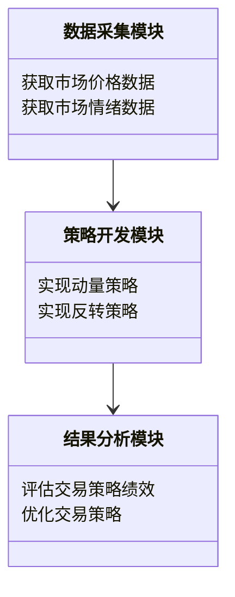
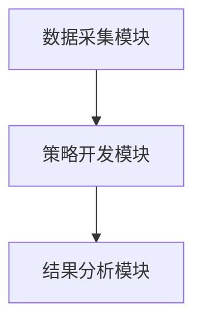
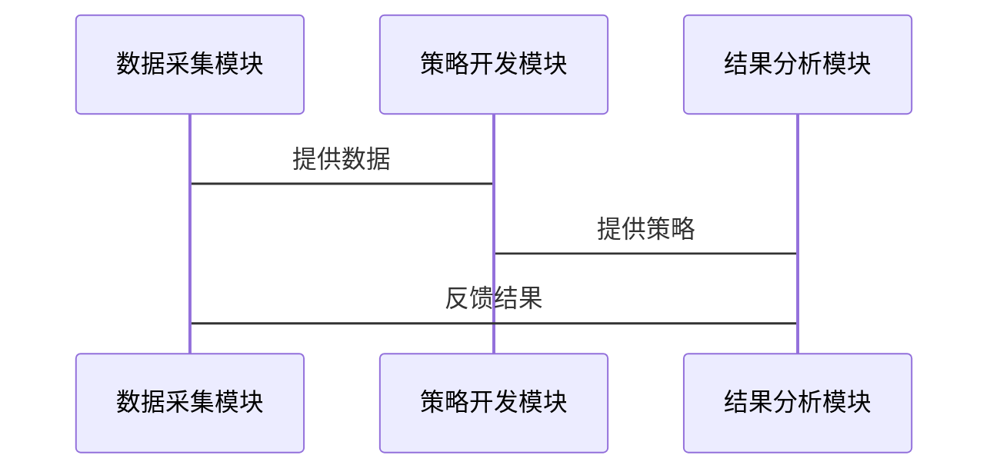

                 


# 《詹姆斯蒙蒂尔的市场异常研究》

## 关键词：市场异常，詹姆斯蒙蒂尔，动量效应，反转效应，投资者行为，交易策略

## 摘要：  
本文深入探讨了詹姆斯蒙蒂尔的市场异常研究，分析了市场异常的核心概念、算法原理以及系统架构设计。通过动量策略和反转策略的数学模型，结合实际案例，展示了如何利用这些市场异常现象优化投资决策。

---

# 第1章: 市场异常研究概述

## 1.1 市场异常的定义与背景  
市场的有效性一直是金融学中的核心假设，但实际市场中经常出现价格与内在价值的偏离，这种现象被称为市场异常。詹姆斯蒙蒂尔通过研究这些异常现象，揭示了投资者行为和市场结构对价格波动的重要影响。

### 1.1.1 传统有效市场假说的局限性  
有效市场假说认为市场价格反映了所有可获取的信息，但现实中，市场参与者的行为偏差和信息不对称导致价格偏离理性预期。

### 1.1.2 市场异常现象的发现与研究意义  
市场异常现象，如动量效应和反转效应，为投资者提供了超越市场有效性的机会，帮助他们在市场中获得超额收益。

### 1.1.3 詹姆斯·蒙蒂尔的研究贡献  
蒙蒂尔通过对市场异常现象的系统性研究，提出了动量策略和反转策略，为投资者提供了有效的交易模型。

## 1.2 市场异常的核心概念  
市场异常的核心概念包括动量效应、反转效应和市场情绪的影响。

### 1.2.1 动量效应与反转效应  
动量效应指价格趋势的延续性，而反转效应则指价格趋向于均值回归。这两种效应在不同市场条件下表现各异。

### 1.2.2 市场情绪与投资者行为  
投资者情绪和行为偏差是导致市场异常的重要因素，市场情绪可以通过波动率和成交量等指标进行量化。

### 1.2.3 市场结构与异常现象的关系  
市场结构，如交易成本和市场深度，也会影响市场异常现象的表现。

## 1.3 市场异常的主要类型  
市场异常主要包括动量效应、反转效应、市场情绪影响和其他特殊现象。

### 1.3.1 动量策略  
动量策略基于价格趋势，通过买入近期表现优异的资产来实现收益。

### 1.3.2 反转策略  
反转策略则相反，通过买入近期表现不佳的资产，期望其价格回归均值。

### 1.3.3 市场情绪与恐慌指数  
市场情绪可以通过恐慌指数（如VIX指数）量化，恐慌指数高时，市场可能出现反转机会。

### 1.3.4 其他异常现象  
小盘股效应和日历效应也是常见的市场异常现象。

## 1.4 本章小结  
本章介绍了市场异常的基本概念，分析了动量效应和反转效应，并探讨了市场情绪和投资者行为对市场异常的影响。

---

# 第2章: 市场异常的核心概念与联系  

## 2.1 市场异常的核心概念  
市场异常的核心概念包括动量效应、反转效应和市场情绪的量化。

### 2.1.1 动量效应的数学模型  
动量效应的数学模型可以表示为：  
$$ P_t = \alpha \cdot P_{t-1} + \beta \cdot P_{t-2} $$  
其中，$\alpha$ 和 $\beta$ 是动量系数。

### 2.1.2 反转效应的数学模型  
反转效应的数学模型可以表示为：  
$$ P_t = \alpha \cdot P_{t-1}^{-1} + \beta \cdot P_{t-2}^{-1} $$  

### 2.1.3 市场情绪的量化方法  
市场情绪可以通过投资者情绪指标（如恐慌指数）进行量化，公式为：  
$$ \text{恐慌指数} = \sqrt{\frac{1}{n}\sum_{i=1}^{n}(P_i - \mu)^2} $$  

## 2.2 市场异常的核心概念对比  
动量效应和反转效应在实际市场中的表现可以通过对比分析得出。

### 2.2.1 动量效应与反转效应的对比分析  
动量效应和反转效应在不同市场周期和资产类别中表现各异，投资者可以根据市场环境选择合适的策略。

### 2.2.2 市场情绪与价格波动的关系  
市场情绪与价格波动呈正相关，恐慌指数高时，价格波动加剧。

### 2.2.3 市场结构与异常现象的关联  
市场结构影响交易成本和流动性，从而影响市场异常现象的表现。

## 2.3 市场异常的ER实体关系图  
通过ER实体关系图，可以清晰地展示市场异常的核心要素及其相互关系。



## 2.4 本章小结  
本章通过数学模型和ER实体关系图，详细分析了市场异常的核心概念及其相互关系。

---

# 第3章: 动量策略与反转策略的算法原理  

## 3.1 动量策略的数学模型  
动量策略基于价格趋势，通过买入近期表现优异的资产实现收益。

### 3.1.1 动量策略的定义  
动量策略是指根据资产的过去表现预测其未来价格走势。

### 3.1.2 动量策略的数学公式  
$$ P_t = \alpha \cdot P_{t-1} + \beta \cdot P_{t-2} $$  

## 3.2 反转策略的数学模型  
反转策略基于价格的均值回归特性，通过买入近期表现不佳的资产实现收益。

### 3.2.1 反转策略的定义  
反转策略是指根据资产的过去表现预测其未来价格走势将回归均值。

### 3.2.2 反转策略的数学公式  
$$ P_t = \alpha \cdot P_{t-1}^{-1} + \beta \cdot P_{t-2}^{-1} $$  

## 3.3 动量策略与反转策略的对比分析  
动量策略和反转策略在算法流程和应用场景上有显著差异。

### 3.3.1 算法流程图  


## 3.4 本章小结  
本章详细分析了动量策略和反转策略的数学模型和算法流程。

---

# 第4章: 市场异常研究的系统架构设计  

## 4.1 系统功能设计  
市场异常研究的系统架构设计包括数据采集、策略开发和结果分析三个主要部分。

### 4.1.1 数据采集模块  
数据采集模块负责获取市场价格数据和市场情绪数据。

### 4.1.2 策略开发模块  
策略开发模块基于动量策略和反转策略的数学模型，开发交易策略。

### 4.1.3 结果分析模块  
结果分析模块对交易策略的绩效进行评估和优化。

## 4.2 系统架构设计  
系统架构设计采用模块化设计，确保各部分协同工作。

### 4.2.1 领域模型mermaid类图  


## 4.3 系统架构mermaid架构图  


## 4.4 系统接口设计  
系统接口设计包括数据接口和策略接口。

### 4.4.1 数据接口  
数据接口负责与数据源对接，获取必要的市场价格数据和市场情绪数据。

### 4.4.2 策略接口  
策略接口负责与交易系统对接，实现交易策略的自动化执行。

## 4.5 系统交互mermaid序列图  


## 4.6 本章小结  
本章通过系统架构设计，展示了如何将市场异常研究应用于实际投资决策。

---

# 第5章: 项目实战  

## 5.1 环境安装  
项目实战需要安装必要的数据处理工具和编程语言。

### 5.1.1 数据处理工具  
建议使用Python和Pandas进行数据处理。

### 5.1.2 编程语言  
使用Python编写交易策略代码。

## 5.2 系统核心实现源代码  
以下是动量策略和反转策略的Python实现代码：

```python
import pandas as pd

def momentum_strategy(prices, window=10):
    # 计算动量指标
    momentum = prices.rolling(window).mean()
    return momentum

def reversal_strategy(prices, window=10):
    # 计算反转指标
    reversal = prices.rolling(window).mean().iloc[-1] / prices.iloc[-1]
    return reversal
```

## 5.3 代码应用解读与分析  
通过对代码的解读和分析，可以更好地理解动量策略和反转策略的应用。

### 5.3.1 动量策略的应用  
动量策略适用于趋势性较强的市场环境。

### 5.3.2 反转策略的应用  
反转策略适用于市场情绪低落、价格超跌的市场环境。

## 5.4 实际案例分析  
通过实际案例分析，验证交易策略的有效性。

### 5.4.1 案例选择  
选择2020年新冠疫情后的市场波动作为案例。

### 5.4.2 数据分析  
分析案例中的市场价格数据和市场情绪数据，验证交易策略的绩效。

## 5.5 本章小结  
本章通过项目实战，展示了如何将市场异常研究应用于实际投资决策。

---

# 第6章: 最佳实践、小结与展望  

## 6.1 最佳实践 tips  
在实际投资中，建议结合市场环境和投资者行为，灵活调整交易策略。

## 6.2 小结  
本篇文章系统地介绍了詹姆斯蒙蒂尔的市场异常研究，分析了动量策略和反转策略的算法原理，并通过项目实战展示了如何将这些理论应用于实际投资决策。

## 6.3 注意事项  
投资者在实际应用中，应关注交易成本和市场风险，避免过度依赖单一策略。

## 6.4 拓展阅读  
建议读者进一步阅读蒙蒂尔的《The New Market Technician》一书，深入理解市场异常研究的最新进展。

---

# 作者：AI天才研究院/AI Genius Institute & 禅与计算机程序设计艺术 /Zen And The Art of Computer Programming

