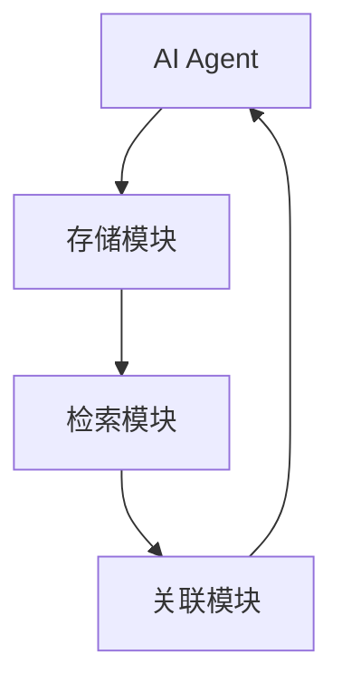
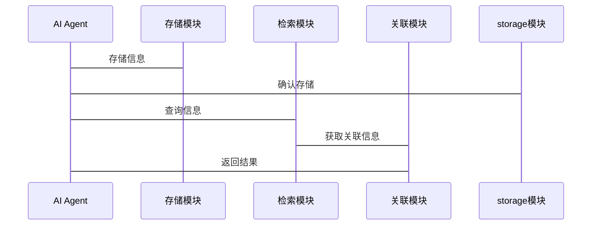

                 


# 记忆机制实现：让AI Agent具备长期记忆能力

## 关键词
- AI Agent, 记忆机制, 长期记忆, 信息检索, 知识关联, 算法原理, 系统设计

## 摘要
本文深入探讨了AI Agent实现长期记忆能力的关键技术，涵盖记忆机制的核心概念、算法原理、系统设计与实现、项目实战以及未来展望。通过详细分析信息存储与检索、知识关联与推理、记忆模型的数学公式、系统架构设计和实际项目案例，本文为读者提供了全面的理解和实践指导。从理论到实践，本文旨在帮助AI开发者构建具备长期记忆能力的智能代理。

---

# 第一部分: 记忆机制的背景与概念

## 第1章: 记忆机制的基本概念

### 1.1 什么是记忆机制
#### 1.1.1 记忆机制的定义
记忆机制是AI Agent实现长期记忆的核心技术，通过存储和检索信息，使AI能够记住过去的经验和知识，从而提升智能性和适应性。

#### 1.1.2 记忆机制的核心要素
- **存储单元**：用于存储信息的结构。
- **检索机制**：根据需求快速找到相关信息。
- **关联能力**：将不同信息进行关联和推理。

#### 1.1.3 记忆机制的分类
- **显式记忆**：明确存储的事实和事件。
- **隐式记忆**：通过经验形成的潜意识知识。
- **混合记忆**：结合显式和隐式记忆的综合模型。

### 1.2 AI Agent的记忆需求
#### 1.2.1 AI Agent的基本概念
AI Agent是具有自主决策和交互能力的智能实体，需要处理复杂任务时依赖长期记忆。

#### 1.2.2 长期记忆的重要性
长期记忆使AI Agent能够积累知识，提高问题解决能力和学习效率。

#### 1.2.3 当前AI Agent记忆的局限性
- **数据量有限**：存储容量不足。
- **检索效率低**：复杂查询耗时。
- **关联性差**：难以关联不同信息。

## 第2章: 记忆机制的核心问题

### 2.1 信息存储与检索
#### 2.1.1 数据结构的选择
- **向量空间模型**：使用向量表示信息，便于计算相似度。
- **哈希表**：通过哈希函数快速存储和检索。

#### 2.1.2 存储效率的优化
- **压缩算法**：减少存储空间。
- **分块存储**：提高并行处理效率。

#### 2.1.3 检索算法的设计
- **线性检索**：简单但效率低。
- **二分检索**：适用于有序数据。
- **哈希检索**：快速定位数据。

### 2.2 知识关联与推理
#### 2.2.1 关系图的构建
- **节点**：表示实体。
- **边**：表示关系。

#### 2.2.2 推理算法的应用
- **规则推理**：基于预定义规则进行推理。
- **概率推理**：基于概率模型进行推断。

#### 2.2.3 知识图谱的管理
- **知识图谱**：结构化知识的图形表示。
- **动态更新**：实时维护知识图谱。

---

# 第二部分: 记忆机制的算法原理

## 第4章: 基于检索的记忆模型

### 4.1 向量数据库
#### 4.1.1 向量空间模型
- **向量表示**：将信息转化为向量。
- **相似度计算**：使用余弦相似度或欧氏距离。

#### 4.1.2 向量索引的构建
- **索引树**：构建索引树加速检索。

#### 4.1.3 检索算法的实现
- **ANN（Approximate Nearest Neighbor）**：近似最近邻算法。

### 4.2 基于哈希的检索
#### 4.2.1 哈希函数的选择
- **均匀分布**：确保哈希值分布均匀。

#### 4.2.2 哈希表的构建
- **分桶存储**：减少碰撞。

#### 4.2.3 冲突处理机制
- **拉链法**：解决哈希冲突。

## 第5章: 基于生成的记忆模型

### 5.1 内存网络
#### 5.1.1 内存单元的设计
- **读写头**：控制内存操作。

#### 5.1.2 内存操作的实现
- **写入**：将信息写入内存。
- **读取**：从内存中读取信息。

#### 5.1.3 内存网络的应用
- **文本摘要**：生成摘要信息。

### 5.2 变量记忆机制
#### 5.2.1 变量的存储与管理
- **变量表**：记录变量的值。

#### 5.2.2 变量的更新与维护
- **版本控制**：管理变量的变更。

#### 5.2.3 变量的检索与应用
- **条件查询**：基于条件检索变量。

## 第6章: 记忆机制的数学模型

### 6.1 向量空间模型
#### 6.1.1 向量空间的构建
- **维度**：表示信息的特征。

#### 6.1.2 向量相似度的计算
- **余弦相似度**：公式为：
  $$
  \cos\theta = \frac{\sum x_i y_i}{\sqrt{\sum x_i^2} \sqrt{\sum y_i^2}}
  $$

#### 6.1.3 向量检索的优化
- **索引优化**：减少检索时间。

### 6.2 概率图模型
#### 6.2.1 概率图的构建
- **贝叶斯网络**：表示变量之间的概率关系。

#### 6.2.2 条件概率的计算
- **联合概率**：公式为：
  $$
  P(A,B) = P(A|B)P(B)
  $$

#### 6.2.3 概率推理的实现
- **马尔可夫链**：用于状态转移。

---

# 第三部分: 系统设计与实现

## 第7章: 系统架构设计

### 7.1 系统功能设计
- **存储模块**：负责信息的存储。
- **检索模块**：负责信息的检索。
- **关联模块**：负责知识的关联和推理。

### 7.2 系统架构图


### 7.3 系统接口设计
- **API接口**：提供存储、检索和关联功能。

### 7.4 系统交互流程


---

# 第四部分: 项目实战

## 第8章: 项目实现

### 8.1 环境搭建
- **Python 3.8+**
- **TensorFlow 2.0+**
- **scikit-learn**

### 8.2 核心代码实现
```python
import numpy as np
from sklearn.neighbors import NearestNeighbors

# 向量数据库实现
class VectorDatabase:
    def __init__(self, dimensions):
        self.dimensions = dimensions
        self.vectors = []

    def add_vector(self, vector):
        self.vectors.append(vector)

    def query_vector(self, query, k=1):
        distances = np.array([np.linalg.norm(v - query) for v in self.vectors])
        nearest = np.argsort(distances)[:k]
        return [self.vectors[i] for i in nearest]
```

### 8.3 案例分析
- **案例：文本摘要**
  - **输入**：长文本内容。
  - **输出**：文本摘要。

### 8.4 项目总结
通过项目实战，展示了记忆机制在实际应用中的实现过程，包括环境搭建、代码实现和案例分析。

---

# 第五部分: 扩展与优化

## 第9章: 记忆机制的优化

### 9.1 记忆机制的优化方法
- **增量学习**：逐步更新记忆内容。
- **遗忘策略**：定期清理无用信息。

### 9.2 记忆机制与其他技术的结合
- **强化学习**：结合记忆机制提升智能体的决策能力。
- **自然语言处理**：应用于文本理解和生成。

### 9.3 记忆机制的未来趋势
- **神经符号结合**：将神经网络与符号推理结合。
- **边缘计算**：在边缘设备上实现记忆机制。

---

# 作者
作者：AI天才研究院 & 禅与计算机程序设计艺术

---

通过以上内容，本文详细介绍了AI Agent实现长期记忆能力的关键技术，从理论到实践，为读者提供了全面的理解和实践指导。希望对AI开发者在记忆机制的研究和应用中有所帮助。

