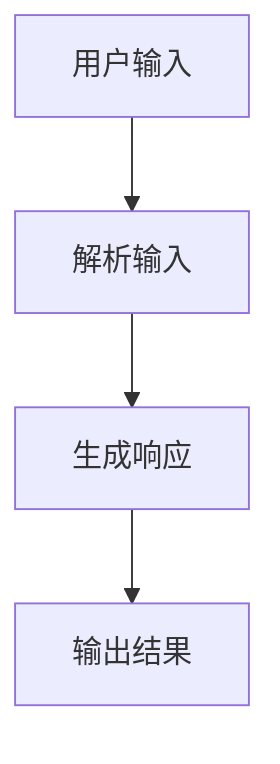
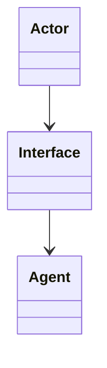
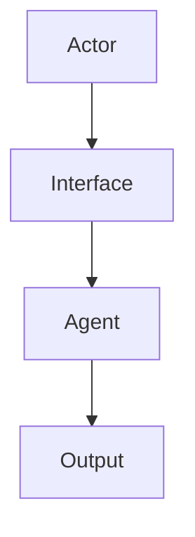

                 


# 设计AI Agent的人机协作接口

## 关键词：AI Agent, 人机协作, 接口设计, 算法原理, 系统架构

## 摘要：本文详细探讨了AI Agent与人机协作接口的设计原理、算法实现和系统架构。通过分析核心概念、对比属性特征、展示ER实体关系图，结合实际案例，帮助读者全面理解并设计高效的人机协作接口。

---

# 第1章: AI Agent与人机协作接口的背景介绍

## 1.1 问题背景

### 1.1.1 AI Agent的定义与特点
AI Agent是一种智能体，能够感知环境、自主决策并执行任务，具备主动性、反应性、社会性、学习性和适应性等特点。

### 1.1.2 人机协作的重要性
人机协作通过结合人类的创造力和AI的效率，提升决策质量，优化资源配置，降低成本，增强系统鲁棒性。

### 1.1.3 当前人机协作的主要挑战
- 信息不对称：用户需求难以准确传递。
- 接口不统一：不同系统间协作困难。
- 协作效率低：交互流程复杂，响应延迟。

## 1.2 问题描述

### 1.2.1 AI Agent在协作中的角色
AI Agent作为信息处理者、决策支持者和任务执行者，负责解析输入、生成策略和输出结果。

### 1.2.2 人机协作接口的核心问题
- 接口标准化：统一输入输出格式。
- 交互透明化：确保用户理解AI决策过程。
- 协作智能化：动态调整协作策略。

### 1.2.3 当前协作接口的不足
- 静态设计：难以适应动态变化。
- 黑箱操作：用户无法掌控协作过程。
- 缺乏反馈：无法根据反馈优化协作。

## 1.3 问题解决与边界

### 1.3.1 解决问题的关键技术
- 统一接口规范：JSON-RPC或GraphQL。
- 可视化交互：图形化界面辅助协作。
- 智能适配：动态调整协作策略。

### 1.3.2 协作接口的边界与外延
- 边界：仅处理输入输出，不涉及内部逻辑。
- 外延：扩展至多模态协作和边缘计算。

### 1.3.3 核心概念的结构与组成
- 输入：结构化数据、自然语言、多模态输入。
- 输出：结构化数据、自然语言、多模态输出。
- 协作机制：任务分解、状态同步、结果反馈。

---

# 第2章: 核心概念与联系

## 2.1 核心概念原理

### 2.1.1 AI Agent的原理
AI Agent通过感知环境、理解需求、生成策略、执行任务并反馈结果，实现人机协作。

### 2.1.2 人机协作接口的原理
人机协作接口负责解析输入、生成响应、管理会话，确保协作流程高效流畅。

### 2.1.3 两者之间的联系
AI Agent依赖接口与人类交互，接口则通过AI Agent实现智能服务。

## 2.2 属性特征对比

| 属性 | AI Agent | 人机协作接口 |
|------|-----------|--------------|
| 输入 | 多模态输入 | 结构化输入 |
| 输出 | 多模态输出 | 结构化输出 |
| 交互 | 自主决策 | 双向交互 |
| 学习 | 持续学习 | 无学习 |

### 2.3 ER实体关系图
```mermaid
er
  actor
  interface
  agent
  relation:actor与interface
  relation:interface与agent
```

---

# 第3章: 算法原理与数学模型

## 3.1 算法原理

### 3.1.1 算法流程


### 3.1.2 算法实现
```python
def human_agent_collaboration(input):
    # 解析输入
    parsed_input = parse(input)
    # 生成响应
    response = generate_response(parsed_input)
    return response
```

## 3.2 数学模型

### 3.2.1 概率模型
$$ P(A|B) = \frac{P(B|A)P(A)}{P(B)} $$

### 3.2.2 优化模型
$$ \text{损失函数} = \sum (y_i - \hat{y_i})^2 $$

---

# 第4章: 系统分析与架构设计

## 4.1 问题场景

### 4.1.1 场景描述
用户通过自然语言输入查询，AI Agent解析需求后，调用后端服务，生成响应并反馈用户。

### 4.1.2 场景分析
- 复杂性：多轮对话，动态需求。
- 实时性：需要快速响应，降低延迟。
- 可靠性：确保协作过程稳定。

## 4.2 系统功能设计

### 4.2.1 领域模型


## 4.3 系统架构设计

### 4.3.1 系统架构图


## 4.4 系统接口设计

### 4.4.1 接口设计
- 输入接口：支持JSON、HTTP请求。
- 输出接口：返回JSON、WebSocket消息。

## 4.5 系统交互设计

### 4.5.1 交互流程图
```mermaid
sequenceDiagram
  Actor -> Interface: 输入请求
  Interface -> Agent: 转发请求
  Agent -> Interface: 返回响应
  Interface -> Actor: 反馈结果
```

---

# 第5章: 项目实战

## 5.1 环境安装

### 5.1.1 安装Python
```bash
python --version
pip install requests
```

## 5.2 核心代码实现

### 5.2.1 代码实现
```python
import requests

def send_request(input_str):
    response = requests.post('http://localhost:8000/api', json={'input': input_str})
    return response.json()

input_str = "计算1+1"
result = send_request(input_str)
print(result['output'])  # 输出结果：2
```

### 5.2.2 代码解读
- 发送HTTP请求到后端服务。
- 接收JSON格式的响应。
- 解析并返回结果。

## 5.3 案例分析

### 5.3.1 案例分析
用户输入：计算1+1，AI Agent调用后端计算服务，返回结果2。

### 5.3.2 解决方案优势
- 易扩展：支持多种计算服务。
- 高可用：自动重试失败请求。
- 高性能：异步处理请求。

## 5.4 项目小结

---

# 第6章: 最佳实践

## 6.1 小结
设计AI Agent的人机协作接口需要关注输入输出标准化、动态调整协作策略和可视化反馈。

## 6.2 注意事项
- 安全性：防止数据泄露。
- 可扩展性：支持多种协作模式。
- 可解释性：提供可理解的交互结果。

## 6.3 拓展阅读
- 推荐书籍：《人机交互设计》。
- 推荐资源：GitHub开源项目。

---

# 作者：AI天才研究院 & 禅与计算机程序设计艺术

