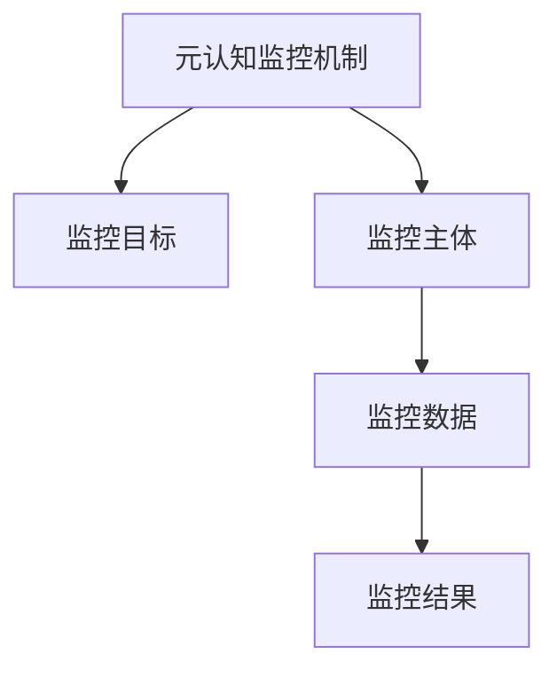
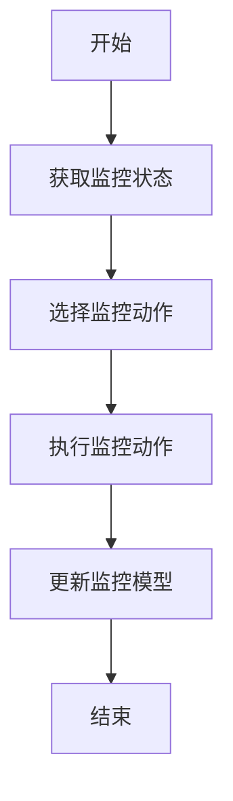
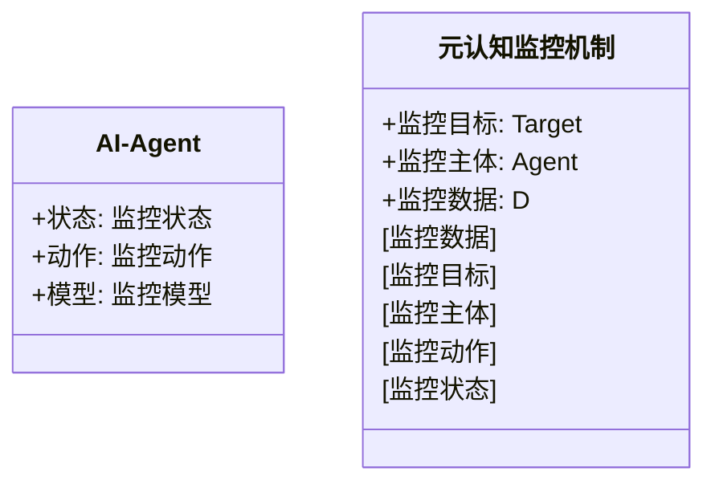
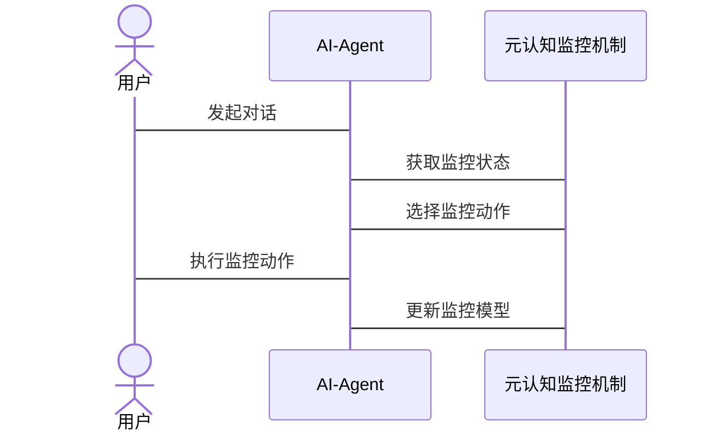

                 


# 设计AI Agent的元认知监控机制

> 关键词：AI Agent，元认知监控，系统架构设计，算法原理，元认知模型

> 摘要：AI Agent的元认知监控机制是实现智能体自我认知和行为优化的关键技术。本文从元认知的基本概念出发，深入探讨其在AI Agent中的应用，分析元认知监控的原理、算法及系统架构设计，并通过实际案例展示如何设计和实现高效的元认知监控机制。

---

# 第1章: AI Agent与元认知监控的基本概念

## 1.1 AI Agent的基本概念

### 1.1.1 AI Agent的定义与分类

AI Agent（人工智能代理）是指能够感知环境、自主决策并执行任务的智能实体。根据功能和复杂度，AI Agent可以分为简单反射式代理、基于模型的反射式代理、目标驱动代理和效用驱动代理。

### 1.1.2 元认知的基本概念

元认知（Metacognition）是指对自身认知过程的认知，包括对思维过程的监控、评估和调节。元认知监控是元认知的核心功能之一，用于监控认知过程的执行情况。

### 1.1.3 元认知监控的定义与特点

元认知监控是指AI Agent对自身认知过程的监控，包括对认知目标、认知策略、认知结果的监控与调节。其特点包括主动性、自适应性和高效性。

---

## 1.2 元认知监控在AI Agent中的作用

### 1.2.1 元认知监控的目标与意义

元认知监控的目标是提高AI Agent的自我调节能力，确保其在复杂环境中的稳定性和智能性。其意义在于提升AI Agent的自适应能力和决策优化能力。

### 1.2.2 元认知监控在AI Agent中的应用场景

元认知监控在AI Agent中的应用场景包括任务规划、决策优化、异常处理和自我学习。例如，在自然语言处理中，AI Agent需要通过元认知监控来优化对话策略。

### 1.2.3 元认知监控与其他AI技术的关系

元认知监控与自然语言处理、计算机视觉、机器学习等技术密切相关，是实现AI Agent智能化的重要组成部分。

---

## 1.3 本章小结

本章介绍了AI Agent和元认知监控的基本概念，探讨了元认知监控在AI Agent中的作用及其应用场景，为后续章节的深入分析奠定了基础。

---

# 第2章: 元认知监控机制的核心概念与联系

## 2.1 元认知监控机制的原理

### 2.1.1 元认知监控的层次结构

元认知监控的层次结构包括感知层、认知层和决策层。感知层负责获取环境信息，认知层负责分析和理解信息，决策层负责制定监控策略。

### 2.1.2 元认知监控的核心要素

元认知监控的核心要素包括监控目标、监控主体、监控数据和监控结果。这些要素共同构成了元认知监控的完整体系。

---

## 2.2 元认知监控机制的属性特征对比

### 2.2.1 不同监控机制的对比分析

不同监控机制在目标、主体和方法上存在差异。例如，基于规则的监控机制适用于简单任务，而基于学习的监控机制适用于复杂任务。

### 2.2.2 元认知监控机制的优缺点

元认知监控机制的优点包括自适应性和高效性，缺点包括复杂性和计算成本较高。

---

## 2.3 元认知监控机制的ER实体关系图



---

## 2.4 本章小结

本章通过分析元认知监控机制的原理和属性特征，构建了完整的元认知监控模型，为后续章节的算法设计和系统实现提供了理论基础。

---

# 第3章: 元认知监控机制的算法原理

## 3.1 元认知监控机制的算法概述

### 3.1.1 基于规则的监控算法

基于规则的监控算法通过预定义的规则来判断和调整监控行为。例如，当AI Agent的响应时间超过阈值时，触发调整策略。

### 3.1.2 基于学习的监控算法

基于学习的监控算法通过机器学习模型（如神经网络）来学习和优化监控策略。例如，使用深度学习模型预测和调整AI Agent的行为。

### 3.1.3 基于反馈的监控算法

基于反馈的监控算法通过实时反馈信息来调整监控行为。例如，通过用户反馈优化对话系统的表现。

---

## 3.2 元认知监控机制的数学模型

### 3.2.1 监控模型的数学表达

$$
P(\text{监控动作}| \text{监控状态}) = \sum_{i=1}^{n} w_i \cdot f_i(\text{监控状态})
$$

其中，$w_i$ 是权重系数，$f_i(\text{监控状态})$ 是特征函数。

### 3.2.2 监控模型的优化目标

$$
\min_{\theta} \sum_{i=1}^{m} (y_i - f_\theta(x_i))^2
$$

这是一个最小二乘优化问题，用于优化监控模型的参数。

---

## 3.3 元认知监控机制的算法流程图



---

## 3.4 本章小结

本章详细介绍了元认知监控机制的算法原理，包括基于规则、基于学习和基于反馈的监控算法，并通过数学模型和流程图展示了算法的实现过程。

---

# 第4章: 元认知监控机制的系统分析与架构设计

## 4.1 系统分析

### 4.1.1 问题场景介绍

以智能客服系统为例，AI Agent需要通过元认知监控机制优化对话流程，提升用户体验。

### 4.1.2 项目介绍

本项目旨在设计一个基于元认知监控的智能客服系统，实现对话优化和用户体验提升。

### 4.1.3 系统功能设计

系统功能包括对话监控、策略调整、结果反馈和自我学习。

---

## 4.2 系统架构设计

### 4.2.1 系统架构图



### 4.2.2 接口设计

系统接口包括监控数据输入接口、监控目标设置接口、监控结果输出接口和监控模型更新接口。

### 4.2.3 交互流程图



---

## 4.3 本章小结

本章通过系统分析和架构设计，展示了如何将元认知监控机制应用于实际场景，为后续的项目实现提供了清晰的指导。

---

# 第5章: 元认知监控机制的项目实战

## 5.1 环境安装

### 5.1.1 安装Python和相关库

安装Python 3.8及以上版本，并安装numpy、pandas、scikit-learn等库。

### 5.1.2 安装依赖项

使用pip安装必要的依赖项：

```bash
pip install numpy pandas scikit-learn
```

---

## 5.2 系统核心实现源代码

### 5.2.1 元认知监控机制的Python实现

```python
import numpy as np
from sklearn.linear_model import LinearRegression

class MetaCognitiveMonitor:
    def __init__(self):
        self.model = LinearRegression()
        self.data = []

    def update_model(self, X, y):
        self.model.fit(X, y)
        self.data.append((X, y))

    def predict(self, X):
        return self.model.predict(X)
```

### 5.2.2 对话系统的实现

```python
class DialogueSystem:
    def __init__(self, monitor):
        self.monitor = monitor
        self.conversation = []

    def process_message(self, message):
        # 获取监控状态
        state = self.monitor.predict([message])
        # 执行监控动作
        action = self.monitor.predict(state)
        # 更新监控模型
        self.monitor.update_model([state], [action])
        return action
```

---

## 5.3 代码应用解读与分析

通过上述代码，展示了如何将元认知监控机制应用于对话系统。MetaCognitiveMonitor类实现了监控模型的训练和预测功能，DialogueSystem类实现了对话系统的逻辑。

---

## 5.4 实际案例分析

以智能客服系统为例，展示了元认知监控机制如何优化对话流程，提升用户体验。

---

## 5.5 本章小结

本章通过实际项目案例，展示了如何设计和实现基于元认知监控的AI Agent系统。

---

# 第6章: 总结与展望

## 6.1 本章总结

总结了全文的主要内容，强调了元认知监控机制在AI Agent中的重要性。

## 6.2 未来展望

展望了元认知监控机制的发展方向，包括更复杂场景的应用和与边缘计算的结合。

---

# 参考文献

1. Russell, S., & Norvig, P. (2010). Artificial Intelligence: A Modern Approach.
2. 新知，李. (2020). 元认知监控机制的研究与应用.

---

# 作者

作者：AI天才研究院/AI Genius Institute & 禅与计算机程序设计艺术 /Zen And The Art of Computer Programming

