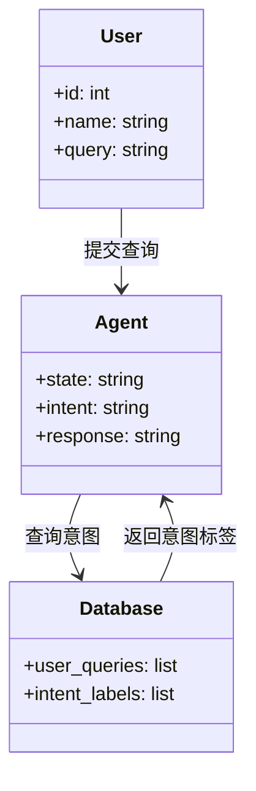

                 


# 设计AI Agent的决策与推理机制

## 关键词：AI Agent，决策机制，推理机制，逻辑推理，强化学习，概率论，知识图谱

## 摘要：本文深入探讨AI Agent的决策与推理机制，涵盖逻辑推理、概率推理、强化学习等方法，结合实际案例分析，提供系统的理论与实践指导，帮助读者理解并设计高效的AI Agent系统。

---

# 第一部分: AI Agent的决策与推理机制基础

# 第1章: AI Agent的背景与概念

## 1.1 AI Agent的基本概念

### 1.1.1 什么是AI Agent
AI Agent（人工智能代理）是指能够感知环境、自主决策并采取行动的智能实体。它可以是一个软件程序或物理设备，旨在解决特定问题或完成特定任务。

### 1.1.2 AI Agent的分类
- **简单反射型代理**：基于预定义规则直接响应输入。
- **基于模型的反射型代理**：维护环境模型，根据模型推理决策。
- **目标驱动型代理**：根据目标选择最优行动。
- **效用驱动型代理**：通过最大化效用函数进行决策。

### 1.1.3 AI Agent的应用场景
- 智能助手（如Siri、Alexa）
- 智能客服系统
- 自动驾驶系统
- 游戏AI
- 机器人控制

## 1.2 AI Agent的发展历程

### 1.2.1 从规则驱动到数据驱动
早期的AI Agent主要基于规则，而现在更多依赖数据驱动的方法，如机器学习和深度学习。

### 1.2.2 大模型时代的AI Agent
随着大语言模型的发展，AI Agent的能力得到了显著提升，能够处理复杂的决策和推理任务。

### 1.2.3 当前AI Agent的技术瓶颈
- 复杂环境下的决策不确定性
- 动态环境中的实时推理
- 多目标优化的平衡问题

## 1.3 AI Agent的核心特点

### 1.3.1 自适应性
能够根据环境变化调整行为。

### 1.3.2 学习能力
通过经验或数据提升性能。

### 1.3.3 交互能力
与用户或其他系统进行有效沟通与协作。

## 1.4 本章小结
本章介绍了AI Agent的基本概念、分类、发展历程及核心特点，为后续内容打下基础。

---

# 第2章: 决策与推理机制的数学基础

## 2.1 基础概率论

### 2.1.1 概率的基本概念
概率用于描述事件发生的可能性，是决策与推理中的关键工具。

### 2.1.2 条件概率与贝叶斯定理
贝叶斯定理（公式：$$P(A|B) = \frac{P(B|A)P(A)}{P(B)}$$）在推理中广泛应用。

### 2.1.3 贝叶斯网络的数学模型
贝叶斯网络通过有向无环图表示变量之间的依赖关系，用于概率推理。

## 2.2 逻辑推理基础

### 2.2.1 命题逻辑
命题逻辑研究命题的真假关系，例如蕴含关系（公式：$$A \rightarrow B$$）。

### 2.2.2 一阶逻辑
一阶逻辑允许使用量词（∀、∃）和函数，表达更复杂的逻辑关系。

### 2.2.3 逻辑推理的规则与算法
常用逻辑推理算法包括自然演绎推理和模析树方法。

## 2.3 决策论基础

### 2.3.1 决策树与决策规则
决策树通过树状结构表示决策过程，用于分类和回归任务。

### 2.3.2 最大期望值法
在不确定条件下，通过最大化期望值进行决策。

### 2.3.3 多目标优化
在多个目标之间寻找平衡点，例如使用帕累托最优。

## 2.4 本章小结
本章介绍了概率论、逻辑推理和决策论的基础知识，为后续决策与推理机制的实现提供了数学基础。

---

# 第3章: AI Agent的决策与推理机制

## 3.1 决策机制的核心原理

### 3.1.1 基于规则的决策
通过预定义规则进行决策，简单但缺乏灵活性。

### 3.1.2 基于模型的决策
基于环境模型进行推理，适用于复杂场景。

### 3.1.3 基于强化学习的决策
通过与环境互动，学习最优策略，如Q-learning算法。

## 3.2 推理机制的核心原理

### 3.2.1 基于符号逻辑的推理
通过符号操作进行推理，如一阶逻辑的演绎推理。

### 3.2.2 基于概率的推理
利用概率模型进行不确定性推理，如贝叶斯网络。

### 3.2.3 基于知识图谱的推理
通过知识图谱进行语义推理，如概念间的关系推理。

## 3.3 决策与推理的结合

### 3.3.1 决策驱动的推理
根据决策目标调整推理过程。

### 3.3.2 推理驱动的决策
基于推理结果生成决策。

### 3.3.3 联合优化的决策与推理
将决策和推理作为一个整体优化问题。

## 3.4 本章小结
本章详细讲解了决策和推理机制的核心原理及其结合方式，展示了不同方法的特点和应用场景。

---

# 第4章: AI Agent的算法实现

## 4.1 基于逻辑推理的算法

### 4.1.1 命题逻辑推理算法
使用自然演绎法进行命题逻辑推理。

### 4.1.2 一阶逻辑推理算法
使用归结演绎法进行一阶逻辑推理。

### 4.1.3 知识图谱推理算法
基于知识图谱的SPARQL查询进行推理。

## 4.2 基于概率的推理算法

### 4.2.1 贝叶斯网络推理
通过贝叶斯网络进行概率推理，计算后验概率。

### 4.2.2 马尔可夫链蒙特卡罗方法
用于复杂概率分布的采样和推理。

## 4.3 基于强化学习的决策算法

### 4.3.1 Q-learning算法
通过状态-动作-奖励机制学习最优策略。

### 4.3.2 Deep Q-Networks (DQN)
使用深度神经网络近似Q值函数。

## 4.4 本章小结
本章介绍了几种常见的决策与推理算法，并通过伪代码示例展示了其实现过程。

---

# 第5章: 系统分析与架构设计方案

## 5.1 项目介绍

### 5.1.1 项目背景
以智能客服系统为例，设计一个基于AI Agent的决策与推理系统。

## 5.2 系统功能设计

### 5.2.1 领域模型设计
使用mermaid类图展示系统各组件之间的关系。



### 5.2.2 系统架构设计
使用mermaid架构图展示系统整体架构。


### 5.2.3 系统接口设计
定义API接口，如`/api/query`用于接收用户查询并返回处理结果。

### 5.2.4 系统交互设计
使用mermaid序列图展示用户与AI Agent的交互流程。

```mermaid
sequenceDiagram
    用户 -> AI Agent: 提交查询
    AI Agent -> 数据库: 查询历史记录
    并行
    AI Agent -> 外部API: 获取实时信息
    数据库 -> AI Agent: 返回历史记录
    AI Agent -> 用户: 返回处理结果
```

## 5.3 本章小结
本章通过实际项目展示了系统分析与架构设计的过程，为后续实现提供了指导。

---

# 第6章: 项目实战

## 6.1 环境安装

### 6.1.1 安装Python
安装Python 3.x及以上版本。

### 6.1.2 安装依赖库
安装numpy、pandas、scikit-learn等机器学习库。

## 6.2 系统核心实现

### 6.2.1 逻辑推理模块

```python
def logical_inference(rules, facts):
    # 实现基于规则的逻辑推理
    pass
```

### 6.2.2 概率推理模块

```python
def bayesian_inference(prior, likelihood):
    posterior = prior * likelihood / normalization_factor
    return posterior
```

### 6.2.3 强化学习模块

```python
def q_learning(state, action):
    return Q[state][action]
```

## 6.3 代码应用解读与分析

### 6.3.1 逻辑推理模块实现
通过规则库和事实库进行命题逻辑推理。

### 6.3.2 概率推理模块实现
基于贝叶斯网络计算后验概率。

### 6.3.3 强化学习模块实现
通过Q-learning算法学习最优策略。

## 6.4 实际案例分析

### 6.4.1 案例介绍
以智能客服系统为例，展示AI Agent如何处理用户查询。

### 6.4.2 案例实现
详细分析系统的核心代码实现。

## 6.5 项目小结
本章通过实际项目展示了AI Agent决策与推理机制的实现过程。

---

# 第7章: 总结与展望

## 7.1 本章总结
总结全文内容，强调AI Agent决策与推理机制的重要性。

## 7.2 未来展望
展望AI Agent技术的发展方向，如多模态推理、自适应学习等。

## 7.3 最佳实践 tips
- 结合具体场景选择合适的方法。
- 定期更新模型以适应环境变化。
- 注重数据质量和多样性。

## 7.4 本章小结
本章总结了全文内容，并为读者提供了进一步学习和实践的方向。

---

# 作者：AI天才研究院/AI Genius Institute & 禅与计算机程序设计艺术 /Zen And The Art of Computer Programming

