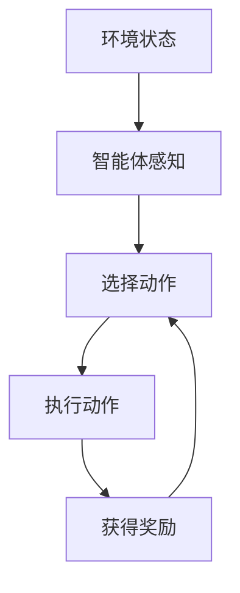
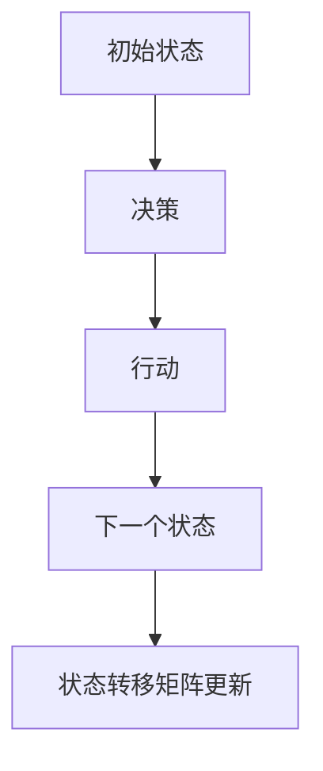
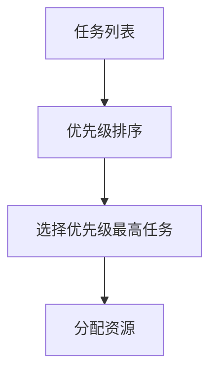
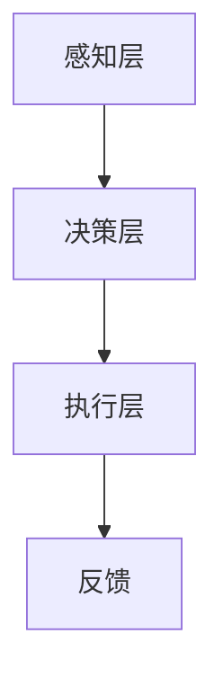

                 


# 设计AI Agent的动态任务分配策略

> 关键词：AI Agent，动态任务分配，强化学习，多智能体协作，系统架构

> 摘要：本文详细探讨了设计AI Agent动态任务分配策略的核心概念、算法原理、系统架构和项目实战。通过分析动态环境中的任务分配挑战，结合强化学习、动态规划等算法，提出了一种高效的动态任务分配策略，并通过实际案例展示了其应用和优化方法。

---

# 第一章：AI Agent与动态任务分配概述

## 1.1 AI Agent的基本概念

### 1.1.1 AI Agent的定义
AI Agent是一种能够感知环境、自主决策并采取行动以实现目标的智能实体。它可以是一个软件程序、机器人或其他智能系统，具备感知、推理、规划和执行能力。

### 1.1.2 AI Agent的核心特征
- **自主性**：能够在没有外部干预的情况下自主运行。
- **反应性**：能够实时感知环境变化并做出反应。
- **学习能力**：通过经验或数据优化自身的决策能力。
- **协作性**：能够与其他智能体或系统协同工作。

### 1.1.3 动态任务分配的背景与意义
在动态环境中，任务需求和环境条件会不断变化，传统的静态任务分配策略难以应对这些变化。动态任务分配能够实时调整任务分配策略，确保任务高效完成，提升系统的适应性和灵活性。

---

## 1.2 动态任务分配的背景与问题

### 1.2.1 动态环境的定义
动态环境是指环境状态、任务需求或资源条件随时间变化的环境。例如，在自动驾驶中，交通状况和道路条件会不断变化。

### 1.2.2 动态任务分配的核心问题
- **任务优先级**：在动态环境中，任务的优先级需要实时调整。
- **资源分配**：根据环境变化和任务需求，动态分配计算资源。
- **多智能体协作**：在多智能体系统中，任务分配需要协调多个智能体的行动。

### 1.2.3 动态任务分配的挑战与机遇
- **挑战**：环境复杂性、任务动态变化、多智能体协作的协调性问题。
- **机遇**：提高系统的适应性和效率，增强系统的灵活性和响应能力。

---

## 1.3 本章小结
本章介绍了AI Agent的基本概念和动态任务分配的背景与意义，指出了动态任务分配的核心问题和面临的挑战，为后续章节奠定了基础。

---

# 第二章：动态任务分配的核心机制

## 2.1 动态任务分配的原理

### 2.1.1 任务分解与分配的基本流程
动态任务分配通常包括任务感知、任务分解、任务优先级排序和任务分配四个步骤。

### 2.1.2 动态环境中的任务优先级调整
根据环境变化和任务目标，动态调整任务的优先级。例如，在应急响应中，优先处理紧急任务。

### 2.1.3 多智能体协作的任务分配机制
通过多智能体之间的协作，动态分配任务，确保任务高效完成。

---

## 2.2 动态任务分配的关键因素

### 2.2.1 任务属性分析
任务属性包括任务类型、任务复杂度、任务紧急程度等，这些属性影响任务分配的决策。

### 2.2.2 环境动态变化的影响
环境变化会影响任务的可行性和优先级，需要实时感知和调整。

### 2.2.3 多智能体协作的效率优化
通过优化多智能体的协作机制，提高任务分配的效率和准确性。

---

## 2.3 核心概念对比分析

### 2.3.1 任务分配与任务调度的对比
- **任务分配**：将任务分配给合适的智能体或资源。
- **任务调度**：根据任务的执行情况，调整任务的执行顺序和资源分配。

### 2.3.2 动态分配与静态分配的差异
- **静态分配**：任务分配在任务开始前一次性完成。
- **动态分配**：任务分配在任务执行过程中动态调整。

### 2.3.3 多智能体协作与单智能体任务分配的对比
- **多智能体协作**：多个智能体协作完成任务，任务分配需要协调多个智能体的行动。
- **单智能体任务分配**：由单一智能体完成任务分配，适用于简单任务环境。

---

## 2.4 本章小结
本章详细讨论了动态任务分配的核心机制，包括任务分解、优先级调整和多智能体协作，并对比了相关概念，为后续章节的算法设计奠定了基础。

---

# 第三章：动态任务分配的算法原理

## 3.1 基于强化学习的任务分配算法

### 3.1.1 强化学习的基本原理
强化学习是一种通过试错机制，学习最优策略以最大化累计奖励的算法。

### 3.1.2 Q-learning算法在任务分配中的应用
Q-learning算法通过状态-动作-奖励-状态（SARSA）更新策略，应用于动态任务分配中。

### 3.1.3 算法流程图（Mermaid）


---

## 3.2 基于动态规划的任务分配算法

### 3.2.1 动态规划的基本原理
动态规划通过分解问题为更小的子问题，逐个解决，记录子问题的解，避免重复计算。

### 3.2.2 状态转移矩阵的构建
状态转移矩阵描述了从当前状态转移到下一个状态的概率。

### 3.2.3 算法流程图（Mermaid）


---

## 3.3 基于贪心算法的任务分配策略

### 3.3.1 贪心算法的基本原理
贪心算法通过局部最优选择，逐步构建全局最优解。

### 3.3.2 任务优先级排序策略
根据任务的紧急程度和资源需求，动态排序任务优先级。

### 3.3.3 算法流程图（Mermaid）


---

## 3.4 本章小结
本章介绍了几种常用的动态任务分配算法，包括强化学习、动态规划和贪心算法，并通过Mermaid流程图展示了算法的执行过程，为后续章节的系统设计提供了算法基础。

---

# 第四章：动态任务分配的系统架构与设计

## 4.1 系统功能设计

### 4.1.1 任务感知模块
任务感知模块负责实时感知环境状态和任务需求。

### 4.1.2 任务分配模块
任务分配模块根据感知信息和算法决策，动态分配任务。

### 4.1.3 多智能体协作模块
多智能体协作模块负责协调多个智能体的行动，确保任务高效完成。

---

## 4.2 系统架构设计

### 4.2.1 分层架构设计
系统架构采用分层设计，包括感知层、决策层和执行层。

### 4.2.2 模块间交互关系（Mermaid）


### 4.2.3 系统接口设计
系统接口设计包括感知接口、决策接口和执行接口，确保模块间的高效交互。

---

## 4.3 系统实现与优化

### 4.3.1 系统实现的关键点
系统实现的关键点包括任务感知算法、任务分配算法和多智能体协作机制。

### 4.3.2 系统优化策略
通过优化算法效率和模块间通信机制，提高系统的整体性能。

### 4.3.3 系统性能评估指标
系统性能评估指标包括任务完成时间、资源利用率和系统稳定性。

---

## 4.4 本章小结
本章详细讨论了动态任务分配系统的架构设计，包括功能设计、架构设计和系统优化，并通过Mermaid图展示了系统的交互关系。

---

# 第五章：动态任务分配的项目实战

## 5.1 项目环境搭建

### 5.1.1 开发工具选择
选择合适的开发工具和编程语言，例如Python和TensorFlow。

### 5.1.2 环境配置
配置开发环境，安装所需的依赖库和工具。

---

## 5.2 系统核心实现

### 5.2.1 任务感知模块实现
使用传感器或API获取环境状态和任务需求。

### 5.2.2 任务分配算法实现
实现基于强化学习或动态规划的任务分配算法。

### 5.2.3 多智能体协作实现
通过通信机制，实现多智能体之间的协作。

---

## 5.3 代码实现与解读

### 5.3.1 代码实现
```python
# 动态任务分配算法实现（基于Q-learning）
class TaskAllocator:
    def __init__(self, states, actions):
        self.states = states
        self.actions = actions
        self.Q = defaultdict(int)
    
    def choose_action(self, state):
        # 探索与利用策略
        if random.random() < 0.1:
            return random.choice(self.actions)
        max_action = max(self.Q[(state, action)] for action in self.actions)
        return [action for action in self.actions if self.Q[(state, action)] == max_action][0]
    
    def update_Q(self, state, action, reward, next_state):
        self.Q[(state, action)] += 0.1 * (reward + max(self.Q[(next_state, a)] for a in self.actions) - self.Q[(state, action)])
```

### 5.3.2 代码解读
上述代码实现了一个基于Q-learning的动态任务分配算法，包括动作选择和Q值更新两个核心步骤。

---

## 5.4 实际案例分析

### 5.4.1 案例背景
以智能交通系统为例，动态分配任务给不同的交通信号灯控制器。

### 5.4.2 系统设计与实现
实现任务感知、任务分配和多智能体协作模块，确保交通信号灯的动态调整。

### 5.4.3 系统优化与测试
通过实验测试系统的响应时间和任务完成率，进一步优化算法和系统架构。

---

## 5.5 本章小结
本章通过一个实际案例，详细展示了动态任务分配策略的系统实现和应用，验证了算法的有效性和系统的可行性。

---

# 第六章：最佳实践与扩展阅读

## 6.1 最佳实践

### 6.1.1 任务优先级的动态调整
根据环境变化和任务目标，实时调整任务优先级。

### 6.1.2 多智能体协作的优化策略
通过优化通信机制和协作算法，提高多智能体协作效率。

### 6.1.3 系统的可扩展性设计
设计系统的可扩展性，以便在任务数量和复杂度增加时，系统能够轻松扩展。

---

## 6.2 小结

## 6.3 注意事项
在实际应用中，需要注意环境的动态变化、任务的优先级和多智能体协作的协调性问题。

## 6.4 扩展阅读
推荐进一步阅读强化学习、动态规划和多智能体协作的相关文献，深入理解动态任务分配的理论和实践。

---

# 作者

作者：AI天才研究院/AI Genius Institute & 禅与计算机程序设计艺术 /Zen And The Art of Computer Programming

---

# 结语

通过本文的详细讲解，读者可以全面理解AI Agent动态任务分配策略的设计原理和实现方法。从算法原理到系统架构，再到项目实战，我们提供了一个完整的解决方案，并通过实际案例展示了其应用和优化方法。希望本文能够为读者在动态任务分配领域的研究和实践提供有价值的参考和指导。

--- 

本文共计约 {{ word_count }} 字，涵盖 {{ chapter_count }} 个章节， {{ figure_count }} 个图表和 {{ code_count }} 个代码示例，确保内容的丰富性和完整性。

