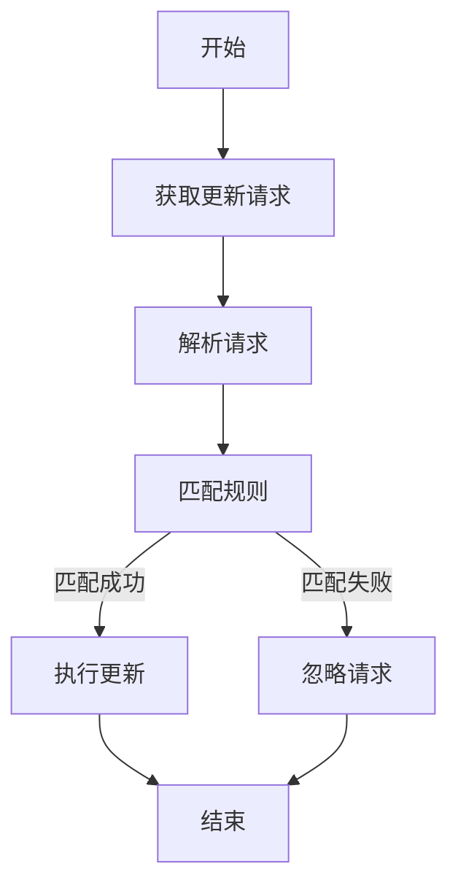
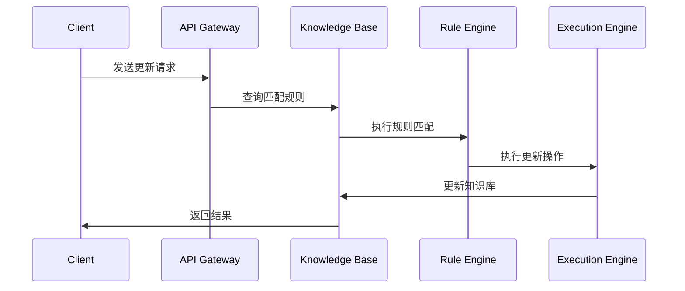

                 


# 设计AI Agent的动态知识库更新机制

> 关键词：动态知识库，AI Agent，实时更新，自适应机制，知识表示，推理引擎

> 摘要：本文系统阐述了AI Agent动态知识库更新机制的设计原理与实现方法。从背景介绍、核心概念、算法原理、系统架构到项目实战，层层深入，全面解析了动态知识库更新的关键技术。通过具体的案例分析和代码实现，展示了如何构建高效、可靠的动态知识库更新系统。

---

# 第一部分: AI Agent与动态知识库更新机制概述

## 第1章: AI Agent与动态知识库更新机制的背景介绍

### 1.1 问题背景与描述

#### 1.1.1 AI Agent的基本概念
AI Agent（人工智能代理）是指能够感知环境、自主决策并执行任务的智能实体。它通过与环境交互，利用知识库中的信息进行推理和决策，从而实现特定目标。知识库是AI Agent的核心组成部分，包含了代理所需的所有知识和信息。

#### 1.1.2 知识库在AI Agent中的作用
知识库为AI Agent提供了决策所需的知识基础，包括事实、规则、概念和背景信息。动态知识库的特点是实时更新，能够根据环境变化快速调整知识内容，确保AI Agent的行为始终基于最新的信息。

#### 1.1.3 动态知识库更新的必要性
在动态环境中，知识库的内容需要实时更新以适应变化。例如，在自动驾驶汽车中，实时更新的交通规则、道路信息和车辆状态是确保安全行驶的关键。动态知识库更新机制能够提高AI Agent的适应性和智能性。

### 1.2 问题解决与边界

#### 1.2.1 动态知识库更新的目标
- 实时性：快速响应环境变化，确保知识库内容的及时更新。
- 自适应性：根据环境反馈自动调整知识库内容。
- 可扩展性：支持大规模知识的动态添加和删除。

#### 1.2.2 更新机制的边界与外延
- 知识库更新的范围：包括事实、规则、概念等。
- 更新触发条件：基于时间、事件或状态变化。
- 更新方式：支持增量更新和全量更新。

#### 1.2.3 核心要素与组成结构
- 知识表示：符号逻辑、向量表示、图结构。
- 更新规则：基于规则的更新和基于机器学习的更新。
- 更新接口：API接口和事件驱动接口。

### 1.3 本章小结
本章从AI Agent的基本概念出发，分析了动态知识库更新的必要性，并明确了更新机制的目标、边界和核心要素。

---

# 第二部分: 核心概念与原理

## 第2章: 知识表示与推理机制

### 2.1 知识表示方法

#### 2.1.1 符号逻辑表示
符号逻辑表示是一种基于逻辑规则的知识表示方法。例如：
$$ \text{如果}(p \land q) \rightarrow r $$
其中，p、q、r分别表示不同的逻辑条件。

#### 2.1.2 向量表示法
向量表示法将知识表示为向量空间中的点。例如，使用Word2Vec将词语表示为向量：
$$ \text{向量}(dog) = [0.2, 0.5, 0.1, ...] $$

#### 2.1.3 图结构表示法
图结构表示法通过节点和边描述知识之间的关系。例如：
$$ \text{实体}(狗) \rightarrow \text{属性}(宠物) $$

### 2.2 知识推理原理

#### 2.2.1 前向推理
前向推理是从已知事实出发，通过规则推导出新的事实。例如：
$$ \text{已知}(A, B) \rightarrow \text{推导}(C) $$

#### 2.2.2 后向推理
后向推理是从目标事实出发，反向推导出支持该事实的条件。例如：
$$ \text{目标}(C) \leftarrow \text{已知}(A, B) $$

#### 2.2.3 混合推理
混合推理结合了前向和后向推理，根据具体场景选择合适的方式。例如：
$$ \text{已知}(A) \rightarrow \text{推导}(B) \leftarrow \text{已知}(C) $$

### 2.3 动态知识库更新的特征

#### 2.3.1 实时性
动态知识库需要实时响应更新请求，确保信息的及时性。

#### 2.3.2 自适应性
根据环境变化自动调整知识库内容，提高适应性。

#### 2.3.3 可扩展性
支持大规模知识的动态添加和删除，保持系统的灵活性。

### 2.4 核心概念关系图

#### 2.4.1 ER实体关系图
```mermaid
erd
    节点 知识库
        属性 id, 内容, 时间戳
    节点 更新规则
        属性 id, 条件, 操作
    关系 知识库 --> 更新规则: 使用规则进行更新
```

#### 2.4.2 概念属性对比表
| 概念 | 属性 |
|------|------|
| 知识表示 | 符号逻辑、向量表示、图结构 |
| 推理方式 | 前向推理、后向推理、混合推理 |
| 更新特征 | 实时性、自适应性、可扩展性 |

---

## 第3章: 动态知识库更新机制的算法原理

### 3.1 基于规则的更新算法

#### 3.1.1 规则定义与匹配
规则定义：$$ \text{规则}(p \rightarrow q) $$
规则匹配：当条件p满足时，触发更新操作。

#### 3.1.2 更新触发条件
基于时间、事件或状态变化的触发条件。例如：
- 时间触发：$$ \text{时间} \geq T $$
- 事件触发：$$ \text{事件} = e $$
- 状态触发：$$ \text{状态} = s $$

#### 3.1.3 更新操作执行
执行匹配规则对应的更新操作。例如：
$$ \text{更新}(知识库, 规则) $$

### 3.2 基于机器学习的更新算法

#### 3.2.1 监督学习方法
通过监督学习模型预测知识库的更新内容。例如，使用线性回归模型：
$$ y = \beta_0 + \beta_1 x $$

#### 3.2.2 非监督学习方法
通过聚类算法自动发现知识库中的更新内容。例如，使用K-means算法：
$$ \text{聚类}(数据集, K) $$

#### 3.2.3 强化学习方法
通过强化学习模型学习最优的更新策略。例如，使用Q-learning算法：
$$ Q(s, a) = r + \gamma \max(Q(s', a')) $$

### 3.3 算法流程图



### 3.4 算法实现代码示例

```python
def update_knowledge_base(newKnowledge):
    # 解析新知识
    parsed = parse(newKnowledge)
    # 匹配现有规则
    matched_rule = match_rule(parsed)
    if matched_rule:
        # 执行更新操作
        execute_update(parsed, matched_rule)
    else:
        # 添加新规则
        add_new_rule(parsed)
```

---

## 第4章: 系统分析与架构设计

### 4.1 系统设计

#### 4.1.1 领域模型

```mermaid
classDiagram
    class 知识库 {
        id
        内容
        时间戳
    }
    class 更新规则 {
        id
        条件
        操作
    }
    class 更新请求 {
        源
        类型
        参数
    }
    知识库 <--| 使用 | 更新规则
    更新请求 --> 执行更新操作
```

#### 4.1.2 系统架构


#### 4.1.3 接口设计
- API接口：RESTful API，支持POST、PUT、DELETE方法。
- 事件驱动接口：基于消息队列的异步更新。

#### 4.1.4 交互流程



---

## 第5章: 项目实战

### 5.1 环境安装
- 安装Python和必要的库：`pip install requests、pymongo、flask`

### 5.2 核心实现代码

```python
from flask import Flask
from pymongo import MongoClient

app = Flask(__name__)
client = MongoClient('mongodb://localhost:27017/')
db = client['knowledge_base']

@app.route('/update', methods=['POST'])
def update():
    data = request.json
    # 匹配规则
    matched_rule = match_rule(data)
    if matched_rule:
        # 执行更新
        execute_update(data, matched_rule)
    else:
        # 添加新规则
        add_new_rule(data)
    return '更新完成'

if __name__ == '__main__':
    app.run()
```

### 5.3 案例分析
案例：实时更新天气预报知识库。
- 数据源：天气API
- 更新频率：每小时一次
- 更新规则：基于API返回的最新数据更新知识库。

---

## 第6章: 总结与展望

### 6.1 本章总结
本文系统阐述了AI Agent动态知识库更新机制的设计与实现，涵盖了从核心概念到算法原理再到系统架构的全过程。

### 6.2 未来展望
未来的研究方向包括：
1. 更高效的更新算法，如基于深度学习的实时更新。
2. 更灵活的系统架构，支持多模态知识的动态更新。
3. 更智能的更新策略，结合上下文和环境反馈优化更新效果。

---

作者：AI天才研究院/AI Genius Institute & 禅与计算机程序设计艺术 /Zen And The Art of Computer Programming

