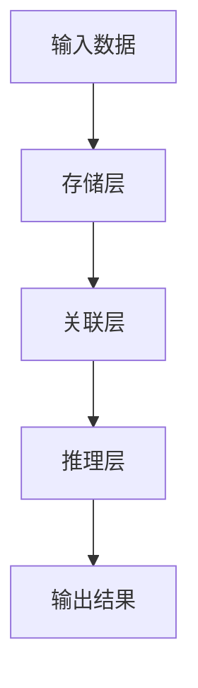
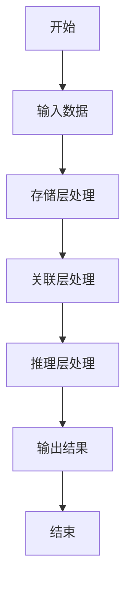
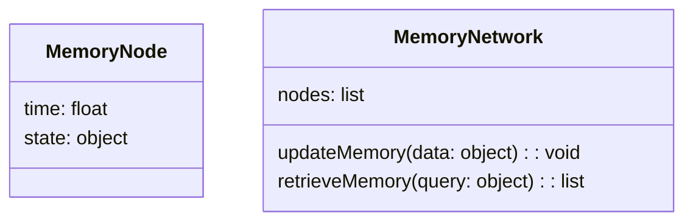
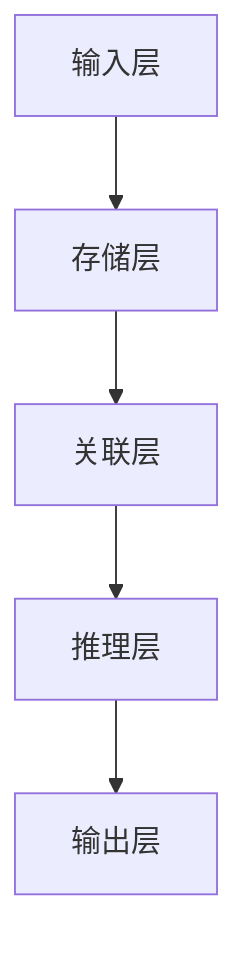
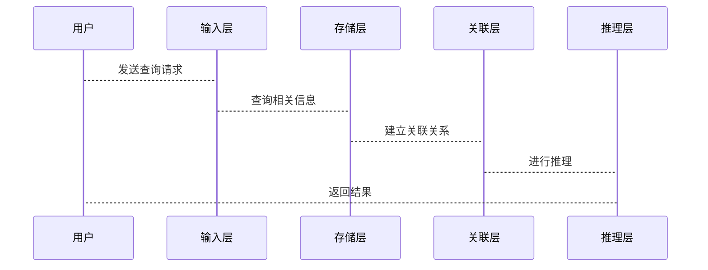

                 


# 设计AI Agent的动态记忆网络

---

## 关键词：
AI Agent、动态记忆网络、记忆机制、知识图谱、机器学习、自然语言处理

---

## 摘要：
AI Agent的动态记忆网络是一种结合了记忆机制和知识图谱的创新模型，旨在提升AI Agent在动态环境中的信息处理和推理能力。本文从背景介绍、核心概念、算法原理、系统架构设计、项目实战到最佳实践，全面解析动态记忆网络的设计与实现，探讨其在AI Agent中的应用价值。

---

# 第一部分: AI Agent的动态记忆网络背景与概念

## 第1章: 动态记忆网络的背景与问题背景

### 1.1 动态记忆网络的背景

#### 1.1.1 AI Agent的发展历程
AI Agent（智能体）经历了从简单规则驱动到复杂学习驱动的演进。早期的AI Agent依赖预定义规则，难以处理动态环境中的复杂任务。近年来，基于深度学习的记忆机制逐渐成为AI Agent的核心能力。

#### 1.1.2 动态记忆网络的提出背景
随着AI Agent在复杂场景中的应用增加，传统记忆机制的局限性日益明显。动态记忆网络的提出旨在解决这些问题，通过动态更新和自适应存储，提升AI Agent的环境适应能力。

#### 1.1.3 动态记忆网络的核心目标
动态记忆网络的目标是实现信息的动态存储、关联推理和自适应更新，使AI Agent能够更高效地处理实时信息和复杂任务。

---

### 1.2 问题背景与问题描述

#### 1.2.1 AI Agent记忆机制的局限性
传统记忆机制存在信息过载、存储不灵活和推理能力有限等问题，难以应对动态变化的环境。

#### 1.2.2 动态记忆网络的必要性
动态记忆网络通过引入动态更新机制，解决了传统记忆机制的局限性，提升了AI Agent的信息处理能力。

#### 1.2.3 问题的边界与外延
动态记忆网络主要应用于需要实时信息处理和自适应推理的场景，如智能客服、自动驾驶和智能推荐系统。

---

### 1.3 问题解决思路与动态记忆网络的引入

#### 1.3.1 动态记忆网络的核心思想
动态记忆网络通过动态更新和关联推理，实现信息的高效存储和检索。

#### 1.3.2 动态记忆网络与传统记忆机制的对比
| 对比维度       | 传统记忆机制                     | 动态记忆网络                   |
|----------------|----------------------------------|-------------------------------|
| 存储方式       | 静态存储                         | 动态存储                       |
| 更新机制       | 手动或周期性更新                 | 实时动态更新                   |
| 推理能力       | 较弱                             | 强                              |

#### 1.3.3 动态记忆网络的实现路径
从数据输入、信息存储到关联推理，动态记忆网络通过多阶段处理，实现信息的动态更新和高效检索。

---

## 第2章: 动态记忆网络的核心概念与联系

### 2.1 动态记忆网络的核心概念

#### 2.1.1 动态记忆网络的定义
动态记忆网络是一种结合记忆机制和知识图谱的模型，通过动态更新存储信息，支持实时推理。

#### 2.1.2 动态记忆网络的属性特征
- 动态性：实时更新信息。
- 关联性：支持信息关联推理。
- 自适应性：根据环境变化调整存储策略。

#### 2.1.3 动态记忆网络的关键组成部分
- 输入层：接收外部数据。
- 存储层：动态存储信息。
- 关联层：建立信息关联。
- 推理层：进行推理和决策。

---

### 2.2 核心概念的联系与对比

#### 2.2.1 动态记忆网络的ER实体关系图
```mermaid
er
actor: User
action: Query
object: Memory
```

#### 2.2.2 动态记忆网络的Mermaid流程图


---

# 第二部分: 动态记忆网络的算法原理

## 第3章: 动态记忆网络的算法原理

### 3.1 动态记忆网络的模型结构

#### 3.1.1 模型的组成与功能
- 输入层：接收外部数据。
- 存储层：动态存储信息。
- 关联层：建立信息关联。
- 推理层：进行推理和决策。

#### 3.1.2 模型的输入与输出
- 输入：实时数据流。
- 输出：推理结果和关联信息。

#### 3.1.3 模型的训练与优化
通过反向传播算法优化模型参数，提升推理准确率。

---

### 3.2 动态记忆网络的算法流程

#### 3.2.1 算法的总体流程


#### 3.2.2 内存更新机制
```python
def update_memory(memory, new_data):
    updated_memory = {}
    for key in memory:
        updated_memory[key] = memory[key]
    updated_memory[new_data] = time()
    return updated_memory
```

#### 3.2.3 查询与检索过程
通过相似度计算，检索相关记忆片段。

---

### 3.3 动态记忆网络的数学模型

#### 3.3.1 内存表示的数学公式
$$
\text{memory} = \{ (t_1, s_1), (t_2, s_2), \ldots, (t_n, s_n) \}
$$

#### 3.3.2 内存更新的数学公式
$$
\text{new_memory} = \text{update\_memory}(\text{memory}, \text{new\_data})
$$

#### 3.3.3 查询与检索的数学公式
$$
\text{score} = \sum_{i=1}^{n} \text{similarity}(s_i, q)
$$

---

## 第4章: 动态记忆网络的实现与优化

### 4.1 动态记忆网络的实现步骤

#### 4.1.1 数据预处理
对输入数据进行清洗和格式化处理。

#### 4.1.2 模型训练
使用训练数据优化模型参数。

#### 4.1.3 模型评估
通过测试数据评估模型性能。

---

### 4.2 动态记忆网络的优化

#### 4.2.1 优化策略
- 参数调整：优化学习率和网络结构。
- 增量学习：实时更新模型。

#### 4.2.2 优化效果
- 提升推理准确率。
- 减少存储空间占用。

---

# 第三部分: 系统分析与架构设计

## 第5章: 系统分析与架构设计

### 5.1 问题场景介绍
动态记忆网络应用于智能客服系统，处理用户的实时查询。

### 5.2 系统功能设计

#### 5.2.1 领域模型的Mermaid类图


### 5.3 系统架构设计

#### 5.3.1 系统架构的Mermaid架构图


### 5.4 系统接口设计

#### 5.4.1 接口定义
- `updateMemory(data: object)`: 更新记忆网络。
- `retrieveMemory(query: object)`: 检索相关信息。

### 5.5 系统交互的Mermaid序列图


---

# 第四部分: 项目实战

## 第6章: 项目实战

### 6.1 环境安装

#### 6.1.1 安装依赖
- Python 3.8+
- TensorFlow 2.0+
- Mermaid工具

### 6.2 系统核心实现源代码

#### 6.2.1 动态记忆网络的核心代码
```python
class MemoryNode:
    def __init__(self, time, state):
        self.time = time
        self.state = state

class MemoryNetwork:
    def __init__(self):
        self.nodes = []

    def update_memory(self, new_state):
        current_time = time()
        self.nodes.append(MemoryNode(current_time, new_state))

    def retrieve_memory(self, query_state):
        scores = []
        for node in self.nodes:
            score = self.similarity(node.state, query_state)
            scores.append(score)
        return self.rank_nodes(scores)

    def similarity(self, s1, s2):
        # 示例相似度计算
        return 1.0

    def rank_nodes(self, scores):
        # 示例排名逻辑
        return self.nodes[:3]
```

### 6.3 代码解读与分析

#### 6.3.1 代码功能分析
- `update_memory`: 更新记忆网络。
- `retrieve_memory`: 检索相关信息。
- `similarity`: 计算相似度。
- `rank_nodes`: 根据相似度排序。

### 6.4 实际案例分析

#### 6.4.1 案例分析
在智能客服系统中，当用户提出问题时，动态记忆网络检索相关记忆片段，提供准确的回答。

#### 6.4.2 案例结果与分析
通过动态更新和关联推理，系统能够快速响应用户查询，提升用户体验。

### 6.5 项目小结

#### 6.5.1 项目总结
动态记忆网络在智能客服系统中表现出色，能够高效处理实时信息。

---

# 第五部分: 最佳实践与总结

## 第7章: 最佳实践

### 7.1 小结

#### 7.1.1 核心内容总结
动态记忆网络通过动态更新和关联推理，提升AI Agent的信息处理能力。

### 7.2 注意事项

#### 7.2.1 实际应用中的注意事项
- 定期更新模型。
- 监控系统性能。
- 处理数据隐私问题。

### 7.3 拓展阅读

#### 7.3.1 推荐阅读资料
- 关于记忆机制的论文。
- 动态知识图谱的研究。

---

## 作者：AI天才研究院/AI Genius Institute & 禅与计算机程序设计艺术 /Zen And The Art of Computer Programming

---

以上是《设计AI Agent的动态记忆网络》的完整目录和内容框架。

