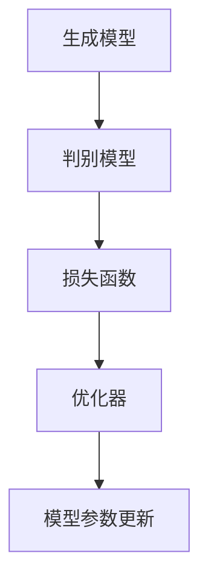

                 


# 设计AI Agent的对抗性学习防御机制

> 关键词：AI Agent，对抗性学习，防御机制，安全，深度学习

> 摘要：本文将详细探讨如何设计AI Agent的对抗性学习防御机制。从对抗性学习的基本概念到防御机制的核心原理，从数学模型的建立到实际系统的架构设计，从代码实现到案例分析，系统地阐述对抗性学习防御机制的设计方法与实现技巧。本文旨在帮助读者理解对抗性学习的本质，并掌握如何构建有效的防御机制，确保AI Agent的安全与稳定。

---

## 第一部分: 对抗性学习与AI Agent防御机制背景

### 第1章: 对抗性学习与AI Agent概述

#### 1.1 对抗性学习的基本概念
对抗性学习是一种机器学习方法，通过两个或多个学习模型（通常是生成模型和判别模型）的对抗过程，推动模型性能的提升。在对抗过程中，生成模型试图生成与真实数据相似的样本，而判别模型则试图区分生成样本与真实样本。通过不断迭代优化，生成模型的能力得到提升，而判别模型的判断能力也得到增强。

对抗性学习的核心思想是通过“对抗”来提高模型的泛化能力。这种方法在图像生成、语音合成、自然语言处理等领域得到了广泛应用。

#### 1.2 AI Agent的定义与特点
AI Agent（人工智能代理）是一种能够感知环境、自主决策并执行任务的智能实体。AI Agent的核心特点包括：
1. **自主性**：能够在没有外部干预的情况下独立运行。
2. **反应性**：能够根据环境的变化实时调整行为。
3. **目标导向性**：具有明确的目标，并通过行为选择来实现目标。
4. **学习能力**：能够通过经验改进自身的性能。

AI Agent与传统算法的区别在于其智能化和自主性。AI Agent能够动态适应环境变化，而传统算法通常需要手动调整参数或设计规则。

#### 1.3 对抗性学习在AI Agent中的应用背景
AI Agent在实际应用中面临着多种威胁与挑战，例如对抗攻击、信息干扰、数据污染等。对抗性学习的防御机制能够帮助AI Agent识别并抵御这些威胁，确保其行为的稳定性和可靠性。

对抗性学习防御机制的边界与外延包括：从网络攻击、数据攻击到模型攻击，从低级对抗到高级对抗，从静态对抗到动态对抗等。防御机制的目标是通过检测、分析和抵抗对抗性攻击，保护AI Agent的安全。

---

### 第2章: 对抗性学习防御机制的原理与核心要素

#### 2.1 对抗性学习防御机制的原理
对抗性学习防御机制的核心思想是通过检测和对抗对抗性攻击，保护模型的安全。其数学模型通常包括生成模型和判别模型两个部分：
- **生成模型**：生成对抗样本。
- **判别模型**：识别生成样本与真实样本的区别。

防御机制的目标是通过优化判别模型的损失函数，使得判别模型能够准确区分真实样本和对抗样本。同时，生成模型也在不断优化生成样本的质量，以欺骗判别模型。

对抗性学习防御机制的分类与对比可以通过以下表格进行展示：

| 防御方法 | 基于概率 | 基于鲁棒性 | 基于生成对抗 |
|----------|----------|------------|--------------|
| 原理     | 通过概率分布检测异常 | 通过优化模型鲁棒性 | 通过生成对抗样本进行防御 |
| 优缺点   | 简单易实现，但效果有限 | 鲁棒性强，但实现复杂 | 效果显著，但需要对抗训练 |

---

#### 2.2 对抗性学习防御机制的核心要素
对抗性学习防御机制的核心要素包括：
1. **检测模块**：用于识别对抗样本。
2. **分析模块**：用于分析对抗样本的特征。
3. **抵抗模块**：用于生成对抗样本或优化模型参数。

通过这三个模块的协同工作，防御机制能够有效地抵御对抗性攻击。

---

### 第3章: 对抗性学习防御机制的算法原理

#### 3.1 对抗性学习的数学模型
对抗性学习的数学模型通常由生成模型和判别模型组成。生成模型的目标是最小化判别模型的损失，而判别模型的目标是最大化真实样本与生成样本之间的差异。

生成模型的损失函数可以表示为：
$$ L_G = \log(P(D(x_{\text{生成}}) = \text{生成})) $$
判别模型的损失函数可以表示为：
$$ L_D = \log(P(D(x_{\text{真实}}) = \text{真实})) + \log(P(D(x_{\text{生成}}) = \text{生成})) $$

#### 3.2 对抗性学习防御机制的算法流程
对抗性学习防御机制的算法流程如下：
1. 初始化生成模型和判别模型的参数。
2. 训练生成模型，使其生成的样本能够欺骗判别模型。
3. 训练判别模型，使其能够准确区分真实样本和生成样本。
4. 重复步骤2和3，直到模型收敛。

通过这种方式，防御机制能够不断优化生成模型和判别模型的性能，从而提高模型的鲁棒性。

---

### 第4章: 对抗性学习防御机制的系统分析与架构设计

#### 4.1 系统功能设计
对抗性学习防御系统的功能设计包括：
1. **样本检测**：检测输入样本是否为对抗样本。
2. **样本分析**：分析对抗样本的特征。
3. **防御策略**：生成对抗样本或优化模型参数。

#### 4.2 系统架构设计
系统架构设计可以采用以下架构图：



---

### 第5章: 对抗性学习防御机制的项目实战

#### 5.1 环境安装
为了实现对抗性学习防御机制，需要安装以下环境：
1. Python 3.7+
2. PyTorch 1.9+
3. NumPy 1.21+

#### 5.2 核心代码实现
以下是防御机制的核心代码实现：

```python
import torch
import torch.nn as nn
import torch.optim as optim

# 定义生成模型
class Generator(nn.Module):
    def __init__(self, input_dim, output_dim):
        super(Generator, self).__init__()
        self.net = nn.Linear(input_dim, output_dim)

    def forward(self, x):
        return torch.sigmoid(self.net(x))

# 定义判别模型
class Discriminator(nn.Module):
    def __init__(self, input_dim, output_dim):
        super(Discriminator, self).__init__()
        self.net = nn.Linear(input_dim, output_dim)

    def forward(self, x):
        return torch.sigmoid(self.net(x))

# 初始化模型参数
input_dim = 100
output_dim = 1
generator = Generator(input_dim, output_dim)
discriminator = Discriminator(input_dim, output_dim)

# 初始化优化器
criterion = nn.BCELoss()
generator_optimizer = optim.Adam(generator.parameters(), lr=0.001)
discriminator_optimizer = optim.Adam(discriminator.parameters(), lr=0.001)

# 训练过程
for epoch in range(100):
    # 生成样本
    z = torch.randn(64, input_dim)
    generated_samples = generator(z)
    
    # 判别模型的训练
    labels_real = torch.ones(64, 1)
    labels_fake = torch.zeros(64, 1)
    
    # 判别模型的损失
    outputs_real = discriminator(real_samples)
    outputs_fake = discriminator(generated_samples)
    
    loss_d = criterion(outputs_real, labels_real) + criterion(outputs_fake, labels_fake)
    discriminator_optimizer.zero_grad()
    loss_d.backward()
    discriminator_optimizer.step()
    
    # 生成模型的训练
    outputs = discriminator(generated_samples)
    loss_g = criterion(outputs, labels_real)
    generator_optimizer.zero_grad()
    loss_g.backward()
    generator_optimizer.step()
```

---

### 第6章: 对抗性学习防御机制的最佳实践

#### 6.1 总结与小结
对抗性学习防御机制的核心是通过检测和对抗对抗样本，保护AI Agent的安全。通过生成模型和判别模型的博弈过程，可以不断优化模型的性能。

#### 6.2 注意事项
1. 防御机制的设计需要考虑模型的泛化能力和鲁棒性。
2. 对抗性攻击的方式多种多样，防御机制需要不断进化。
3. 在实际应用中，需要结合具体场景进行定制化设计。

#### 6.3 拓展阅读
1. Goodfellow, I., Pouget-Abadie, J., & Bengio, Y. (2014). Generative adversarial nets.
2. Szegedy, C., & Hadsell, R. (2015). Intriguing properties of neural networks.

---

作者：AI天才研究院/AI Genius Institute & 禅与计算机程序设计艺术 /Zen And The Art of Computer Programming

