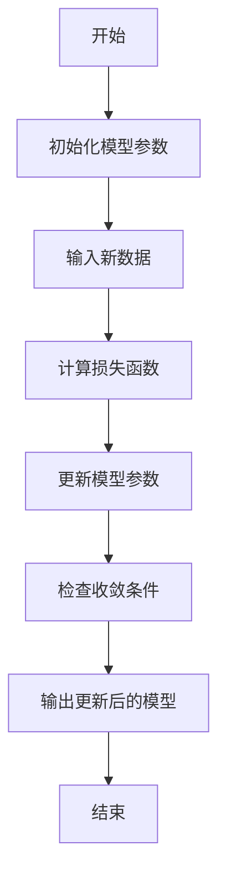
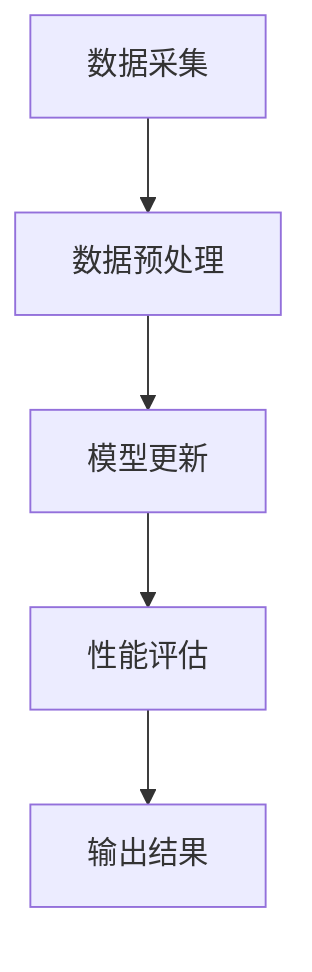

                 


# 设计AI Agent的持续学习与模型更新机制

> 关键词：AI Agent, 持续学习, 模型更新, 算法原理, 系统设计

> 摘要：本文详细探讨了设计AI Agent的持续学习与模型更新机制的核心概念、算法原理、系统架构和实际应用。通过逐步分析，本文为读者提供了从理论到实践的全面指导，帮助读者理解如何构建高效、自适应的AI Agent系统。

---

## 第1章: AI Agent与持续学习的背景介绍

### 1.1 AI Agent的基本概念

#### 1.1.1 AI Agent的定义与特点
AI Agent（人工智能代理）是一种能够感知环境、自主决策并采取行动的智能实体。它具有以下特点：
- **自主性**：能够在没有外部干预的情况下自主运行。
- **反应性**：能够实时感知环境并做出响应。
- **目标导向**：通过设定目标来驱动行为。
- **学习能力**：能够通过经验改进性能。

#### 1.1.2 AI Agent的分类与应用场景
AI Agent可以根据功能和应用领域进行分类：
- **简单反射型Agent**：基于规则的简单响应，适用于环境变化缓慢的场景。
- **基于模型的反射型Agent**：利用内部模型进行决策，适用于复杂环境。
- **目标驱动型Agent**：以目标为导向，优化行为以达到目标。
- **实用驱动型Agent**：通过效用函数优化决策，适用于多目标场景。

#### 1.1.3 持续学习在AI Agent中的重要性
在动态环境中，AI Agent需要不断适应新变化，持续学习能够帮助其：
- **增强适应性**：在环境变化时快速调整策略。
- **提高准确性**：通过更新模型提高预测和决策的准确性。
- **延长有效生命周期**：使AI Agent在长时间运行中保持高性能。

---

### 1.2 持续学习的背景与问题背景

#### 1.2.1 传统机器学习的局限性
传统机器学习模型通常在训练阶段完成后，无法适应新的数据分布变化，导致在动态环境中性能下降。

#### 1.2.2 动态环境下的学习需求
在现实场景中，数据分布可能随时间变化，例如网络攻击检测、金融市场预测等领域，需要模型能够实时更新。

#### 1.2.3 模型更新的必要性与挑战
模型更新的必要性：
- **实时性**：需要快速响应新数据。
- **资源效率**：模型更新应尽量节省计算资源。
- **稳定性**：模型更新过程中应保持系统的稳定运行。

---

## 第2章: 持续学习的核心概念与模型更新机制

### 2.1 持续学习的核心概念

#### 2.1.1 持续学习的定义与特点
持续学习（Continuous Learning）是一种机器学习范式，允许模型在新数据流不断输入的情况下进行实时更新和优化。

#### 2.1.2 持续学习与在线学习的区别
| 特性 | 持续学习 | 在线学习 |
|------|----------|----------|
| 数据输入 | 流式数据 | 流式数据 |
| 决策时间 | 实时更新 | 实时更新 |
| 模型复杂度 | 可能复杂 | 通常简单 |

#### 2.1.3 持续学习的数学模型与公式
持续学习的数学模型可以表示为：
$$
\theta_{t+1} = \theta_t + \alpha \cdot \nabla L(\theta_t)
$$
其中，$\theta_t$ 表示第 $t$ 时刻的模型参数，$\alpha$ 是学习率，$\nabla L(\theta_t)$ 是损失函数的梯度。

---

### 2.2 模型更新机制的原理

#### 2.2.1 模型更新的核心流程
模型更新的流程包括：
1. 数据预处理：清洗和归一化新数据。
2. 模型训练：使用新数据更新模型参数。
3. 模型评估：验证更新后的模型性能。
4. 模型部署：将更新后的模型应用于实际场景。

#### 2.2.2 模型更新的触发条件与策略
触发条件：
- **时间触发**：每隔固定时间更新模型。
- **性能触发**：当模型性能下降到一定阈值时更新。
- **数据触发**：当新数据量积累到一定程度时更新。

策略：
- **增量更新**：仅更新与新数据相关的参数。
- **全量更新**：重新训练整个模型。

#### 2.2.3 模型更新的评估与优化
评估指标包括：
- **准确率**：模型在测试集上的正确预测比例。
- **F1分数**：综合考虑精确率和召回率。
- **训练时间**：每次模型更新所需的时间。

优化方法：
- **学习率调整**：使用Adam优化器动态调整学习率。
- **模型剪枝**：去除冗余的模型参数以减少计算量。

---

## 第3章: 持续学习与模型更新的数学模型与算法原理

### 3.1 持续学习的数学模型

#### 3.1.1 基于概率的模型更新公式
概率更新公式：
$$
P(y|x) = \frac{P(x|y)P(y)}{P(x)}
$$

#### 3.1.2 基于优化的模型更新算法
优化目标函数：
$$
\min_{\theta} \sum_{i=1}^n (y_i - f(x_i; \theta))^2
$$

#### 3.1.3 基于强化学习的模型更新策略
强化学习策略：
$$
Q(s, a) = r + \gamma \max_a Q(s', a)
$$

---

### 3.2 模型更新算法的详细讲解

#### 3.2.1 算法原理与流程图


#### 3.2.2 算法代码实现
```python
def model_update_algorithm(data, model):
    # 初始化模型参数
    model_params = model.get_params()
    # 计算损失函数
    loss = calculate_loss(data, model_params)
    # 更新模型参数
    updated_params = update_params(model_params, loss)
    # 返回更新后的模型
    model.set_params(updated_params)
    return model
```

---

## 第4章: 持续学习与模型更新的系统架构设计

### 4.1 系统功能设计

#### 4.1.1 系统模块划分
- **数据采集模块**：负责收集实时数据。
- **模型更新模块**：执行模型参数的更新。
- **性能评估模块**：监控模型性能并触发更新。

#### 4.1.2 系统功能流程


---

## 第5章: 项目实战

### 5.1 环境安装与配置

#### 5.1.1 安装依赖
```bash
pip install numpy pandas scikit-learn tensorflow
```

#### 5.1.2 配置环境
```python
import numpy as np
import pandas as pd
from sklearn.model_selection import train_test_split
from tensorflow.keras.models import Sequential
from tensorflow.keras.layers import Dense
```

---

## 第6章: 总结与展望

### 6.1 最佳实践 tips
- **定期评估模型性能**：避免模型性能下降。
- **选择合适的更新策略**：根据场景选择增量或全量更新。
- **优化资源利用**：通过模型剪枝减少计算开销。

### 6.2 小结
本文系统地探讨了设计AI Agent的持续学习与模型更新机制，从理论到实践进行了全面分析，为读者提供了深入的指导。

### 6.3 注意事项
- **数据质量**：确保新数据的准确性和完整性。
- **模型稳定性**：避免频繁更新导致模型波动。

### 6.4 拓展阅读
- 建议进一步研究分布式模型更新和在线学习算法。

---

作者：AI天才研究院/AI Genius Institute & 禅与计算机程序设计艺术 /Zen And The Art of Computer Programming

