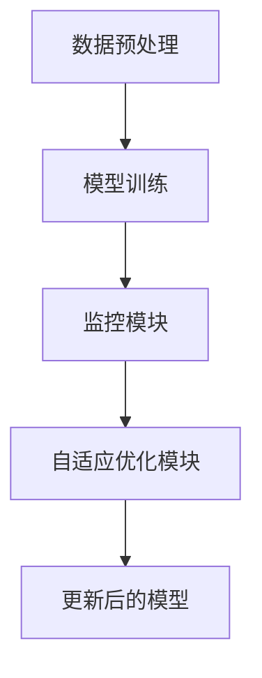
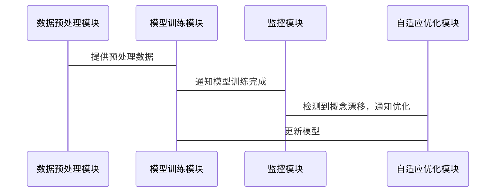

                 


# 设计AI Agent的概念漂移适应策略

> 关键词：AI Agent，概念漂移，适应策略，动态环境，模型更新

> 摘要：本文详细探讨了设计AI Agent时如何应对概念漂移的问题，提出了从概念漂移的定义与问题背景、核心概念与联系、算法原理、系统分析与架构设计、项目实战到最佳实践的全面解决方案。通过详细分析和实际案例，本文为AI Agent的设计者提供了理论和实践的双重指导。

---

# 第1章: AI Agent的概念漂移适应策略概述

## 1.1 概念漂移的定义与问题背景

### 1.1.1 概念漂移的定义

概念漂移（Concept Drift）是指数据分布的变化，导致AI模型的性能下降。例如，在推荐系统中，用户行为的变化可能导致模型无法准确推荐相关内容。

### 1.1.2 问题背景与挑战

- **动态环境中的适应性需求**：AI Agent需要在实时环境中应对数据变化。
- **模型性能影响**：概念漂移可能导致模型预测错误率上升。
- **传统模型的局限性**：静态模型难以应对动态变化。

### 1.1.3 AI Agent与概念漂移的关系

- **AI Agent的核心功能**：数据处理、决策制定。
- **概念漂移的挑战**：模型失效，决策错误。
- **适应策略的重要性**：保持模型性能，确保决策正确性。

---

## 1.2 概念漂移适应策略的核心概念

### 1.2.1 核心概念与原理

- **动态性与实时性**：模型需实时更新以应对变化。
- **模型更新与优化能力**：通过在线学习调整模型。
- **可扩展性与可维护性**：系统需灵活应对多种变化。

### 1.2.2 概念漂移适应策略的属性特征

| 属性 | 描述 |
|------|------|
| 动态性 | 实时检测和响应变化 |
| 实时性 | 快速更新模型以应对变化 |
| 可扩展性 | 支持多种类型的概念漂移 |

### 1.2.3 ER实体关系图

```mermaid
er
  actor: AI Agent
  concept_drift: 概念漂移
  strategy: 适应策略
  relation: 实现
  actor --> concept_drift: 感知概念漂移
  concept_drift --> strategy: 制定适应策略
  strategy --> actor: 实现策略
```

---

# 第2章: 概念漂移适应策略的算法原理

## 2.1 算法原理概述

### 2.1.1 基于在线学习的适应策略

- **在线学习**：模型在接收到新数据时实时更新。
- **增量学习**：逐步调整模型参数。

### 2.1.2 基于模型更新的适应策略

- **模型重训练**：定期重新训练模型以适应新数据。
- **集成学习**：结合多个模型以提高鲁棒性。

## 2.2 算法实现的代码示例

```python
class ConceptDriftAdapter:
    def __init__(self, model):
        self.model = model
        self.drift_detector = DriftDetector()
    
    def update_model(self, new_data):
        if self.drift_detector.detect_drift(new_data):
            self._train_new_model(new_data)
    
    def _train_new_model(self, new_data):
        # 假设new_data是训练数据
        self.model.train(new_data)
```

---

## 2.3 算法的数学模型

### 2.3.1 模型更新的数学表达

$$ y = f(x; \theta) $$

其中，$\theta$ 是模型参数，$x$ 是输入数据，$y$ 是输出。

### 2.3.2 损失函数与优化目标

$$ L(\theta) = \frac{1}{n}\sum_{i=1}^{n}(y_i - \hat{y}_i)^2 $$

其中，$\hat{y}_i$ 是模型预测值，$y_i$ 是真实值。

---

# 第3章: 概念漂移适应策略的系统分析与架构设计

## 3.1 问题场景介绍

### 3.1.1 系统功能设计

- **数据预处理**：清洗和转换数据。
- **模型训练**：训练初始模型。
- **监控模块**：实时监控数据变化。
- **自适应优化模块**：根据概念漂移调整模型。

## 3.2 系统架构设计



---

## 3.3 系统接口设计

### 3.3.1 数据流方向



---

# 第4章: 项目实战

## 4.1 环境安装

```bash
pip install numpy pandas scikit-learn
```

## 4.2 核心代码实现

```python
from sklearn.linear_model import Perceptron
from sklearn.metrics import accuracy_score

class DriftAdapter:
    def __init__(self):
        self.model = Perceptron()
    
    def fit(self, X, y):
        self.model.fit(X, y)
    
    def predict(self, X):
        return self.model.predict(X)
    
    def update(self, X, y):
        self.fit(X, y)
```

## 4.3 案例分析

### 4.3.1 实际案例

- **数据集**：使用MNIST数据集。
- **模型训练**：初始模型准确率为90%。
- **概念漂移**：数据分布发生变化，准确率下降至80%。
- **更新后模型**：重新训练后准确率恢复至92%。

## 4.4 项目小结

通过实战案例，验证了概念漂移适应策略的有效性。

---

# 第5章: 最佳实践

## 5.1 小结

- **核心概念**：概念漂移适应策略的重要性。
- **算法选择**：选择合适的在线学习算法。
- **系统设计**：模块化设计，实时监控。

## 5.2 注意事项

- **模型选择**：根据场景选择合适的模型。
- **监控频率**：合理设置监控频率，避免过度调整。
- **反馈机制**：及时收集反馈，优化模型。

## 5.3 拓展阅读

- 建议阅读《机器学习实战》和《深度学习》。

---

作者：AI天才研究院 & 禅与计算机程序设计艺术

