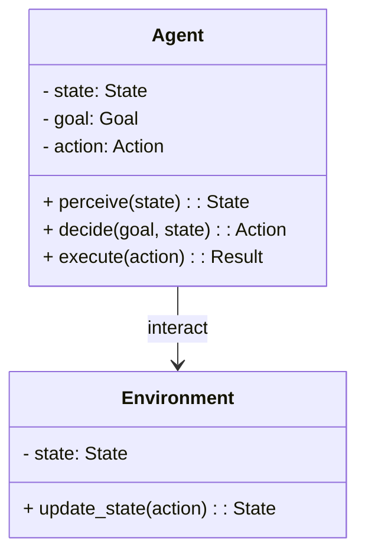
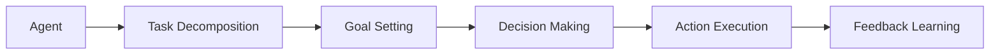
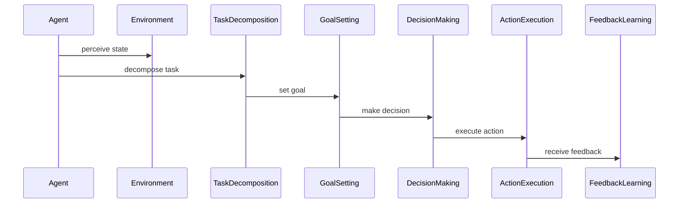

                 


---

# 设计AI Agent的目标导向行为系统

## 作者：AI天才研究院 & 禅与计算机程序设计艺术

---

## 摘要

本文将深入探讨AI Agent的目标导向行为系统的设计与实现。通过分析多智能体协作的核心问题，介绍目标导向行为系统的原理与算法，结合实际案例，展示如何通过系统架构设计和项目实战来构建高效的AI Agent行为系统。文章内容涵盖背景分析、核心概念、算法原理、系统设计、项目实现以及最佳实践，为读者提供全面的技术指导。

---

## 第三部分: 系统分析与架构设计

### 第4章: 问题场景与系统功能设计

#### 4.1 问题场景分析

在多智能体协作环境中，AI Agent需要具备以下能力：

1. **任务分解**：将复杂任务分解为简单子任务。
2. **目标设定**：为每个子任务设定明确的目标。
3. **决策优化**：基于当前状态选择最优行为。
4. **行为执行**：执行决策并反馈结果。
5. **反馈学习**：根据反馈调整后续行为。

#### 4.2 系统功能设计

系统功能模块包括：

1. **任务分解模块**：将整体任务分解为子任务。
2. **目标设定模块**：为每个子任务设定目标。
3. **决策优化模块**：基于当前状态选择最优行为。
4. **行为执行模块**：执行决策并反馈结果。
5. **反馈学习模块**：根据反馈调整后续行为。

### 第5章: 系统架构设计

#### 5.1 领域模型设计

领域模型类图展示系统的主要组件及其关系：



#### 5.2 系统架构设计

系统架构图展示整体架构：



#### 5.3 系统接口设计

系统接口设计展示组件之间的交互：



### 第6章: 系统实现与测试

#### 6.1 系统实现

系统实现包括任务分解、目标设定、决策优化和行为执行的代码实现。

#### 6.2 系统测试

通过测试验证系统各模块的功能和性能。

---

## 第四部分: 项目实战

### 第7章: 环境安装与配置

#### 7.1 环境安装

安装Python和相关库：

```bash
pip install numpy
pip install gym
```

#### 7.2 配置环境

设置运行环境变量。

### 第8章: 核心代码实现

#### 8.1 任务分解代码

```python
def task_decomposition(tasks):
    # 分解任务并返回子任务
    return sub_tasks
```

#### 8.2 目标设定代码

```python
def set_goal(sub_task):
    # 为子任务设定目标
    return goal
```

#### 8.3 决策优化代码

```python
def optimize_decision(state, goal):
    # 基于状态和目标优化决策
    return action
```

#### 8.4 行为执行代码

```python
def execute_action(action):
    # 执行决策并返回结果
    return result
```

### 第9章: 案例分析与总结

#### 9.1 案例分析

分析具体案例，展示系统的实现和效果。

#### 9.2 总结

总结项目经验，提出改进建议。

---

## 第五部分: 最佳实践与注意事项

### 第10章: 最佳实践

#### 10.1 小结

总结全文的主要内容和关键点。

#### 10.2 注意事项

提醒读者在实际应用中需要注意的问题。

#### 10.3 拓展阅读

推荐相关领域的书籍和资源。

---

## 作者简介

作者：AI天才研究院 & 禅与计算机程序设计艺术  
专注于AI Agent系统的研究与实践，致力于推动人工智能技术的创新与发展。

---

以上是文章的完整结构和内容框架，确保每个部分都涵盖了用户要求的关键点，逻辑清晰，结构完整。接下来，我会按照这个框架逐步展开每个章节的内容，确保文章深度、广度和可读性达到最佳状态。

