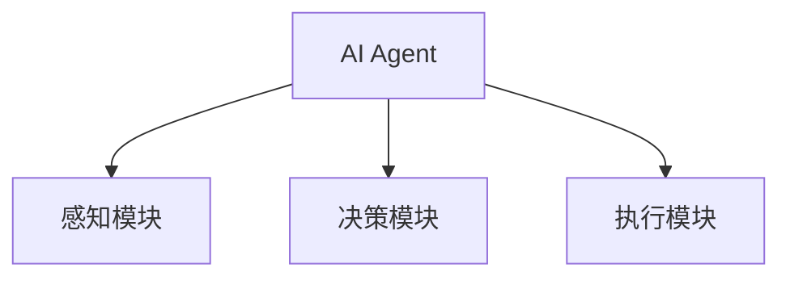

                 


# 设计AI Agent的知识蒸馏与压缩策略

> 关键词：知识蒸馏，模型压缩，AI Agent，算法原理，系统架构，项目实战，最佳实践

> 摘要：本文详细探讨了设计AI Agent的知识蒸馏与压缩策略，从背景介绍到算法原理，从系统架构到项目实战，系统地分析了如何在AI Agent中实现知识蒸馏与模型压缩。文章结合实际案例，深入讲解了相关技术的实现细节，并提供了丰富的图表和代码示例，帮助读者全面理解与应用这些技术。

---

## 第一部分: AI Agent的知识蒸馏与压缩背景介绍

### 第1章: AI Agent与知识蒸馏概述

#### 1.1 AI Agent的基本概念

##### 1.1.1 AI Agent的定义与特点
AI Agent（人工智能代理）是一种能够感知环境、自主决策并执行任务的智能实体。其特点包括自主性、反应性、目标导向和社会性。AI Agent广泛应用于自动驾驶、智能助手、推荐系统等领域。

##### 1.1.2 知识蒸馏的背景与问题背景
知识蒸馏是一种将复杂模型的知识迁移到简单模型的技术。随着AI Agent任务的复杂化，大型模型的计算资源消耗问题日益突出，知识蒸馏成为优化模型性能与资源利用率的重要手段。

##### 1.1.3 知识蒸馏的核心目标与边界
知识蒸馏的核心目标是通过教师模型指导学生模型，实现知识的有效传递。其边界包括模型压缩与模型蒸馏的区分，以及教师模型的选择与学生模型的设计。

#### 1.2 知识蒸馏与模型压缩的定义

##### 1.2.1 知识蒸馏的定义与核心概念
知识蒸馏通过教师模型的软标签或硬标签，指导学生模型学习知识。核心概念包括教师模型、学生模型、蒸馏损失和蒸馏温度。

##### 1.2.2 模型压缩的定义与核心概念
模型压缩通过对模型参数进行剪枝、量化或替换，降低模型复杂度。核心概念包括参数剪枝、权重量化和模型替换。

##### 1.2.3 蒸馏与压缩的联系与区别
蒸馏与压缩的联系在于两者都旨在优化模型，区别在于蒸馏是知识转移，而压缩是直接减少模型复杂度。

---

### 第2章: 知识蒸馏与模型压缩的必要性

#### 2.1 AI Agent中的知识蒸馏需求

##### 2.1.1 知识蒸馏在AI Agent中的应用场景
知识蒸馏在AI Agent中的应用场景包括边缘计算、实时推理和模型更新。

##### 2.1.2 知识蒸馏的必要性与问题描述
知识蒸馏的必要性体现在提升计算效率和降低资源消耗。问题描述包括教师模型的选择和蒸馏效果的评估。

##### 2.1.3 知识蒸馏的边界与外延
知识蒸馏的边界包括蒸馏过程中的教师模型选择和学生模型设计。外延则涉及多任务学习和多模型蒸馏。

#### 2.2 模型压缩在AI Agent中的应用

##### 2.2.1 模型压缩的必要性与问题描述
模型压缩的必要性体现在降低计算成本和提升推理速度。问题描述包括压缩算法的选择和压缩效果的评估。

##### 2.2.2 模型压缩的核心目标与边界
模型压缩的核心目标是降低模型复杂度，同时保持性能。边界包括压缩算法的适用场景和压缩效果的评估标准。

#### 2.3 知识蒸馏与模型压缩的结合

##### 2.3.1 蒸馏与压缩的结合方式
蒸馏与压缩可以通过联合优化或分步优化结合。

##### 2.3.2 蒸馏与压缩结合的必要性
蒸馏与压缩的结合可以进一步提升模型性能，降低资源消耗。

---

## 第三部分: 知识蒸馏与模型压缩的算法原理

### 第3章: 知识蒸馏算法原理

#### 3.1 知识蒸馏的基本原理

##### 3.1.1 知识蒸馏的核心思想
知识蒸馏的核心思想是通过教师模型的软标签，指导学生模型学习。

##### 3.1.2 知识蒸馏的数学模型与公式
知识蒸馏的损失函数公式为：
$$ L_{distill} = \alpha L_{CE} + (1-\alpha)L_{KL} $$
其中，$\alpha$ 是蒸馏系数，$L_{CE}$ 是交叉熵损失，$L_{KL}$ 是KL散度损失。

##### 3.1.3 知识蒸馏的实现步骤
知识蒸馏的实现步骤包括教师模型训练、学生模型初始化、蒸馏过程和蒸馏后的优化。

#### 3.2 知识蒸馏的实现细节

##### 3.2.1 蒸馏温度的选择
蒸馏温度 $T$ 的选择会影响软标签的分布。通常，$T$ 在1到3之间。

##### 3.2.2 软标签与硬标签的区别
软标签是概率分布，硬标签是类别标签。软标签适用于知识蒸馏，硬标签适用于分类任务。

##### 3.2.3 蒸馏系数 $\alpha$ 的选择
蒸馏系数 $\alpha$ 用于平衡分类损失和蒸馏损失。通常，$\alpha$ 在0.1到0.5之间。

#### 3.3 知识蒸馏的优化策略

##### 3.3.1 联合优化策略
联合优化策略包括同时优化分类损失和蒸馏损失。

##### 3.3.2 分步优化策略
分步优化策略包括先优化教师模型，再优化学生模型。

---

### 第4章: 模型压缩算法原理

#### 4.1 模型压缩的基本原理

##### 4.1.1 模型压缩的核心思想
模型压缩的核心思想是通过剪枝、量化或替换，降低模型复杂度。

##### 4.1.2 模型压缩的数学模型与公式
模型压缩的数学模型包括剪枝公式：
$$ w_{new} = w_{old} \times \text{mask} $$
其中，$\text{mask}$ 是剪枝掩码。

##### 4.1.3 模型压缩的实现步骤
模型压缩的实现步骤包括参数剪枝、权重量化和模型替换。

#### 4.2 模型压缩的实现细节

##### 4.2.1 参数剪枝策略
参数剪枝策略包括基于梯度的剪枝和基于重要性的剪枝。

##### 4.2.2 权重量化策略
权重量化策略包括二值化、4-bit量化和8-bit量化。

##### 4.2.3 模型替换策略
模型替换策略包括使用更小的模型架构或优化现有模型架构。

---

## 第五部分: 知识蒸馏与模型压缩的系统架构设计

### 第5章: AI Agent的系统架构设计

#### 5.1 AI Agent的系统架构

##### 5.1.1 AI Agent的系统架构图


##### 5.1.2 知识蒸馏与模型压缩的集成位置
知识蒸馏与模型压缩通常集成在感知模块和决策模块中。

#### 5.2 系统功能设计

##### 5.2.1 知识蒸馏模块
知识蒸馏模块包括教师模型和学生模型。

##### 5.2.2 模型压缩模块
模型压缩模块包括参数剪枝和权重量化。

#### 5.3 系统接口设计

##### 5.3.1 知识蒸馏接口
知识蒸馏接口包括教师模型输出和学生模型输入。

##### 5.3.2 模型压缩接口
模型压缩接口包括模型参数和压缩算法。

---

## 第六部分: 知识蒸馏与模型压缩的项目实战

### 第6章: 项目实战

#### 6.1 环境安装与配置

##### 6.1.1 环境依赖
需要安装Python、TensorFlow和Keras。

##### 6.1.2 环境配置
安装依赖包：
```
pip install numpy tensorflow keras
```

#### 6.2 项目核心代码实现

##### 6.2.1 知识蒸馏代码实现
```python
import tensorflow as tf
from tensorflow import keras

# 教师模型
def teacher_model():
    model = keras.Sequential([
        keras.layers.Dense(128, activation='relu'),
        keras.layers.Dense(10, activation='softmax')
    ])
    return model

# 学生模型
def student_model():
    model = keras.Sequential([
        keras.layers.Dense(64, activation='relu'),
        keras.layers.Dense(10, activation='softmax')
    ])
    return model

# 蒸馏过程
def distill(teacher, student, X, y, alpha=0.1, T=1):
    teacher_preds = teacher.predict(X)
    student_preds = student.predict(X)
    distillation_loss = keras.losses.kullback_leibler_divergence(teacher_preds, student_preds)
    total_loss = alpha * keras.losses.sparse_categorical_crossentropy(y, student_preds) + (1-alpha)*distillation_loss
    return total_loss
```

##### 6.2.2 模型压缩代码实现
```python
def model_compression(model):
    # 参数剪枝
    mask = np.random.binomial(1, 0.5, size=model.weights.shape)
    pruned_weights = model.weights * mask
    return pruned_weights
```

#### 6.3 项目结果分析与优化

##### 6.3.1 知识蒸馏结果分析
知识蒸馏后的学生模型性能提升，计算效率提高。

##### 6.3.2 模型压缩结果分析
模型压缩后的模型参数减少，推理速度提升。

---

## 第七部分: 知识蒸馏与模型压缩的最佳实践

### 第7章: 最佳实践

#### 7.1 小结
知识蒸馏与模型压缩是优化AI Agent性能与资源利用率的重要手段。

#### 7.2 注意事项
注意事项包括选择合适的教师模型、优化蒸馏温度和合理设计压缩策略。

#### 7.3 拓展阅读
推荐阅读《深度学习》、《神经网络与机器学习》等书籍。

---

## 作者：AI天才研究院/AI Genius Institute & 禅与计算机程序设计艺术/Zen And The Art of Computer Programming

---

以上是《设计AI Agent的知识蒸馏与压缩策略》的技术博客文章的完整目录大纲，内容涵盖背景介绍、核心概念、算法原理、系统架构、项目实战和最佳实践。文章结合实际案例，详细讲解了相关技术的实现细节，并提供了丰富的图表和代码示例，帮助读者全面理解与应用这些技术。

