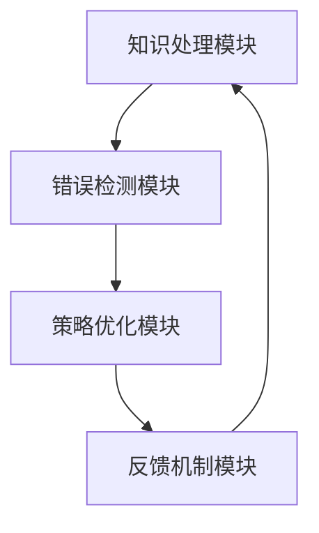

                 


# 设计AI Agent的自我修正学习策略

> 关键词：AI Agent, 自我修正学习, 强化学习, 策略优化, 错误检测, 知识更新

> 摘要：本文详细探讨了设计AI Agent的自我修正学习策略的核心原理、系统架构、算法实现及实际应用。通过分析知识表示、错误检测与纠正、策略优化等关键环节，结合数学模型和实际案例，展示了如何构建高效、自适应的AI Agent系统。文章最后总结了设计要点，并展望了未来的研究方向。

---

## 第1章: AI Agent的背景与核心概念

### 1.1 AI Agent的基本概念

AI Agent（人工智能代理）是指能够感知环境、自主决策并采取行动的智能实体。它可以是一个软件程序、机器人或任何具备智能行为的系统。AI Agent的核心目标是通过与环境交互，实现特定任务的目标，同时具备学习和适应能力。

AI Agent可以分为以下几类：

1. **简单反射型AI Agent**：基于固定的规则和条件做出反应，不具备学习能力。
2. **基于模型的AI Agent**：维护对环境的内部模型，能够根据模型进行决策。
3. **目标驱动型AI Agent**：基于明确的目标进行规划和行动。
4. **学习型AI Agent**：通过与环境交互和经验积累，逐步优化自身的决策策略。

### 1.2 自我修正学习的必要性

在动态变化的环境中，AI Agent需要不断适应新的情况，修正错误并优化策略。自我修正学习（Self-repairing Learning）是一种能够让AI Agent在面对错误和挑战时，自动识别问题、调整策略并恢复正常功能的学习机制。

**自我修正学习的重要性：**

- **动态环境适应**：环境条件不断变化，AI Agent需要实时调整策略以应对新情况。
- **错误检测与纠正**：在复杂任务中，AI Agent可能会因为策略缺陷或环境干扰而导致错误，自我修正学习能够及时检测并纠正这些错误。
- **持续优化**：通过不断学习和优化，AI Agent能够提升任务完成效率和准确性。

### 1.3 问题背景与应用场景

AI Agent的自我修正学习在许多领域具有广泛的应用，例如：

- **自动驾驶**：车辆需要在复杂交通环境中实时调整路径和决策。
- **智能推荐系统**：根据用户反馈不断优化推荐策略。
- **机器人控制**：机器人需要在动态环境中调整动作和行为。

---

## 第2章: 自我修正学习的核心原理

### 2.1 知识表示与更新机制

知识表示是AI Agent进行推理和决策的基础。常用的表示方法包括符号逻辑、概率图模型和向量空间模型。

- **符号逻辑表示**：使用规则和逻辑推理表示知识，例如“如果A则B”。
- **概率图模型**：通过贝叶斯网络表示概率关系，适用于不确定性的推理。
- **向量空间模型**：将知识表示为向量，便于计算相似性和关联性。

知识更新机制需要考虑以下因素：

- **知识来源**：知识可以通过监督学习、无监督学习或强化学习获得。
- **更新频率**：实时更新或定期更新。
- **更新策略**：基于反馈、基于错误修正、基于模型优化。

### 2.2 错误检测与纠正方法

错误检测是自我修正学习的关键环节。常用的方法包括：

- **基于反馈的错误检测**：通过用户反馈或任务结果判断是否存在错误。
- **基于模型的错误检测**：通过模型内部的状态和输出判断错误。
- **基于对比的错误检测**：通过不同模型或方法的对比发现错误。

错误纠正的方法：

- **局部修正**：针对具体错误进行调整，例如修改决策策略中的某一步骤。
- **全局优化**：重新优化整个策略，适用于错误根源较深的情况。
- **经验迁移**：利用已有经验或知识库中的解决方案进行纠正。

### 2.3 策略优化与调整机制

策略优化是自我修正学习的核心。常用的优化方法包括：

- **强化学习（Reinforcement Learning）**：通过奖励机制优化策略。
- **梯度下降（Gradient Descent）**：通过优化目标函数调整策略参数。
- **元学习（Meta-Learning）**：通过学习如何学习，快速适应新任务。

---

## 第3章: 自我修正学习的系统架构

### 3.1 系统模块划分

一个典型的AI Agent自我修正学习系统可以分为以下几个模块：

1. **知识处理模块**：负责知识的表示、存储和更新。
2. **错误检测模块**：实时监控系统状态，发现错误。
3. **策略优化模块**：根据错误信息优化决策策略。
4. **反馈机制模块**：收集反馈信息并传递给相关模块。

### 3.2 系统功能设计

- **知识表示与更新**：通过向量空间模型表示知识，并根据反馈更新知识库。
- **错误检测与纠正**：利用贝叶斯网络检测错误，并采用局部修正方法进行纠正。
- **策略优化与调整**：使用强化学习优化策略，并通过梯度下降方法调整参数。

### 3.3 系统架构图



---

## 第4章: 自我修正学习的数学模型与算法原理

### 4.1 知识表示与更新的数学模型

知识可以表示为向量空间中的点，更新过程可以通过向量加法实现：

$$ \text{新知识向量} = \text{旧知识向量} + \Delta $$

### 4.2 错误检测与纠正的算法原理

错误检测可以使用贝叶斯网络模型，错误纠正可以采用强化学习方法：

$$ Q(s, a) = r + \gamma \max_a Q(s', a') $$

### 4.3 策略优化的数学公式

策略优化可以通过梯度下降方法实现：

$$ \theta = \theta - \eta \nabla_\theta \text{损失函数} $$

---

## 第5章: 项目实战——设计一个简单的自我修正学习AI Agent

### 5.1 环境安装

需要安装以下工具：

- Python 3.8+
- TensorFlow或PyTorch
- Mermaid图生成工具

### 5.2 系统核心实现源代码

以下是一个简单的自我修正学习AI Agent的代码示例：

```python
import numpy as np

class AI_Agent:
    def __init__(self, state_space, action_space):
        self.state_space = state_space
        self.action_space = action_space
        self.Q = np.zeros((state_space, action_space))
    
    def感知环境(self, state):
        return state
    
    def决策(self, state):
        return np.argmax(self.Q[state, :])
    
    def学习(self, state, action, reward, next_state):
        self.Q[state, action] += reward + np.max(self.Q[next_state, :])

# 示例环境
state_space = 5
action_space = 3
agent = AI_Agent(state_space, action_space)

# 与环境交互
state = 2
action = agent决策(state)
reward = 1  # 假设获得奖励
next_state = 3
agent学习(state, action, reward, next_state)
```

### 5.3 代码应用解读与分析

上述代码实现了一个简单的Q-learning算法，用于训练AI Agent。通过感知环境、决策和学习三个步骤，实现自我修正学习。通过不断与环境交互，AI Agent能够优化其Q值表，从而提高决策的准确性。

### 5.4 实际案例分析

假设AI Agent是一个智能推荐系统，用户点击行为作为反馈。系统通过收集用户点击数据，更新推荐策略，从而提高推荐准确率。

---

## 第6章: 高级主题与未来研究方向

### 6.1 知识图谱与自适应推理

结合知识图谱技术，实现更复杂的自适应推理。

### 6.2 联合学习（Federated Learning）

通过联合学习，多个AI Agent可以协同优化，提升整体性能。

### 6.3 可解释性与透明性

未来的研究方向之一是提升AI Agent的可解释性和透明性，让用户更好地理解AI的决策过程。

---

## 第7章: 总结与展望

### 7.1 核心内容回顾

本文详细探讨了AI Agent的自我修正学习策略，包括知识表示、错误检测、策略优化等方面。

### 7.2 最佳实践 Tips

- **持续学习**：保持对新技术的关注，不断更新知识库。
- **数据多样性**：确保训练数据的多样性和代表性。
- **反馈机制**：建立有效的反馈机制，及时发现和纠正错误。

### 7.3 未来展望

随着人工智能技术的不断发展，AI Agent的自我修正学习策略将变得更加智能化和自适应。未来的研究方向包括更高效的算法设计、更强大的知识表示方法以及更广泛的应用场景。

---

## 作者：AI天才研究院/AI Genius Institute & 禅与计算机程序设计艺术 /Zen And The Art of Computer Programming

---

**本文内容仅用于学术交流与技术探讨，未经授权，请勿商用。**

---

**声明：**

- 本文内容为AI天才研究院/AI Genius Institute版权所有，未经授权不得转载或摘编。
- 如果您对本文内容有疑问或需要进一步的技术支持，请联系邮箱：contact@aicourse.org

