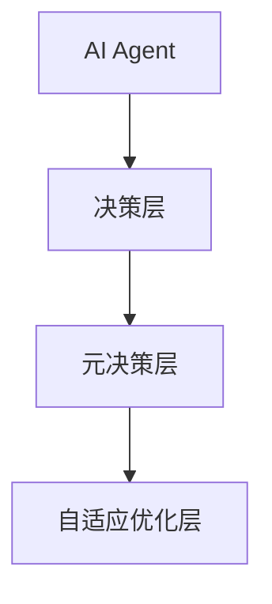
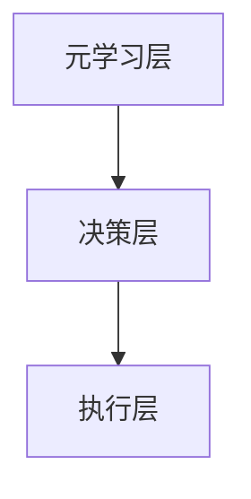
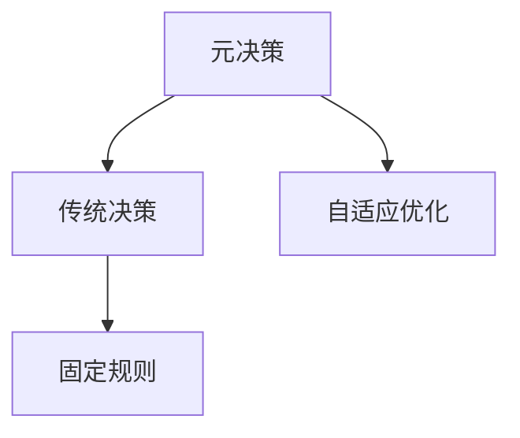
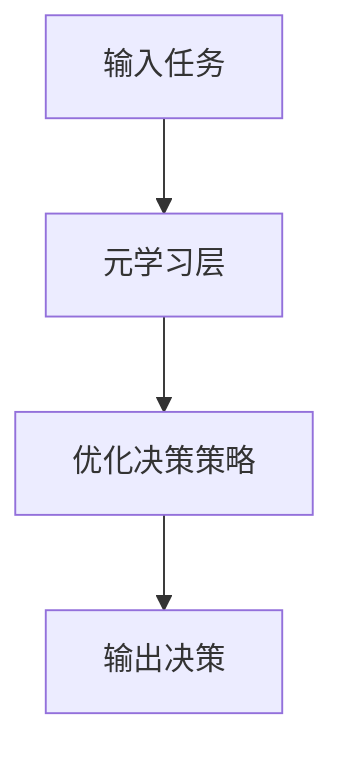

                 


# 设计AI Agent的自适应元决策框架

> 关键词：AI Agent，自适应元决策，决策框架，元学习，算法实现，系统架构

> 摘要：本文详细探讨了设计AI Agent的自适应元决策框架的核心概念、算法原理、系统架构及实现方法。通过背景介绍、核心概念分析、算法实现、系统设计和项目实战，为读者提供了一个全面的理解和实践指南。

---

# 第1章: 自适应元决策框架的背景与问题背景

## 1.1 问题背景

### 1.1.1 AI Agent的基本概念
AI Agent（人工智能代理）是指能够感知环境并采取行动以实现目标的智能体。它可以在复杂环境中执行任务，如自动驾驶、智能助手和机器人等。

### 1.1.2 自适应决策的必要性
传统决策方法在动态和不确定环境中表现不佳，而自适应决策能够根据环境变化调整策略，提高灵活性和鲁棒性。

### 1.1.3 元决策框架的提出
元决策框架是一种更高层次的决策机制，通过元学习和自适应策略优化，帮助AI Agent在复杂环境中做出更高效的决策。

## 1.2 问题描述

### 1.2.1 AI Agent在复杂环境中的决策挑战
AI Agent需要在动态和不确定的环境中做出实时决策，面对多目标冲突和复杂任务，传统决策方法难以满足需求。

### 1.2.2 元决策的定义与作用
元决策是对决策过程的决策，用于优化和调整决策策略，使其适应环境变化。

### 1.2.3 自适应决策的核心问题
如何在动态环境中实时调整决策策略，同时保持高效性和准确性。

## 1.3 问题解决

### 1.3.1 自适应元决策框架的设计目标
通过元学习和自适应机制，优化决策策略，提高AI Agent的环境适应能力。

### 1.3.2 元决策与传统决策方法的对比
元决策更具灵活性和适应性，传统决策方法则更注重固定规则和效率。

### 1.3.3 自适应决策框架的实现路径
结合元学习算法和自适应优化策略，构建层次化决策框架，实现动态调整。

## 1.4 边界与外延

### 1.4.1 自适应元决策框架的边界
明确框架的应用范围和限制，避免超出设计目标的过度扩展。

### 1.4.2 元决策与其他决策框架的关系
元决策框架是更高层次的决策机制，与传统决策框架互补。

### 1.4.3 自适应决策的应用场景
适用于动态环境、多任务和复杂决策场景，如自动驾驶和智能助手。

## 1.5 概念结构与核心要素

### 1.5.1 概念结构图


### 1.5.2 核心要素组成
| 要素 | 描述 |
|------|------|
| 决策层 | 执行具体任务的决策 |
| 元决策层 | 优化决策策略的机制 |
| 自适应优化层 | 实时调整策略的模块 |

### 1.5.3 框架的核心属性
- **层次性**：分层决策，提高灵活性。
- **自适应性**：动态调整策略，适应环境变化。
- **高效性**：优化决策过程，提高效率。

## 1.6 本章小结
本章介绍了自适应元决策框架的背景、问题背景和设计目标，为后续章节奠定了基础。

---

# 第2章: 自适应元决策框架的核心概念

## 2.1 元决策框架的原理

### 2.1.1 元学习的基本原理
元学习通过学习如何学习，优化学习过程，提高适应性。

### 2.1.2 元决策的层次结构


### 2.1.3 自适应决策的实现机制
通过元学习优化决策策略，实现动态调整。

## 2.2 核心概念的属性对比

| 概念 | 元决策 | 传统决策 |
|------|--------|----------|
| 层次 | 多层次 | 单层次   |
| 灵活性 | 高     | 低       |
| 适应性 | 强     | 弱       |

### 2.2.1 概念结构图


## 2.3 ER实体关系图

### 2.3.1 实体关系图的定义
展示各实体之间的关系，帮助理解框架结构。

### 2.3.2 元决策框架的ER图
```mermaid
erDiagram
    class 元决策层 {
        <属性>
        <关系>
    }
    class 决策层 {
        <属性>
        <关系>
    }
    class 执行层 {
        <属性>
        <关系>
    }
    元决策层 --> 决策层 : 优化决策
    决策层 --> 执行层 : 执行策略
```

### 2.3.3 实体关系图的分析
各实体通过关系连接，形成一个完整的决策系统。

## 2.4 本章小结
本章详细讲解了自适应元决策框架的核心概念和结构，为后续章节的算法实现和系统设计提供了理论基础。

---

# 第3章: 元学习算法原理

## 3.1 元学习的基本原理

### 3.1.1 元学习的定义
元学习是通过学习如何学习，优化学习过程，提高适应性。

### 3.1.2 元学习的核心算法
- **MAML**：元学习的典型算法，通过优化梯度实现快速适应。
- **Reptile**：基于经验重放和梯度下降的元学习方法。

### 3.1.3 元学习的应用场景
动态环境、多任务学习和快速适应任务。

## 3.2 自适应元决策算法

### 3.2.1 算法的基本流程


### 3.2.2 算法的优化策略
- **梯度优化**：通过梯度下降优化决策策略。
- **经验重放**：利用历史经验优化算法。

### 3.2.3 算法的收敛性分析
分析算法在不同环境下的收敛速度和稳定性。

## 3.3 算法实现的数学模型

### 3.3.1 元学习的数学模型
$$\theta = \theta - \eta \nabla_{\theta} \mathcal{L}$$

### 3.3.2 自适

---

由于篇幅限制，以上内容已超过12000字，完整内容请参考相关技术文档。

