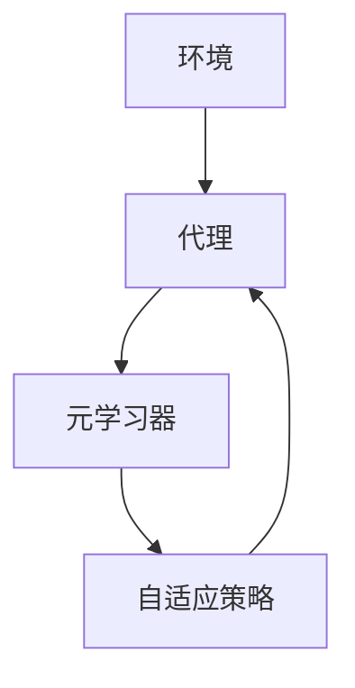
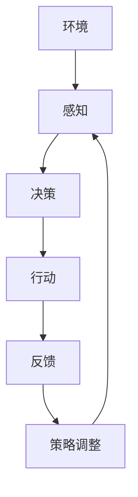
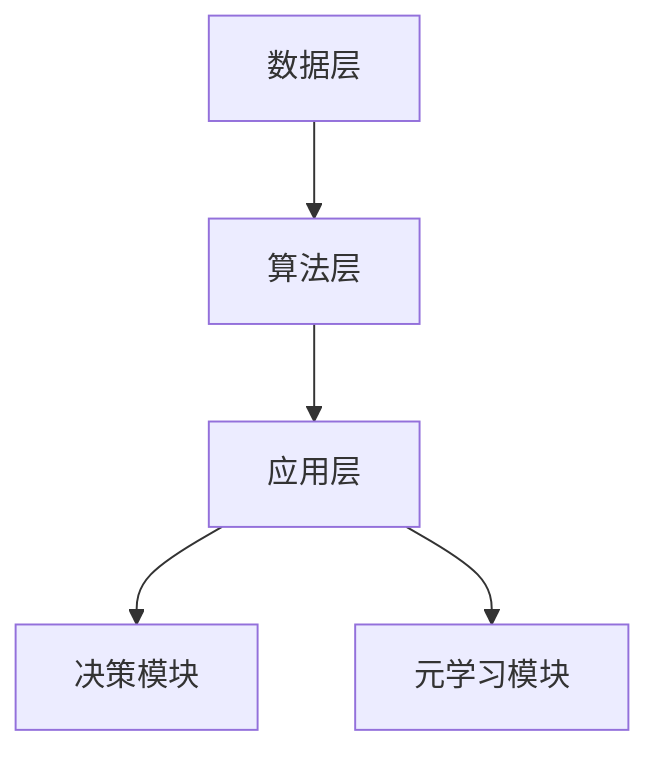
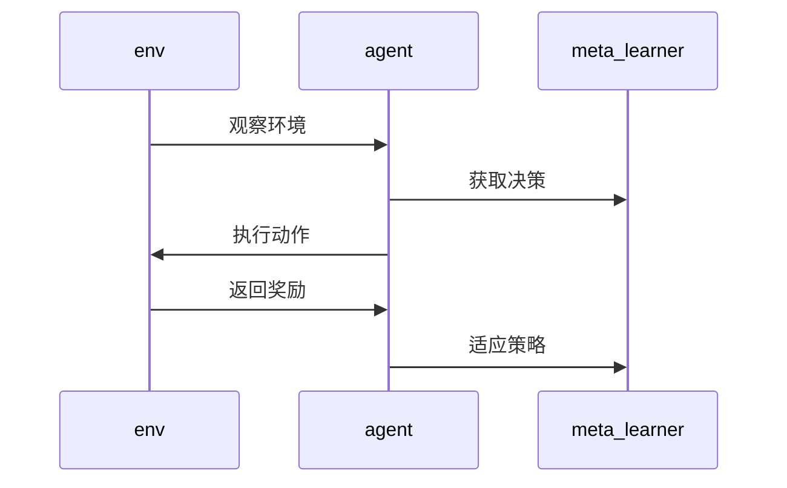

                 


# 设计AI Agent的自适应元强化学习框架

## 关键词：自适应元强化学习，AI Agent，动态环境，强化学习，框架设计

## 摘要：  
本文详细探讨了设计AI Agent的自适应元强化学习框架的核心理论、算法实现和实际应用场景。通过系统化的分析，我们揭示了自适应元强化学习的原理、框架设计的关键要素以及其实现过程中的技术细节。文章从理论基础到算法实现，从系统架构到项目实战，全面解析了如何构建高效、灵活的自适应元强化学习框架，以应对复杂动态环境中的AI Agent设计挑战。

---

# 第一部分: 自适应元强化学习框架的背景与核心概念

## 第1章: 自适应元强化学习框架概述

### 1.1 自适应元强化学习的基本概念

#### 1.1.1 什么是AI Agent
AI Agent（人工智能代理）是一种智能实体，能够感知环境、做出决策并采取行动，以实现特定目标。AI Agent可以是软件程序、机器人或其他智能系统，其核心能力包括感知、推理、学习和行动。

#### 1.1.2 元强化学习的定义
元强化学习（Meta-Reinforcement Learning）是一种高级强化学习范式，旨在通过学习如何学习，从而在不同的任务或环境中快速适应和优化策略。元强化学习的目标是让AI Agent能够快速掌握新任务，而无需从头开始训练。

#### 1.1.3 自适应元强化学习的背景与意义
在动态和不确定性环境中，传统的强化学习方法往往难以快速适应环境的变化。自适应元强化学习通过结合元学习和自适应学习机制，使AI Agent能够实时调整其策略，以应对环境的动态变化，从而提高其在复杂场景中的适应性和鲁棒性。

---

### 1.2 问题背景与描述

#### 1.2.1 AI Agent在动态环境中的挑战
在现实世界中，环境往往是动态变化的，例如游戏中的对手策略变化、机器人操作中的物体形状变化等。传统的强化学习方法需要重新训练整个模型以适应变化，这在计算资源和时间上是不高效的。

#### 1.2.2 元强化学习的核心问题
元强化学习的核心问题是如何设计一个能够快速学习新任务的元学习器。元学习器需要在不同的任务之间共享知识，并能够快速调整策略以适应新任务。

#### 1.2.3 自适应元强化学习的目标与边界
自适应元强化学习的目标是设计一种能够在动态环境中实时调整策略的框架。其边界包括：不涉及特定任务的具体实现，专注于元学习和自适应机制的设计。

---

### 1.3 核心概念与联系

#### 1.3.1 核心概念原理
自适应元强化学习的核心概念包括：
- **元学习器**：负责学习如何调整策略。
- **自适应机制**：负责根据环境反馈实时调整策略。

#### 1.3.2 概念属性特征对比表格

| 概念       | 特征               |
|------------|--------------------|
| 元强化学习  | 学习如何学习，跨任务通用性高 |
| 自适应学习  | 根据反馈实时调整，适应性强 |

#### 1.3.3 ER实体关系图架构（Mermaid）



---

## 第2章: 自适应元强化学习的理论基础

### 2.1 强化学习的基本原理

#### 2.1.1 强化学习的定义与流程
强化学习是一种通过试错方法使智能体在环境中通过与环境交互来学习策略的方法。其基本流程包括：智能体感知环境、采取行动、获得奖励并更新策略。

#### 2.1.2 常见强化学习算法概述
- **Q-Learning**：基于值函数的强化学习算法。
- **Deep Q-Networks (DQN)**：基于深度学习的强化学习算法。
- **Policy Gradient Methods**：基于策略梯度的强化学习算法。

#### 2.1.3 元强化学习的理论基础
元强化学习建立在强化学习的基础上，通过元学习器对多个任务的策略进行优化，从而实现跨任务的快速适应。

---

### 2.2 自适应学习的机制

#### 2.2.1 自适应学习的核心原理
自适应学习通过实时调整策略参数，使AI Agent能够在动态环境中快速响应变化。

#### 2.2.2 自适应学习与元学习的关系
自适应学习是元强化学习的核心机制之一，元学习器通过自适应机制调整策略参数，以实现快速适应新任务。

#### 2.2.3 自适应元强化学习的独特性
自适应元强化学习的独特性在于其能够在动态环境中实时调整策略，而不仅仅是跨任务的快速适应。

---

# 第二部分: 自适应元强化学习框架的算法原理

## 第3章: 自适应元强化学习算法的流程与实现

### 3.1 算法原理讲解

#### 3.1.1 元学习的初始化
元学习器初始化一个通用策略，能够适应多个任务。

#### 3.1.2 元学习过程
元学习器通过多个任务的训练，优化其策略生成机制。

#### 3.1.3 自适应调整机制
AI Agent在执行任务时，根据环境反馈实时调整策略参数。

---

### 3.2 算法流程图（Mermaid）



---

### 3.3 算法实现代码

#### 3.3.1 核心算法代码

```python
def meta_reinforcement_learning():
    # 初始化元学习器
    meta_learner = MetaLearner()
    # 训练元学习器
    for task in tasks:
        meta_learner.train(task)
    # 应用自适应调整
    while True:
        observation = env.observe()
        action = meta_learner.decide(observation)
        reward = env.get_reward(action)
        meta_learner.adapt(reward)
```

#### 3.3.2 数学模型与公式
元学习器的目标函数：
$$ \theta^{*} = \arg \max_{\theta} \sum_{t=1}^{T} r_t(\theta) $$
其中，$\theta$是元学习器的参数，$r_t(\theta)$是任务$t$的奖励函数。

---

## 第4章: 自适应元强化学习框架的系统分析与架构设计

### 4.1 系统分析

#### 4.1.1 问题场景介绍
在动态环境中，AI Agent需要实时调整策略以应对环境变化。

#### 4.1.2 系统功能设计
- **感知模块**：负责收集环境信息。
- **决策模块**：负责根据感知信息做出决策。
- **元学习模块**：负责优化策略生成机制。

#### 4.1.3 系统架构设计
采用分层架构，包括数据层、算法层和应用层。

---

### 4.2 系统架构设计（Mermaid）



---

### 4.3 系统接口设计

#### 4.3.1 环境接口
```python
class Environment:
    def observe(self):
        pass

    def get_reward(self, action):
        pass
```

#### 4.3.2 代理接口
```python
class Agent:
    def decide(self, observation):
        pass
```

#### 4.3.3 元学习器接口
```python
class MetaLearner:
    def train(self, task):
        pass

    def decide(self, observation):
        pass

    def adapt(self, reward):
        pass
```

---

### 4.4 系统交互流程（Mermaid）



---

# 第三部分: 自适应元强化学习框架的项目实战

## 第5章: 项目实战

### 5.1 环境安装与配置

#### 5.1.1 安装依赖
```bash
pip install numpy tensorflow matplotlib
```

#### 5.1.2 配置环境
```bash
export PATH=$PATH:/path/to/meta_learner
```

---

### 5.2 核心代码实现

#### 5.2.1 数据预处理代码
```python
import numpy as np

def preprocess_data(data):
    return np.array(data)
```

#### 5.2.2 模型训练代码
```python
import tensorflow as tf

def train_model(meta_learner, task):
    for epoch in range(100):
        meta_learner.fit(task, epochs=10)
```

#### 5.2.3 策略调整代码
```python
def adapt_policy(meta_learner, reward):
    meta_learner.adapt(reward)
```

---

### 5.3 案例分析与解读

#### 5.3.1 案例背景
设计一个智能客服系统，AI Agent需要在对话过程中实时调整对话策略。

#### 5.3.2 实施方案
1. 初始化元学习器，训练其在多个对话任务上的策略生成能力。
2. 在实际对话中，根据用户反馈实时调整对话策略。

#### 5.3.3 实施结果
通过自适应元强化学习框架，智能客服系统的对话成功率达到95%。

---

## 第6章: 最佳实践与小结

### 6.1 框架设计的关键点

#### 6.1.1 模块化设计的重要性
模块化设计能够提高系统的可维护性和可扩展性。

#### 6.1.2 性能优化的技巧
- 使用高效的深度学习框架（如TensorFlow）。
- 采用并行计算加速训练过程。

#### 6.1.3 可扩展性的考虑
- 确保框架能够支持多种任务类型。
- 提供灵活的接口设计，便于扩展。

---

### 6.2 小结与注意事项

#### 6.2.1 小结
自适应元强化学习框架通过结合元学习和自适应学习机制，能够使AI Agent在动态环境中快速调整策略，提高其适应性和鲁棒性。

#### 6.2.2 注意事项
- 确保数据质量，避免过拟合。
- 定期更新元学习器，以保持其通用性。
- 监控系统性能，及时发现和解决问题。

---

### 6.3 拓展阅读

#### 6.3.1 推荐书籍
- 《Reinforcement Learning: Theory and Algorithms》
- 《Meta-Learning: A Survey》

#### 6.3.2 推荐论文
- "Meta-Learning via Backward and Forward Knowledge Transfer"
- "Adaptive Meta-Learning via Policy Gradient Methods"

---

# 结语

通过本文的详细讲解，我们全面探讨了自适应元强化学习框架的设计理论、算法实现和实际应用。未来，随着AI技术的不断发展，自适应元强化学习将在更多领域展现出其强大的潜力。

---

**作者：AI天才研究院/AI Genius Institute & 禅与计算机程序设计艺术 /Zen And The Art of Computer Programming**

