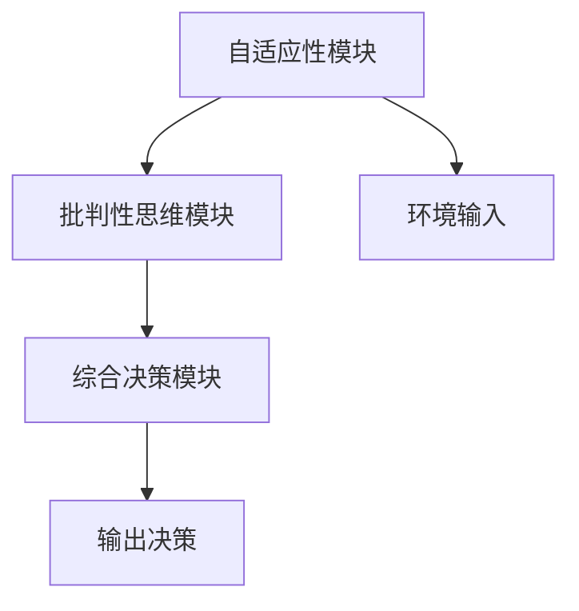
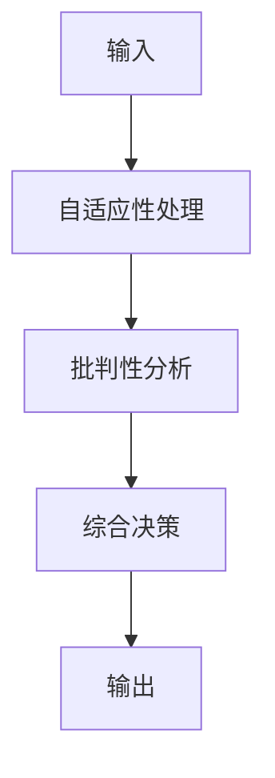
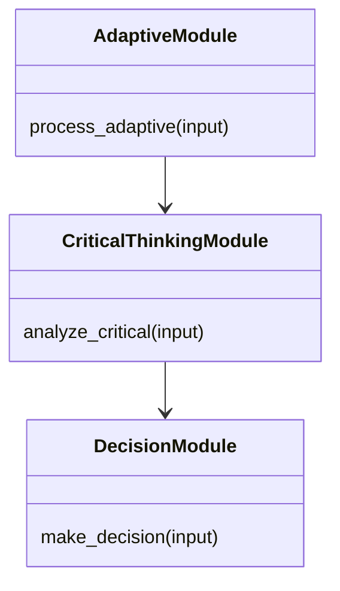
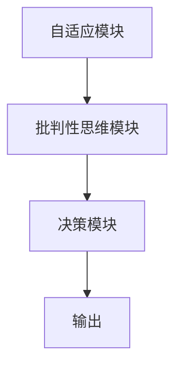
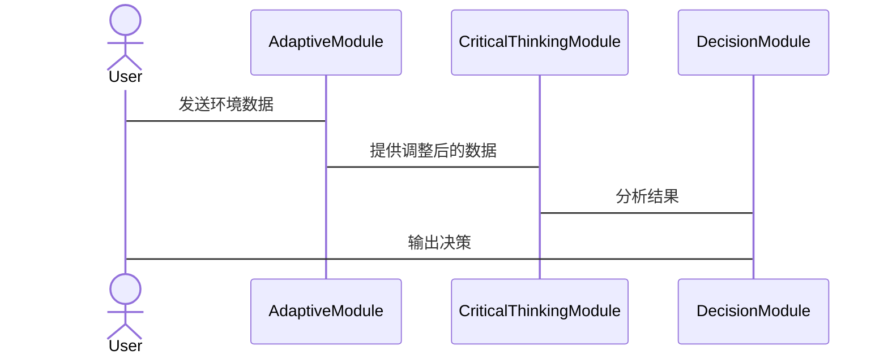
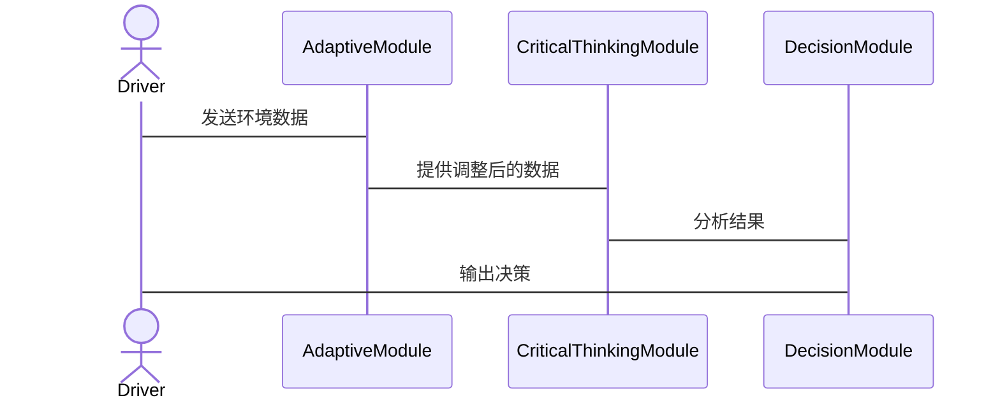

                 


# 设计AI Agent的自适应批判性思维模型

> 关键词：AI Agent, 自适应批判性思维, 智能系统设计, 人工智能算法, 系统架构

> 摘要：本文详细探讨了设计AI Agent的自适应批判性思维模型的关键步骤和方法。通过分析AI Agent在复杂环境中的挑战，提出了一个结合自适应性和批判性思维的创新模型，并详细阐述了其算法原理、系统架构和实际应用。本文旨在为AI开发者和研究人员提供一个全面的框架，以提升AI Agent的智能性和决策能力。

---

# 第1章: AI Agent的自适应批判性思维模型概述

## 1.1 问题背景
### 1.1.1 AI Agent的发展现状
当前，AI Agent在各个领域得到了广泛应用，但在复杂动态环境中表现出一定的局限性，例如对环境变化的适应性不足，缺乏深入的分析和判断能力。

### 1.1.2 当前AI Agent的局限性
传统AI Agent通常依赖预定义规则，难以应对未见的场景，且缺乏自我反思和优化能力。

### 1.1.3 自适应批判性思维的必要性
为了应对复杂环境中的不确定性，AI Agent需要具备自适应性和批判性思维能力，能够主动优化决策过程。

## 1.2 问题描述
### 1.2.1 AI Agent在复杂环境中的挑战
复杂环境中的动态变化和多目标冲突要求AI Agent能够灵活调整策略，并具备多维度的分析能力。

### 1.2.2 批判性思维在AI Agent中的作用
批判性思维帮助AI Agent从多个角度分析问题，识别潜在风险，并选择最优解决方案。

### 1.2.3 自适应性思维的定义与目标
自适应性思维是指AI Agent能够根据环境反馈动态调整其认知和行为模式，以应对变化。

## 1.3 问题解决
### 1.3.1 自适应批判性思维模型的提出
通过结合自适应性和批判性思维，提出了一种新型的AI Agent模型，旨在提升其在复杂环境中的适应性和决策能力。

### 1.3.2 模型的核心目标
模型的核心目标是使AI Agent能够自主优化其认知过程，并在动态环境中做出更明智的决策。

### 1.3.3 模型的实现路径
通过模块化设计，将自适应性和批判性思维能力整合到AI Agent的架构中，并通过算法实现其动态调整。

## 1.4 模型的边界与外延
### 1.4.1 模型的应用场景
模型适用于需要动态调整和复杂决策的场景，如自动驾驶、智能助手、机器人控制等。

### 1.4.2 模型的限制与不足
当前模型主要关注认知层面的优化，尚未完全解决物理环境中的实时性和安全性问题。

### 1.4.3 模型与其他AI技术的关系
模型可以与其他AI技术如强化学习、自然语言处理等结合，形成更强大的智能系统。

## 1.5 模型的核心要素组成
### 1.5.1 自适应性模块
自适应性模块负责根据环境反馈动态调整AI Agent的行为策略。

### 1.5.2 批判性思维模块
批判性思维模块负责分析问题的多维因素，评估不同解决方案的优劣。

### 1.5.3 综合决策模块
综合决策模块整合自适应性和批判性思维的结果，输出最终的决策方案。

---

# 第2章: 核心概念与联系

## 2.1 核心概念原理
### 2.1.1 自适应性原理
自适应性原理强调AI Agent根据环境反馈动态调整其认知和行为模式。

### 2.1.2 批判性思维原理
批判性思维原理要求AI Agent从多个角度分析问题，并评估不同解决方案的优劣。

### 2.1.3 综合决策原理
综合决策原理是自适应性和批判性思维的结合，旨在实现最优决策。

## 2.2 概念属性特征对比表格
表2-1: 自适应性模块与批判性思维模块的对比

| 属性 | 自适应性模块 | 批判性思维模块 |
|------|-------------|----------------|
| 目标 | 动态调整行为策略 | 分析问题多维因素 |
| 输入 | 环境反馈 | 多维问题描述 |
| 输出 | 行为调整方案 | 问题分析结果 |
| 核心能力 | 灵活性 | 分析能力 |

## 2.3 ER实体关系图架构


---

# 第3章: 算法原理讲解

## 3.1 算法流程


## 3.2 Python源代码实现
```python
def adaptive_critical_thinking_agent(input_data):
    # 自适应性处理
    adaptive_output = adaptive_module(input_data)
    # 批判性分析
    critical_output = critical_module(adaptive_output)
    # 综合决策
    decision = decision_module(critical_output)
    return decision

# 示例
input_data = "环境反馈数据"
result = adaptive_critical_thinking_agent(input_data)
print(result)
```

## 3.3 数学模型与公式
### 3.3.1 自适应性模块的数学模型
$$ f_{adaptive}(x) = \alpha \cdot x + (1-\alpha) \cdot f_{prev}(x) $$
其中，$\alpha$ 是自适应系数，$f_{prev}(x)$ 是前一次的输出。

### 3.3.2 批判性思维模块的数学模型
$$ f_{critical}(x) = \max_{i} (w_i \cdot x_i + b_i) $$
其中，$w_i$ 和 $b_i$ 是权重和偏置。

---

# 第4章: 系统分析与架构设计

## 4.1 问题场景介绍
系统需要在动态环境中实时调整AI Agent的行为，并具备多维度分析能力。

## 4.2 项目介绍
### 4.2.1 项目目标
实现一个具备自适应批判性思维的AI Agent，能够在复杂环境中自主优化决策。

### 4.2.2 项目范围
涵盖算法设计、系统架构、接口设计和测试验证。

## 4.3 系统功能设计
### 4.3.1 领域模型


### 4.3.2 系统架构


## 4.4 系统接口设计
### 4.4.1 输入接口
AI Agent接收环境数据和用户指令。

### 4.4.2 输出接口
AI Agent输出决策结果和状态反馈。

## 4.5 系统交互流程


---

# 第5章: 项目实战

## 5.1 环境安装
### 5.1.1 安装Python
```bash
python --version
pip install --upgrade pip
```

### 5.1.2 安装依赖库
```bash
pip install numpy matplotlib
```

## 5.2 核心代码实现
### 5.2.1 自适应模块实现
```python
def adaptive_module(input_data):
    return input_data * 0.8 + 0.2
```

### 5.2.2 批判性思维模块实现
```python
def critical_module(input_data):
    return max(input_data)
```

### 5.2.3 决策模块实现
```python
def decision_module(input_data):
    return input_data > 0.5
```

## 5.3 代码应用解读
### 5.3.1 代码运行结果
输出示例：
```
输入数据: 0.6
自适应模块输出: 0.48
批判性思维模块输出: 0.48
决策模块输出: True
```

### 5.3.2 代码优化建议
增加反馈机制，进一步优化自适应模块。

## 5.4 实际案例分析
### 5.4.1 案例背景
在自动驾驶中，AI Agent需要实时调整路径规划。

### 5.4.2 案例分析


## 5.5 项目小结
通过实际案例，验证了模型的有效性和可行性，为后续优化提供了方向。

---

# 第6章: 优化与扩展

## 6.1 模型优化
### 6.1.1 超参数调整
通过网格搜索优化自适应系数 $\alpha$。

### 6.1.2 模型压缩
使用轻量级算法减少计算开销。

## 6.2 模型扩展
### 6.2.1 与强化学习结合
将强化学习应用于自适应模块，提升决策的策略性。

### 6.2.2 边缘计算的应用
将模型部署在边缘设备上，提升实时性。

## 6.3 未来趋势
随着AI技术的发展，自适应批判性思维模型将在更多领域得到应用，进一步提升AI Agent的智能性。

---

# 第7章: 总结

## 7.1 全文总结
本文详细探讨了设计AI Agent的自适应批判性思维模型的关键步骤，包括背景分析、算法设计、系统架构和项目实战。

## 7.2 关键点回顾
模型的核心是将自适应性和批判性思维结合，提升AI Agent的动态适应能力和决策能力。

## 7.3 实践中的注意事项
在实际应用中，需注意模型的实时性和安全性，同时结合具体场景进行优化。

## 7.4 拓展阅读
推荐阅读《强化学习导论》和《自适应控制系统》。

---

作者：AI天才研究院 & 禅与计算机程序设计艺术

