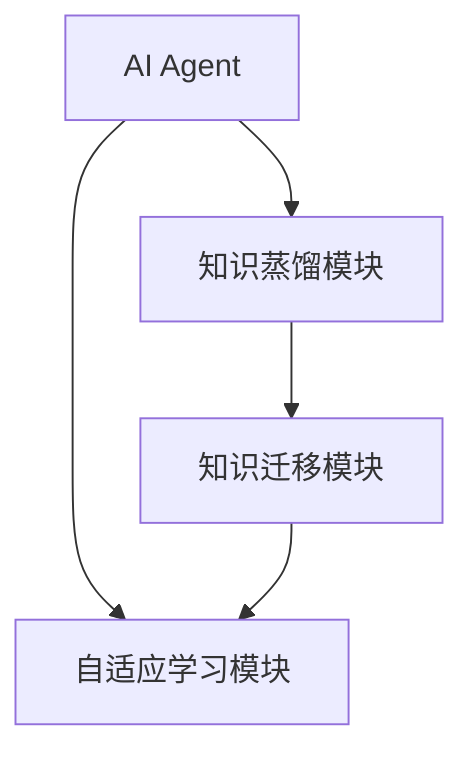
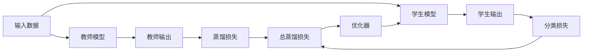
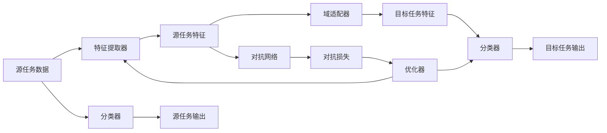
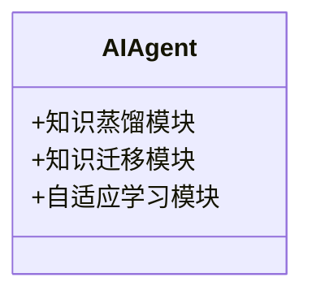
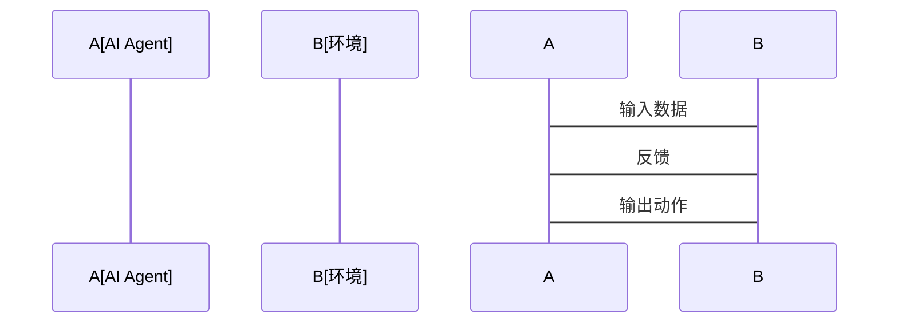

                 


# 设计AI Agent的自适应知识蒸馏与迁移

> **关键词**：AI Agent, 知识蒸馏, 知识迁移, 自适应学习, 迁移学习, 系统架构设计

> **摘要**：  
本文旨在探讨AI Agent的自适应知识蒸馏与迁移的核心原理和设计方法。通过分析知识蒸馏与迁移学习的基本概念，结合自适应学习的特性，提出一种基于自适应蒸馏和迁移的AI Agent设计框架。文章详细介绍了自适应蒸馏的数学模型、迁移学习的优化策略，并通过系统架构设计和项目实战，展示了如何实现高效的知识蒸馏与迁移。本文还提供了丰富的代码示例和系统设计图，帮助读者更好地理解和应用这些技术。

---

## 引言

随着人工智能技术的快速发展，AI Agent（智能体）在各个领域的应用越来越广泛。AI Agent能够通过与环境交互，自主学习和适应新的任务场景。然而，如何让AI Agent高效地进行知识蒸馏与迁移，成为一个关键问题。知识蒸馏是指将复杂模型的知识迁移到简单模型中，而知识迁移则是指在不同任务或环境中应用已有的知识。本文将重点探讨如何设计AI Agent的自适应知识蒸馏与迁移系统，使其能够在动态环境中高效学习和适应。

---

## 第1章: 背景介绍

### 1.1 知识蒸馏与迁移的基本概念

知识蒸馏是一种将复杂模型的知识迁移到简单模型的技术，其核心思想是通过教师模型（Teacher）指导学生模型（Student）的学习过程。传统的知识蒸馏方法通常使用固定的蒸馏温度和固定的教师模型，而自适应知识蒸馏则是通过动态调整蒸馏参数，使学生模型能够更好地适应不同的任务需求。

知识迁移则是指将一个任务中学到的知识应用到另一个相关任务中。迁移学习通过共享不同任务之间的特征，减少对新任务数据的依赖，从而提高模型的泛化能力。

### 1.2 自适应学习的特性

自适应学习是指系统能够根据环境的变化动态调整其学习策略和模型参数。自适应学习的核心在于通过反馈机制不断优化模型，使其能够在动态环境中保持高性能。

### 1.3 问题背景与描述

在实际应用中，AI Agent需要面对多样化的任务和复杂的环境。传统的知识蒸馏和迁移方法往往难以应对动态变化的场景，导致模型性能下降。因此，如何设计一种自适应的知识蒸馏与迁移方法，使AI Agent能够在动态环境中高效学习和适应，成为一个亟待解决的问题。

### 1.4 核心概念与联系

| 核心概念 | 定义 | 特性 |
|----------|------|------|
| 知识蒸馏 | 将复杂模型的知识迁移到简单模型的技术 | 动态调整蒸馏参数，优化学生模型性能 |
| 知识迁移 | 将一个任务中的知识应用到另一个相关任务中 | 减少数据依赖，提高模型泛化能力 |
| 自适应学习 | 根据环境变化动态调整学习策略 | 基于反馈机制优化模型性能 |

### 1.5 系统架构与核心要素



---

## 第2章: 自适应知识蒸馏的核心原理

### 2.1 自适应蒸馏的数学模型

自适应蒸馏的核心在于动态调整蒸馏温度和教师模型的权重。蒸馏温度决定了学生模型对教师模型的关注程度，温度越高，学生模型越依赖教师模型的输出。教师模型的权重则决定了教师模型对不同特征的重要性。

自适应蒸馏的损失函数可以表示为：

$$ L_{\text{distill}} = \lambda \cdot L_{\text{KL}}(P, Q) + (1-\lambda) \cdot L_{\text{CE}}(Q, y) $$

其中，$L_{\text{KL}}$表示KL散度，$L_{\text{CE}}$表示交叉熵损失，$\lambda$是蒸馏系数，用于动态调整蒸馏损失和分类损失的权重。

### 2.2 自适应蒸馏的优化目标

自适应蒸馏的目标是在动态环境中，通过优化蒸馏系数和教师模型的权重，使学生模型在保持教师模型性能的同时，能够在新的任务中快速适应。

### 2.3 算法流程



---

## 第3章: 知识迁移的核心原理

### 3.1 迁移学习的数学模型

迁移学习的核心在于通过共享源任务和目标任务之间的特征，减少对目标任务数据的依赖。源任务和目标任务之间的特征可以通过域适配（Domain Adaptation）和任务适配（Task Adaptation）来实现。

域适配的目标是最小化源域和目标域之间的分布差异，其损失函数可以表示为：

$$ L_{\text{DA}} = \lambda \cdot L_{\text{JS}}(P_{\text{src}}, P_{\text{tgt}}) + (1-\lambda) \cdot L_{\text{CE}}(Q, y_{\text{src}}) $$

其中，$L_{\text{JS}}$表示Jensen-Shannon散度，$\lambda$是域适配的权重。

### 3.2 自适应迁移学习的优化策略

自适应迁移学习通过动态调整任务适配的权重，使模型能够更好地适应不同的目标任务。任务适配的权重可以通过对抗训练来优化，对抗训练的目标是使生成器生成的特征能够 fool 判别器。

### 3.3 算法流程



---

## 第4章: 系统架构设计

### 4.1 系统架构概述

AI Agent的系统架构包括以下几个核心模块：

1. **知识蒸馏模块**：负责将教师模型的知识迁移到学生模型。
2. **知识迁移模块**：负责将源任务的知识应用到目标任务中。
3. **自适应学习模块**：负责根据环境反馈动态调整模型参数。



### 4.2 接口设计与交互流程

AI Agent的接口设计包括以下内容：

1. **输入接口**：接收环境输入的数据和反馈。
2. **输出接口**：输出动作或决策。
3. **反馈接口**：接收环境对动作的反馈，用于优化模型。



---

## 第5章: 项目实战

### 5.1 环境搭建与安装

为了实现自适应知识蒸馏与迁移，首先需要安装以下环境：

1. **Python 3.8+**
2. **TensorFlow或PyTorch**
3. **Mermaid图生成工具**

### 5.2 核心代码实现

以下是自适应知识蒸馏与迁移的核心代码示例：

```python
import tensorflow as tf
from tensorflow.keras import layers

# 定义教师模型
def teacher_model(input_shape):
    model = tf.keras.Sequential()
    model.add(layers.Dense(128, activation='relu', input_shape=input_shape))
    model.add(layers.Dense(10, activation='softmax'))
    return model

# 定义学生模型
def student_model(input_shape):
    model = tf.keras.Sequential()
    model.add(layers.Dense(64, activation='relu', input_shape=input_shape))
    model.add(layers.Dense(10, activation='softmax'))
    return model

# 定义蒸馏损失函数
def distillation_loss(y_true, y_pred, alpha=0.1):
    kl_loss = tf.keras.losses.KLDivergence()(y_true, y_pred)
    ce_loss = tf.keras.losses.sparse_categorical_crossentropy(y_true, y_pred)
    return alpha * kl_loss + (1 - alpha) * ce_loss

# 自适应蒸馏训练
teacher = teacher_model((input_dim,))
student = student_model((input_dim,))

optimizer = tf.keras.optimizers.Adam()

for epoch in range(num_epochs):
    for x, y in dataset:
        with tf.GradientTape() as tape:
            t_y = teacher(x)
            s_y = student(x)
            loss = distillation_loss(y, s_y)
        gradients = tape.gradient(loss, student.trainable_weights)
        optimizer.apply_gradients(student trainable_weights, gradients)
```

### 5.3 案例分析与代码解读

通过上述代码示例可以看出，自适应知识蒸馏的核心在于动态调整蒸馏系数和优化学生模型的参数。在实际应用中，可以根据任务需求动态调整蒸馏温度和教师模型的权重，以达到最佳的蒸馏效果。

---

## 第6章: 最佳实践与小结

### 6.1 小结

本文详细探讨了AI Agent的自适应知识蒸馏与迁移的核心原理和设计方法，提出了基于自适应蒸馏和迁移的系统架构设计，并通过代码示例展示了如何实现自适应知识蒸馏与迁移。

### 6.2 注意事项

在实际应用中，需要注意以下几点：

1. **数据质量**：确保源任务和目标任务的数据质量，避免噪声数据影响模型性能。
2. **模型选择**：根据任务需求选择合适的模型架构，避免过度复杂的模型。
3. **参数调优**：动态调整蒸馏系数和迁移学习的参数，以达到最佳的性能。

### 6.3 拓展阅读

对于感兴趣的研究者，可以进一步阅读以下文献：

1. Hinton G, Vinyals O,等人提出的知识蒸馏方法。
2. Pan S J,等人提出的迁移学习框架。

---

## 结论

AI Agent的自适应知识蒸馏与迁移是一种高效的知识转移方法，能够帮助AI Agent在动态环境中快速适应新的任务场景。通过本文的探讨，读者可以深入了解自适应蒸馏和迁移的核心原理，并通过实际的代码示例和系统设计图，掌握如何实现自适应知识蒸馏与迁移。未来的研究方向可以进一步探索多模态蒸馏和自适应对抗学习，以提高AI Agent的泛化能力和适应性。

---

**作者：AI天才研究院/AI Genius Institute & 禅与计算机程序设计艺术 /Zen And The Art of Computer Programming**

