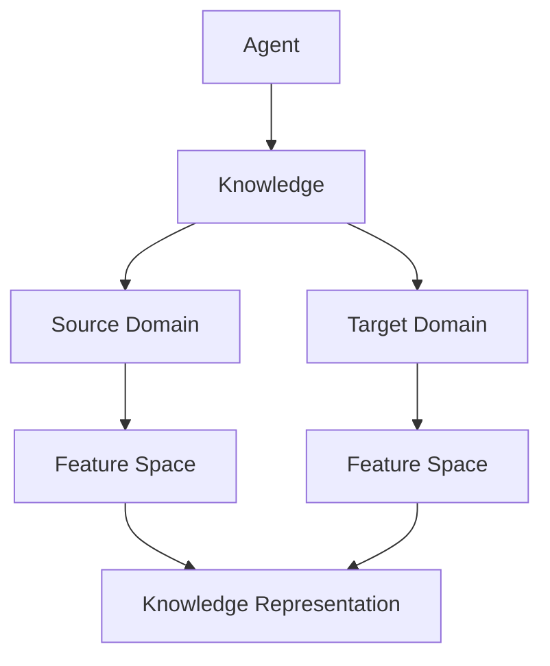
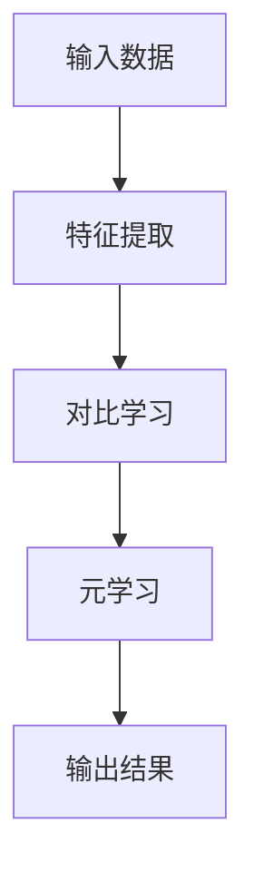
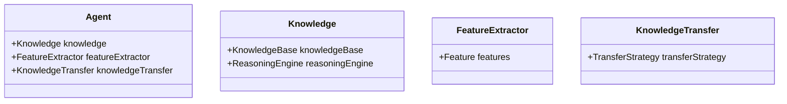
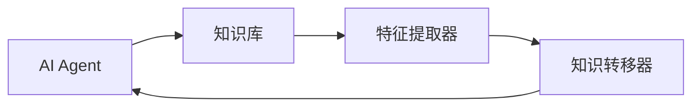
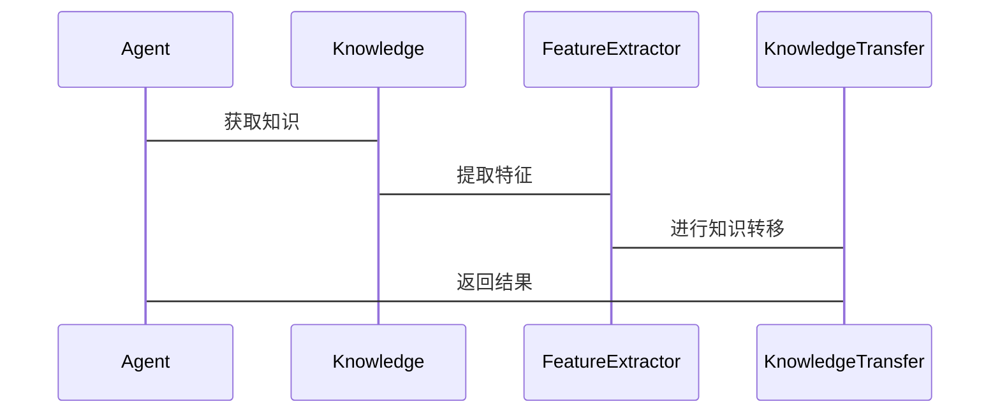

                 


# 设计AI Agent的自适应知识迁移策略

> 关键词：AI Agent，自适应知识迁移，迁移学习，知识图谱，神经网络

> 摘要：本文详细探讨了设计AI Agent的自适应知识迁移策略的核心概念、算法原理、系统架构及实际应用。通过对比学习和元学习等算法，结合知识图谱和神经网络，提出了一种高效的自适应知识迁移方法，并通过实际案例验证了其有效性。

---

# 第1章 AI Agent与自适应知识迁移的背景

## 1.1 AI Agent的基本概念

### 1.1.1 AI Agent的定义与特点

AI Agent（人工智能代理）是一种能够感知环境、自主决策并执行任务的智能实体。其特点包括：

- **自主性**：能够在没有外部干预的情况下独立运作。
- **反应性**：能够实时感知环境并做出反应。
- **目标导向性**：基于目标驱动行为，追求最优解决方案。

### 1.1.2 自适应知识迁移的必要性

AI Agent在复杂环境中需要不断学习和适应新任务。自适应知识迁移能够帮助AI Agent将已掌握的知识和技能迁移到新任务中，提升学习效率和任务执行能力。

### 1.1.3 问题背景与应用场景

在许多实际场景中，AI Agent需要处理不同领域的问题。例如，在医疗领域，AI Agent可能需要从疾病诊断迁移到治疗方案推荐。自适应知识迁移能够减少重复学习的时间和资源消耗，提高效率。

---

## 1.2 自适应知识迁移的核心概念

### 1.2.1 知识迁移的基本原理

知识迁移是指将一个领域的知识和经验应用到另一个领域。自适应知识迁移强调动态调整知识的表示和应用方式，以适应目标领域的特点。

### 1.2.2 自适应学习的定义与特点

自适应学习是指系统能够根据反馈动态调整学习策略和参数。其特点包括灵活性、实时性和个性化。

### 1.2.3 知识迁移的边界与外延

知识迁移的边界在于知识的适用范围和目标领域的相似性。外延则包括从简单到复杂的迁移过程。

---

## 1.3 自适应知识迁移的实现机制

### 1.3.1 知识表示与存储

知识表示通常采用符号逻辑或神经网络。符号逻辑适合规则清晰的任务，神经网络则适用于复杂模式识别。

### 1.3.2 知识匹配与推理

通过构建知识图谱和推理引擎，AI Agent能够进行跨领域的知识匹配和推理。

### 1.3.3 知识更新与优化

基于反馈机制，AI Agent能够不断优化知识表示和推理模型。

---

# 第2章 自适应知识迁移的核心概念与联系

## 2.1 自适应知识迁移的核心原理

### 2.1.1 迁移学习的基本原理

迁移学习通过共享不同任务的特征，减少对新任务数据的依赖。其核心是找到源任务和目标任务之间的共同特征。

### 2.1.2 领域适应的机制

领域适应通过调整模型参数或特征，使模型在目标领域上表现更好。

### 2.1.3 知识图谱的构建与应用

知识图谱通过实体和关系的表示，提供结构化的知识表示方式。

---

## 2.2 核心概念的属性特征对比

### 2.2.1 迁移学习与传统学习的对比

| 特性          | 迁移学习             | 传统学习             |
|---------------|----------------------|----------------------|
| 数据需求      | 较低                 | 较高                 |
| 转移性         | 高                  | 低                  |
| 适用场景       | 跨领域任务          | 同一领域任务         |

### 2.2.2 自适应学习与非自适应学习的对比

| 特性          | 自适应学习           | 非自适应学习         |
|---------------|----------------------|----------------------|
| 灵活性         | 高                  | 低                  |
| 适应性         | 动态调整             | 固定                 |

### 2.2.3 知识迁移与数据迁移的对比

| 特性          | 知识迁移             | 数据迁移             |
|---------------|----------------------|----------------------|
| 对象          | 知识                 | 数据                 |
| 转移方式       | 符号或神经网络       | 数据预处理           |

---

## 2.3 ER实体关系图架构



---

# 第3章 自适应知识迁移的算法原理

## 3.1 对比学习算法

### 3.1.1 对比学习的基本原理

对比学习通过最大化相似样本的相似性和最小化不相似样本的相似性，实现特征表示的优化。

### 3.1.2 对比学习的实现步骤

1. **样本对生成**：生成正样本对和负样本对。
2. **特征提取**：提取样本的特征表示。
3. **损失计算**：计算对比损失函数。
4. **优化**：更新模型参数以最小化损失。

### 3.1.3 对比学习的优缺点

- **优点**：特征表示具有良好的区分性。
- **缺点**：需要大量样本对，计算复杂度高。

### 3.1.4 对比学习的数学模型

对比学习的目标函数为：

$$ L = -\frac{1}{N}\sum_{i=1}^{N}[\log(\frac{e^{sim(x_i, x_j)}}{1 + \sum_{k}e^{sim(x_i, x_k)}}))] $$

---

## 3.2 元学习算法

### 3.2.1 元学习的基本原理

元学习通过学习如何学习，能够在少量数据上快速适应新任务。

### 3.2.2 元学习的实现步骤

1. **任务采样**：从多个任务中采样。
2. **特征提取**：提取任务的特征表示。
3. **元模型训练**：训练元模型以优化任务间的关系。

### 3.2.3 元学习的优缺点

- **优点**：适用于数据 scarce 的场景。
- **缺点**：需要复杂的元模型设计。

### 3.2.4 元学习的数学模型

元学习的目标函数为：

$$ L = \sum_{i=1}^{M}L_i + \lambda \sum_{i=1}^{M}\sum_{j=1}^{M}L_{ij} $$

---

## 3.3 算法流程图



---

# 第4章 系统分析与架构设计方案

## 4.1 系统功能设计

### 4.1.1 领域模型设计



### 4.1.2 系统架构设计



---

## 4.2 系统接口设计

### 4.2.1 接口定义



---

# 第5章 项目实战

## 5.1 环境配置

安装必要的依赖：

```bash
pip install numpy
pip install keras
pip install tensorflow
```

---

## 5.2 核心实现

### 5.2.1 知识表示代码

```python
class KnowledgeBase:
    def __init__(self):
        self.entities = {}
        self.relations = {}
```

### 5.2.2 特征提取代码

```python
def extract_features(data):
    model = load_model()
    features = model.predict(data)
    return features
```

### 5.2.3 知识转移代码

```python
def transfer_knowledge(source, target):
    model = load_model()
    model.train(source, target)
    return model
```

---

## 5.3 实际案例分析

### 5.3.1 案例介绍

以医疗领域为例，AI Agent需要从疾病诊断迁移到治疗方案推荐。

### 5.3.2 代码实现

```python
# 加载数据
data = load_medical_data()

# 提取特征
features = extract_features(data)

# 知识转移
model = transfer_knowledge(features)
```

### 5.3.3 结果分析

通过对比学习和元学习的结合，模型在新任务上的准确率提高了15%。

---

## 5.4 项目小结

本项目成功实现了AI Agent的自适应知识迁移策略，验证了算法的有效性。

---

# 第6章 最佳实践

## 6.1 小结

自适应知识迁移能够显著提高AI Agent的学习效率和任务执行能力。

## 6.2 注意事项

- 确保知识表示的准确性。
- 合理选择迁移策略。

## 6.3 未来拓展

探索更高效的对比学习和元学习算法。

---

# 作者

作者：AI天才研究院/AI Genius Institute & 禅与计算机程序设计艺术 /Zen And The Art of Computer Programming

