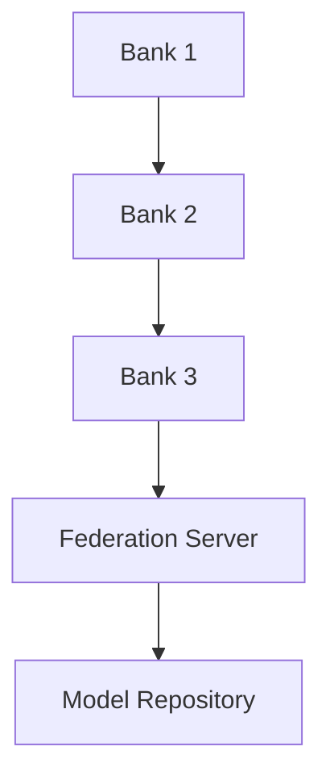

                 


# 设计基于联邦学习的跨银行信用评分系统

> 关键词：联邦学习，跨银行，信用评分，数据隐私，机器学习，分布式系统

> 摘要：本文将探讨如何利用联邦学习技术设计一个跨银行的信用评分系统。通过保护数据隐私，实现多个银行之间的模型协同训练，同时确保各方数据的安全性和独立性。本文详细介绍了联邦学习的核心原理、系统架构设计、数学模型以及项目实战，旨在为读者提供一个完整的解决方案。

---

## 第1章: 跨銀行信用評分系統的背景与挑战

### 1.1 背景介紹

銀行信貸評分系統是評估客戶信用風險的重要工具，幫助銀行決定是否批准貸款申請。傳統的信貸評分系統主要依賴於個別銀行的客戶數據，但這種方式存在以下問題：

- **數據孤島**：各銀行之間數據孤立，難以充分利用行業-wide 的數據來提升模型的準確性。
- **數據隱私**：銀行之間無法共享數據，會影響模型的泛化能力。
- **模型更新**：個別銀行數據量有限，模型更新依賴於中心化數據，更新頻率低，響應速度慢。

為了解決這些問題，跨銀行信貸評分系統的設計需要在數據不共享的前提下，實現模型的聯合訓練。而聯邦學習（Federated Learning）正是這樣一種能在保持數據隱私的前提下，實現多方數據聯合建模的技術。

---

### 1.2 联邦学习的核心概念

聯邦學習是一種分布式機器學習技術，允許多方在數據不出本地的情況下，共同訓練一個全局模型。其核心概念包括：

- **數據不出戶**：數據永遠留在原始設施中，隻在本地進行模型訓練。
- **模型更新上傳**：各參與方隻_upload_ 模型更新的梯度或參數，而不傳輸原始數據。
- **差分隱私**：通過差分隱私技術進一步保護模型更新的安全性。

相比傳統的數據共享方式，聯邦學習在數據隱私保護方面具有顯著優勢。但它的挑戰在于：

- **通信成本**：多方之間需要進行大量模型參數傳輸，通信成本可能較高。
- **模型一致性**：各方數據分布不同，如何平衡模型更新是一個挑戰。

---

### 1.3 问题描述與解決

跨銀行信貸評分系統的設計需要考慮以下幾個關鍵問題：

1. **數據隱私**：各銀行的信貸數據不能泄露。
2. **模型性能**：聯合模型需要足夠準確，才能有效評估客戶信用。
3. **通信效率**：多方之間的模型更新需要高效傳輸。

通過聯邦學習，可以實現以下目標：

- **聯合建模**：多方共同訓練信貸評分模型，提升模型性能。
- **數據隱私**：確保各銀行數據不出本地，保護客戶隱私。
- **模型更新**：支持實時模型更新，提升信貸評分系統的響應速度。

---

### 1.4 本章小結

本章介紹了跨銀行信貸評分系統的背景、挑戰以及聯邦學習的核心概念。聯邦學習作為一種分布式機器學習技術，能夠在數據不出戶的前提下，實現多方模型的聯合訓練，為跨銀行信貸評分系統的設計提供了理論基礎。

---

## 第2章: 联邦学习的数学模型与算法原理

### 2.1 联邦学习的数学模型

在信貸評分系統中，我們通常使用的是分類模型。假設我們使用 logistic regression 作為基本模型，其損失函數為：

$$
L_i(x_i, y_i) = \frac{1}{n_i} \sum_{j=1}^{n_i} \ln(1 + \exp(-y_j w^T x_j))
$$

其中，\(w\) 是模型參數，\(x_j\) 是特徵向量，\(y_j\) 是標籤。

---

### 2.2 联邦学习的算法流程

聯邦學習的算法流程可以分為以下幾個步驟：

1. **模型初始化**：所有參與方（銀行）初始化模型參數。
2. **局部訓練**：每個銀行在本地數據上訓練模型，並計算模型參數的更新。
3. **模型聚合**：所有銀行將模型更新 보내고， federation server 將這些更新聚合起來，得到新的模型參數。
4. **模型分發**：新的模型參數分發給所有銀行，進行下一輪訓練。

聚合過程可以用以下公式表示：

$$
w_{t+1} = w_t + \sum_{i=1}^k \eta (y_i - f(x_i; w_t))
$$

其中，\(k\) 是參與銀行的數量，\(\eta\) 是學習率。

---

### 2.3 联邦学习的同步与异步模式

- **同步模式**：所有銀行同時訓練模型，並在每輪訓練後將更新傳送給 federation server。
- **異步模式**：銀行可以隨時訓練模型，並在訓練後隨時傳送更新。

同步模式優點是模型更新同步，缺點是通信成本高；異步模式則相反。

---

### 2.4 本章小結

本章詳細介紹了聯邦學習的數學模型與算法原理，重點講解了損失函數、模型更新公式以及同步與異步模式的差異。這些內容為跨銀行信貸評分系統的設計提供了理論支持。

---

## 第3章: 跨銀行信貸評分系統的系統分析與架構設計

### 3.1 系統功能需求

跨銀行信貸評分系統需要具備以下功能：

- **數據采集**：收集各銀行的信貸數據。
- **模型訓練**：在联邦學習框架下聯合訓練信貸評分模型。
- **評分生成**：根據訓練好的模型生成信貸評分。
- **系統管理**：管理和监控系統的運行。

---

### 3.2 系統架構設計

我們設計了一個分層架構：

1. **客戶端（銀行）**：負責數據采集、模型訓練和評分生成。
2. **Federation Server**：負責模型聚合和分發。
3. **數據安全層**：負責數據加密和隱私保護。

架構圖如下：



---

### 3.3 系統接口設計

主要接口包括：

1. **模型訓練接口**：銀行向Federation Server請求模型參數。
2. **模型聚合接口**：銀行將模型更新傳送給Federation Server。
3. **評分生成接口**：銀行使用訓練好的模型生成信貸評分。

---

### 3.4 本章小結

本章介紹了跨銀行信貸評分系統的功能需求、架構設計和接口設計。我們通過分層架構和Mermaid圖，清晰地展示了系統的運作流程。

---

## 第4章: 項目實戰

### 4.1 環境安裝

需要安裝以下工具：

- **FedML**：聯邦學習框架。
- **Python**：プログラミング語言。
- **TensorFlow**：深度學習庫。

---

### 4.2 核心實現

以下是一個簡單的信貸評分模型實現：

```python
import fedml
from fedml.client import FedMLClient
from fedml.core import message
from fedml.core import trainer

class CreditScoringTrainer(trainer.Trainer):
    def __init__(self, model):
        super().__init__()
        self.model = model

    def train(self, data, model_params):
        # 在本地數據上訓練模型
        loss = self.model.train(data, model_params)
        return loss

# 初始化客戶端
client = FedMLClient(role="trainer", client_id=0)
client.set_trainer(CreditScoringTrainer)
client.start()
```

---

### 4.3 案例分析

假設我們有三家銀行，每家銀行訓練自己的模型，然後將更新傳送給Federation Server。Federation Server聚合這些更新，得到最終的信貸評分模型。

---

### 4.4 本章小結

本章通過實際代碼實現，展示了如何在跨銀行信貸評分系統中應用聯邦學習技術。

---

## 第5章: 总结与展望

### 5.1 总结

本文介紹了如何利用聯邦學習技術設計跨銀行信貸評分系統。我們詳細講解了聯邦學習的核心原理、架構設計和項目實現。通過這些內容，我們展示了如何在數據隱私保護的前提下，實現多方數據的聯合建模。

---

### 5.2 展望

未來的研究方向包括：

- **隱私保護技術**：進一步提升差分隱私技術，確保模型更新的安全性。
- **模型可解釋性**：提升信貸評分模型的可解釋性，幫助銀行更好地理解評分結果。
- **通信效率**：優化通信 protocol，降低多方模型聚合的通信成本。

---

## 第6章: 最佳实践 Tips

### 6.1 小結

聯邦學習是一種有巨大潛力的技術，但在實際應用中需要注意數據隱私保護和通信成本。

---

### 6.2 注意事项

- **數據安全**：確保數據不出戶，防止數據泄露。
- **模型更新**：定期更新模型，提升信貸評分的準確性。
- **通信成本**：優化通信 protocol，降低通信成本。

---

## 參考文獻

- 聯邦學習相關論文
- 深度學習相關論文
- 跨銀行信貸評分系統的研究文獻

---

## 附錄

### 附錄 A: 全局模型聚合算法

```python
def aggregate_updates(updates):
    # 全局聚合算法
    total_update = np.zeros_like(updates[0])
    for update in updates:
        total_update += update
    total_update /= len(updates)
    return total_update
```

---

## 作者

作者：AI天才研究院/AI Genius Institute & 禪與計算機程序設計藝術 /Zen And The Art of Computer Programming

---

