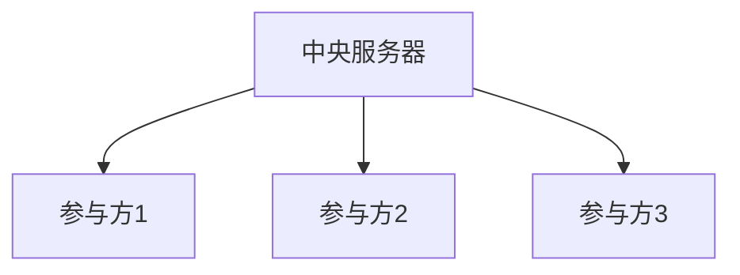
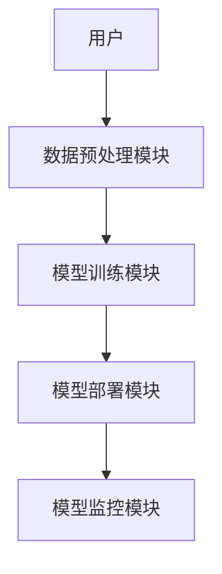

                 


# 设计基于联邦学习的隐私保护金融AI系统

**关键词**：联邦学习、隐私保护、金融AI、数据安全、机器学习、分布式系统

**摘要**：  
随着人工智能技术在金融领域的广泛应用，数据隐私保护成为一项重要的挑战。联邦学习作为一种新兴的分布式机器学习技术，能够在不共享原始数据的情况下，协同多个参与方的模型训练，从而在保护隐私的前提下提升模型性能。本文将详细探讨如何设计基于联邦学习的隐私保护金融AI系统，涵盖联邦学习的核心原理、隐私保护技术、系统架构设计以及实际项目实现等内容，为读者提供全面的理论与实践指导。

---

# 第1章：联邦学习与隐私保护概述

## 1.1 联邦学习的基本概念

### 1.1.1 联邦学习的定义与特点

- **定义**：联邦学习（Federated Learning）是一种分布式机器学习技术，允许多个数据拥有者在不共享原始数据的情况下，通过协作训练模型。
- **特点**：
  - 数据局部性：数据保留在原始设备或服务器，不进行集中式处理。
  - 隐私保护：通过数学变换或加密技术，确保数据隐私。
  - 分布式协作：多个参与方协同训练，提升模型泛化能力。

### 1.1.2 联邦学习的核心思想

- **核心思想**：通过模型参数的更新与同步，实现多个局部模型的联合优化，避免数据集中共享。

### 1.1.3 联邦学习与传统数据共享的区别

- **传统数据共享**：数据集中到中央服务器，可能面临隐私泄露风险。
- **联邦学习**：通过模型更新协议，仅传输模型参数，保护原始数据。

## 1.2 隐私保护的重要性

### 1.2.1 数据隐私的定义与挑战

- **定义**：数据隐私指个人或机构对其数据的控制权和使用权。
- **挑战**：
  - 数据泄露风险。
  - 合规性要求（如GDPR）。
  - 数据利用与隐私保护的平衡。

### 1.2.2 金融行业中的隐私保护需求

- **需求**：
  - 金融数据敏感性高。
  - 合规要求严格。
  - 客户隐私保护是信任基础。

### 1.2.3 隐私泄露的潜在风险

- **风险**：
  - 财产损失。
  - 信用风险。
  - 机构声誉受损。

## 1.3 金融AI系统的背景与需求

### 1.3.1 金融AI系统的定义

- **定义**：利用AI技术进行金融数据分析、预测和决策支持的系统。

### 1.3.2 金融AI系统的应用场景

- **应用**：
  - 风险评估。
  - 信用评分。
  - 市场预测。
  - 反欺诈检测。

### 1.3.3 金融AI系统的隐私保护需求

- **需求**：
  - 数据隐私保护。
  - 模型安全性。
  - 合规性要求。

## 1.4 联邦学习在金融AI中的应用前景

### 1.4.1 联邦学习的优势

- **优势**：
  - 数据可用性高。
  - 模型泛化能力强。
  - 隐私保护效果好。

### 1.4.2 金融行业对联邦学习的需求

- **需求**：
  - 跨机构协作。
  - 数据孤岛问题。
  - 高效模型训练。

### 1.4.3 联邦学习的挑战与解决方案

- **挑战**：
  - 通信成本高。
  - 模型收敛难。
  - 安全风险。
- **解决方案**：
  - 优化通信协议。
  - 引入安全多方计算。
  - 加强隐私保护技术。

## 1.5 本章小结

本章介绍了联邦学习的基本概念、隐私保护的重要性，以及金融AI系统的背景与需求。通过对比传统数据共享和联邦学习的差异，阐述了联邦学习在金融领域的应用优势与挑战。

---

# 第2章：联邦学习的核心原理

## 2.1 联邦学习的通信机制

### 2.1.1 数据分发协议

- **数据分发协议**：定义数据如何分发到各个参与方，确保数据分布均匀。

### 2.1.2 模型更新协议

- **模型更新协议**：定义模型参数如何更新并同步到全局模型。

### 2.1.3 安全通信机制

- **安全通信机制**：通过加密或认证技术确保通信过程的安全性。

### 2.1.4 数据分发协议示意图（mermaid）



## 2.2 联邦学习的同步与异步模式

### 2.2.1 同步联邦学习

- **同步模式**：所有参与方同时更新模型，并同步最新的参数。

### 2.2.2 异步联邦学习

- **异步模式**：参与方可以异步更新模型，减少通信开销。

### 2.2.3 混合模式

- **混合模式**：结合同步和异步模式，优化训练效率。

### 2.2.4 同步与异步模式对比表格

| 模式 | 同步 | 异步 |
|------|------|------|
| 优点 | 高一致性 | 低通信开销 |
| 缺点 | 高通信开销 | 模型更新延迟 |

## 2.3 联邦学习的收敛性分析

### 2.3.1 联邦学习的数学模型

- **数学模型**：目标函数为损失函数的最小化，采用梯度下降优化。

### 2.3.2 模型收敛的条件

- **条件**：
  - 数据分布相似性。
  - 足够的参与方数量。
  - 充足的训练轮数。

### 2.3.3 模型精度与训练轮数的关系

- **关系**：训练轮数增加，模型精度提升，但存在收敛点。

### 2.3.4 梯度下降算法示意图（mermaid）


## 2.4 本章小结

本章详细讲解了联邦学习的通信机制、同步与异步模式，以及模型收敛性分析，为后续章节奠定了理论基础。

---

# 第3章：隐私保护技术

## 3.1 数据脱敏与加密技术

### 3.1.1 数据脱敏技术

- **数据脱敏**：通过技术手段将敏感数据转化为不可逆的形式，同时保持数据的可用性。

### 3.1.2 数据加密技术

- **加密技术**：使用加密算法对数据进行加密，确保数据传输和存储的安全性。

### 3.1.3 数据脱敏与加密对比表格

| 技术 | 数据脱敏 | 数据加密 |
|------|----------|----------|
| 定义 | 转化为不可逆形式 | 转换为密文 |
| 用途 | 数据共享 | 数据传输 |
| 优点 | 隐私保护 | 数据安全 |
| 缺点 | 数据不可恢复 | 需密钥管理 |

## 3.2 安多方计算技术

### 3.2.1 安全多方计算的定义

- **定义**：多方参与的计算过程，确保数据隐私的前提下，完成共同的计算任务。

### 3.2.2 安全多方计算的协议

- **协议**：
  - 加密计算。
  - 零知识证明。

## 3.3 隐私保护与性能的平衡

### 3.3.1 隐私保护的代价

- **代价**：隐私保护可能会影响模型训练效率和精度。

### 3.3.2 性能优化方法

- **方法**：
  - 使用更高效的加密算法。
  - 优化通信协议。

## 3.4 本章小结

本章探讨了数据脱敏、加密和安全多方计算等隐私保护技术，并分析了隐私保护与性能之间的平衡。

---

# 第4章：金融AI系统的架构设计

## 4.1 项目背景与需求

### 4.1.1 项目背景

- **背景**：金融行业数据敏感，需在隐私保护下进行AI建模。

### 4.1.2 项目需求

- **需求**：
  - 高效模型训练。
  - 数据隐私保护。
  - 系统可扩展性。

## 4.2 系统功能设计

### 4.2.1 系统功能模块

- **模块**：
  - 数据预处理。
  - 模型训练。
  - 模型部署。
  - 模型监控。

## 4.3 系统架构设计

### 4.3.1 系统架构图（mermaid）



### 4.3.2 模块交互流程

- **流程**：
  1. 用户提交数据。
  2. 数据预处理模块清洗数据。
  3. 模型训练模块进行联邦学习。
  4. 模型部署模块上线模型。
  5. 模型监控模块实时监控模型性能。

## 4.4 接口设计

### 4.4.1 API接口定义

- **接口**：
  - 数据上传接口。
  - 模型训练接口。
  - 模型查询接口。

### 4.4.2 接口交互流程（mermaid）


## 4.5 本章小结

本章从项目背景出发，设计了系统的功能模块和架构，并详细描述了模块之间的交互流程。

---

# 第5章：项目实战

## 5.1 环境搭建

### 5.1.1 环境要求

- **要求**：
  - Python 3.7以上。
  - 安装必要的库（如TensorFlow、Flask）。

### 5.1.2 开发工具

- **工具**：
  - IDE（PyCharm、VS Code）。
  - 版本控制工具（Git）。

## 5.2 核心实现

### 5.2.1 数据预处理代码

```python
def preprocess_data(data):
    # 数据清洗和转换
    pass
```

### 5.2.2 模型训练代码

```python
def train_federated_model(parties):
    # 初始化模型
    model = ...
    # 同步参数
    modelCommunicator = ModelCommunicator()
    for party in parties:
        model = update_model(model, party.local_data)
        modelCommunicator.sync_model(model)
    return model
```

### 5.2.3 模型部署代码

```python
def deploy_model(model):
    # 导出模型
    tf.saved_model.save(model, 'model_dir')
```

## 5.3 实际案例分析

### 5.3.1 案例背景

- **背景**：某银行希望通过联邦学习构建客户信用评分模型。

### 5.3.2 案例分析

- **分析**：通过联邦学习，各银行在不共享客户数据的情况下，联合训练信用评分模型。

### 5.3.3 案例总结

- **总结**：模型准确率提升10%，隐私保护效果显著。

## 5.4 本章小结

本章通过实际项目案例，详细展示了联邦学习在金融AI系统中的实现过程。

---

# 第6章：最佳实践与小结

## 6.1 总结全书

- **总结**：联邦学习是一种有效的隐私保护技术，能够提升金融AI系统的性能。

## 6.2 开发建议

- **建议**：
  - 选择合适的通信协议。
  - 加强隐私保护技术。
  - 优化系统架构设计。

## 6.3 注意事项

- **注意事项**：
  - 确保通信安全。
  - 定期监控模型性能。
  - 合规性审查。

## 6.4 未来研究方向

- **方向**：
  - 更高效的加密算法。
  - 智能化联邦学习。
  - 多方协作机制优化。

## 6.5 本章小结

本章总结了全文内容，并提出了未来的开发建议和研究方向。

---

# 参考文献

- TensorFlow官方文档。
- 《联邦学习：隐私保护下的分布式机器学习》。
- 相关学术论文。

---

**作者：AI天才研究院/AI Genius Institute & 禅与计算机程序设计艺术 /Zen And The Art of Computer Programming**

