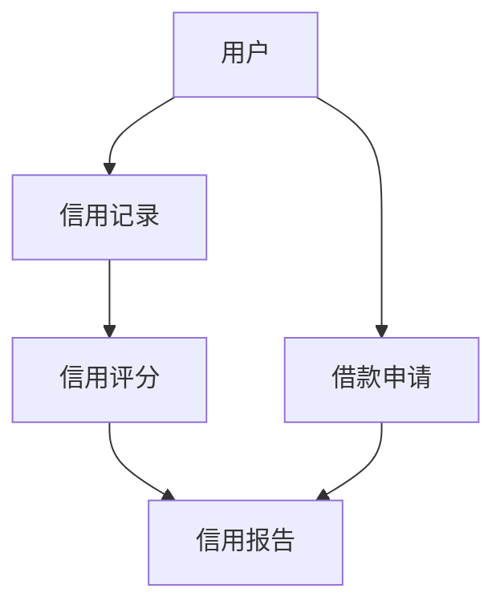
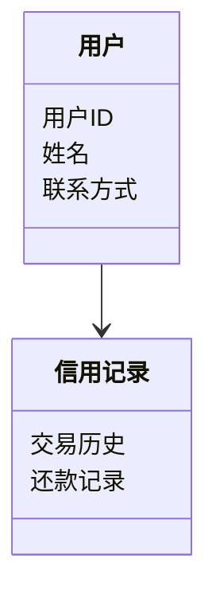

                 


# 设计智能化的个人信用评估系统

## 关键词：信用评估系统，人工智能，机器学习，金融系统，数据科学

## 摘要：智能化的个人信用评估系统是金融领域的一项重要技术，旨在通过人工智能和大数据分析，提高信用评估的效率和准确性。本文将详细探讨系统的设计思路，包括核心概念、算法原理、系统架构、项目实战等，为读者提供全面的技术指导。

---

# 第一部分: 背景介绍

## 第1章: 个人信用评估系统概述

### 1.1 个人信用评估的基本概念
#### 1.1.1 信用评估的定义与作用
信用评估是通过对个人的信用历史、财务状况、行为特征等多方面信息的分析，对其信用风险进行量化的过程。其作用在于帮助金融机构判断个人的信用worthiness，从而做出授信决策。

#### 1.1.2 智能化信用评估的必要性
随着金融业务的复杂化和数据量的爆炸式增长，传统的信用评估方法已难以满足需求。引入人工智能技术，可以提高评估的效率和准确性，同时能够处理非结构化数据，发现潜在风险。

#### 1.1.3 信用评估系统的边界与外延
信用评估系统不仅包括对个人信用的评分，还包括风险预警、欺诈检测等功能。其外延涉及数据收集、模型训练、结果输出等多个环节。

### 1.2 个人信用评估的核心要素
#### 1.2.1 信用评分的定义与特征
信用评分是对个人信用风险的量化指标，通常以分数形式表示。其特征包括可比性、可解释性和动态性。

#### 1.2.2 信用评估的核心指标
包括还款能力、还款意愿、信用历史、资产状况等。这些指标共同决定了个人的信用评分。

#### 1.2.3 信用评估系统的组成结构
包括数据采集模块、数据处理模块、模型训练模块、评分输出模块等。

---

## 第2章: 智能化信用评估的背景与挑战

### 2.1 传统信用评估的局限性
#### 2.1.1 传统信用评估的主要方法
基于统计模型的评分方法，如逻辑回归。这些方法在处理复杂数据和非线性关系方面存在局限性。

#### 2.1.2 传统方法的不足与改进方向
数据维度低、模型可解释性差、难以处理复杂关系等。引入机器学习和深度学习技术可以解决这些问题。

### 2.2 智能化信用评估的驱动力
#### 2.2.1 人工智能技术的发展
机器学习、自然语言处理等技术的发展为信用评估提供了新的工具。

#### 2.2.2 数据量的爆炸式增长
大数据技术的应用使得更多的数据可用于信用评估，提高了评估的准确性。

#### 2.2.3 金融行业的需求变化
金融行业对风险控制的需求日益增加，智能化信用评估成为必然趋势。

### 2.3 当前智能化信用评估的主要挑战
#### 2.3.1 数据隐私与安全问题
如何在保证数据隐私的前提下进行模型训练是当前的重要挑战。

#### 2.3.2 模型的可解释性与透明性
复杂的模型往往难以解释，这在金融领域尤为重要。

#### 2.3.3 算法的公平性与歧视问题
算法可能对某些群体存在歧视，需要确保算法的公平性。

---

# 第二部分: 核心概念与联系

## 第3章: 智能化信用评估的核心概念

### 3.1 数据特征与处理
#### 3.1.1 数据的多样性与复杂性
信用评估涉及结构化数据（如收入、资产）和非结构化数据（如社交网络信息）。

#### 3.1.2 数据预处理的关键步骤
包括数据清洗、特征提取、数据归一化等。

#### 3.1.3 特征选择与降维技术
使用主成分分析（PCA）等方法降低数据维度。

### 3.2 模型算法与选择
#### 3.2.1 常见的信用评分模型
包括逻辑回归、决策树、随机森林等。

#### 3.2.2 机器学习算法在信用评估中的应用
支持向量机（SVM）、神经网络等算法的应用。

#### 3.2.3 深度学习模型的优势与局限
深度学习在非结构化数据处理方面有优势，但训练成本高。

### 3.3 系统架构与组件
#### 3.3.1 系统的整体架构
包括数据采集、模型训练、评分计算、结果输出等模块。

#### 3.3.2 各组件的功能与交互关系
数据采集模块负责获取数据，模型训练模块负责训练模型，评分计算模块负责生成信用评分。

#### 3.3.3 系统的可扩展性与灵活性
系统架构需具备扩展性，以适应数据量和模型复杂度的变化。

## 第4章: 核心概念的联系与对比

### 4.1 核心概念的属性特征对比
| 概念 | 数据特征 | 模型算法 | 系统架构 |
|------|-----------|-----------|-----------|
| 特征 | 结构化与非结构化 | 分类与回归 | 单体与分布式 |

### 4.2 ER实体关系图


---

# 第三部分: 算法原理

## 第5章: 算法原理与实现

### 5.1 算法原理
#### 5.1.1 逻辑回归算法
用于分类问题，适用于二分类信用评分。

#### 5.1.2 随机森林算法
基于树模型的集成方法，具有高准确性和低过拟合风险。

### 5.2 算法实现
#### 5.2.1 逻辑回归实现
```python
import numpy as np
from sklearn.linear_model import LogisticRegression

# 数据预处理
X = ... # 特征矩阵
y = ... # 标签向量

# 模型训练
model = LogisticRegression()
model.fit(X, y)

# 预测
y_pred = model.predict(X)
```

#### 5.2.2 随机森林实现
```python
from sklearn.ensemble import RandomForestClassifier

model = RandomForestClassifier(n_estimators=100)
model.fit(X, y)
y_pred = model.predict(X)
```

### 5.3 算法对比
从准确率、训练时间、可解释性等方面对比逻辑回归和随机森林。

---

## 第6章: 数学模型和公式

### 6.1 信用评分模型
$$ \text{信用评分} = \beta_0 + \beta_1x_1 + \beta_2x_2 + \dots + \beta_nx_n $$

### 6.2 预测模型
$$ P(y=1|x) = \frac{1}{1 + e^{-(\beta_0 + \beta_1x_1 + \dots + \beta_nx_n)}} $$

---

# 第四部分: 系统分析与架构设计

## 第7章: 系统分析与设计

### 7.1 问题场景介绍
描述一个典型的信用评估场景，如银行贷款申请。

### 7.2 系统功能设计
#### 7.2.1 领域模型


#### 7.2.2 系统架构设计


---

## 第8章: 项目实战

### 8.1 环境安装
安装Python、Scikit-learn、TensorFlow等库。

### 8.2 核心代码实现
#### 8.2.1 数据预处理
```python
import pandas as pd
data = pd.read_csv('credit_data.csv')
data = data.dropna()
```

#### 8.2.2 模型训练
```python
from sklearn.model_selection import train_test_split
from sklearn.metrics import accuracy_score

X_train, X_test, y_train, y_test = train_test_split(data.drop('label', axis=1), data['label'], test_size=0.2)
model = RandomForestClassifier().fit(X_train, y_train)
```

#### 8.2.3 模型评估
```python
y_pred = model.predict(X_test)
print(accuracy_score(y_test, y_pred))
```

### 8.3 案例分析
通过具体案例分析模型的准确性和实用性。

---

## 第9章: 总结与展望

### 9.1 总结
智能化个人信用评估系统的实现依赖于先进的算法和大数据技术，能够显著提高评估的效率和准确性。

### 9.2 未来展望
未来可以探索区块链技术在数据隐私保护中的应用，以及强化学习在动态信用评估中的潜力。

---

## 作者：AI天才研究院/AI Genius Institute & 禅与计算机程序设计艺术 /Zen And The Art of Computer Programming

