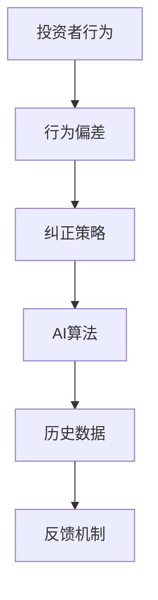
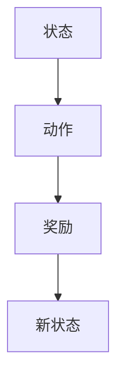
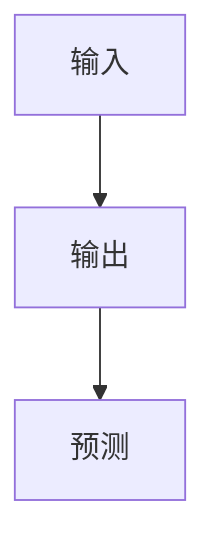
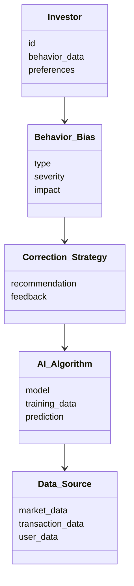
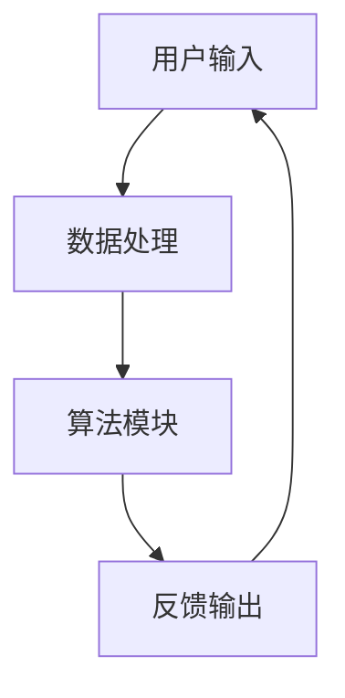

                 


# 设计智能化的个人投资者行为偏差纠正工具

**关键词**：行为偏差，投资决策，人工智能，大数据，强化学习

**摘要**：本文探讨了如何利用人工智能和大数据技术设计智能化的个人投资者行为偏差纠正工具。文章从行为偏差的定义与分类入手，分析其对投资决策的影响，提出利用AI算法和大数据分析来纠正行为偏差的理论基础与实现方案。通过构建系统架构和算法模型，结合实际案例分析，为投资者提供科学的行为纠正策略。

---

## 第1章：行为偏差与投资决策的挑战

### 1.1 行为偏差的定义与分类

#### 1.1.1 行为偏差的定义
行为偏差是指投资者在决策过程中因心理因素或认知局限导致的非理性行为。这些偏差会影响投资决策的科学性和有效性。

#### 1.1.2 常见的行为偏差类型
以下是常见的行为偏差类型及其描述（表格形式）：

| 行为偏差类型 | 描述 | 示例 |
|--------------|------|------|
| **过度自信偏差** | 投资者高估自己判断的准确性 | 盲目追涨杀跌 |
| **从众心理偏差** | 跟随大众决策，忽视独立思考 | 非理性跟风 |
| **沉没成本偏差** | 因过去的投入而继续投入 | 投资亏损后加码 |

---

### 1.2 投资决策中的行为偏差影响

#### 1.2.1 行为偏差对投资决策的影响
行为偏差会导致以下问题：
1. **过度交易**：频繁买卖导致交易成本增加。
2. **误判市场**：基于情绪而非事实做出决策。
3. **错失收益**：因恐惧错失投资机会。

#### 1.2.2 常见的投资决策错误
- 过度交易
- 选择性信息处理
- 从众心理

#### 1.2.3 行为偏差的后果
- 财务损失
- 投资目标偏离
- 长期收益下降

---

### 1.3 智能化纠正工具的必要性

#### 1.3.1 行为偏差纠正的理论基础
- 行为金融学：研究投资者心理与行为。
- 认知心理学：分析人类认知偏差。

#### 1.3.2 智能化工具的优势
- **实时分析**：利用AI快速识别偏差。
- **个性化建议**：根据投资者行为提供定制化纠正策略。
- **数据驱动**：基于大数据提供科学决策支持。

#### 1.3.3 工具的目标与边界
- 目标：帮助投资者识别和纠正行为偏差。
- 边界：不直接替代投资决策，而是提供辅助支持。

---

## 第2章：行为偏差纠正工具的核心概念与联系

### 2.1 行为偏差纠正的核心原理

#### 2.1.1 行为矫正的理论基础
- **行为矫正**：通过反馈机制纠正行为偏差。
- **强化学习**：利用奖励机制强化正确决策。

#### 2.1.2 AI在行为矫正中的作用
- 数据分析：识别行为模式。
- 模型训练：预测偏差并提出建议。

#### 2.1.3 大数据在行为分析中的应用
- 数据来源：交易记录、市场数据、用户行为。
- 数据处理：清洗、建模、分析。

---

### 2.2 核心概念的ER实体关系图



---

## 第3章：行为偏差纠正工具的算法原理

### 3.1 算法选择与原理

#### 3.1.1 强化学习算法
强化学习通过奖励机制优化决策策略。



#### 3.1.2 监督学习算法
监督学习通过历史数据训练模型识别偏差。



---

### 3.2 算法实现

#### 3.2.1 Python代码实现

```python
# 强化学习算法示例
class Agent:
    def __init__(self, state_space, action_space):
        self.state_space = state_space
        self.action_space = action_space
        self.policy = PolicyNetwork(state_space, action_space)
    
    def act(self, state):
        action = self.policy.act(state)
        return action
```

---

### 3.3 数学模型与公式

#### 3.3.1 Q-learning算法公式

$$ Q(s, a) = Q(s, a) + \alpha [r + \max Q(s', a') - Q(s, a)] $$

其中：
- $Q(s, a)$：状态-动作对的值。
- $\alpha$：学习率。
- $r$：奖励。
- $\max Q(s', a')$：新状态下最大值。

---

## 第4章：系统架构与实现方案

### 4.1 系统功能设计

#### 4.1.1 领域模型



---

### 4.2 系统架构设计



---

## 第5章：项目实战与案例分析

### 5.1 环境安装

```bash
pip install numpy pandas scikit-learn tensorflow
```

---

### 5.2 核心代码实现

```python
import numpy as np
import tensorflow as tf

# 定义强化学习模型
class PolicyNetwork:
    def __init__(self, input_dim, output_dim):
        self.model = tf.keras.Sequential([
            tf.keras.layers.Dense(64, activation='relu', input_dim=input_dim),
            tf.keras.layers.Dense(output_dim, activation='linear')
        ])
    
    def call(self, x):
        return self.model(x)
```

---

### 5.3 案例分析

#### 5.3.1 案例描述
假设投资者小王因过度自信偏差频繁交易，导致亏损。

#### 5.3.2 工具应用
工具识别小王的过度交易行为，建议减少交易频率。

#### 5.3.3 结果分析
- 交易成本下降。
- 投资收益提升。

---

## 第6章：最佳实践与总结

### 6.1 最佳实践

1. **定期复盘**：分析行为偏差的频率和影响。
2. **持续优化**：根据市场变化更新模型。
3. **多策略结合**：结合技术分析和基本面分析。

### 6.2 小结

本文通过理论分析与实践结合，展示了如何利用AI和大数据技术设计智能化的投资者行为偏差纠正工具。工具通过识别偏差、提供反馈和优化策略，帮助投资者做出更理性的决策。

### 6.3 注意事项

- 工具仅提供辅助支持，不替代专业投资决策。
- 数据质量和模型训练至关重要。

### 6.4 拓展阅读

- 《行为金融学》
- 《强化学习实战》

---

**作者**：AI天才研究院/AI Genius Institute & 禅与计算机程序设计艺术 /Zen And The Art of Computer Programming

