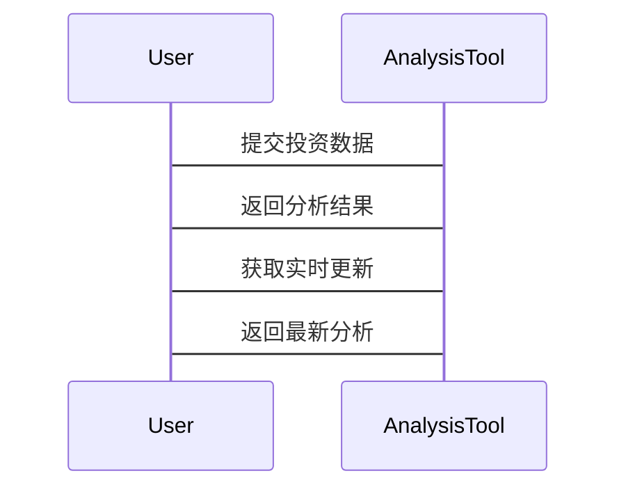

                 


# 《设计智能化的个人投资者行为分析工具》

---

## 关键词
- 个人投资者行为分析
- 智能化工具
- 机器学习
- 数据分析
- 系统架构

---

## 摘要
本文详细探讨了设计智能化个人投资者行为分析工具的核心方法与技术实现。通过结合机器学习、大数据分析和系统架构设计，提出了一种高效的行为分析解决方案，旨在帮助投资者做出更明智的投资决策。文章从背景分析、核心概念、算法原理、系统架构到实际案例，层层展开，为读者提供了全面的技术指导。

---

## 目录大纲

### 第一章：背景介绍与核心概念

#### 1.1 个人投资者行为分析的背景
- 1.1.1 传统投资分析的局限性
- 1.1.2 现代市场环境对投资者行为分析的需求
- 1.1.3 智能化工具在投资决策中的作用

#### 1.2 问题描述与目标
- 1.2.1 投资者行为分析的核心目标
- 1.2.2 行为分析中的关键问题
- 1.2.3 智能化工具如何解决这些问题

#### 1.3 核心概念与边界
- 1.3.1 行为分析工具的定义与特征
- 1.3.2 工具的边界与适用范围
- 1.3.3 核心要素与组成结构

### 第二章：核心概念与联系

#### 2.1 核心概念原理
- 2.1.1 行为分析工具的基本原理
- 2.1.2 智能化分析的核心算法
- 2.1.3 工具与投资者行为的关系

#### 2.2 核心概念属性对比
- 行为分析工具与传统分析工具的对比表格
| 特性 | 传统工具 | 智能化工具 |
|------|----------|-----------|
| 数据来源 | 历史数据 | 实时数据+行为数据 |
| 分析方法 | 统计分析 | 机器学习+自然语言处理 |
| 输出形式 | 数值报告 | 智能建议+可视化 |

#### 2.3 ER实体关系图
```mermaid
erDiagram
    investor {
        id : int
        name : string
        investmentHistory : string
        behavioralData : string
    }
    market {
        id : int
        stock : string
        price : float
        time : datetime
    }
    analysisTool {
        id : int
        algorithm : string
        result : string
    }
    investor --> market : 投资
    investor --> analysisTool : 使用工具
    market --> analysisTool : 分析
```

### 第三章：算法原理与数学模型

#### 3.1 算法原理
- 3.1.1 决策树算法在投资者行为分析中的应用
- 3.1.2 神经网络算法的核心原理
- 3.1.3 聚类分析与异常检测

#### 3.2 数学模型与公式
- 3.2.1 线性回归模型：$y = \beta_0 + \beta_1x + \epsilon$
- 3.2.2 逻辑回归模型：$P(Y=1|X) = \frac{e^{\beta_0 + \beta_1x}}{1 + e^{\beta_0 + \beta_1x}}$
- 3.2.3 随机森林模型：集成学习的实现

#### 3.3 机器学习算法实现
- 使用Python的scikit-learn库实现决策树和随机森林模型
- 代码示例：
```python
from sklearn.tree import DecisionTreeClassifier
from sklearn.ensemble import RandomForestClassifier
# 数据预处理
# 训练模型
model = DecisionTreeClassifier().fit(X_train, y_train)
# 预测与评估
y_pred = model.predict(X_test)
print(classification_report(y_test, y_pred))
```

### 第四章：系统分析与架构设计

#### 4.1 问题场景与系统功能设计
- 投资者行为数据的采集与处理
- 风险评估与投资建议生成
- 实时监控与反馈机制

#### 4.2 系统架构设计


#### 4.3 接口与交互设计
- RESTful API接口设计
- 用户与系统的交互流程


### 第五章：项目实战与案例分析

#### 5.1 环境安装与数据准备
- 安装必要的Python库（numpy、pandas、scikit-learn、matplotlib）
- 数据集获取与预处理示例

#### 5.2 核心功能实现
- 使用决策树算法实现投资行为分类
- 代码实现：
```python
import pandas as pd
from sklearn.tree import DecisionTreeClassifier
# 数据加载
data = pd.read_csv('investor_behavior.csv')
# 特征与目标分离
X = data.drop('label', axis=1)
y = data['label']
# 模型训练
model = DecisionTreeClassifier().fit(X, y)
# 预测与评估
print(model.score(X_test, y_test))
```

#### 5.3 案例分析与结果解读
- 某投资者的行为分析案例
- 结果解读与投资建议

### 第六章：最佳实践与小结

#### 6.1 小结
- 本文总结了智能化个人投资者行为分析工具的设计与实现过程
- 强调了算法选择与系统架构设计的重要性

#### 6.2 注意事项
- 数据隐私与安全保护
- 模型的可解释性与鲁棒性
- 用户界面的友好性

#### 6.3 拓展阅读
- 推荐相关书籍与论文
- 提供进一步学习的资源

---

## 作者：AI天才研究院/AI Genius Institute & 禅与计算机程序设计艺术 /Zen And The Art of Computer Programming

