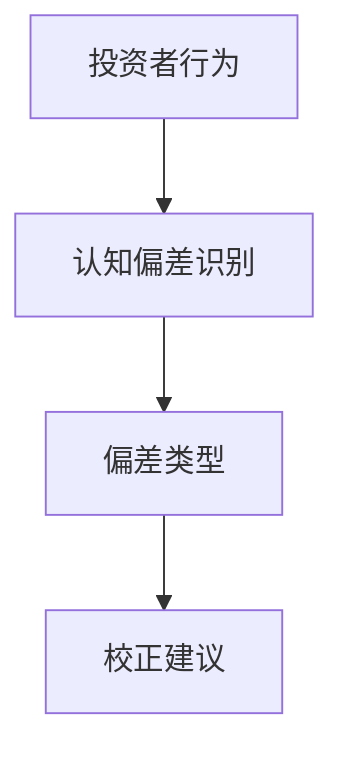
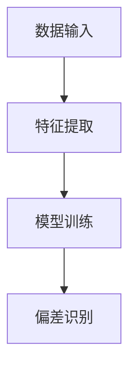
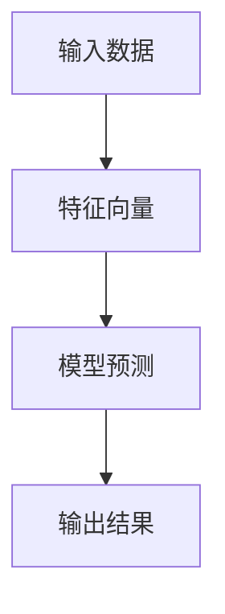
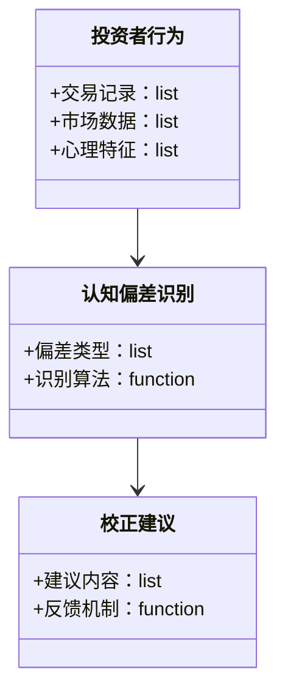
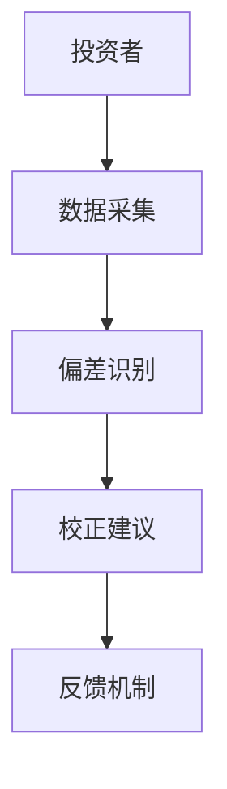
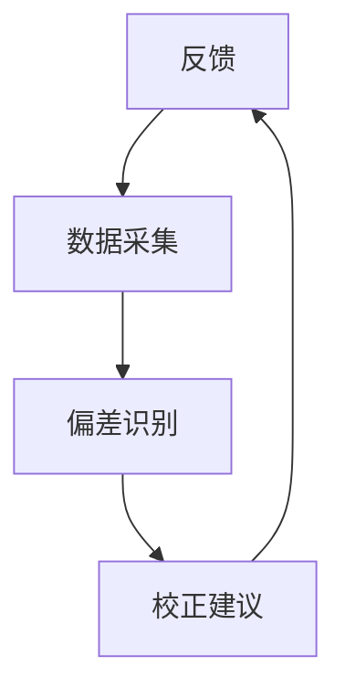

                 


```markdown
# 设计智能化的个人投资者认知偏差校正工具

> 关键词：认知偏差、个人投资者、人工智能、行为分析、算法校正、金融科技

> 摘要：本文旨在探讨如何利用人工智能技术设计智能化的个人投资者认知偏差校正工具。通过分析认知偏差的类型及其对投资决策的影响，结合机器学习算法和系统架构设计，提出了一套完整的解决方案。本文详细介绍了算法原理、系统架构、项目实战等内容，为投资者提供了一种有效校正认知偏差的工具。

---

## 第1章 认知偏差与个人投资者的挑战

### 1.1 认知偏差的基本概念

#### 1.1.1 认知偏差的定义
认知偏差是指人在信息处理和决策过程中产生的系统性错误，这些错误通常源于心理和情感因素，而非随机的偶然事件。

#### 1.1.2 常见的认知偏差类型
- **确认偏差**：倾向于寻找支持已有假设的信息，忽略或曲解相反的证据。
- **损失厌恶**：对损失的恐惧程度远超过对收益的追求。
- **过度自信偏差**：高估自己对事件的了解程度和预测能力。

#### 1.1.3 认知偏差对个人投资者的影响
认知偏差会导致错误的决策，例如在市场下跌时卖出股票，或者在高位买入股票，从而影响投资回报。

### 1.2 个人投资者中的常见偏差

#### 1.2.1 确认偏差
投资者倾向于寻找与自己观点一致的信息，导致决策失误。

#### 1.2.2 损失厌恶
对损失的厌恶导致投资者在亏损时做出错误的卖出决策。

#### 1.2.3 过度自信偏差
投资者高估自己的能力，导致过度交易和错误决策。

### 1.3 AI在认知偏差校正中的作用

#### 1.3.1 AI技术如何识别偏差
通过分析投资者的行为模式和交易数据，AI可以识别出常见的认知偏差。

#### 1.3.2 AI如何帮助校正偏差
通过提供反向思维和理性建议，AI帮助投资者克服认知偏差。

#### 1.3.3 AI校正工具的优势
- 提供实时反馈
- 个性化校正建议
- 高效的数据处理能力

### 1.4 相关工具与技术现状

#### 1.4.1 现有认知偏差校正工具分析
目前市场上的工具多基于规则引擎，缺乏智能化和个性化。

#### 1.4.2 AI技术在金融领域的应用
AI技术广泛应用于风险评估、投资组合优化等领域，但在认知偏差校正方面的应用较少。

#### 1.4.3 当前工具的局限性
- 缺乏深度学习能力
- 个性化校正不足
- 实时反馈能力有限

---

## 第2章 核心概念与联系

### 2.1 核心概念与联系

#### 2.1.1 认知偏差校正工具的定义
一种利用AI技术帮助投资者识别和校正认知偏差的工具。

#### 2.1.2 核心概念的属性特征对比表格
| 概念       | 定义                                                                 | 特性         |
|------------|----------------------------------------------------------------------|--------------|
| 认知偏差    | 人在信息处理和决策中产生的系统性错误                                     | 心理因素驱动 |
| AI校正工具  | 利用AI技术帮助识别和校正认知偏差的工具                                   | 智能化、实时性 |

#### 2.1.3 ER实体关系图架构的Mermaid流程图


### 2.2 算法原理讲解

#### 2.2.1 认知偏差识别的算法流程


#### 2.2.2 基于机器学习的校正算法
使用监督学习算法，如随机森林和梯度提升树，进行偏差识别和校正。

#### 2.2.3 算法的数学模型与公式


### 2.3 数学模型与公式

#### 2.3.1 认知偏差识别的数学模型
使用逻辑回归模型进行分类：
$$ P(y=1|x) = \frac{e^{w \cdot x + b}}{1 + e^{w \cdot x + b}} $$

#### 2.3.2 偏差校正的数学公式
使用贝叶斯定理进行校正：
$$ P(A|B) = \frac{P(B|A)P(A)}{P(B)} $$

---

## 第3章 系统分析与架构设计方案

### 3.1 问题场景介绍

#### 3.1.1 个人投资者的行为分析
投资者在决策过程中容易受到认知偏差的影响，导致投资失误。

#### 3.1.2 工具的应用场景
在股票交易、基金投资等场景中，工具可以实时提供校正建议。

#### 3.1.3 系统的目标与范围
目标：帮助投资者识别和校正认知偏差，提升投资决策的理性化。

范围：涵盖交易决策、投资组合管理等金融领域。

### 3.2 系统功能设计

#### 3.2.1 领域模型Mermaid类图


#### 3.2.2 系统架构设计Mermaid架构图


#### 3.2.3 系统接口设计
- 数据采集接口：获取投资者的交易记录和市场数据。
- 偏差识别接口：返回投资者的认知偏差类型。
- 校正建议接口：提供个性化的校正建议。

#### 3.2.4 系统交互Mermaid序列图


### 3.3 系统实现细节

#### 3.3.1 数据采集模块
负责采集投资者的交易记录、市场数据和心理特征。

#### 3.3.2 偏差识别模块
基于机器学习算法，识别投资者的认知偏差类型。

#### 3.3.3 校正建议模块
根据识别出的偏差类型，生成个性化的校正建议。

#### 3.3.4 系统优化建议
- 数据预处理：清洗和标准化数据。
- 模型优化：使用深度学习模型提升准确性。
- 系统优化：采用分布式架构提升性能。

---

## 第4章 项目实战

### 4.1 环境安装

#### 4.1.1 安装Python
```bash
python --version
pip install --upgrade pip
```

#### 4.1.2 安装机器学习库
```bash
pip install scikit-learn
pip install xgboost
```

#### 4.1.3 安装可视化工具
```bash
pip install matplotlib
pip install seaborn
```

### 4.2 系统核心实现

#### 4.2.1 数据预处理代码
```python
import pandas as pd
import numpy as np

# 加载数据
data = pd.read_csv('investor_data.csv')

# 数据清洗
data.dropna(inplace=True)
data = pd.get_dummies(data)
```

#### 4.2.2 偏差识别算法代码
```python
from sklearn.ensemble import RandomForestClassifier
from xgboost import XGBClassifier

# 训练模型
model = XGBClassifier()
model.fit(X_train, y_train)
```

#### 4.2.3 校正建议生成代码
```python
import numpy as np

def generate_correction_suggestions(model, X_test):
    predictions = model.predict(X_test)
    suggestions = []
    for i in range(len(X_test)):
        if predictions[i] == 0:
            suggestions.append("建议增加对该股票的关注")
        elif predictions[i] == 1:
            suggestions.append("建议减少对该股票的投资")
    return suggestions

correction_suggestions = generate_correction_suggestions(model, X_test)
```

### 4.3 代码解读与分析

#### 4.3.1 数据预处理流程
- 加载数据
- 清洗数据
- 转换为虚拟变量

#### 4.3.2 算法实现细节
- 使用XGBoost模型进行分类
- 交叉验证优化模型参数
- 模型评估与调优

#### 4.3.3 校正建议生成逻辑
- 根据模型预测结果生成建议
- 建议包括增加关注和减少投资两类

### 4.4 实际案例分析

#### 4.4.1 案例背景
一位投资者在市场下跌时，因损失厌恶而卖出股票，导致亏损。

#### 4.4.2 数据分析
交易记录显示该投资者在市场下跌时频繁交易，符合损失厌恶的特征。

#### 4.4.3 工具应用效果
工具识别出投资者的损失厌恶偏差，提供卖出策略的校正建议，帮助投资者减少亏损。

---

## 第5章 总结与展望

### 5.1 最佳实践Tips

#### 5.1.1 数据质量的重要性
确保数据的准确性和完整性，以提高模型的准确性。

#### 5.1.2 模型选择的建议
根据具体问题选择合适的算法，避免盲目使用复杂模型。

#### 5.1.3 系统维护的注意事项
定期更新模型，确保工具的有效性。

### 5.2 本章小结
本文设计了一种智能化的个人投资者认知偏差校正工具，结合AI技术，帮助投资者克服认知偏差，提升投资决策的理性化。

### 5.3 未来展望
随着AI技术的发展，认知偏差校正工具将更加智能化和个性化，帮助更多投资者实现稳健的投资回报。

---

## 附录

### 附录A 相关术语解释
- **认知偏差**：人在信息处理和决策中产生的系统性错误。
- **机器学习**：一种人工智能技术，通过数据训练模型进行预测和分类。

### 附录B 工具安装与使用指南
详细说明工具的安装步骤和使用方法。

### 附录C 参考文献与拓展阅读
列出本文参考的文献和相关资料，供读者进一步阅读。

---

## 作者：AI天才研究院/AI Genius Institute & 禅与计算机程序设计艺术 /Zen And The Art of Computer Programming
```

