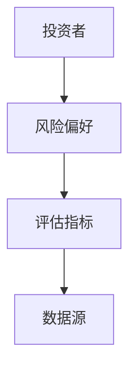
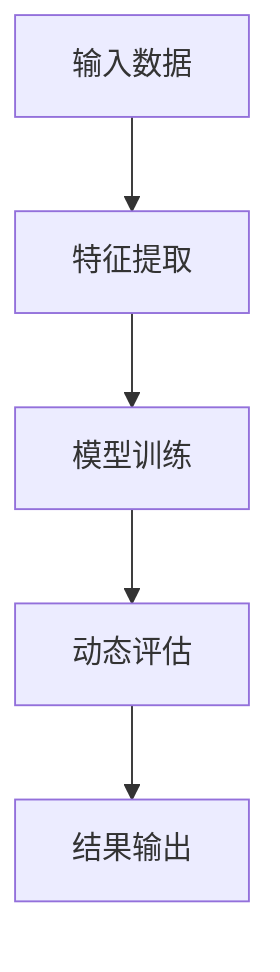
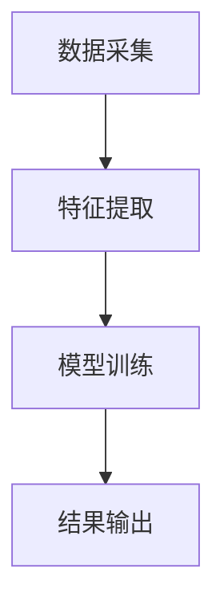
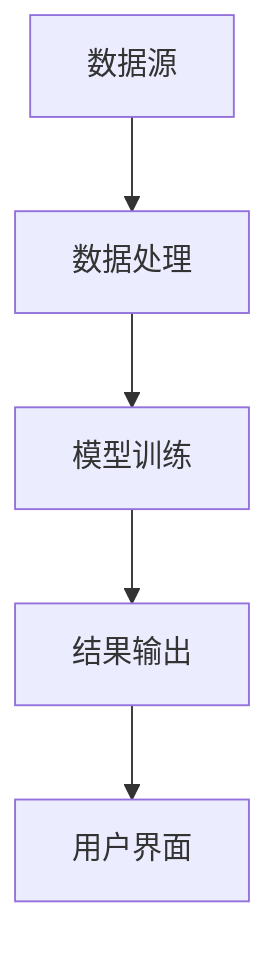
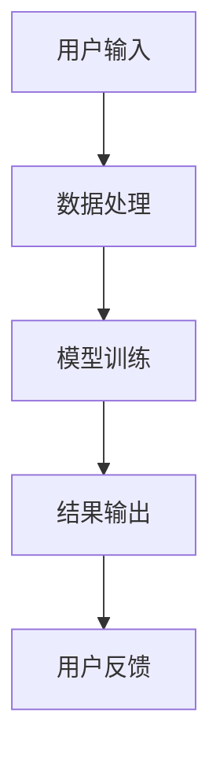

                 


# 设计智能化的个人投资者风险偏好动态评估工具

> 关键词：风险偏好评估，动态评估，机器学习，自然语言处理，投资决策

> 摘要：本文详细探讨了设计智能化的个人投资者风险偏好动态评估工具的背景、核心概念、算法原理、系统架构、项目实现和总结。文章通过逐步分析，结合实际案例，展示了如何利用机器学习和自然语言处理技术，构建一个能够实时动态调整投资者风险偏好的评估系统，为投资决策提供科学依据。

---

# 第一部分: 背景与意义

# 第1章: 个人投资者风险偏好动态评估工具的背景与意义

## 1.1 问题背景

### 1.1.1 个人投资者的风险偏好评估需求

在金融市场中，投资者的风险偏好是投资决策的核心因素之一。个人投资者的风险偏好因市场环境、个人财务状况和心理因素的变化而动态调整。传统风险偏好评估工具通常基于静态问卷或历史数据，难以捕捉实时变化的市场环境和投资者心理状态。

### 1.1.2 动态评估的必要性

金融市场波动剧烈，投资者的风险承受能力需要实时动态评估。例如，股市暴跌时，投资者可能变得更加保守，而经济复苏时可能变得更加激进。动态评估工具能够帮助投资者和理财顾问及时调整投资策略，规避潜在风险。

### 1.1.3 现有工具的局限性

现有工具通常基于静态数据，无法实时捕捉投资者心理变化。此外，传统评估工具往往依赖主观问卷，存在人为误差，难以量化投资者的真实风险偏好。

## 1.2 问题描述

### 1.2.1 风险偏好评估的核心问题

投资者风险偏好是其对风险的态度和行为的综合反映。评估工具需要准确捕捉投资者对风险的敏感性和承受能力，以便提供个性化的投资建议。

### 1.2.2 动态变化的驱动因素

市场波动、个人财务状况、情绪变化和外部环境等因素都会影响投资者的风险偏好。动态评估工具需要实时监测这些因素的变化。

### 1.2.3 评估工具的边界与外延

评估工具需要在有限的时间和数据范围内，提供准确的风险偏好评估结果。同时，工具的外延应涵盖多种投资场景，如股票、基金和期货等。

## 1.3 问题解决思路

### 1.3.1 综合评估模型的构建

结合机器学习和自然语言处理技术，构建一个能够动态调整的评估模型。

### 1.3.2 动态调整机制的设计

基于实时市场数据和投资者行为数据，设计动态调整机制。

### 1.3.3 评估工具的实现路径

从数据采集、特征提取、模型训练到结果输出，构建完整的评估工具实现路径。

## 1.4 核心概念与结构

### 1.4.1 风险偏好评估模型的组成

模型由数据源、特征提取、算法选择和结果输出四个部分组成。

### 1.4.2 动态评估的核心要素

实时数据采集、动态调整算法和可视化界面是动态评估的核心要素。

### 1.4.3 模型的输入与输出关系

输入包括市场数据和投资者行为数据，输出是投资者的风险偏好评估结果。

## 1.5 本章小结

本章详细介绍了设计智能化的个人投资者风险偏好动态评估工具的背景和意义，明确了问题的核心和解决思路。

---

# 第二部分: 核心概念与联系

# 第2章: 风险偏好评估模型的核心概念

## 2.1 风险偏好评估模型的原理

### 2.1.1 风险偏好的定义与分类

风险偏好是指投资者对风险的态度和行为，通常分为保守型、稳健型和激进型三类。

### 2.1.2 动态评估的核心算法

动态评估的核心算法包括聚类算法和分类算法。

### 2.1.3 模型的适用场景

模型适用于股票、基金和期货等多种投资场景。

## 2.2 核心概念的属性特征对比

### 2.2.1 不同风险偏好的特征对比

| 风险偏好类型 | 投资风格 | 风险承受能力 | 适合的投资产品 |
|--------------|----------|---------------|----------------|
| 保守型       | 低风险   | 低             | 固定收益产品   |
| 稳健型       | 中风险   | 中             | 混合型基金      |
| 激进型       | 高风险   | 高             | 股票             |

### 2.2.2 动态评估的指标体系

指标体系包括市场波动率、投资者情绪指数和财务状况变化。

### 2.2.3 模型的性能指标

性能指标包括准确率、召回率和F1值。

## 2.3 实体关系图（ER图）



## 2.4 工作流程图



## 2.5 本章小结

本章详细探讨了风险偏好评估模型的核心概念和动态评估的实现原理。

---

# 第三部分: 算法原理讲解

# 第3章: 基于机器学习的动态评估算法

## 3.1 算法原理

### 3.1.1 聚类算法在风险偏好评估中的应用

聚类算法用于将投资者分为不同的风险偏好类别。

### 3.1.2 分类算法的实现原理

分类算法用于预测投资者的风险偏好类型。

### 3.1.3 回归算法的优化策略

回归算法用于量化投资者的风险偏好程度。

## 3.2 算法实现

### 3.2.1 K-means聚类算法的代码实现

```python
from sklearn.cluster import KMeans

# 初始化模型
kmeans = KMeans(n_clusters=3, random_state=42)

# 训练模型
kmeans.fit(X)

# 预测类别
y_pred = kmeans.predict(X)
```

### 3.2.2 分类算法的数学模型

分类算法的数学模型如下：

$$
f(x) = \sum_{i=1}^{n} w_i x_i + b
$$

其中，$w_i$ 是权重，$x_i$ 是输入特征，$b$ 是偏置项。

### 3.2.3 回归算法的优化策略

回归算法的优化策略包括正则化和参数调整。

## 3.3 本章小结

本章详细讲解了机器学习算法在风险偏好动态评估中的应用。

---

# 第四部分: 系统分析与架构设计

# 第4章: 风险偏好动态评估系统架构

## 4.1 项目介绍

### 4.1.1 项目背景

本项目旨在设计一个智能化的个人投资者风险偏好动态评估工具。

### 4.1.2 项目目标

项目目标是实现一个能够实时动态评估投资者风险偏好的系统。

## 4.2 功能设计

### 4.2.1 系统功能模块

系统功能模块包括数据采集模块、特征提取模块、模型训练模块和结果输出模块。

### 4.2.2 功能模块的交互关系

功能模块之间的交互关系如下：



## 4.3 系统架构设计

### 4.3.1 系统架构图

系统架构图如下：



### 4.3.2 系统接口设计

系统接口设计包括数据接口和用户接口。

### 4.3.3 系统交互流程

系统交互流程如下：



## 4.4 本章小结

本章详细设计了风险偏好动态评估系统的架构和功能模块。

---

# 第五部分: 项目实战

# 第5章: 项目实战与案例分析

## 5.1 环境安装

### 5.1.1 安装Python

安装Python 3.8及以上版本。

### 5.1.2 安装依赖库

安装scikit-learn、pandas和numpy。

## 5.2 核心实现

### 5.2.1 数据采集模块

数据采集模块代码如下：

```python
import pandas as pd
import requests

def get_data():
    url = "https://api.example.com/data"
    response = requests.get(url)
    data = response.json()
    return pd.DataFrame(data)
```

### 5.2.2 特征提取模块

特征提取模块代码如下：

```python
from sklearn.feature_extraction.text import TfidfVectorizer

vectorizer = TfidfVectorizer()
features = vectorizer.fit_transform(text_data)
```

### 5.2.3 模型训练模块

模型训练模块代码如下：

```python
from sklearn.model_selection import train_test_split
from sklearn.linear_model import LogisticRegression

X_train, X_test, y_train, y_test = train_test_split(features, labels, test_size=0.2)
model = LogisticRegression()
model.fit(X_train, y_train)
```

## 5.3 案例分析

### 5.3.1 案例背景

假设我们有一个投资者的数据集，包括其投资行为和市场数据。

### 5.3.2 数据分析

分析投资者在不同市场环境下的风险偏好变化。

### 5.3.3 结果展示

展示模型预测的风险偏好类型和评估结果。

## 5.4 本章小结

本章通过实际案例展示了如何实现风险偏好动态评估工具。

---

# 第六部分: 总结与展望

# 第6章: 总结与展望

## 6.1 项目总结

### 6.1.1 项目成果

成功设计并实现了智能化的个人投资者风险偏好动态评估工具。

### 6.1.2 经验总结

在项目实施过程中，需要注意数据质量和模型优化。

## 6.2 未来展望

### 6.2.1 技术改进方向

探索更先进的机器学习算法，如深度学习和强化学习。

### 6.2.2 应用场景扩展

将工具应用于更多金融产品和服务。

### 6.2.3 未来发展趋势

随着人工智能技术的发展，风险偏好评估工具将更加智能化和个性化。

## 6.3 小结

本文详细探讨了设计智能化的个人投资者风险偏好动态评估工具的背景、核心概念、算法原理、系统架构、项目实现和总结。

---

作者：AI天才研究院/AI Genius Institute & 禅与计算机程序设计艺术 /Zen And The Art of Computer Programming

