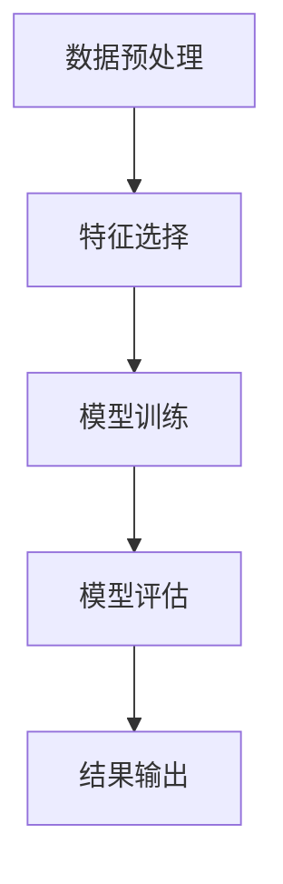
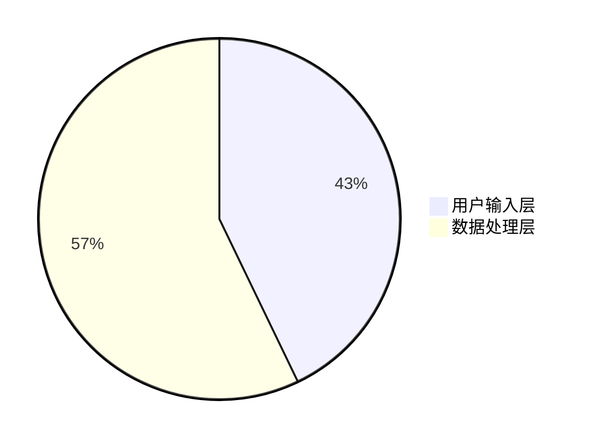
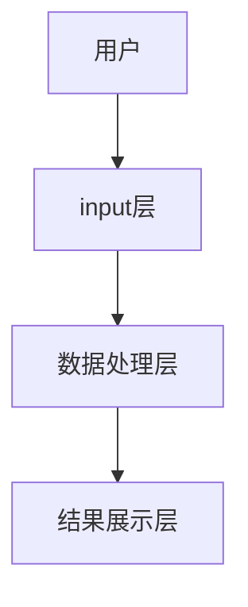
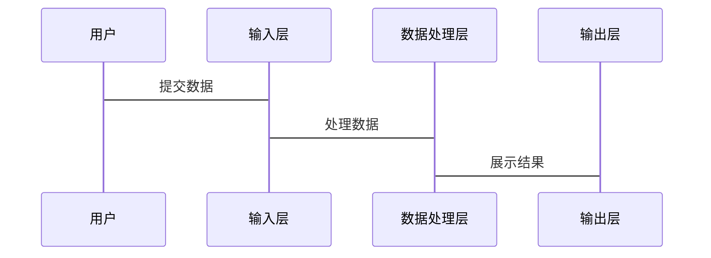

                 


# 设计智能化的个人投资风险承受能力评估工具

## 关键词：投资风险评估，智能化工具，机器学习，系统架构，金融科技

## 摘要：  
本文旨在设计一个智能化的个人投资风险承受能力评估工具，通过结合机器学习算法和系统架构设计，提供个性化的投资建议。工具的核心在于构建投资者画像和风险评估模型，利用数据预处理和特征选择等技术，实现精准的风险评估。本文将从背景介绍、核心概念、算法原理、系统架构到项目实战，全面解析工具的设计与实现过程。

---

# 第一部分: 投资风险承受能力评估工具的背景与核心概念

# 第1章: 个人投资风险承受能力评估的背景与意义

## 1.1 投资风险评估的重要性

### 1.1.1 投资风险的定义与分类

- **定义**：投资风险是指在投资过程中，由于市场波动、经济环境变化等因素导致投资损失的可能性。
- **分类**：
  - **系统性风险**：影响整个市场的风险，如经济衰退、政策变化等。
  - **非系统性风险**：影响特定资产或行业的风险，如公司基本面变化等。

### 1.1.2 风险承受能力的概念

- **风险承受能力**：投资者在面对投资损失时的心理和财务承受能力。
- **心理承受能力**：投资者对风险的态度和情绪反应。
- **财务承受能力**：投资者在财务上的抗压能力，包括流动性、收入水平等。

### 1.1.3 个人投资决策中的风险因素

- **财务状况**：收入、资产、负债等。
- **投资目标**：短期、中期或长期目标。
- **风险偏好**：保守型、稳健型或激进型。

## 1.2 智能化评估工具的必要性

### 1.2.1 传统评估方法的局限性

- **传统方法**：基于简单的问卷和静态模型，难以捕捉动态市场变化。
- **局限性**：无法个性化分析，难以量化风险。

### 1.2.2 智能化工具的优势

- **优势**：利用机器学习和大数据分析，实现精准评估和动态调整。
- **数据驱动**：通过收集和分析大量数据，提高评估的准确性和实时性。

### 1.2.3 金融科技的发展与智能化评估工具的结合

- **金融科技（FinTech）**：通过技术创新提升金融服务效率。
- **结合点**：利用人工智能、大数据等技术，推动投资风险评估工具的智能化。

## 1.3 本书的目标与结构

### 1.3.1 本书的核心目标

- **目标**：设计一个智能化的个人投资风险承受能力评估工具，帮助投资者做出科学的投资决策。

### 1.3.2 目录结构概览

- **第1章**：背景与核心概念。
- **第2章**：核心概念与投资者画像。
- **第3章**：算法原理与实现。
- **第4章**：系统架构与功能设计。
- **第5章**：项目实战与案例分析。
- **第6章**：总结与展望。

### 1.3.3 读者对象与预期收获

- **读者对象**：投资者、金融科技从业者、数据科学家等。
- **预期收获**：掌握投资风险评估的核心方法和技术，能够设计和实现类似工具。

---

# 第2章: 智能化个人投资风险承受能力评估工具的核心概念

## 2.1 风险承受能力的评估维度

### 2.1.1 财务状况分析

- **收入**：月收入、年收入。
- **资产**：可投资资产、固定资产。
- **负债**：短期负债、长期负债。

### 2.1.2 投资目标与风险偏好

- **投资目标**：短期收益、长期财富积累。
- **风险偏好**：保守、稳健、激进。

### 2.1.3 心理承受能力评估

- **情绪稳定性**：面对市场波动的反应。
- **风险厌恶程度**：对风险的接受程度。

## 2.2 投资者画像的构建

### 2.2.1 投资者画像的定义

- **投资者画像**：基于数据分析构建的投资者特征模型，用于个性化评估。

### 2.2.2 投资者画像的属性特征对比表

| 属性 | 特征描述 | 示例 |
|------|---------|------|
| 年龄 | 年龄范围 | 25-35岁 |
| 收入 | 收入水平 | 年收入50万元 |
| 风险偏好 | 风险态度 | 保守型 |
| 投资经验 | 投资经验 | 初级 |

### 2.2.3 投资者画像的ER实体关系图

```mermaid
erDiagram
    投资者 : [投资者ID, 姓名, 年龄, 收入]
    资产 : [资产ID, 资产类型, 资产价值]
    投资记录 : [投资记录ID, 投资金额, 投资日期]
    风险偏好 : [风险偏好ID, 风险类型]
    投资者-资产
    投资者-投资记录
    投资者-风险偏好
```

## 2.3 风险承受能力评估模型

### 2.3.1 模型的输入与输出

- **输入**：投资者的财务状况、投资目标、风险偏好。
- **输出**：风险承受能力评分、投资建议。

### 2.3.2 模型的构建逻辑

- **数据预处理**：清洗、归一化。
- **特征选择**：重要特征的筛选。
- **模型训练**：使用机器学习算法训练模型。

### 2.3.3 模型的评估标准

- **准确率**：模型预测的准确程度。
- **召回率**：模型识别的正例比例。

## 2.4 本章小结

---

# 第3章: 基于机器学习的风险承受能力评估算法原理

## 3.1 机器学习在风险评估中的应用

### 3.1.1 监督学习与非监督学习的对比

- **监督学习**：基于标签数据进行学习。
- **非监督学习**：基于无标签数据进行学习。

### 3.1.2 常见的机器学习算法介绍

- **线性回归**：用于回归问题。
- **逻辑回归**：用于分类问题。
- **随机森林**：用于分类和回归。

## 3.2 风险承受能力评估的算法选择

### 3.2.1 线性回归模型公式

$$ y = \beta_0 + \beta_1x + \epsilon $$

### 3.2.2 逻辑回归模型公式

$$ P(Y=1|X) = \frac{e^{\beta_0 + \beta_1x}}{1 + e^{\beta_0 + \beta_1x}} $$

### 3.2.3 算法实现的流程图



## 3.3 算法实现的数学模型

### 3.3.1 线性回归模型

- **损失函数**：均方误差。
- **优化方法**：梯度下降。

### 3.3.2 逻辑回归模型

- **损失函数**：交叉熵损失。
- **优化方法**：Adam优化器。

## 3.4 本章小结

---

# 第4章: 系统架构与功能设计

## 4.1 系统功能模块划分

### 4.1.1 用户信息输入模块

- **功能**：用户输入财务状况、投资目标等信息。

### 4.1.2 风险评估计算模块

- **功能**：基于输入数据，计算风险承受能力评分。

### 4.1.3 结果展示与建议模块

- **功能**：展示评估结果，并给出投资建议。

## 4.2 系统架构设计

### 4.2.1 系统功能设计



### 4.2.2 系统架构图



## 4.3 系统接口设计

### 4.3.1 输入接口

- **API**：RESTful API。
- **数据格式**：JSON。

### 4.3.2 输出接口

- **API**：RESTful API。
- **数据格式**：JSON。

## 4.4 系统交互流程图



## 4.5 本章小结

---

# 第5章: 项目实战与案例分析

## 5.1 项目环境安装

### 5.1.1 安装Python

- **命令**：`python --version`

### 5.1.2 安装依赖库

- **命令**：`pip install numpy pandas scikit-learn`

## 5.2 系统核心实现

### 5.2.1 数据预处理代码

```python
import pandas as pd

data = pd.read_csv('input.csv')
data.dropna(inplace=True)
data = data[['age', 'income', 'risk_preference']]
```

### 5.2.2 模型训练代码

```python
from sklearn.model_selection import train_test_split
from sklearn.linear_model import LinearRegression

X = data[['age', 'income']]
y = data['risk_preference']
X_train, X_test, y_train, y_test = train_test_split(X, y, test_size=0.2)
model = LinearRegression()
model.fit(X_train, y_train)
```

## 5.3 案例分析

### 5.3.1 案例背景

- **投资者A**：30岁，年收入50万元，风险偏好稳健。

### 5.3.2 模型预测

- **预测结果**：风险承受能力评分75分，建议配置60%股票、30%债券、10%现金。

## 5.4 本章小结

---

# 第6章: 总结与展望

## 6.1 本章总结

- **总结**：本文设计了一个智能化的个人投资风险承受能力评估工具，结合机器学习算法和系统架构设计，实现了精准的风险评估。

## 6.2 未来展望

- **展望**：未来可以结合更多的数据源，如市场数据、新闻数据，进一步提升评估的准确性。

---

# 作者：AI天才研究院/AI Genius Institute & 禅与计算机程序设计艺术 /Zen And The Art of Computer Programming

