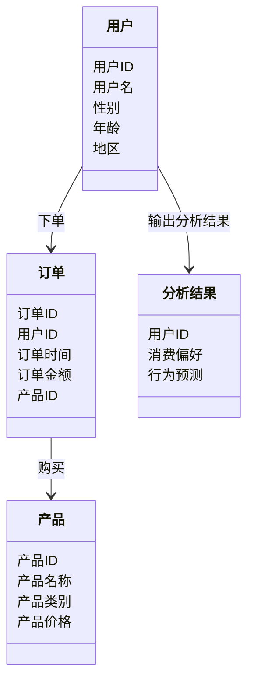

                 


# 设计智能化的个人消费行为分析系统

## 关键词：
智能化消费分析系统, 个人消费行为, 数据挖掘, 机器学习, 系统架构设计

## 摘要：
本文详细探讨了设计智能化个人消费行为分析系统的各个方面。从背景介绍到系统架构设计，结合实际案例分析，深入讲解了如何利用数据挖掘和机器学习技术实现智能化的消费行为分析。文章内容涵盖系统核心概念、算法原理、系统架构、项目实战以及最佳实践，为读者提供全面的技术指导。

---

# 第1章: 背景与问题背景

## 1.1 个人消费行为分析的背景

### 1.1.1 消费行为分析的定义与重要性
消费行为分析是指通过对消费者在购物、支付、浏览等行为数据的收集和分析，揭示消费者的购买偏好、消费习惯和行为模式。随着大数据技术的快速发展，消费行为分析在商业决策、个性化推荐和用户画像构建等领域发挥着越来越重要的作用。

智能化的个人消费行为分析系统能够帮助企业更好地理解用户需求，优化产品推荐策略，提升用户体验，同时为企业创造更大的商业价值。

### 1.1.2 智能化分析的必要性
传统的消费行为分析方法通常依赖于人工经验或简单的统计分析，存在效率低、精度差、难以实时响应等问题。随着人工智能和大数据技术的普及，智能化分析能够通过机器学习算法自动识别数据中的模式和关联，提供更精准的分析结果。

### 1.1.3 当前市场中的问题与挑战
当前市场中，消费行为分析面临以下问题：
1. 数据量大且复杂：消费者行为数据来源多样，包括点击流数据、订单数据、用户评价等，数据量大且维度复杂。
2. 分析效率低：传统分析方法难以应对实时数据分析的需求。
3. 精准度不足：简单的统计方法难以捕捉数据中的深层关联。
4. 系统可扩展性差：传统的分析系统难以应对数据量和用户规模的快速增长。

---

## 1.2 问题描述与目标设定

### 1.2.1 传统消费分析的局限性
传统消费分析方法通常依赖于简单的统计分析或规则引擎，难以应对以下问题：
- 数据维度单一，难以捕捉用户行为的多样性。
- 分析结果依赖人工经验，难以保证准确性。
- 系统缺乏实时性，难以满足在线分析的需求。

### 1.2.2 智能化分析的目标与核心问题
智能化个人消费行为分析系统的目标是通过机器学习算法和大数据技术，实现以下功能：
1. 实时分析用户行为数据，提供快速的分析结果。
2. 自动识别用户的消费偏好和行为模式，提供个性化推荐。
3. 预测用户的消费行为，帮助企业制定精准的营销策略。

核心问题包括：
- 如何高效地处理海量数据。
- 如何设计高效的算法模型以提高分析精度。
- 如何构建可扩展的系统架构以应对数据量的增长。

### 1.2.3 系统边界与外延
系统边界：本系统仅关注个人消费行为的分析，不涉及企业的内部管理或其他外部系统。
系统外延：系统可以与其他系统（如推荐系统、营销系统）进行集成，提供更全面的解决方案。

---

## 1.3 核心概念与组成要素

### 1.3.1 系统核心概念的定义
1. 用户行为数据：包括用户的点击流数据、订单数据、浏览数据等。
2. 特征提取：从原始数据中提取有用的特征，如用户的年龄、性别、地区等。
3. 模型训练：利用机器学习算法对特征数据进行建模，生成消费行为预测模型。
4. 实时分析：对用户的实时行为数据进行分析，提供即时反馈。

### 1.3.2 核心要素的特征对比
| 特征 | 用户行为数据 | 特征提取 | 模型训练 |
|------|--------------|----------|----------|
| 数据来源 | 用户操作日志、订单数据 | 数据预处理、特征选择 | 数据集划分、算法选择 |
| 数据量 | 海量数据 | 中等数据 | 中等数据 |
| 数据类型 | 结构化数据、非结构化数据 | 结构化数据 | 结构化数据 |
| 处理目标 | 数据采集与存储 | 提取有用特征 | 训练预测模型 |

### 1.3.3 系统架构的实体关系图

```mermaid
erDiagram
    用户 : 用户信息
    订单 : 订单信息
    产品 : 产品信息
    分析结果 : 分析结果
    用户 --> 订单 : 下单
    订单 --> 产品 : 购买
    用户 --> 分析结果 : 分析结果输出
```

---

# 第2章: 核心概念与联系

## 2.1 核心概念原理

### 2.1.1 数据采集与处理
数据采集是消费行为分析的第一步，主要包括以下步骤：
1. 数据源选择：确定数据采集的渠道，如网站、移动应用、第三方数据源等。
2. 数据清洗：对采集到的数据进行去重、填充缺失值、异常值处理等。
3. 数据转换：将原始数据转换为适合建模的格式，如数值型数据、分类数据等。

### 2.1.2 特征提取与建模
特征提取是数据预处理的关键步骤，常见的特征提取方法包括：
1. 基于统计的特征提取：如均值、方差、频次等。
2. 基于机器学习的特征提取：如主成分分析（PCA）、线性判别分析（LDA）等。
3. 基于深度学习的特征提取：如卷积神经网络（CNN）、循环神经网络（RNN）等。

建模阶段通常采用以下算法：
1. 聚类分析：如K-means、层次聚类等。
2. 分类分析：如决策树、随机森林、支持向量机（SVM）等。
3. 回归分析：如线性回归、逻辑回归等。

### 2.1.3 模型训练与优化
模型训练阶段需要对数据进行划分，通常分为训练集、验证集和测试集。模型训练完成后，需要通过验证集和测试集对模型的性能进行评估，并通过调参和优化算法提高模型的准确率和效率。

---

## 2.2 算法原理与实现

### 2.2.1 协同过滤算法
协同过滤是一种基于用户行为相似性推荐算法，常用于个性化推荐系统。其基本思想是找到与当前用户行为相似的其他用户，推荐这些用户喜欢的商品或服务。

#### 协同过滤算法的流程图

```mermaid
graph TD
    A[用户A] --> B[用户B] : 用户B与用户A相似
    B --> C[商品C] : 用户B喜欢商品C
    A --> C : 推荐商品C给用户A
```

#### 协同过滤算法的数学模型

$$ 相似度计算公式：\text{相似度}(u_i, u_j) = \frac{\sum_{k} (r_{i,k} - \bar{r_i})(r_{j,k} - \bar{r_j})}{\sqrt{\sum_{k} (r_{i,k} - \bar{r_i})^2} \cdot \sqrt{\sum_{k} (r_{j,k} - \bar{r_j})^2}} $$

其中：
- \( r_{i,k} \) 表示用户 \( u_i \) 对商品 \( k \) 的评分。
- \( \bar{r_i} \) 表示用户 \( u_i \) 的平均评分。

### 2.2.2 聚类分析算法
聚类分析是一种无监督学习算法，常用于将用户划分为不同的群体，以便更好地进行个性化推荐。

#### 聚类分析算法的流程图

```mermaid
graph TD
    A[数据预处理] --> B[特征提取] : 提取用户特征
    B --> C[选择聚类算法] : 选择K-means算法
    C --> D[模型训练] : 训练聚类模型
    D --> E[结果分析] : 分析聚类结果
```

#### 聚类分析算法的数学模型

$$ K-means算法的目标函数：\min_{Z} \sum_{i=1}^{k} \sum_{j=1}^{n_i} \|x_j - c_i\|^2 $$

其中：
- \( Z \) 表示样本的划分。
- \( k \) 表示聚类的数量。
- \( n_i \) 表示第 \( i \) 个聚类中的样本数。
- \( c_i \) 表示第 \( i \) 个聚类的中心。

---

## 2.3 系统分析与架构设计

### 2.3.1 系统功能设计
系统功能设计包括以下几个方面：
1. 数据采集与存储：负责采集用户行为数据，并存储到数据库中。
2. 数据处理与特征提取：对数据进行清洗、转换和特征提取。
3. 模型训练与优化：训练消费行为预测模型，并进行模型优化。
4. 实时分析与反馈：对用户的实时行为数据进行分析，并返回分析结果。

### 2.3.2 系统架构设计



---

## 2.4 项目实战

### 2.4.1 环境安装
1. 安装Python：建议使用Python 3.6及以上版本。
2. 安装必要的库：如numpy、pandas、scikit-learn、matplotlib等。

### 2.4.2 核心代码实现

```python
import pandas as pd
from sklearn.cluster import KMeans
from sklearn.metrics import silhouette_score

# 数据加载
data = pd.read_csv('user_behavior.csv')

# 数据预处理
X = data[['年龄', '性别', '地区', '消费金额']]

# 特征提取
from sklearn.preprocessing import StandardScaler
scaler = StandardScaler()
X_scaled = scaler.fit_transform(X)

# 模型训练
kmeans = KMeans(n_clusters=3, random_state=42)
kmeans.fit(X_scaled)

# 模型评估
print(silhouette_score(X_scaled, kmeans.labels_))
```

### 2.4.3 案例分析
假设我们有以下数据：

| 用户ID | 年龄 | 性别 | 地区 | 消费金额 |
|-------|-----|------|------|----------|
| 1     | 25  | 男   | 北京 | 1000     |
| 2     | 30  | 女   | 上海 | 1500     |
| 3     | 28  | 男   | 广州 | 800      |

通过聚类分析，我们可以将用户分为不同的群体，例如高消费用户、中消费用户和低消费用户。

---

## 2.5 最佳实践与总结

### 2.5.1 小结
智能化个人消费行为分析系统的设计需要结合数据挖掘和机器学习技术，通过高效的算法和系统的架构设计，实现对用户行为的精准分析和预测。

### 2.5.2 注意事项
1. 数据隐私保护：在处理用户数据时，需要注意数据隐私和合规性。
2. 系统性能优化：需要关注系统的响应时间和可扩展性。
3. 模型调优：需要不断优化模型的准确率和效率。

### 2.5.3 拓展阅读
1. 《机器学习实战》
2. 《数据挖掘导论》
3. 《Python机器学习》

---

# 作者：AI天才研究院/AI Genius Institute & 禅与计算机程序设计艺术 /Zen And The Art of Computer Programming

---

本文通过详细分析智能化个人消费行为分析系统的各个方面，结合实际案例和代码实现，为读者提供了一套完整的系统设计思路。希望本文能够帮助读者更好地理解如何利用数据挖掘和机器学习技术，设计出高效的消费行为分析系统。

