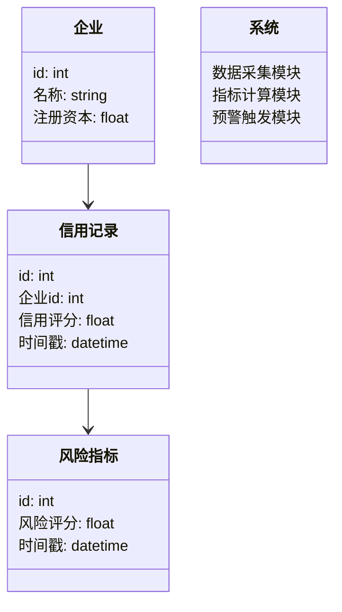
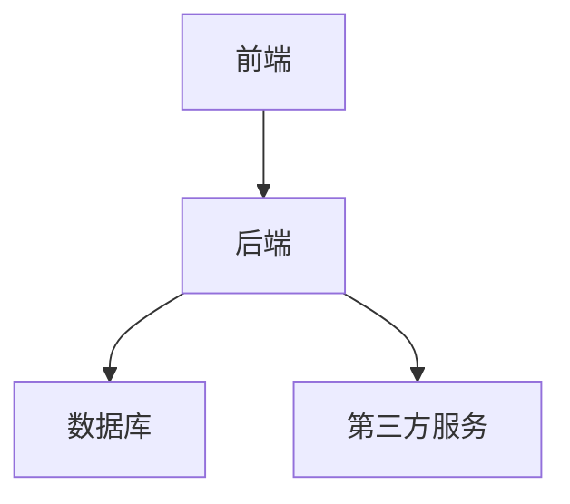
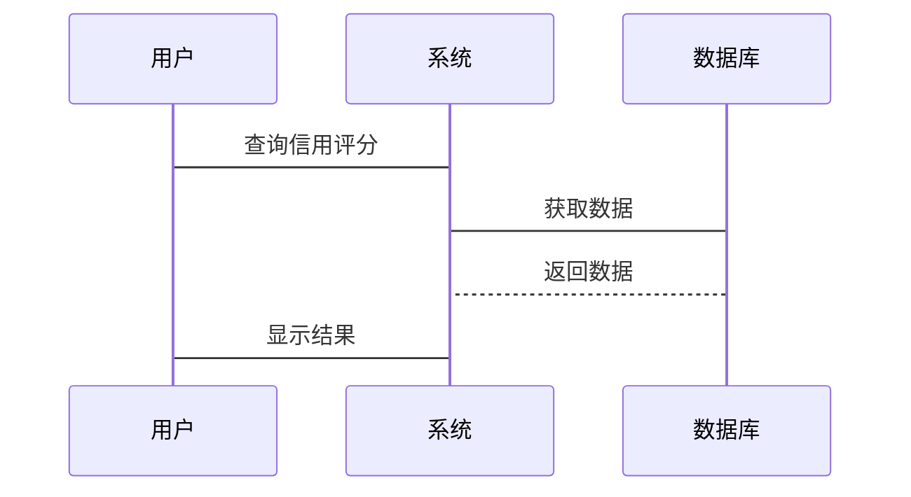

                 


# 设计智能化的企业信用评级模型性能监控与预警系统

> 关键词：企业信用评级，智能化，性能监控，预警系统，机器学习，系统架构

> 摘要：本文详细探讨了设计智能化企业信用评级模型性能监控与预警系统的关键步骤，涵盖从问题背景到系统架构的全过程。通过分析传统信用评级的不足，介绍智能化模型的优势，结合实际案例，阐述系统设计的各个方面，包括算法原理、系统架构、项目实现和最佳实践。

---

# 第一部分：企业信用评级模型的智能化设计

## 第1章：企业信用评级模型的背景与问题

### 1.1 信用评级的定义与作用

#### 1.1.1 信用评级的基本概念
信用评级是对企业的信用状况进行评估，旨在量化企业在未来履行债务的能力。传统的信用评级依赖人工审核，耗时且主观性较强。

#### 1.1.2 信用评级在企业中的重要性
信用评级是企业融资、贷款审批和投资决策的重要依据。高准确性的信用评级能够降低金融风险，优化资源配置。

#### 1.1.3 传统信用评级方法的局限性
传统方法依赖人工审核，存在耗时长、效率低、容易受主观因素影响的问题，且难以实时更新。

### 1.2 企业信用评级的智能化需求

#### 1.2.1 智能化信用评级的定义
智能化信用评级利用机器学习和大数据分析技术，自动评估企业的信用状况，提供实时监控和预警。

#### 1.2.2 智能化信用评级的优势
通过自动化和智能化手段，信用评级可以快速、准确地评估企业信用，同时支持实时监控和动态调整。

#### 1.2.3 企业信用评级智能化的必要性
随着企业数据的复杂化和金融市场的快速变化，传统的信用评级方法已无法满足需求，智能化评级成为必然趋势。

### 1.3 问题背景与目标

#### 1.3.1 问题背景分析
企业信用评级需要考虑的因素众多，包括财务数据、市场表现、行业风险等，传统方法难以高效处理。

#### 1.3.2 问题解决的目标
构建一个智能化的企业信用评级系统，能够实时监控企业信用状况，及时发现潜在风险并发出预警。

#### 1.3.3 问题的边界与外延
系统仅关注企业信用评级，不涉及个人信用或其他类型信用评级；边界包括数据输入、模型训练、预警触发等环节。

### 1.4 核心概念与组成要素

#### 1.4.1 核心概念的定义
- **信用评分**：量化企业的信用状况。
- **风险指标**：反映企业信用风险的关键指标。
- **预警机制**：在信用风险超过阈值时触发报警。

#### 1.4.2 核心要素的对比分析
| 要素 | 描述 | 重要性 |
|------|------|--------|
| 财务数据 | 包括收入、利润、负债等 | 高 |
| 市场表现 | 包括股价、行业排名等 | 中 |
| 行业风险 | 行业整体风险状况 | 高 |

#### 1.4.3 概念结构与ER实体关系图

```mermaid
er
    entity 企业 (id, 名称, 注册资本, 法人代表) {
        id: int
        名称: string
        注册资本: float
        法人代表: string
    }
    entity 信用记录 (id, 企业id, 信用评分, 时间戳) {
        id: int
        企业id: int
        信用评分: float
        时间戳: datetime
    }
    entity 风险指标 (id, 信用记录id, 风险评分, 时间戳) {
        id: int
        信用记录id: int
        风险评分: float
        时间戳: datetime
    }
    relationship 企业-信用记录 (企业id, 信用记录id) {
        企业通过信用记录关联到具体的信用评分
    }
    relationship 信用记录-风险指标 (信用记录id, 风险指标id) {
        风险指标基于信用记录生成
    }
```

---

## 第2章：企业信用评级模型的核心概念与联系

### 2.1 信用评级模型的原理

#### 2.1.1 传统信用评级方法
基于财务指标和人工审核，耗时长且主观性强。

#### 2.1.2 现代信用评级方法
采用机器学习算法，如逻辑回归、随机森林等，自动分析多维度数据。

#### 2.1.3 模型的输入与输出
- **输入**：企业财务数据、市场表现、行业风险等。
- **输出**：信用评分（0到10分）。

### 2.2 性能监控与预警系统的组成

#### 2.2.1 数据采集模块
从企业数据库中实时采集信用相关数据。

#### 2.2.2 指标计算模块
计算信用评分和风险评分。

#### 2.2.3 预警触发模块
当风险评分超过阈值时，触发预警。

### 2.3 核心算法的数学模型

#### 2.3.1 信用评分计算公式
$$ credit\_score = \alpha \cdot revenue + \beta \cdot profit + \gamma \cdot debt $$

其中，$\alpha$、$\beta$、$\gamma$为权重系数。

#### 2.3.2 风险评分计算公式
$$ risk\_score = \frac{credit\_score}{max\_credit\_score} \cdot 10 $$

---

## 第3章：企业信用评级模型的算法原理

### 3.1 信用评分模型

#### 3.1.1 逻辑回归算法
用于分类问题，预测企业信用等级。

$$ P(y=1|x) = \frac{e^{\beta x}}{1 + e^{\beta x}} $$

#### 3.1.2 随机森林算法
基于决策树的集成学习方法，适合处理多维度数据。

### 3.2 风险评分模型

#### 3.2.1 时间序列分析
使用ARIMA模型预测未来信用评分。

$$ ARIMA(p, d, q) $$

#### 3.2.2 异常检测算法
基于孤立森林算法，识别异常信用评分。

### 3.3 预警触发算法

#### 3.3.1 阈值设定
当风险评分超过设定阈值时，触发预警。

#### 3.3.2 机器学习模型
使用XGBoost算法训练预警模型。

---

## 第4章：企业信用评级模型的系统分析与架构设计

### 4.1 问题场景分析

#### 4.1.1 问题场景描述
企业需要实时监控信用评分，并在风险升高时及时预警。

#### 4.1.2 问题解决思路
构建一个基于机器学习的实时监控系统。

### 4.2 系统功能设计

#### 4.2.1 领域模型
使用领域模型描述系统核心功能模块。



### 4.3 系统架构设计

#### 4.3.1 系统架构图
展示系统整体架构，包括前端、后端和数据库。



#### 4.3.2 接口设计
定义系统接口，如数据采集接口、预警触发接口。

### 4.4 交互设计

#### 4.4.1 序列图
展示系统交互流程。



---

## 第5章：企业信用评级模型的项目实战

### 5.1 环境安装

#### 5.1.1 安装Python环境
使用Anaconda安装Python 3.8及以上版本。

#### 5.1.2 安装依赖库
安装pandas、numpy、scikit-learn等库。

### 5.2 核心代码实现

#### 5.2.1 数据预处理
```python
import pandas as pd

data = pd.read_csv('企业数据.csv')
data = data.dropna()
```

#### 5.2.2 模型训练
```python
from sklearn.ensemble import RandomForestClassifier

model = RandomForestClassifier(n_estimators=100)
model.fit(X_train, y_train)
```

#### 5.2.3 预警系统开发
```python
def trigger_alarm(risk_score):
    if risk_score > 8:
        print("触发预警")
    else:
        print("正常")
```

### 5.3 实际案例分析

#### 5.3.1 数据分析
分析企业财务数据，发现某企业的利润显著下降，信用评分从8.5降至6.2。

#### 5.3.2 模型优化
调整随机森林的参数，提高模型准确率。

### 5.4 项目小结

#### 5.4.1 项目成果
成功构建智能化信用评级系统，实现实时监控和预警。

#### 5.4.2 经验与教训
数据质量对模型性能影响重大，需加强数据清洗和特征工程。

---

## 第6章：企业信用评级模型的最佳实践与总结

### 6.1 最佳实践

#### 6.1.1 数据管理
确保数据的准确性和完整性。

#### 6.1.2 模型选择
根据实际需求选择合适的算法。

### 6.2 小结

#### 6.2.1 核心内容回顾
系统介绍了智能化企业信用评级模型的设计与实现。

#### 6.2.2 未来发展方向
探索更先进的机器学习算法，如深度学习和强化学习。

### 6.3 注意事项

#### 6.3.1 数据隐私
遵守数据隐私保护法规，确保数据安全。

#### 6.3.2 模型可解释性
提升模型的可解释性，便于业务理解和应用。

### 6.4 拓展阅读

#### 6.4.1 推荐书籍
《Python机器学习实战》、《深入浅出机器学习》。

#### 6.4.2 技术博客
推荐相关技术博客，深入探讨信用评级和机器学习的应用。

---

作者：AI天才研究院/AI Genius Institute & 禅与计算机程序设计艺术/Zen And The Art of Computer Programming

---

# 本文结束

