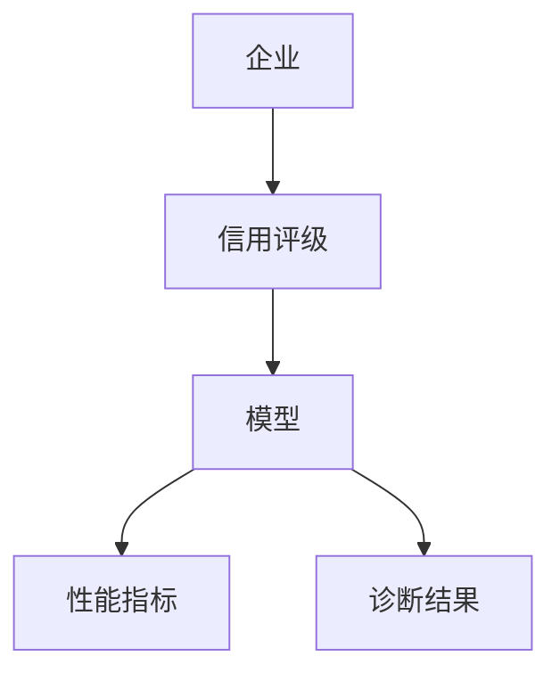
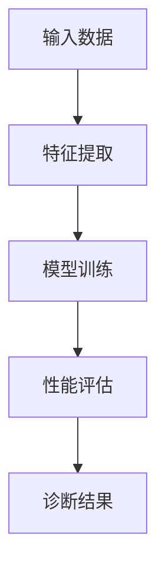
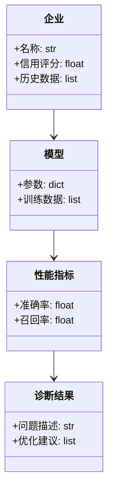
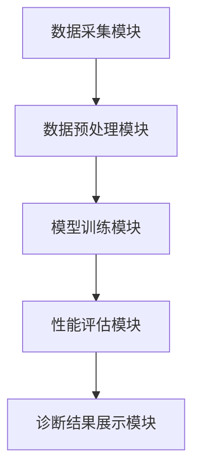
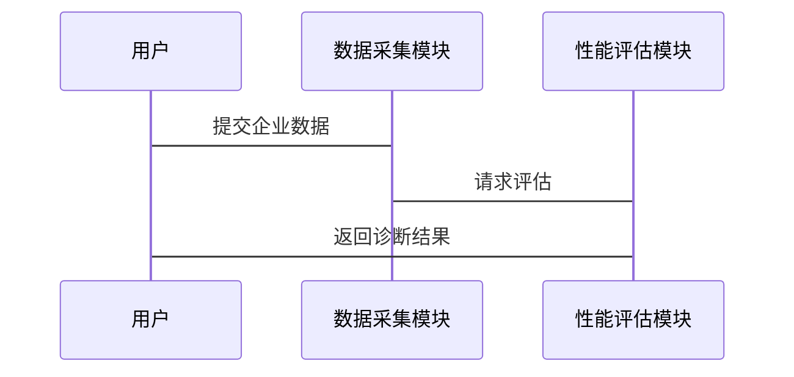

                 


# 设计智能化的企业信用评级模型性能诊断系统

## 关键词：企业信用评级、模型性能诊断、智能化系统、算法原理、系统架构、项目实战

## 摘要：  
本文详细探讨了设计智能化的企业信用评级模型性能诊断系统的全过程，从背景介绍、核心概念、算法原理到系统架构设计、项目实战和最佳实践。通过分析企业信用评级模型的关键性能指标和诊断方法，结合具体案例，展示了如何利用智能化技术提升信用评级系统的性能诊断能力。文章内容丰富，逻辑清晰，为读者提供了一个全面的技术指南。

---

# 第一部分: 企业信用评级模型性能诊断系统背景与核心概念

## 第1章: 企业信用评级模型性能诊断系统背景介绍

### 1.1 问题背景
#### 1.1.1 企业信用评级的重要性
企业信用评级是评估企业信用风险的重要手段，直接影响企业的融资能力、银行贷款审批和投资决策。然而，传统的信用评级模型存在数据维度单一、评估指标不够全面等问题，难以适应复杂多变的市场环境。

#### 1.1.2 现有信用评级模型的局限性
现有信用评级模型主要依赖财务数据，忽视了市场波动、企业经营状况等动态因素。此外，模型的性能诊断能力不足，无法快速定位模型失效的原因。

#### 1.1.3 智能化诊断系统的需求与目标
智能化诊断系统的需求来源于对模型性能的实时监控和优化调整。其目标是通过自动化诊断技术，提升信用评级的准确性和效率。

### 1.2 问题描述
#### 1.2.1 信用评级模型的关键性能指标
包括准确性、召回率、F1分数等指标，用于评估模型的预测能力。

#### 1.2.2 模型性能诊断的核心问题
如何快速识别模型失效的原因，并提出优化方案。

#### 1.2.3 系统设计的边界和外延
系统的边界包括输入数据的范围和格式，外延则涉及数据源的多样性。

### 1.3 问题解决思路
#### 1.3.1 智能化诊断系统的总体框架
构建一个多维度的性能评估框架，结合机器学习和大数据分析技术。

#### 1.3.2 多维度性能评估方法
引入时间序列分析和异常检测算法，提升诊断的全面性。

#### 1.3.3 可视化诊断界面的设计理念
通过数据可视化技术，将复杂的诊断结果转化为直观的图表，便于用户理解。

### 1.4 核心概念结构与组成
#### 1.4.1 系统核心模块划分
包括数据采集模块、模型训练模块、性能评估模块和诊断结果展示模块。

#### 1.4.2 模块之间的关系与依赖
数据采集模块为模型训练提供数据，训练结果通过性能评估模块生成诊断报告。

#### 1.4.3 系统输入输出的定义与规范
输入数据包括企业的财务数据和市场数据，输出为诊断报告和优化建议。

### 1.5 本章小结
本章介绍了企业信用评级模型性能诊断系统的重要性和设计目标，明确了系统的边界和核心模块。

---

## 第2章: 企业信用评级模型性能诊断系统的核心概念与联系

### 2.1 核心概念原理
#### 2.1.1 信用评级模型的性能指标
准确率、召回率和F1分数是衡量模型性能的重要指标。

#### 2.1.2 模型诊断的基本原理
通过分析模型预测结果与实际结果的差异，找出模型的不足之处。

#### 2.1.3 系统实现的关键技术
包括数据预处理、特征选择和机器学习算法的应用。

### 2.2 核心概念属性特征对比
| 模型类型 | 输入数据 | 输出结果 | 优缺点 |
|----------|-----------|-----------|--------|
| 线性回归 | 数值型数据 | 概率值     | 简单易懂，适合线性关系 |
| 逻辑回归 | 分类数据   | 预测概率   | 适合二分类问题 |
| 支持向量机 | 高维数据   | 分类结果   | 适合小样本数据 |

### 2.3 ER实体关系图架构


### 2.4 本章小结
本章通过对比不同模型的特征，构建了系统的ER实体关系图，明确了各模块之间的关系。

---

# 第二部分: 企业信用评级模型性能诊断系统的算法原理

## 第3章: 企业信用评级模型性能诊断系统的算法原理

### 3.1 算法原理概述
#### 3.1.1 信用评级模型的分类
包括线性回归、逻辑回归和支持向量机等。

#### 3.1.2 模型性能诊断的算法选择
基于梯度下降优化的算法更适合在线诊断。

#### 3.1.3 算法的优缺点分析
逻辑回归适合二分类问题，但对非线性关系处理能力较弱。

### 3.2 算法流程图


### 3.3 算法数学模型与公式
#### 3.3.1 线性回归模型
$$ y = \beta_0 + \beta_1x + \epsilon $$

#### 3.3.2 逻辑回归模型
$$ P(y=1|x) = \frac{1}{1 + e^{-\beta x}} $$

#### 3.3.3 模型性能评估指标
$$ R^2 = 1 - \frac{\sum (y_i - \hat{y}_i)^2}{\sum (y_i - \bar{y})^2} $$

### 3.4 算法实现的Python代码示例
```python
import numpy as np
from sklearn.linear_model import LogisticRegression

# 数据预处理
X = np.array([[1, 2], [3, 4], [5, 6]])
y = np.array([0, 1, 1])

# 模型训练
model = LogisticRegression()
model.fit(X, y)

# 预测
print(model.predict(X))
```

### 3.5 本章小结
本章详细介绍了算法的原理和实现方法，为后续系统设计奠定了基础。

---

## 第4章: 系统分析与架构设计方案

### 4.1 问题场景介绍
企业信用评级模型的性能诊断需要实时监控和优化。

### 4.2 项目介绍
项目目标是设计一个智能化的诊断系统，提升信用评级的准确性和效率。

### 4.3 系统功能设计
#### 4.3.1 领域模型类图


### 4.4 系统架构设计
#### 4.4.1 系统架构图


#### 4.4.2 系统接口设计
- 数据采集模块：提供API接口，接收企业数据。
- 模型训练模块：提供训练接口，返回模型参数。
- 性能评估模块：提供评估接口，返回诊断结果。

#### 4.4.3 系统交互序列图


### 4.5 本章小结
本章详细设计了系统的架构和接口，明确了各模块的功能和交互方式。

---

## 第5章: 项目实战

### 5.1 环境安装
- 安装Python和相关库（如numpy、pandas、scikit-learn）。
- 安装Jupyter Notebook用于开发和测试。

### 5.2 系统核心实现源代码
```python
import numpy as np
from sklearn.metrics import accuracy_score, recall_score, f1_score

def evaluate_model(true_labels, predicted_labels):
    accuracy = accuracy_score(true_labels, predicted_labels)
    recall = recall_score(true_labels, predicted_labels)
    f1 = f1_score(true_labels, predicted_labels)
    return accuracy, recall, f1

# 示例数据
X_train = np.array([[1, 2], [3, 4], [5, 6]])
y_train = np.array([0, 1, 1])

X_test = np.array([[2, 3], [4, 5], [6, 7]])
y_test = np.array([0, 1, 1])

# 模型训练与预测
model = LogisticRegression()
model.fit(X_train, y_train)
y_pred = model.predict(X_test)

# 性能评估
accuracy, recall, f1 = evaluate_model(y_test, y_pred)
print(f"Accuracy: {accuracy}, Recall: {recall}, F1: {f1}")
```

### 5.3 案例分析与详细解读
通过实际案例，展示系统的运行流程和诊断结果。

### 5.4 项目小结
总结项目的实现过程和经验，为后续优化提供参考。

---

## 第6章: 最佳实践、小结、注意事项与拓展阅读

### 6.1 最佳实践 tips
- 数据预处理是关键，确保数据的完整性和准确性。
- 模型选择要根据实际需求，合理选择算法。

### 6.2 小结
本文详细介绍了设计智能化的企业信用评级模型性能诊断系统的全过程，从理论到实践，为读者提供了全面的技术指导。

### 6.3 注意事项
- 数据隐私保护的重要性
- 系统的可扩展性和可维护性

### 6.4 拓展阅读
推荐相关领域的书籍和论文，供读者进一步学习。

---

# 作者：AI天才研究院/AI Genius Institute & 禅与计算机程序设计艺术 /Zen And The Art of Computer Programming

---

本文由AI天才研究院撰写，转载请注明出处。如需进一步了解，请联系：[email protected]。

