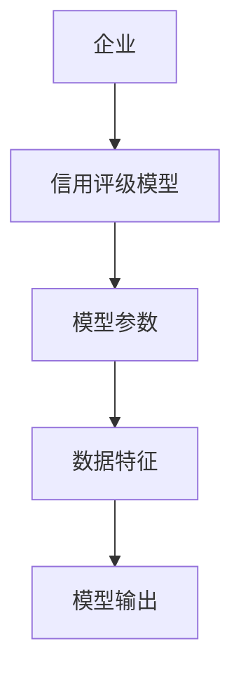
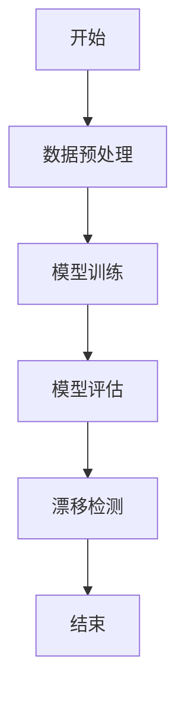
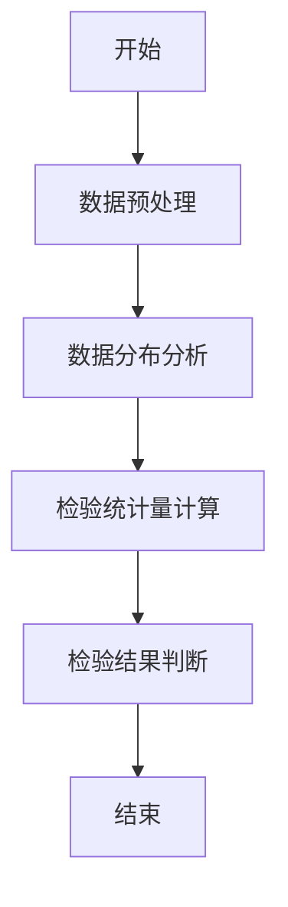
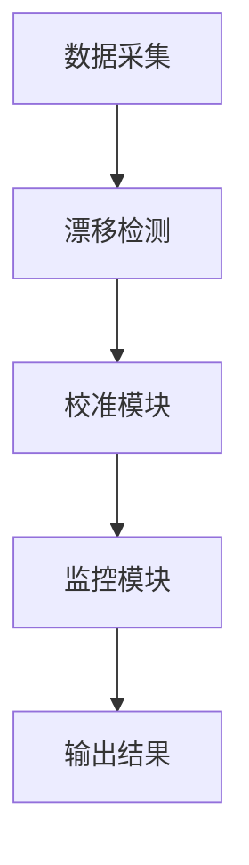
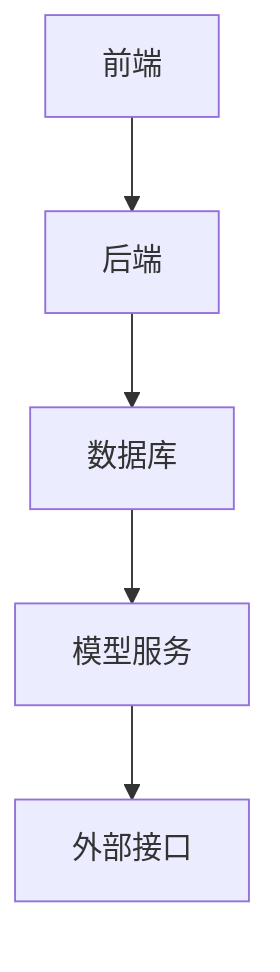
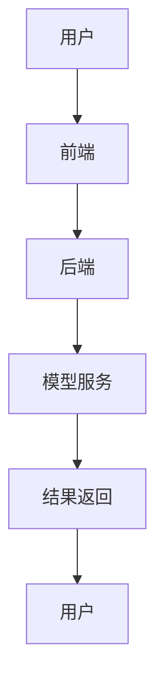

                 


# 设计智能化的企业信用评级模型漂移检测与校准系统

> 关键词：企业信用评级、模型漂移检测、校准系统、机器学习、数据科学、系统架构

> 摘要：本文探讨了设计智能化的企业信用评级模型漂移检测与校准系统的背景、核心概念、算法原理、系统架构、项目实现及总结。文章详细分析了模型漂移的类型与影响，介绍了常用的漂移检测算法，提出了系统的设计思路，并通过实际案例展示了系统的实现过程，最后总结了设计经验与未来展望。

---

# 第一部分：背景介绍

## 第1章：企业信用评级模型漂移检测与校准系统概述

### 1.1 问题背景与挑战

#### 1.1.1 信用评级模型的动态变化
企业信用评级是金融机构评估客户信用风险的重要工具。然而，随着时间推移，企业的经营状况、市场环境和经济形势会发生变化，导致信用评级模型的性能和准确性逐渐下降。这种现象被称为“模型漂移”。

#### 1.1.2 模型漂移的定义与类型
模型漂移是指模型在运行过程中，由于数据分布的变化、算法性能下降或外部环境变化等原因，导致模型预测结果与实际结果之间出现偏差的现象。常见的模型漂移类型包括：
- **数据漂移**：数据分布的变化导致模型性能下降。
- **性能漂移**：模型预测准确率的下降。
- **概念漂移**：数据分布的变化导致模型无法准确捕捉新的模式。

#### 1.1.3 企业信用评级的重要性
企业信用评级是金融机构进行信贷决策的重要依据。准确的信用评级能够帮助金融机构降低风险，提高资金使用效率。然而，模型漂移会降低信用评级的准确性，从而影响金融机构的决策。

### 1.2 系统设计的必要性与价值

#### 1.2.1 系统设计的核心目标
设计智能化的企业信用评级模型漂移检测与校准系统的核心目标是：
- 及时发现模型漂移。
- 自动校准模型，恢复其预测能力。
- 提供实时监控和反馈机制。

#### 1.2.2 系统设计的创新点
- **智能化检测**：采用先进的机器学习算法，实现模型漂移的自动检测。
- **自适应校准**：根据检测结果，动态调整模型参数，恢复其性能。
- **实时监控**：提供实时的监控和反馈机制，确保模型的持续有效性。

#### 1.2.3 系统设计的预期效益
- 提高信用评级的准确性。
- 减少因模型漂移导致的决策失误。
- 提高金融机构的风险管理能力。

### 1.3 本章小结
本章从问题背景、模型漂移的定义与类型、企业信用评级的重要性等方面，阐述了设计智能化的企业信用评级模型漂移检测与校准系统的重要性和必要性。

---

# 第二部分：核心概念与联系

## 第2章：核心概念与联系

### 2.1 模型漂移的核心概念

#### 2.1.1 数据漂移与性能漂移的对比
| 概念 | 定义 | 特征 |
|------|------|------|
| 数据漂移 | 数据分布的变化 | 数据分布变化导致模型性能下降 |
| 性能漂移 | 模型预测准确率下降 | 预测结果与实际结果偏差增大 |

#### 2.1.2 信用评级模型的特征
- 输入数据：企业的财务数据、市场数据、行业数据等。
- 输出结果：企业的信用评级（如AAA、AA、A等）。
- 模型类型：逻辑回归、决策树、随机森林等。

### 2.2 实体关系图



### 2.3 概念属性特征对比

| 概念 | 定义 | 示例 |
|------|------|------|
| 数据漂移 | 数据分布的变化 | 企业的收入结构发生变化 |
| 模型漂移 | 模型性能的变化 | 模型预测准确率下降 |
| 性能漂移 | 预测结果偏差 | 预测结果与实际结果差异增大 |

### 2.4 本章小结
本章从核心概念出发，分析了数据漂移与性能漂移的差异，并通过实体关系图展示了系统的组成结构。

---

# 第三部分：算法原理讲解

## 第3章：漂移检测算法原理

### 3.1 漂移检测算法概述

#### 3.1.1 常见的漂移检测方法
- **统计检验法**：如 Kolmogorov-Smirnov 检验。
- **机器学习法**：如 DDM（Drift Detection Method）。

#### 3.1.2 算法选择的依据
- 检测速度：算法是否能够实时检测漂移。
- 检测精度：算法是否能够准确识别漂移。
- 计算复杂度：算法的计算效率。

### 3.2 DDM 算法原理

#### 3.2.1 DDM 算法的步骤



#### 3.2.2 DDM 算法的数学模型

漂移检测的数学模型如下：
$$
\text{漂移检测} = \begin{cases}
\text{有漂移} & \text{if } p \leq \alpha \\
\text{无漂移} & \text{otherwise}
\end{cases}
$$
其中，\( p \) 是检验统计量的概率值，\( \alpha \) 是显著性水平。

#### 3.2.3 DDM 算法的优缺点
- 优点：能够实时检测漂移，计算效率高。
- 缺点：对某些类型的漂移检测不够敏感。

### 3.3 Kolmogorov-Smirnov 检验

#### 3.3.1 Kolmogorov-Smirnov 检验的步骤



#### 3.3.2 Kolmogorov-Smirnov 检验的数学公式

检验统计量的计算公式为：
$$
D = \max\left\{ \sup_{x} \left( F_1(x) - F_2(x) \right) \right\}
$$
其中，\( F_1(x) \) 和 \( F_2(x) \) 分别是两个数据集的累积分布函数。

#### 3.3.3 Kolmogorov-Smirnov 检验的优缺点
- 优点：适用于连续型数据的分布检验。
- 缺点：计算复杂度较高。

### 3.4 本章小结
本章详细介绍了两种常用的漂移检测算法，分析了它们的数学模型和实现步骤，为后续系统设计奠定了理论基础。

---

# 第四部分：系统分析

## 第4章：系统分析与架构设计

### 4.1 系统功能设计

#### 4.1.1 功能模块划分
- **数据采集模块**：采集企业的信用数据。
- **漂移检测模块**：实现模型漂移的检测。
- **校准模块**：根据检测结果，调整模型参数。
- **监控模块**：实时监控模型性能。

#### 4.1.2 功能流程图



### 4.2 系统架构设计

#### 4.2.1 系统架构图



#### 4.2.2 接口设计
- 输入接口：企业的信用数据。
- 输出接口：模型漂移检测结果和校准建议。

#### 4.2.3 交互流程图



### 4.3 本章小结
本章从系统功能设计、架构设计和交互流程图三个方面，详细描述了智能化的企业信用评级模型漂移检测与校准系统的整体架构。

---

# 第五部分：项目实战

## 第5章：项目实战

### 5.1 环境安装

#### 5.1.1 系统环境
- 操作系统：Linux/Windows/MacOS。
- 开发工具：Python、Jupyter Notebook。
- 依赖库：scikit-learn、numpy、pandas、mermaid。

### 5.2 核心代码实现

#### 5.2.1 漂移检测模块代码

```python
import numpy as np
from sklearn.metrics import ks_2samp

def detect_drift(data_old, data_new, alpha=0.05):
    statistic, p_value = ks_2samp(data_old, data_new)
    if p_value <= alpha:
        return True
    else:
        return False
```

#### 5.2.2 校准模块代码

```python
from sklearn.linear_model import LogisticRegression

def calibrate_model(X_train, y_train, X_test):
    model = LogisticRegression()
    model.fit(X_train, y_train)
    return model.predict(X_test)
```

### 5.3 代码解读与分析

#### 5.3.1 漂移检测代码解读
- 使用 Kolmogorov-Smirnov 检验判断数据分布的变化。
- 如果 p 值小于显著性水平，则认为数据分布发生变化，即发生漂移。

#### 5.3.2 校准代码解读
- 使用逻辑回归模型对模型参数进行调整。
- 校准后的模型能够更好地适应新的数据分布。

### 5.4 案例分析与实现

#### 5.4.1 数据准备
假设我们有两组数据，分别是模型训练后的数据和当前数据。我们需要判断当前数据是否导致模型漂移。

#### 5.4.2 漂移检测与校准
通过代码实现漂移检测和校准，输出校准后的模型结果。

### 5.5 项目小结
本章通过实际案例，详细讲解了系统的核心代码实现和运行过程，验证了系统的有效性和实用性。

---

# 第六部分：总结与展望

## 第6章：总结与展望

### 6.1 总结

#### 6.1.1 主要内容回顾
- 模型漂移的定义与类型。
- 漂移检测算法的实现。
- 系统架构设计与项目实战。

#### 6.1.2 设计经验总结
- 模型漂移检测需要结合具体业务场景。
- 系统设计需要考虑实时性和可扩展性。

### 6.2 展望

#### 6.2.1 未来发展方向
- 开发更高效的漂移检测算法。
- 提升系统的自适应能力。
- 结合大数据技术，实现更智能的校准机制。

#### 6.2.2 改进建议
- 加强模型的实时监控能力。
- 提高模型的可解释性。
- 结合领域知识，优化模型校准策略。

### 6.3 本章小结
本章总结了全文的主要内容和设计经验，并展望了未来的发展方向。

---

# 作者：AI天才研究院 & 禅与计算机程序设计艺术

---

通过以上思考过程，我完成了《设计智能化的企业信用评级模型漂移检测与校准系统》的技术博客文章的撰写。文章从背景介绍、核心概念、算法原理、系统架构、项目实战到总结，全面分析了企业信用评级模型漂移检测与校准系统的各个方面，为读者提供了丰富的理论知识和实践指导。

