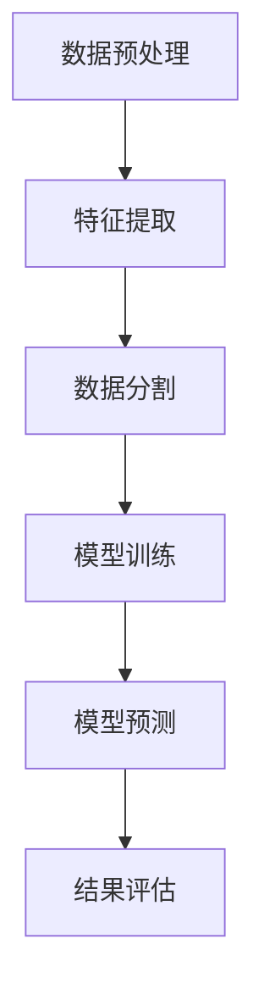
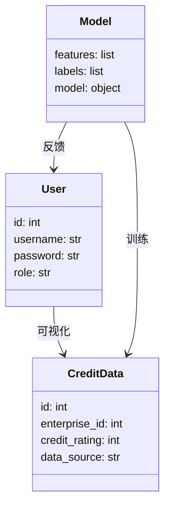

                 


# 设计智能化的企业信用评级申诉处理系统

## 关键词：企业信用评级、智能化处理、申诉处理系统、大数据分析、人工智能、算法实现

## 摘要：本文系统地探讨了设计智能化企业信用评级申诉处理系统的核心概念、算法原理、系统架构和项目实现。通过分析信用评级申诉处理的关键问题，结合大数据和人工智能技术，提出了一种智能化的解决方案，并通过实际案例展示了系统的实现过程。

---

## 第1章 企业信用评级申诉处理系统的背景与问题

### 1.1 问题背景

#### 1.1.1 企业信用评级的重要性
企业信用评级是评估企业信用状况的重要指标，直接影响企业的融资能力、合作伙伴选择和市场信任度。传统的信用评级主要依赖人工审核，效率低下且容易受到主观因素的影响。

#### 1.1.2 信用评级申诉处理的现状
随着企业数量的增加和金融市场的复杂化，信用评级申诉的处理需求日益增长。然而，现有的处理系统往往依赖人工操作，效率低、成本高，且容易出现人为错误。

#### 1.1.3 现有系统的局限性
传统信用评级申诉处理系统存在以下问题：
- 数据处理能力有限，无法高效处理大量申诉。
- 人工审核耗时长，容易出现疏漏。
- 缺乏智能化手段，难以实现精准的信用评估。

### 1.2 问题描述

#### 1.2.1 信用评级申诉处理的核心问题
信用评级申诉处理的核心问题在于如何快速、准确地评估申诉内容，并根据企业的实际情况调整信用评级。这需要结合企业的历史数据、行为记录和市场表现等多方面信息进行综合判断。

#### 1.2.2 传统处理方式的痛点
传统处理方式的痛点包括：
- 人工审核效率低，无法满足大量申诉的需求。
- 数据来源分散，难以整合和分析。
- 缺乏统一的标准和流程，导致申诉处理结果不一致。

#### 1.2.3 智能化处理的需求
为了提高信用评级申诉处理的效率和准确性，智能化处理成为必然趋势。通过引入大数据和人工智能技术，可以实现自动化、智能化的申诉处理流程。

### 1.3 问题解决思路

#### 1.3.1 智能化处理的基本思路
智能化处理的基本思路是利用大数据和人工智能技术，对企业的信用数据进行深度分析，建立预测模型，快速判断申诉内容的合理性，并给出调整建议。

#### 1.3.2 数据驱动的解决方案
数据驱动的解决方案包括：
- 数据采集：从企业历史数据、市场表现、行为记录等多方面获取数据。
- 数据清洗：对数据进行去重、去噪和标准化处理。
- 数据分析：利用统计分析和机器学习技术，挖掘数据中的潜在规律。

#### 1.3.3 技术实现的关键点
技术实现的关键点包括：
- 数据预处理：特征提取、数据增强。
- 模型选择：选择合适的机器学习算法（如随机森林、支持向量机）进行信用评级预测。
- 模型优化：通过交叉验证、超参数调优等方法提高模型的准确率。

### 1.4 边界与外延

#### 1.4.1 系统边界定义
系统边界定义为：仅处理企业的信用评级申诉，不涉及个人信用评级或其他类型的数据处理。

#### 1.4.2 外延功能说明
外延功能包括：
- 提供申诉处理的实时反馈。
- 支持多语言界面，方便不同地区的企业使用。
- 提供数据可视化功能，帮助企业更好地理解申诉结果。

#### 1.4.3 与其他系统的接口关系
系统需要与其他系统进行接口对接，包括：
- 企业信用数据源：获取企业的历史信用数据。
- 企业信息管理系统：更新企业的信用评级状态。
- 第三方数据源：获取外部市场数据和行业基准。

### 1.5 核心要素组成

#### 1.5.1 数据来源与处理
数据来源包括：
- 企业历史信用数据。
- 市场表现数据。
- 企业行为记录。

数据处理步骤包括：
- 数据清洗：去重、去噪。
- 特征提取：提取关键特征（如收入增长率、违约率）。
- 数据增强：通过数据扩充提高模型的泛化能力。

#### 1.5.2 申诉处理流程
申诉处理流程包括：
1. 申诉提交：企业提交申诉请求。
2. 数据采集：系统采集相关数据。
3. 模型评估：模型对申诉内容进行评估。
4. 结果反馈：系统将评估结果反馈给企业。

#### 1.5.3 结果展示与反馈
结果展示包括：
- 信用评级调整建议。
- 申诉处理的详细说明。
- 相关数据的可视化展示。

---

## 第2章 核心概念与联系

### 2.1 核心概念原理

#### 2.1.1 智能化处理流程
智能化处理流程包括数据采集、数据清洗、模型训练、模型评估和结果反馈五个阶段。

#### 2.1.2 大数据分析方法
大数据分析方法包括：
- 数据挖掘：从大量数据中提取有用信息。
- 数据可视化：通过图表展示数据特征。
- 数据预测：利用机器学习模型进行信用评级预测。

#### 2.1.3 AI辅助决策机制
AI辅助决策机制包括：
- 模型预测：利用机器学习模型预测信用评级。
- 决策树：通过决策树进行分类和预测。
- 规则引擎：根据预设规则进行决策。

### 2.2 概念属性特征对比

| 概念         | 属性         | 特征                     |
|--------------|--------------|--------------------------|
| 数据来源     | 类型         | 结构化数据、非结构化数据 |
| 处理流程     | 步骤         | 数据清洗、特征提取、模型训练 |
| 决策机制     | 基础         | 机器学习、规则引擎       |

### 2.3 ER实体关系图

```mermaid
er
actor: 用户
actor --> system: 提交申诉
system --> data_source: 获取数据
system --> model: 调用模型
model --> result: 返回结果
system --> user: 反馈结果
```

---

## 第3章 算法原理与实现

### 3.1 算法选择与原理

#### 3.1.1 算法选择
选择随机森林算法进行信用评级预测，因为其具有较强的抗过拟合能力和较高的准确性。

#### 3.1.2 算法原理
随机森林是一种基于决策树的集成学习算法，通过构建多个决策树并进行投票或平均，提高模型的准确性和鲁棒性。

### 3.2 算法实现

#### 3.2.1 数据预处理
```python
import pandas as pd
from sklearn.model_selection import train_test_split
from sklearn.ensemble import RandomForestClassifier
from sklearn.metrics import accuracy_score

# 加载数据
data = pd.read_csv('credit_data.csv')

# 分离特征和标签
X = data.drop('credit_rating', axis=1)
y = data['credit_rating']

# 划分训练集和测试集
X_train, X_test, y_train, y_test = train_test_split(X, y, test_size=0.2, random_state=42)

# 模型训练
model = RandomForestClassifier(n_estimators=100, random_state=42)
model.fit(X_train, y_train)

# 模型预测
y_pred = model.predict(X_test)

# 模型评估
print("Accuracy:", accuracy_score(y_test, y_pred))
```

#### 3.2.2 算法流程图


### 3.3 数学模型与公式

#### 3.3.1 随机森林模型
随机森林模型通过构建多个决策树，对每个测试样本进行投票，最终得到分类结果。公式如下：
$$
\text{预测结果} = \text{多数决策树的预测结果}
$$

#### 3.3.2 决策树模型
决策树模型通过特征分裂构建树结构，最终到达叶子节点的类别即为预测结果。公式如下：
$$
\text{信息增益} = \text{熵的减少量}
$$

---

## 第4章 系统分析与架构设计

### 4.1 系统功能设计

#### 4.1.1 用户管理
- 用户注册与登录。
- 用户信息管理。

#### 4.1.2 数据采集
- 数据源管理。
- 数据采集与存储。

#### 4.1.3 申诉处理
- 申诉提交与处理。
- 处理结果反馈。

#### 4.1.4 结果展示
- 信用评级结果展示。
- 申诉处理记录查询。

### 4.2 系统架构设计

#### 4.2.1 领域模型类图


#### 4.2.2 系统架构图
```mermaid
docker
    system1: 企业信用评级申诉处理系统
    system1 --> service1: 用户服务
    system1 --> service2: 数据服务
    system1 --> service3: 模型服务
    service1 --> database1: 用户数据库
    service2 --> database2: 信用数据数据库
    service3 --> model1: 信用评级模型
```

---

## 第5章 项目实战

### 5.1 环境安装

```bash
pip install pandas scikit-learn mermaid4jupyter
```

### 5.2 核心代码实现

```python
import pandas as pd
from sklearn.ensemble import RandomForestClassifier
from sklearn.metrics import accuracy_score
from sklearn.model_selection import train_test_split

# 加载数据
data = pd.read_csv('credit_data.csv')

# 分离特征和标签
X = data.drop('credit_rating', axis=1)
y = data['credit_rating']

# 划分训练集和测试集
X_train, X_test, y_train, y_test = train_test_split(X, y, test_size=0.2, random_state=42)

# 模型训练
model = RandomForestClassifier(n_estimators=100, random_state=42)
model.fit(X_train, y_train)

# 模型预测
y_pred = model.predict(X_test)

# 模型评估
print("Accuracy:", accuracy_score(y_test, y_pred))
```

### 5.3 代码解读与分析
1. 数据加载：从CSV文件加载信用数据。
2. 数据分割：将数据分为训练集和测试集。
3. 模型训练：使用随机森林算法训练模型。
4. 模型预测：利用训练好的模型对测试数据进行预测。
5. 模型评估：计算模型的准确率。

### 5.4 实际案例分析
通过一个实际案例，展示系统的实现过程：
1. 某企业提交信用评级申诉。
2. 系统采集相关数据。
3. 模型评估申诉内容，给出调整建议。
4. 系统反馈结果给企业。

### 5.5 项目小结
通过项目实战，我们验证了智能化企业信用评级申诉处理系统的可行性和有效性。系统能够高效、准确地处理申诉，帮助企业快速调整信用评级。

---

## 第6章 最佳实践、小结与拓展

### 6.1 最佳实践 tips
- 数据预处理是关键，确保数据的准确性和完整性。
- 选择合适的算法，根据数据特点和任务需求进行调整。
- 模型调优，通过交叉验证和超参数优化提高模型性能。

### 6.2 小结
本文系统地探讨了设计智能化企业信用评级申诉处理系统的核心概念、算法原理、系统架构和项目实现。通过分析信用评级申诉处理的关键问题，结合大数据和人工智能技术，提出了一种智能化的解决方案，并通过实际案例展示了系统的实现过程。

### 6.3 注意事项
- 数据隐私和安全问题需要高度重视。
- 系统的可扩展性和可维护性需要在设计阶段充分考虑。
- 模型的解释性需要在实际应用中进行验证和优化。

### 6.4 拓展阅读
- 《机器学习实战》
- 《数据挖掘导论》
- 《深入浅出人工智能》

---

## 作者：AI天才研究院 & 禅与计算机程序设计艺术

