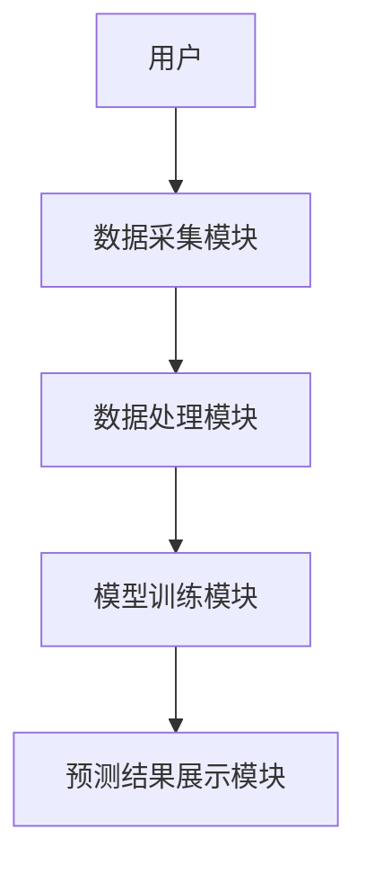
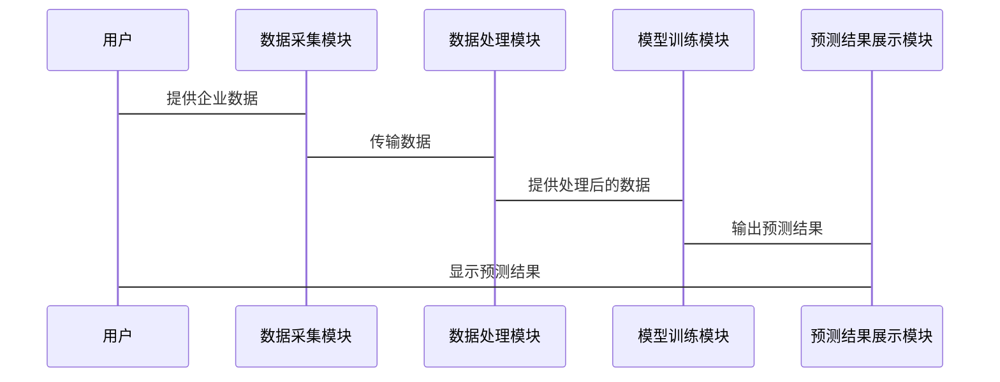

                 


# 设计智能化的企业信用评级申诉成功率预测系统

> 关键词：企业信用评级，申诉成功率预测，智能化系统，机器学习，算法实现

> 摘要：本文详细介绍了如何设计一个智能化的企业信用评级申诉成功率预测系统，涵盖了从问题背景到系统实现的全过程。文章首先分析了企业信用评级和申诉成功率预测的核心概念，然后深入探讨了相关的算法原理和数学模型。接下来，文章详细介绍了系统架构设计和接口设计，并通过具体的项目实战展示了系统的实现过程。最后，文章总结了系统设计的最佳实践和注意事项。

---

# 第一部分：企业信用评级申诉成功率预测系统背景介绍

## 第1章：企业信用评级申诉成功率预测系统概述

### 1.1 问题背景

#### 1.1.1 企业信用评级的重要性
企业信用评级是评估企业信用状况的重要指标，直接影响企业的融资能力、合作伙伴选择以及市场信任度。信用评级越高，企业在贷款、投资等方面的优势越明显。

#### 1.1.2 申诉成功率预测的必要性
在企业信用评级过程中，申诉成功率预测可以帮助企业了解其申诉的成功可能性，从而优化决策，提前采取措施改善信用状况。

#### 1.1.3 当前存在的问题与挑战
当前企业在信用评级申诉过程中面临以下问题：
- 数据分散，难以整合。
- 申诉成功率预测缺乏科学性，多依赖人工经验。
- 缺乏智能化的预测模型，无法实现精准预测。

### 1.2 问题描述

#### 1.2.1 信用评级的定义与标准
信用评级是对企业的财务状况、经营能力、偿债能力等多方面进行综合评估，通常采用分数或等级来表示。

#### 1.2.2 申诉成功率的定义与影响因素
申诉成功率是指企业在信用评级申诉中成功提升评级的概率。影响因素包括企业的财务数据、历史申诉记录、行业竞争状况等。

#### 1.2.3 系统目标与预期效果
系统目标：建立智能化的预测模型，实现对企业信用评级申诉成功率的精准预测。
预期效果：提高企业信用管理效率，降低申诉成本，提升企业信用等级。

### 1.3 问题解决思路

#### 1.3.1 数据驱动的解决方案
通过收集和分析企业的历史数据，建立数据驱动的预测模型。

#### 1.3.2 智能化预测模型的设计
采用机器学习算法，构建申诉成功率预测模型，实现自动化预测。

#### 1.3.3 系统实现的关键技术
- 数据采集与预处理
- 特征工程
- 模型训练与优化
- 系统集成与部署

### 1.4 系统边界与外延

#### 1.4.1 系统的功能边界
- 数据采集与处理
- 模型训练与预测
- 结果展示与分析

#### 1.4.2 系统的输入输出范围
- 输入：企业财务数据、历史申诉记录
- 输出：申诉成功率预测结果

#### 1.4.3 系统与其他系统的接口关系
- 与企业征信系统接口
- 与企业申诉系统接口

## 第2章：核心概念与联系

### 2.1 核心概念原理

#### 2.1.1 信用评级的计算方法
信用评级通常基于财务指标（如资产负债率、利润率）和非财务指标（如行业地位、管理团队）进行综合评估。

#### 2.1.2 申诉成功率的预测模型
申诉成功率预测模型基于历史数据，结合机器学习算法，预测未来申诉的成功概率。

#### 2.1.3 系统的整体架构原理
系统通过数据采集、特征提取、模型训练、结果输出等步骤，实现信用评级申诉成功率的智能化预测。

### 2.2 核心概念属性特征对比表

| 特征               | 信用评级         | 申诉成功率预测      |
|--------------------|-----------------|--------------------|
| 数据来源           | 企业财务数据     | 历史申诉记录        |
| 数据类型           | 结构化数据       | 结构化与非结构化数据|
| 处理方法           | 统计分析         | 机器学习模型        |
| 输出结果           | 评级分数         | 预测概率            |

### 2.3 ER实体关系图

```mermaid
erDiagram
    customer[CUSTOMER] {
        +id: int
        +name: string
        +credit_score: float
    }
    appeal_record[APPEAL_RECORD] {
        +id: int
        +customer_id: int
        +appeal_success_rate: float
    }
    system SYSTEM {
        +id: int
        +name: string
        +version: string
    }
    CUSTOMER --|> APPEAL_RECORD : 一个客户对应多条申诉记录
    SYSTEM --|> CUSTOMER : 系统管理多个客户
    SYSTEM --|> APPEAL_RECORD : 系统记录申诉结果
```

---

## 第3章：算法原理与实现

### 3.1 算法原理

#### 3.1.1 逻辑回归算法
逻辑回归是一种常用的分类算法，适用于二分类问题。在申诉成功率预测中，可以将申诉成功（1）与失败（0）作为分类目标。

#### 3.1.2 随机森林算法
随机森林是一种基于决策树的集成算法，适用于高维数据的分类和回归问题。

### 3.2 算法实现步骤

#### 3.2.1 数据预处理
1. 数据清洗：处理缺失值、异常值。
2. 特征提取：从财务数据和申诉记录中提取相关特征。

#### 3.2.2 模型训练
1. 选择算法：如逻辑回归或随机森林。
2. 训练模型：使用训练数据拟合模型。
3. 模型评估：通过交叉验证评估模型性能。

#### 3.2.3 模型优化
1. 调参：优化模型参数，如正则化系数、树的深度等。
2. 模型部署：将模型部署到生产环境，提供预测接口。

### 3.3 算法实现代码

```python
import pandas as pd
from sklearn.model_selection import train_test_split
from sklearn.linear_model import LogisticRegression
from sklearn.ensemble import RandomForestClassifier
from sklearn.metrics import accuracy_score

# 数据加载与预处理
data = pd.read_csv('appeal_data.csv')
X = data.drop('appeal_success', axis=1)
y = data['appeal_success']

# 划分训练集和测试集
X_train, X_test, y_train, y_test = train_test_split(X, y, test_size=0.2, random_state=42)

# 逻辑回归模型训练
lr_model = LogisticRegression()
lr_model.fit(X_train, y_train)
y_pred_lr = lr_model.predict(X_test)
accuracy_lr = accuracy_score(y_test, y_pred_lr)

# 随机森林模型训练
rf_model = RandomForestClassifier()
rf_model.fit(X_train, y_train)
y_pred_rf = rf_model.predict(X_test)
accuracy_rf = accuracy_score(y_test, y_pred_rf)

print(f'逻辑回归准确率：{accuracy_lr}')
print(f'随机森林准确率：{accuracy_rf}')
```

### 3.4 算法数学模型

#### 3.4.1 逻辑回归模型
逻辑回归的损失函数为：
$$ L = -\sum_{i=1}^{n} [y_i \ln(h(x_i)) + (1 - y_i) \ln(1 - h(x_i))] $$
其中，$$ h(x_i) = \frac{1}{1 + e^{-\beta x_i}} $$

#### 3.4.2 随机森林模型
随机森林通过构建多棵决策树，并将结果进行投票或平均，最终输出预测结果。

---

## 第4章：系统分析与架构设计

### 4.1 项目场景介绍

#### 4.1.1 项目背景
企业信用评级申诉成功率预测系统旨在帮助企业预测申诉成功的可能性，优化信用管理流程。

#### 4.1.2 项目目标
实现一个智能化的申诉成功率预测系统，提供高效的预测服务。

### 4.2 系统功能设计

#### 4.2.1 系统功能模块
1. 数据采集模块：负责收集企业数据。
2. 数据处理模块：进行数据清洗和特征提取。
3. 模型训练模块：训练申诉成功率预测模型。
4. 预测结果展示模块：输出预测结果。

#### 4.2.2 系统功能流程
1. 数据采集：从数据库中提取企业财务数据和申诉记录。
2. 数据处理：清洗数据，提取特征。
3. 模型训练：选择算法，训练模型。
4. 模型预测：输入新数据，输出预测结果。

### 4.3 系统架构设计

#### 4.3.1 系统架构图


#### 4.3.2 系统接口设计
1. 数据接口：提供数据输入和输出的接口。
2. 模型接口：提供模型训练和预测的接口。

### 4.4 系统交互流程图



---

## 第5章：项目实战与实现

### 5.1 环境安装与配置

#### 5.1.1 安装Python环境
安装Python 3.8及以上版本，并安装必要的库，如pandas、scikit-learn。

#### 5.1.2 数据集准备
准备企业信用数据和申诉记录数据，存储为CSV格式。

### 5.2 核心功能实现

#### 5.2.1 数据采集模块实现
```python
import pandas as pd

def load_data():
    data = pd.read_csv('appeal_data.csv')
    return data
```

#### 5.2.2 数据处理模块实现
```python
def preprocess_data(data):
    # 删除缺失值
    data.dropna(inplace=True)
    # 标准化处理
    from sklearn.preprocessing import StandardScaler
    scaler = StandardScaler()
    data_scaled = scaler.fit_transform(data)
    return data_scaled
```

#### 5.2.3 模型训练模块实现
```python
from sklearn.linear_model import LogisticRegression

def train_model(X, y):
    model = LogisticRegression()
    model.fit(X, y)
    return model
```

### 5.3 项目小结

#### 5.3.1 项目总结
通过本项目，我们实现了企业信用评级申诉成功率的智能化预测，提高了预测的准确性和效率。

#### 5.3.2 经验与教训
- 数据预处理是关键，数据质量直接影响模型性能。
- 模型选择需结合实际业务需求，不同算法有不同的适用场景。

---

## 第6章：最佳实践与注意事项

### 6.1 小结

#### 6.1.1 核心概念回顾
- 信用评级的重要性
- 申诉成功率预测的必要性

#### 6.1.2 系统设计总结
- 系统架构的设计原则
- 模型选择与优化的关键点

### 6.2 注意事项

#### 6.2.1 数据安全与隐私保护
确保数据的安全性，遵守相关法律法规。

#### 6.2.2 模型的可解释性
在实际应用中，模型的可解释性很重要，特别是在金融领域。

### 6.3 拓展阅读

#### 6.3.1 推荐阅读
- 《机器学习实战》
- 《Python机器学习》

#### 6.3.2 深入学习方向
- 高级机器学习算法
- 模型部署与优化

---

作者：AI天才研究院/AI Genius Institute & 禅与计算机程序设计艺术/Zen And The Art of Computer Programming

---

# 结语

通过本文的详细讲解，我们了解了设计智能化的企业信用评级申诉成功率预测系统的全过程。从背景分析到算法实现，再到系统设计和项目实战，我们掌握了系统的整体架构和关键实现技术。希望本文能为相关领域的从业者提供有价值的参考和启示。

