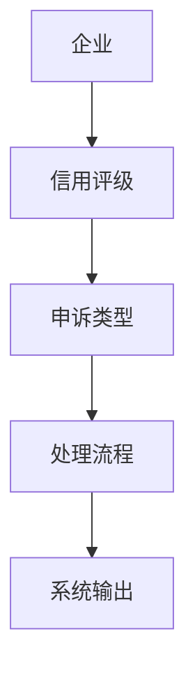
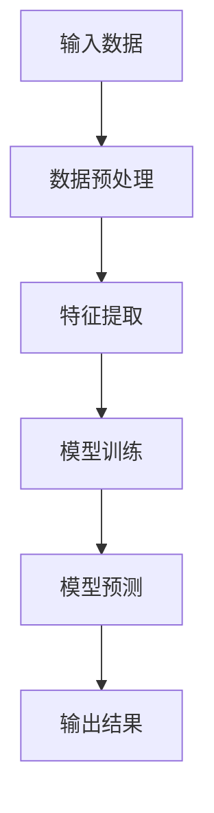
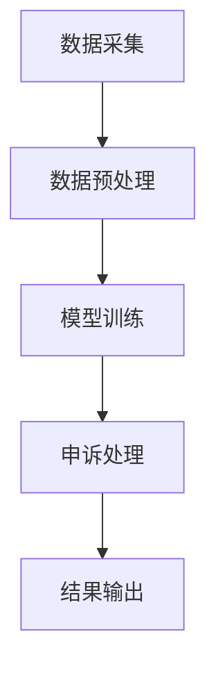

                 


# 设计智能化的企业信用评级申诉自动处理与学习系统

> 关键词：企业信用评级，智能化处理，申诉自动处理，机器学习，系统架构，学习优化

> 摘要：随着企业信用评级在商业活动中的重要性日益增加，如何高效、准确地处理企业信用评级申诉成为一个亟待解决的问题。本文将详细探讨如何设计一个智能化的企业信用评级申诉自动处理与学习系统，通过机器学习算法和系统架构设计，实现申诉的自动分类、处理和学习优化。文章将从系统背景、核心概念、算法原理、系统架构、项目实战等方面展开，详细阐述系统的设计与实现过程。

---

## 第一部分: 企业信用评级申诉处理的背景与问题

### 第1章: 企业信用评级申诉处理的背景与问题

#### 1.1 企业信用评级的重要性
企业信用评级是衡量企业信用状况的重要指标，直接影响企业的融资能力、合作伙伴选择以及市场信任度。然而，信用评级的申诉处理过程通常繁琐且耗时，容易受到人为因素的影响，导致处理效率低下且结果不一致。

#### 1.2 传统信用评级申诉处理的痛点
传统信用评级申诉处理主要依赖人工操作，存在以下问题：
1. **低效性**：人工审核耗时长，难以满足大量申诉的需求。
2. **复杂性**：申诉类型多样，人工分类容易出错。
3. **一致性差**：不同审核人员的标准不一，导致处理结果不一致。

#### 1.3 智能化处理的必要性与优势
智能化处理能够有效解决上述问题，其优势包括：
1. **高效性**：自动化处理大幅提高申诉处理效率。
2. **准确性**：基于机器学习的算法能够提高分类和处理的准确性。
3. **一致性**：系统化的处理流程确保结果的一致性。

---

## 第二部分: 企业信用评级申诉处理的核心概念与联系

### 第2章: 核心概念与联系

#### 2.1 核心概念
- **企业信用评级**：对企业的信用状况进行评估，通常基于财务数据、经营状况等指标。
- **申诉处理**：企业对信用评级结果有异议时，提出的重新评估请求。
- **智能化处理**：利用机器学习等技术，自动分类和处理申诉请求。

#### 2.2 实体关系图


---

## 第三部分: 系统算法原理与数学模型

### 第3章: 算法原理与数学模型

#### 3.1 算法原理
系统采用基于机器学习的分类算法，主要流程包括：
1. 数据预处理：清洗和特征提取。
2. 模型训练：使用逻辑回归或随机森林进行分类。
3. 申诉分类：根据模型预测结果进行分类。
4. 处理优化：基于分类结果优化处理流程。

#### 3.2 数学模型
1. **逻辑回归模型**：
   $$ P(y=1|x) = \frac{1}{1 + e^{-\beta x}} $$
2. **随机森林模型**：
   $$ y = \sum_{i=1}^{n} tree_i(x) $$

#### 3.3 算法流程图


---

## 第四部分: 系统架构与设计

### 第4章: 系统架构与设计

#### 4.1 系统架构设计
系统采用分层架构，包括数据采集层、数据处理层、模型训练层和结果输出层。

#### 4.2 系统功能设计
1. **数据采集模块**：收集企业的信用数据和申诉信息。
2. **数据预处理模块**：清洗数据并提取特征。
3. **模型训练模块**：训练机器学习模型。
4. **申诉处理模块**：自动分类和处理申诉请求。

#### 4.3 系统架构图


---

## 第五部分: 项目实战与优化

### 第5章: 项目实战

#### 5.1 环境安装与数据准备
1. 安装Python和必要的库（如scikit-learn、pandas）。
2. 准备企业信用数据和申诉数据。

#### 5.2 核心代码实现
```python
import pandas as pd
from sklearn.model import LogisticRegression

# 数据加载与预处理
data = pd.read_csv('credit_data.csv')
X = data[['revenue', 'profit', 'debt']]
y = data['rating']

# 模型训练
model = LogisticRegression()
model.fit(X, y)

# 申诉处理
def process_complaint(complaint_data):
    prediction = model.predict(complaint_data)
    return prediction
```

#### 5.3 实际案例分析
通过实际案例分析，验证系统的处理能力和优化效果。

#### 5.4 系统优化与学习
系统通过反馈机制不断优化模型，提高处理准确率。

---

## 第六部分: 最佳实践与总结

### 第6章: 最佳实践与总结

#### 6.1 最佳实践
1. 数据隐私保护：确保数据的安全性和合规性。
2. 模型调优：根据实际需求优化模型参数。
3. 系统维护：定期更新数据和模型。

#### 6.2 小结
智能化的企业信用评级申诉处理系统能够显著提高处理效率和准确性，为企业信用管理提供有力支持。

---

## 作者

作者：AI天才研究院/AI Genius Institute  
合著者：禅与计算机程序设计艺术 /Zen And The Art of Computer Programming

