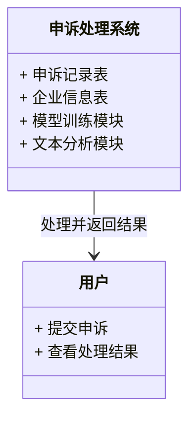
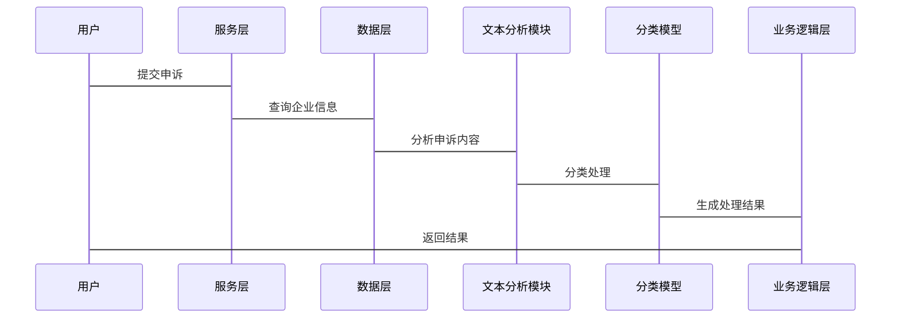

                 


# 设计智能化的企业信用评级申诉自动处理系统

**关键词：** 企业信用评级、自然语言处理、机器学习、申诉处理系统、自动化处理

**摘要：** 本文详细探讨了设计智能化的企业信用评级申诉自动处理系统的背景、核心概念、算法原理、系统架构以及实际应用。通过结合自然语言处理和机器学习技术，该系统能够高效、准确地处理企业信用评级申诉，显著提高效率和用户体验。本文还提供了系统的实战案例和最佳实践，为读者提供全面的技术指导。

---

# 第一部分: 企业信用评级申诉自动处理系统背景与核心概念

# 第1章: 企业信用评级申诉处理系统概述

## 1.1 问题背景与描述
### 1.1.1 传统信用评级申诉处理的痛点
- 人工处理效率低，成本高。
- 数据量大，信息复杂，容易出错。
- 申诉处理缺乏标准化，结果不一致。

### 1.1.2 企业信用评级的重要性
- 信用评级影响企业的融资能力、合作伙伴选择和市场信誉。
- 评级结果直接影响企业的经营决策。

### 1.1.3 申诉处理的复杂性与挑战
- 申诉内容多样，涉及财务、法律等多个领域。
- 申诉原因复杂，需深入分析才能得出合理结论。

## 1.2 系统目标与功能
### 1.2.1 系统的核心目标
- 自动化处理信用评级申诉，提高效率。
- 提供准确的评级结果，降低人为错误。
- 支持多语言、多格式的申诉内容处理。

### 1.2.2 系统的主要功能模块
1. 文本分析模块：自动解析申诉内容，提取关键信息。
2. 分类处理模块：基于机器学习模型对申诉进行分类。
3. 决策支持模块：生成处理建议和评级结果。
4. 用户界面模块：提供友好的用户交互界面。

### 1.2.3 系统的边界与外延
- 处理范围：企业信用评级申诉。
- 不处理范围：个人信用评级或其他类型的数据处理。

## 1.3 核心概念与组成要素
### 1.3.1 信用评级的核心要素
- 企业财务状况：收入、利润、负债等。
- 信用历史：历史违约记录、还款情况。
- 经营能力：市场表现、管理团队稳定性。

### 1.3.2 申诉处理的关键环节
1. 信息收集：获取申诉内容。
2. 数据分析：提取关键信息。
3. 分类处理：基于规则或模型进行分类。
4. 决策生成：生成处理建议。

### 1.3.3 系统的组成架构
1. 数据层：存储申诉数据和模型数据。
2. 业务逻辑层：处理逻辑和算法实现。
3. 应用层：用户交互和结果展示。

## 1.4 本章小结
本章介绍了企业信用评级申诉处理系统的背景、目标和核心概念，为后续章节奠定了基础。

---

# 第二部分: 核心概念与系统原理

# 第2章: 基于NLP的文本分析原理

## 2.1 自然语言处理在信用申诉中的应用
### 2.1.1 文本预处理与分词
- 去除停用词、标点符号。
- 分词处理，提取关键词。

### 2.1.2 情感分析与关键词提取
- 情感分析：判断申诉文本的情绪倾向。
- 关键词提取：提取与信用评级相关的重要信息。

### 2.1.3 文本相似度计算
- 使用余弦相似度计算文本相似性。
- $$\text{余弦相似度} = \frac{\vec{A} \cdot \vec{B}}{|\vec{A}| |\vec{B}|}$$

## 2.2 机器学习模型在分类中的应用
### 2.2.1 基于TF-IDF的特征提取
- TF-IDF公式：$$\text{TF-IDF}(t, d) = \text{TF}(t, d) \times \text{IDF}(t)$$
- 其中，TF是词频，IDF是逆向文件频率。

### 2.2.2 支持向量机（SVM）分类器
- SVM原理：在特征空间中找到最优超平面，将数据分为两类。
- SVM优点：适用于高维数据，分类准确率高。

### 2.2.3 随机森林（Random Forest）分类器
- 随机森林原理：通过随机采样和特征选择，构建多棵决策树，取投票结果作为最终分类结果。
- 优点：抗过拟合，适合高维度数据。

## 2.3 模型训练与优化
### 2.3.1 数据增强与样本平衡
- 数据增强：通过同义词替换、数据扰动等方法增加数据多样性。
- 样本平衡：处理类别不平衡问题，采用过采样或欠采样方法。

### 2.3.2 模型调参与交叉验证
- 调参方法：网格搜索（Grid Search）。
- 交叉验证：K折交叉验证，评估模型泛化能力。

### 2.3.3 模型评估与性能指标
- 常见指标：准确率（Accuracy）、精确率（Precision）、召回率（Recall）、F1分数（F1 Score）。

## 2.4 本章小结
本章详细介绍了自然语言处理和机器学习在信用评级申诉处理中的应用，重点讲解了文本分析和分类模型的实现原理。

---

# 第三部分: 系统架构与算法实现

# 第3章: 系统架构与算法实现

## 3.1 问题场景介绍
### 3.1.1 高并发请求处理
- 系统需支持大量并发请求，确保处理效率。
- 使用队列和异步处理机制优化性能。

### 3.1.2 数据隐私保护
- 数据加密存储，确保用户隐私安全。
- 访问控制，限制敏感数据访问权限。

## 3.2 系统功能设计
### 3.2.1 领域模型类图


### 3.2.2 系统架构设计


### 3.2.3 接口设计
- 输入接口：接收申诉内容和相关数据。
- 输出接口：返回处理结果和建议。

### 3.2.4 交互流程图


## 3.3 项目实战
### 3.3.1 环境安装
- 安装Python和相关库（如scikit-learn、nltk、spaCy）。

### 3.3.2 核心代码实现
```python
import numpy as np
from sklearn.svm import SVC
from sklearn.feature_extraction.text import TfidfVectorizer

# 文本预处理
def preprocess(text):
    # 分词和去停用词
    words = text.lower().split()
    return ' '.join(words)

# 特征提取
vectorizer = TfidfVectorizer()
X = vectorizer.fit_transform([preprocess(text) for text in texts])

# 模型训练
model = SVC()
model.fit(X.toarray(), labels)

# 预测
test_text = preprocess(new_text)
test_X = vectorizer.transform([test_text])
predicted_label = model.predict(test_X.toarray())
```

### 3.3.3 案例分析
- 案例背景：某企业因财务问题申诉信用评级。
- 系统处理：自动分析财务报表，提取关键指标，分类处理。
- 处理结果：评级调整为BBB级，建议补充财务审计报告。

## 3.4 本章小结
本章详细介绍了系统架构设计和算法实现，重点展示了如何通过自然语言处理和机器学习技术实现智能化的信用评级申诉处理。

---

# 第四部分: 最佳实践与总结

# 第4章: 最佳实践与总结

## 4.1 小结
- 系统通过自然语言处理和机器学习实现了高效的信用评级申诉处理。
- 关键技术包括文本分析、分类模型和系统架构设计。

## 4.2 注意事项
- 数据隐私保护：严格加密处理用户数据。
- 模型调优：定期更新模型，保持分类准确率。

## 4.3 拓展阅读
- 推荐书籍：《自然语言处理实战》、《机器学习实战》。
- 推荐工具：spaCy、Gensim。

## 4.4 本章小结
本章总结了系统设计的关键点，并提供了实际应用中的注意事项和拓展资源。

---

# 作者

作者：AI天才研究院/AI Genius Institute & 禅与计算机程序设计艺术 /Zen And The Art of Computer Programming

