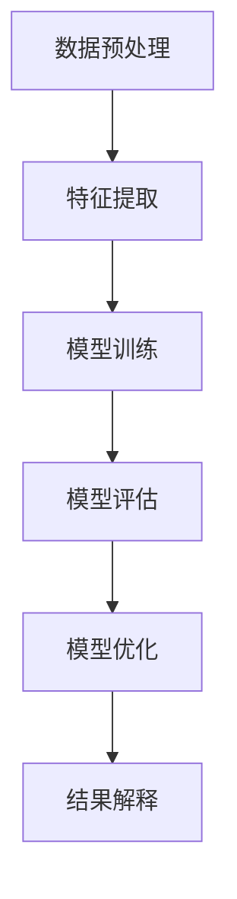
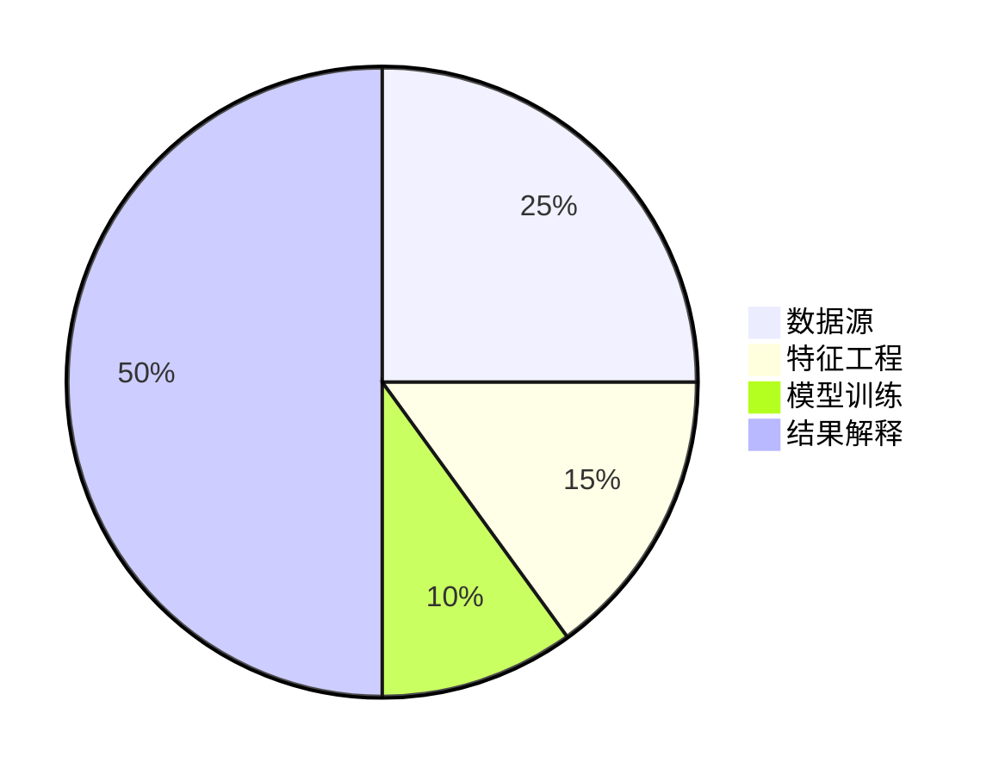

                 


# 设计智能化的企业信用评级解释系统

> 关键词：企业信用评级，智能化，机器学习，深度学习，信用风险评估，模型解释，可解释性AI

> 摘要：本文系统地介绍了如何设计一个智能化的企业信用评级解释系统。从问题背景到系统架构，从算法原理到项目实战，文章详细阐述了如何利用人工智能技术提升信用评级的准确性和可解释性。通过实际案例分析，展示了系统的实际应用场景和优势，为读者提供了从理论到实践的完整指南。

---

## 第一部分：企业信用评级解释系统背景与核心概念

### 第1章：企业信用评级解释系统背景介绍

#### 1.1 问题背景与描述
企业信用评级是企业在金融市场中获得融资的关键环节。传统信用评级方法依赖于经验丰富的分析师，存在主观性强、效率低、透明度不足等问题。随着人工智能技术的发展，智能化信用评级系统应运而生，旨在提高评级的准确性和效率。

#### 1.2 系统边界与外延
智能化企业信用评级解释系统的核心目标是通过机器学习和深度学习算法，自动分析企业的财务数据、市场表现和行业趋势，生成可解释的信用评级结果。

#### 1.3 核心概念与联系
企业信用评级涉及多个关键概念，包括企业财务数据、信用评分模型、可解释性AI等。通过ER图可以清晰地展示系统中实体之间的关系。

---

### 第2章：智能化信用评级算法原理

#### 2.1 算法原理概述
智能化信用评级系统通常采用混合模型，结合传统机器学习和深度学习的优势。例如，随机森林模型用于特征重要性分析，而神经网络模型则用于复杂模式识别。

#### 2.2 算法流程图
以下是算法的整体流程图：


#### 2.3 算法实现代码
以下是实现随机森林模型的Python代码：
```python
import pandas as pd
from sklearn.ensemble import RandomForestClassifier

# 数据预处理
data = pd.read_csv('credit_data.csv')
X = data.drop('rating', axis=1)
y = data['rating']

# 特征提取
selected_features = ['revenue', 'profit', 'debt']
X_selected = X[selected_features]

# 模型训练
model = RandomForestClassifier()
model.fit(X_selected, y)

# 模型评估
score = model.score(X_selected, y)
print(f'模型准确率: {score}')
```

#### 2.4 数学模型与公式
评分函数：
$$ rating = f(features) $$
其中，$features$ 是企业信用相关特征向量。

模型损失函数：
$$ loss = \sum_{i=1}^{n} (y_i - \hat{y_i})^2 $$

---

## 第二部分：系统分析与架构设计

### 第3章：系统分析与架构设计方案

#### 3.1 问题场景介绍
企业信用评级系统需要处理海量数据，包括财务数据、市场数据和行业趋势。系统需要能够快速响应用户查询，并提供可解释的评级结果。

#### 3.2 系统功能设计
系统功能包括数据采集、特征提取、模型训练、结果解释等。

#### 3.3 系统架构图
以下是系统架构图：


#### 3.4 接口设计与交互流程
以下是系统交互流程图：
```mermaid
sequence
    用户 --> 数据采集模块: 提供企业数据
    数据采集模块 --> 特征工程模块: 进行特征提取
    特征工程模块 --> 模型训练模块: 训练模型
    模型训练模块 --> 结果解释模块: 生成评级报告
    结果解释模块 --> 用户: 返回评级结果
```

---

## 第三部分：项目实战

### 第4章：项目实战

#### 4.1 环境安装
需要安装以下依赖：
```
Python 3.8+
Pandas
Scikit-learn
```

#### 4.2 核心代码实现
以下是核心代码：
```python
import pandas as pd
from sklearn.ensemble import RandomForestClassifier

# 数据预处理
data = pd.read_csv('credit_data.csv')
X = data.drop('rating', axis=1)
y = data['rating']

# 特征提取
selected_features = ['revenue', 'profit', 'debt']
X_selected = X[selected_features]

# 模型训练
model = RandomForestClassifier()
model.fit(X_selected, y)

# 模型评估
score = model.score(X_selected, y)
print(f'模型准确率: {score}')

# 结果解释
importances = model.feature_importances_
print(f'特征重要性: {importances}')
```

#### 4.3 案例分析
通过实际案例分析，展示系统的实际应用效果。例如，某企业的财务数据输入系统后，系统快速生成评级结果，并提供可解释的分析报告。

#### 4.4 项目总结
本项目展示了如何利用人工智能技术设计一个智能化的企业信用评级解释系统，通过实际案例验证了系统的有效性和可扩展性。

---

## 第四部分：最佳实践与拓展

### 第5章：最佳实践

#### 5.1 小结
智能化企业信用评级解释系统通过结合机器学习和深度学习技术，显著提高了评级的准确性和效率。

#### 5.2 注意事项
在实际应用中，需要注意数据质量和模型解释性，确保系统的透明性和可信度。

#### 5.3 拓展阅读
推荐阅读相关领域的最新论文和技术报告，深入了解可解释性AI的最新进展。

---

## 作者
作者：AI天才研究院 & 禅与计算机程序设计艺术

