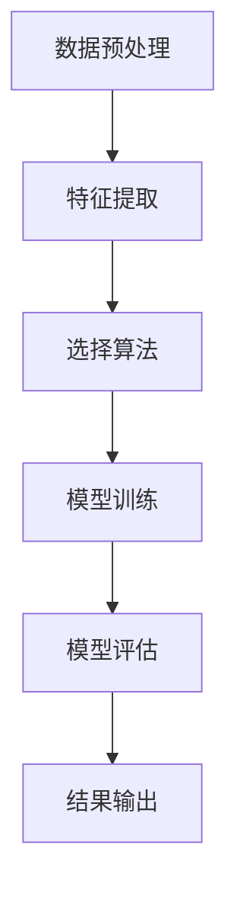
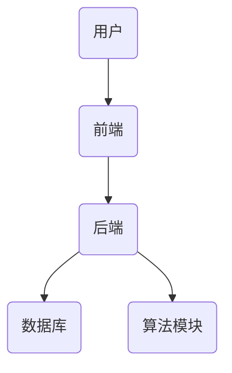

                 


# 设计智能化的企业信用评级迁移矩阵预测模型

## 关键词：企业信用评级，迁移矩阵，预测模型，机器学习，人工智能

## 摘要：本文详细介绍了设计智能化企业信用评级迁移矩阵预测模型的过程，从背景分析、核心概念到算法选择、系统架构设计，再到项目实战和最佳实践，提供了全面的技术指导。通过系统化的分析和实践，展示了如何利用智能化技术提升信用评级的准确性和效率。

---

## 第一部分：企业信用评级迁移矩阵预测模型概述

## 第1章：背景介绍

### 1.1 问题背景

#### 1.1.1 企业信用评级的重要性
企业信用评级是评估企业信用状况的重要工具，直接影响企业的融资成本、投资决策和市场信誉。准确的评级帮助企业优化资源配置，降低风险。

#### 1.1.2 迁移矩阵预测的必要性
信用评级不是静态的，会随时间变化。迁移矩阵预测帮助企业理解评级变化的趋势，优化风险管理策略。

#### 1.1.3 当前信用评级中的问题与挑战
传统评级方法依赖人工经验，存在主观性和低效性。随着市场波动加剧，需要更智能、动态的预测方法。

### 1.2 问题描述

#### 1.2.1 信用评级的基本概念
信用评级是基于财务指标、市场表现等因素，对企业信用状况的综合评价。

#### 1.2.2 迁移矩阵的定义与作用
迁移矩阵记录企业在一定时期内评级变化的概率，用于预测未来的评级变化。

#### 1.2.3 预测模型的目标与意义
构建智能化模型，准确预测评级迁移，辅助企业优化信用管理和风险控制。

### 1.3 问题解决方法

使用机器学习和大数据分析技术，构建预测模型，实现评级迁移的智能预测。

### 1.4 边界和外延

模型仅考虑直接影响评级的内部因素，外部宏观经济因素需另行考虑。

---

## 第2章：核心概念与联系

### 2.1 核心概念原理

#### 2.1.1 信用评级的指标体系
包括财务指标（如资产负债率）、市场指标（如行业趋势）和管理指标（如治理结构）。

#### 2.1.2 迁移矩阵的构建方法
基于历史数据，计算各评级等级间的转移概率，构建矩阵。

#### 2.1.3 预测模型的输入输出关系
输入：企业特征和市场数据；输出：评级迁移概率矩阵。

### 2.2 概念属性特征对比表

| 概念       | 输入 | 输出 | 方法 |
|------------|------|------|------|
| 信用评级   | 特征数据 | 评级结果 | 统计模型 |
| 迁移矩阵   | 历史数据 | 迁移概率 | 马尔可夫链 |

### 2.3 ER实体关系图

```mermaid
erd
  entity 企业 (id, name, industry)
  entity 信用评级 (id, rating, timestamp)
  entity 迁移矩阵 (id, from_rating, to_rating, probability)
  relation 企业 -> 信用评级 (一个企业有多个评级)
  relation 信用评级 -> 迁移矩阵 (一个评级对应多个迁移路径)
```

---

## 第3章：算法原理讲解

### 3.1 算法选择与原理

#### 3.1.1 逻辑回归模型
适用于分类问题，预测企业评级迁移的可能性。

#### 3.1.2 随机森林模型
处理高维数据，适合特征较多的场景。

#### 3.1.3 神经网络模型
处理非线性关系，适合复杂特征的场景。

### 3.2 算法流程图



### 3.3 数学模型和公式

#### 3.3.1 逻辑回归模型

$$ P(Y=1|X) = \frac{1}{1 + e^{-\beta X}} $$

#### 3.3.2 随机森林模型

$$ y = \text{sum}(\text{trees predictions}) / n\_trees $$

---

## 第4章：系统分析与架构设计方案

### 4.1 系统功能设计

#### 4.1.1 系统架构图



### 4.2 系统架构设计


---

## 第5章：项目实战

### 5.1 环境安装

安装Python和相关库：pandas、scikit-learn、tensorflow。

### 5.2 核心代码实现

```python
import pandas as pd
from sklearn.model_selection import train_test_split
from sklearn.linear_model import LogisticRegression

data = pd.read_csv('credit_data.csv')
X = data.drop('rating', axis=1)
y = data['rating']

X_train, X_test, y_train, y_test = train_test_split(X, y, test_size=0.2)

model = LogisticRegression()
model.fit(X_train, y_train)
print(model.score(X_test, y_test))
```

### 5.3 代码解读与分析

训练逻辑回归模型，评估准确率。

### 5.4 实际案例分析

分析一家企业的历史数据，预测其评级迁移。

---

## 第6章：最佳实践

### 6.1 小结

智能化模型提高了预测准确性和效率。

### 6.2 注意事项

确保数据质量和模型调优。

### 6.3 拓展阅读

推荐相关文献和工具书籍。

---

## 作者：AI天才研究院/AI Genius Institute & 禅与计算机程序设计艺术 /Zen And The Art of Computer Programming

