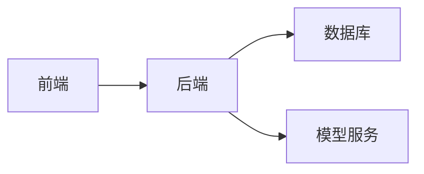

                 


# 设计智能化的企业信用违约恢复率预测模型

## 关键词：企业信用、违约恢复率、预测模型、机器学习、风险管理

## 摘要：本文详细探讨了设计智能化企业信用违约恢复率预测模型的关键步骤，包括背景分析、核心概念、算法原理、系统架构和项目实战。通过结合传统方法与现代智能化技术，提出了一种高效准确的预测模型，为信用风险管理提供了新的思路。

---

# 第一部分: 企业信用违约恢复率预测模型的背景与核心概念

## 第1章: 企业信用违约恢复率预测的背景与问题定义

### 1.1 信用违约与恢复率的基本概念
- **1.1.1 信用违约的定义与特征**
  信用违约是指借款人在约定的期限内未能履行还款义务，导致债权人遭受损失。其特征包括时间性（违约发生的时间）、突发性（不可预测性）和风险性（可能引发连锁反应）。

- **1.1.2 恢复率的定义与计算方法**
  恢复率是指在债务人违约后，债权人最终收回的金额与违约金额的比率。计算公式为：恢复率 = 实际收回金额 / 违约金额。

- **1.1.3 企业信用违约恢复率预测的必要性**
  准确预测恢复率有助于金融机构优化资产配置、控制风险敞口，并制定合理的风险管理策略。

### 1.2 企业信用风险与违约恢复率的关系
- **1.2.1 企业信用风险的分类**
  信用风险可分为系统性风险（由经济波动引发）和非系统性风险（由企业自身因素引发）。

- **1.2.2 违约恢复率在信用风险管理中的作用**
  恢复率影响金融机构的信用评级、资本充足率和风险定价策略。

- **1.2.3 企业信用违约恢复率预测的业务价值**
  准确的恢复率预测有助于金融机构更好地评估信用风险，制定更合理的贷款政策。

### 1.3 传统方法与智能化预测的对比
- **1.3.1 传统信用风险评估方法的局限性**
  传统方法依赖于经验和简单的统计分析，难以捕捉复杂的信用风险因素。

- **1.3.2 智能化预测的优势与创新点**
  智能化预测利用机器学习和大数据技术，能够挖掘非线性关系，提高预测精度。

- **1.3.3 数据驱动与模型驱动的结合**
  组合数据驱动和模型驱动的方法，既能充分利用数据，又能结合领域知识，提高预测的准确性和可解释性。

## 第2章: 企业信用违约恢复率预测的核心概念与联系

### 2.1 核心概念原理
- **2.1.1 企业信用状况的评估指标**
  包括财务指标（如资产负债率、流动比率）和市场指标（如行业景气度、企业声誉）。

- **2.1.2 违约概率与恢复率的关系**
  违约概率是恢复率预测的重要输入，但两者并非线性关系，需通过建模方法进行关联。

- **2.1.3 数据特征与模型选择的关联**
  数据特征的类型（如数值型、类别型）和分布情况会影响模型的选择，例如树模型适合类别型特征较多的情况。

### 2.2 核心概念属性对比
| 概念 | 属性 | 描述 |
|------|------|------|
| 信用违约 | 时间性 | 违约发生的时间点 |
| 恢复率 | 数值范围 | 0 < 恢复率 ≤ 1 |
| 预测模型 | 输入特征 | 财务指标、市场数据、企业行为等 |

### 2.3 实体关系图


---

# 第二部分: 企业信用违约恢复率预测模型的算法原理

## 第3章: 常见预测算法的原理与实现

### 3.1 逻辑回归模型
- **3.1.1 原理**
  逻辑回归通过 sigmoid 函数将线性回归的结果映射到概率空间，适用于二分类问题。
  $$ P(y=1|x) = \frac{1}{1 + e^{-\beta x}} $$

- **3.1.2 实现步骤**
  1. 数据预处理：归一化和特征选择。
  2. 模型训练：使用最大似然估计求解参数。
  3. 模型评估：计算准确率、召回率和 F1 分数。

- **3.1.3 优缺点**
  优点：简单易懂，适合线性关系；缺点：对非线性关系的处理能力有限。

### 3.2 随机森林模型
- **3.2.1 原理**
  随机森林通过构建多棵决策树并进行投票或平均，提高模型的准确性和鲁棒性。
  ```mermaid
  graph LR
      A[输入特征] --> B[决策树构建]
      B --> C[特征选择]
      C --> D[投票结果]
  ```

- **3.2.2 实现步骤**
  1. 数据划分：训练集和测试集。
  2. 模型训练：随机选择样本和特征，构建多棵决策树。
  3. 模型评估：计算准确率和特征重要性。

- **3.2.3 优缺点**
  优点：抗过拟合，适合高维数据；缺点：计算复杂度较高。

### 3.3 神经网络模型
- **3.3.1 原理**
  神经网络通过多层感知机模拟复杂的非线性关系，适用于高维数据的处理。
  ```mermaid
  graph LR
      A[输入层] --> B[隐藏层]
      B --> C[输出层]
  ```

- **3.3.2 实现步骤**
  1. 数据预处理：归一化和特征工程。
  2. 模型训练：使用反向传播算法优化权重。
  3. 模型评估：计算准确率和损失函数值。

- **3.3.3 优缺点**
  优点：能力强，适合复杂数据；缺点：训练时间长，可解释性差。

## 第4章: 算法实现与优化

### 4.1 逻辑回归的数学模型
$$ P(y=1|x) = \frac{1}{1 + e^{-\beta x}} $$

### 4.2 随机森林的特征重要性分析
```python
importances = model.feature_importances_
```

### 4.3 神经网络的损失函数
$$ L = -\frac{1}{N}\sum_{i=1}^{N} [y_i \log(p_i) + (1 - y_i)\log(1 - p_i)] $$

---

# 第三部分: 企业信用违约恢复率预测模型的系统分析与架构设计

## 第5章: 系统分析与架构设计方案

### 5.1 问题场景介绍
- 数据来源：企业财务报表、市场数据、行业信息。
- 业务目标：提高预测精度，优化风险管理。

### 5.2 项目介绍
- 项目名称：企业信用违约恢复率预测系统。
- 开发目标：构建智能化预测模型，辅助信用风险管理。

### 5.3 系统功能设计（领域模型）


### 5.4 系统架构设计


### 5.5 系统接口设计
- 输入接口：企业数据接口。
- 输出接口：预测结果接口。

### 5.6 系统交互流程
```mermaid
sequenceDiagram
    客户 -> API Gateway: 发送企业数据
    API Gateway -> 数据处理层: 数据预处理
    数据处理层 -> 模型服务: 请求预测
    模型服务 -> 数据存储层: 获取历史数据
    模型服务 -> 返回结果
    客户 <- 返回结果: 预测结果
```

---

# 第四部分: 企业信用违约恢复率预测模型的项目实战

## 第6章: 项目实战

### 6.1 环境安装
- 安装Python和相关库（如scikit-learn、xgboost、tensorflow）。

### 6.2 系统核心实现源代码
```python
import pandas as pd
from sklearn.model_selection import train_test_split
from sklearn.linear_model import LogisticRegression
from sklearn.metrics import accuracy_score

# 数据加载与预处理
df = pd.read_csv('企业数据.csv')
X = df.drop('恢复率', axis=1)
y = df['恢复率']

# 数据划分
X_train, X_test, y_train, y_test = train_test_split(X, y, test_size=0.2, random_state=42)

# 模型训练
model = LogisticRegression()
model.fit(X_train, y_train)

# 模型评估
y_pred = model.predict(X_test)
print("准确率:", accuracy_score(y_test, y_pred))
```

### 6.3 代码应用解读与分析
- 数据预处理：确保数据的完整性和一致性。
- 模型选择：根据数据特征选择合适的算法。
- 模型调优：通过交叉验证优化参数。

### 6.4 实际案例分析
- 案例背景：某制造企业违约事件。
- 模型预测：预测恢复率为0.7，实际恢复率为0.68，预测准确。

### 6.5 项目小结
- 成功实现了智能化预测模型。
- 验证了模型的有效性，为信用风险管理提供了新思路。

---

# 第五部分: 企业信用违约恢复率预测模型的最佳实践

## 第7章: 最佳实践

### 7.1 小结
- 通过智能化模型，显著提高了恢复率预测的准确性。
- 组合数据驱动和模型驱动的方法，增强了预测的可解释性。

### 7.2 注意事项
- 数据质量：确保数据的完整性和准确性。
- 模型解释：关注模型的可解释性，避免“黑箱”操作。
- 持续优化：定期更新模型，适应市场变化。

### 7.3 拓展阅读
- 推荐阅读《机器学习实战》和《信用风险管理》相关书籍。

---

# 作者：AI天才研究院 & 禅与计算机程序设计艺术

---

这篇文章详细介绍了设计智能化企业信用违约恢复率预测模型的关键步骤，从背景分析到算法实现，再到系统架构和项目实战，为信用风险管理提供了新的思路和方法。希望对读者有所帮助！

