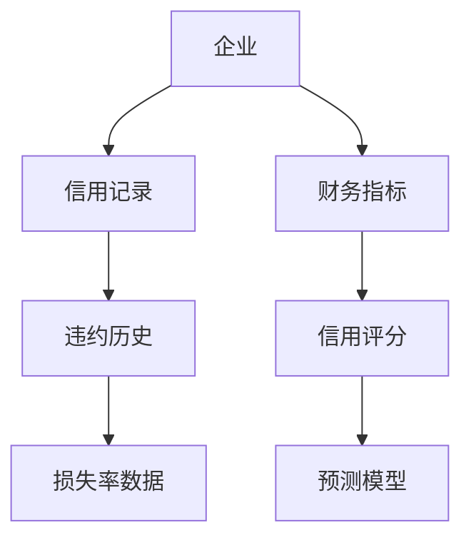
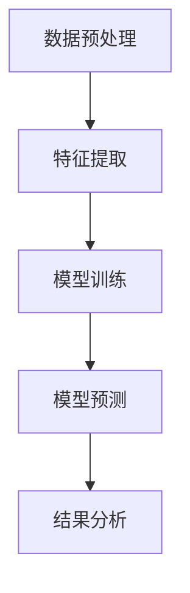
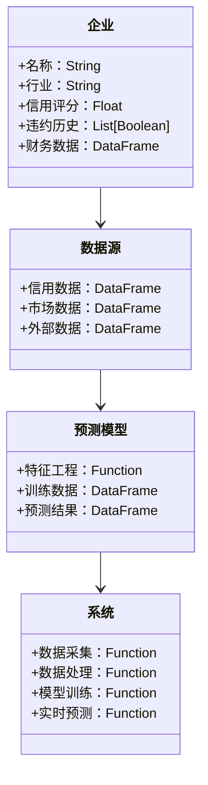
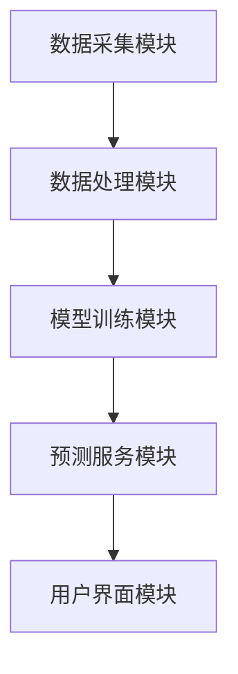
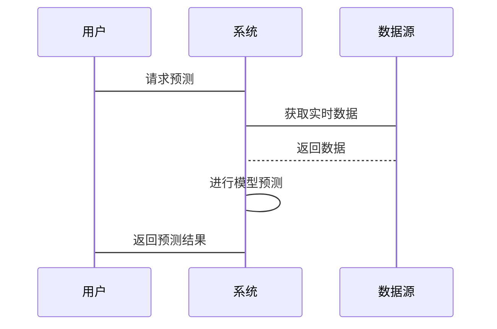

                 


# 设计智能化的企业信用违约损失率动态预测模型

> 关键词：企业信用，违约损失率，动态预测，机器学习，金融风险管理

> 摘要：本文旨在探讨如何利用机器学习技术构建智能化的企业信用违约损失率动态预测模型。通过分析企业信用数据，结合传统金融模型与现代算法，提出了一种高效、准确的预测方法，为企业风险管理和信贷决策提供科学依据。

---

# 第1章: 企业信用违约损失率动态预测模型概述

## 1.1 问题背景与重要性

### 1.1.1 信用违约损失率的定义与作用
信用违约损失率是指在企业发生信用违约事件后，债权人实际遭受的损失占违约金额的比例。它是信用风险管理的核心指标之一，直接影响金融机构的资产质量和盈利能力。准确预测信用违约损失率可以帮助银行和投资机构提前制定风险缓解策略，降低经济损失。

### 1.1.2 传统信用风险评估的局限性
传统的信用风险评估方法主要依赖于历史数据分析和静态模型，存在以下问题：
- 数据维度单一，难以捕捉企业经营的动态变化。
- 模型假设过于简化，无法应对复杂的市场环境。
- 缺乏实时性，无法快速响应市场波动。

### 1.1.3 智能化预测模型的必要性
随着大数据和人工智能技术的发展，利用机器学习算法构建动态预测模型成为可能。智能化预测模型能够实时更新数据，捕捉企业信用状况的细微变化，显著提高预测的准确性和及时性。

## 1.2 核心概念与问题描述

### 1.2.1 信用违约损失率的计算公式
信用违约损失率（LGD）的计算公式如下：
$$ LGD = \frac{\text{违约金额} - \text{回收金额}}{\text{违约金额}} $$

### 1.2.2 动态预测的核心要素
动态预测模型需要考虑以下核心要素：
1. **企业信用记录**：包括历史违约情况、还款记录等。
2. **财务指标**：如资产负债率、净利润率等。
3. **市场环境**：经济周期、行业景气度等。
4. **实时数据**：企业的最新财务报表和市场信息。

### 1.2.3 模型的边界与外延
- **边界**：模型仅预测企业信用违约后的损失率，不涉及违约概率的预测。
- **外延**：基于模型结果，可以进一步优化信用评分系统和风险控制策略。

## 1.3 问题解决与模型目标

### 1.3.1 智能化预测的核心目标
- 实现企业信用违约损失率的实时预测。
- 提供高精度、可解释的预测结果。

### 1.3.2 模型实现的关键问题
- 数据采集与预处理：如何获取高质量的信用数据。
- 特征工程：如何提取有效的特征变量。
- 模型选择：如何选择适合的机器学习算法。

### 1.3.3 解决方案的创新点
- 结合传统金融模型与机器学习算法，构建混合预测模型。
- 引入实时数据流处理技术，实现动态预测。

## 1.4 核心概念联系与ER实体关系图



## 1.5 本章小结

---

# 第2章: 信用违约损失率预测的核心概念与联系

## 2.1 核心概念原理

### 2.1.1 信用违约的定义
信用违约是指企业未能按照合同约定偿还债务本息的行为。它是信用风险管理的核心问题之一。

### 2.1.2 损失率的计算方法
损失率的计算方法包括历史平均法、专家评分法和模型法。模型法是当前最常用的计算方法，其核心是构建损失率预测模型。

### 2.1.3 动态预测的数学模型
动态预测模型通常基于时间序列分析和机器学习算法，例如ARIMA和LSTM。

## 2.2 核心概念属性特征对比

| 核心概念 | 属性 | 特征 |
|----------|------|------|
| 信用违约 | 时间性 | 历史数据驱动 |
| 损失率   | 数值性 | 需要归一化处理 |
| 动态预测 | 实时性 | 需要在线更新 |

## 2.3 ER实体关系图架构


## 2.4 本章小结

---

# 第3章: 算法原理与流程

## 3.1 算法原理概述

### 3.1.1 机器学习在信用风险评估中的应用
机器学习算法在信用风险评估中的应用包括特征提取、模型训练和预测评估。常用的算法有XGBoost、随机森林和神经网络。

### 3.1.2 常见算法对比（如XGBoost、神经网络等）
| 算法名称 | 优势 | 劣势 |
|----------|------|------|
| XGBoost  | 高准确性，易实现 | 对异常值敏感 |
| 神经网络  | 强大学习能力 | 需要大量数据，难解释 |

## 3.2 算法流程图



## 3.3 算法实现代码

```python
import pandas as pd
from sklearn.model_selection import train_test_split
from xgboost import XGBRegressor

# 数据加载与预处理
data = pd.read_csv('credit_data.csv')
X = data.drop('loss_rate', axis=1)
y = data['loss_rate']

# 数据分割
X_train, X_test, y_train, y_test = train_test_split(X, y, test_size=0.2, random_state=42)

# 模型训练
model = XGBRegressor(n_estimators=100, learning_rate=0.1, max_depth=6)
model.fit(X_train, y_train)

# 模型预测
y_pred = model.predict(X_test)

# 结果分析
from sklearn.metrics import mean_squared_error
print(mean_squared_error(y_test, y_pred))
```

## 3.4 本章小结

---

# 第4章: 系统分析与架构设计方案

## 4.1 问题场景介绍
企业信用违约损失率动态预测系统需要处理大量的实时数据，包括企业的财务数据、市场数据和信用历史数据。

## 4.2 系统功能设计

### 4.2.1 领域模型



### 4.2.2 系统架构设计



### 4.2.3 系统接口设计
- 数据接口：数据采集模块与数据源的交互接口。
- 模型接口：模型训练模块与预测服务模块的交互接口。

### 4.2.4 系统交互流程图



## 4.3 本章小结

---

# 第5章: 项目实战

## 5.1 环境安装

### 5.1.1 Python环境配置
安装必要的Python包，如pandas、numpy、xgboost等。

## 5.2 系统核心实现源代码

```python
import pandas as pd
import numpy as np
from sklearn.model_selection import train_test_split
from xgboost import XGBRegressor
from sklearn.metrics import mean_squared_error

# 数据加载与预处理
data = pd.read_csv('credit_data.csv')
data['loss_rate'] = data['loss_rate'].astype(float)

# 特征工程
features = data.drop('loss_rate', axis=1)
target = data['loss_rate']

# 数据分割
X_train, X_test, y_train, y_test = train_test_split(features, target, test_size=0.2, random_state=42)

# 模型训练
model = XGBRegressor(n_estimators=100, learning_rate=0.1, max_depth=6)
model.fit(X_train, y_train)

# 模型预测
y_pred = model.predict(X_test)

# 结果分析
mse = mean_squared_error(y_test, y_pred)
print(f"均方误差: {mse}")
```

## 5.3 代码应用解读与分析
- 数据加载与预处理：确保数据格式正确，处理缺失值和异常值。
- 特征工程：提取关键特征，如财务指标和信用评分。
- 模型训练：使用XGBoost算法进行训练。
- 模型预测：对测试数据进行预测，并计算均方误差。

## 5.4 实际案例分析
以某企业为例，分析模型的预测结果，并与实际损失率进行对比，验证模型的准确性。

## 5.5 本章小结

---

# 第6章: 最佳实践与小结

## 6.1 最佳实践 tips
- 数据质量是模型准确性的基础，需确保数据的完整性和一致性。
- 特征工程是关键，需结合业务知识提取有效的特征。
- 模型解释性是实际应用的重要考量，需选择可解释的算法。

## 6.2 小结
本文详细介绍了企业信用违约损失率动态预测模型的设计与实现过程，包括背景分析、算法选择、系统架构设计和项目实战。通过结合传统金融模型与现代机器学习算法，构建了一个高效、准确的预测系统，为企业信用风险管理提供了新的思路。

## 6.3 注意事项
- 模型的实时性依赖于数据流处理技术，需确保数据更新的及时性。
- 模型的可解释性需在业务决策中得到重视，避免黑箱模型的过度依赖。

## 6.4 拓展阅读
建议读者进一步阅读《信用风险分析与管理》和《机器学习实战》等书籍，深入理解信用风险管理的核心理论和机器学习算法的实现细节。

---

# 作者：AI天才研究院/AI Genius Institute & 禅与计算机程序设计艺术 /Zen And The Art of Computer Programming

