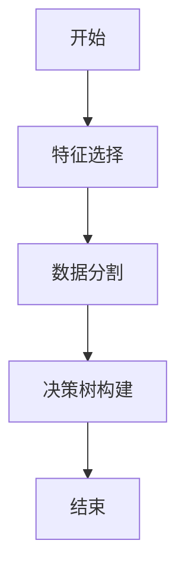
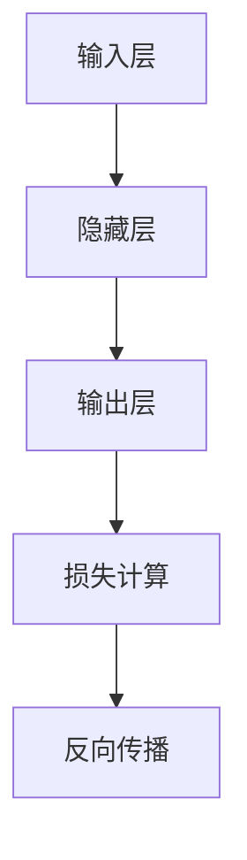
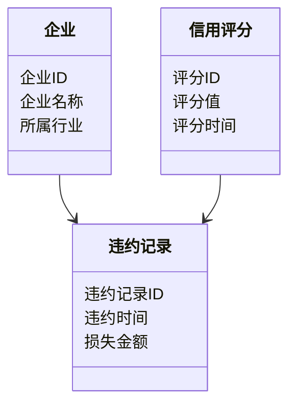

                 


# 设计智能化的企业信用违约损失率预测模型

**关键词：** 信用风险，违约损失率，人工智能，大数据，预测模型

**摘要：** 本文详细探讨了设计智能化的企业信用违约损失率预测模型的各个方面。从信用风险的基本概念到智能化预测模型的必要性，从核心算法的原理到系统架构设计，再到实际项目实战，本文为读者提供了一套完整的解决方案。通过理论与实践相结合，本文旨在帮助读者掌握如何利用人工智能和大数据技术，构建高效、准确的企业信用违约损失率预测模型。

---

## 第1章: 信用风险与违约损失率预测概述

### 1.1 信用风险的基本概念

#### 1.1.1 信用风险的定义与特征

信用风险是指企业在偿还债务时发生违约的可能性，是金融领域的重要风险之一。其主要特征包括：

1. **不确定性**：信用风险的大小取决于多种因素，如经济环境、企业经营状况等。
2. **可测性**：通过数据分析和模型构建，可以量化信用风险。
3. **可控性**：通过合理的风险管理策略，可以降低信用风险。

#### 1.1.2 信用风险的分类与度量

信用风险的分类主要依据风险来源和影响范围，常见的分类包括：

1. **系统性风险**：由整体经济环境变化引起的信用风险。
2. **非系统性风险**：由企业自身经营状况引起的信用风险。

信用风险的度量方法包括违约概率（PD）、违约损失率（LGD）等。

#### 1.1.3 违约损失率预测的定义与意义

违约损失率（LGD）是指在企业违约的情况下，债权人实际损失的比例。预测违约损失率的意义在于帮助金融机构合理评估风险，制定有效的风险管理策略。

---

### 1.2 企业信用违约损失率预测的背景与问题

#### 1.2.1 传统信用风险评估方法的局限性

传统信用评估方法主要依赖于财务指标和经验判断，存在以下问题：

1. **主观性**：依赖于评估人员的经验，结果可能受主观因素影响。
2. **数据不足**：仅依赖财务数据，无法充分利用其他数据源。
3. **静态性**：无法动态捕捉企业经营状况的变化。

#### 1.2.2 数据驱动与智能化预测的需求

随着大数据和人工智能技术的发展，金融机构可以利用更多的数据源（如市场数据、企业行为数据等）来构建更精准的信用评估模型。智能化预测模型的优势在于：

1. **数据驱动**：能够充分利用结构化和非结构化数据。
2. **自动化**：模型可以自动学习数据特征，减少人工干预。
3. **动态性**：能够实时更新模型，捕捉市场变化。

#### 1.2.3 企业信用违约损失率预测的核心问题

企业信用违约损失率预测的核心问题包括：

1. **数据获取**：如何获取高质量的信用相关数据。
2. **模型选择**：如何选择合适的算法来构建预测模型。
3. **模型评估**：如何评估模型的准确性和稳定性。

---

### 1.3 智能化预测模型的必要性与优势

#### 1.3.1 数据驱动的优势

通过大数据技术，金融机构可以获取海量的信用相关数据，包括企业的财务数据、市场数据、行为数据等。这些数据为信用评估提供了更全面的信息支持。

#### 1.3.2 AI与大数据技术的应用前景

人工智能技术（如机器学习、深度学习）在信用评估中的应用前景广阔，能够帮助金融机构提高信用评估的准确性和效率。

#### 1.3.3 智能化模型的创新点与价值

智能化模型的创新点在于其能够利用复杂的数据关系，发现传统方法难以捕捉的信用风险信号。其价值体现在：

1. **提高预测准确性**：通过复杂算法，模型能够捕捉更多的信用风险信号。
2. **降低风险管理成本**：自动化模型可以减少人工干预，降低管理成本。
3. **增强决策支持**：智能化模型能够为金融机构提供更精准的决策支持。

---

### 1.4 本书内容与目标

#### 1.4.1 本书的研究目标

本书旨在探讨如何利用人工智能和大数据技术，构建智能化的企业信用违约损失率预测模型。通过理论分析和实际案例，帮助读者掌握信用风险预测的核心方法和技术。

#### 1.4.2 本书的主要内容框架

本书将从信用风险的基本概念出发，详细讲解智能化预测模型的核心算法、系统架构设计以及实际项目实战。具体内容包括：

1. **信用风险的基本概念**：包括信用风险的定义、分类和度量方法。
2. **智能化预测模型的核心算法**：包括逻辑回归、随机森林、XGBoost等。
3. **系统架构设计**：包括数据处理、模型训练、服务部署等模块。
4. **项目实战**：从数据获取到模型部署，详细讲解实际项目中的关键步骤。

#### 1.4.3 本书的读者对象与应用价值

本书适用于金融机构的信用风险管理人员、数据科学家以及对信用风险预测感兴趣的技术人员。其应用价值体现在：

1. **理论价值**：为信用风险预测研究提供理论支持。
2. **实践价值**：为金融机构提供可操作的信用风险预测方案。

---

## 第2章: 企业信用违约损失率预测的核心概念

### 2.1 信用风险模型的核心要素

#### 2.1.1 企业信用风险的影响因素

企业信用风险的影响因素包括：

1. **财务状况**：如资产负债率、利润率等。
2. **市场环境**：如行业竞争状况、宏观经济环境等。
3. **管理能力**：如管理层的稳定性、战略决策能力等。

#### 2.1.2 违约概率与损失率的关系

违约概率（PD）与违约损失率（LGD）是信用风险评估中的两个重要指标。PD表示企业在一定期限内违约的概率，LGD表示在违约发生时的平均损失比例。

#### 2.1.3 数据特征与模型选择

数据特征与模型选择密切相关。例如，线性模型（如逻辑回归）适用于线性关系，而树模型（如随机森林）适用于非线性关系。

---

### 2.2 违约损失率预测的数学模型

#### 2.2.1 概率论基础

概率论是信用风险评估的理论基础。例如，贝叶斯定理可以用于计算条件概率，帮助模型预测违约概率。

#### 2.2.2 回归分析与分类模型

回归分析用于预测连续型变量（如违约损失率），而分类模型（如逻辑回归）用于预测分类变量（如违约与否）。

#### 2.2.3 时间序列分析与机器学习算法

时间序列分析适用于预测具有时间依赖性的信用风险，而机器学习算法（如XGBoost、神经网络）能够捕捉复杂的数据特征。

---

### 2.3 核心概念的ER实体关系图

以下是一个企业信用违约损失率预测的核心概念的ER实体关系图：

```mermaid
er
    entity 企业信用信息 {
        key 企业ID
        attribute 企业名称, 成立时间, 所属行业
    }
    entity 信用评分 {
        key 评分ID
        attribute 评分值, 评分时间
        relationship 违约记录 (违约记录ID) --> 违约信息
    }
    entity 违约记录 {
        key 违约记录ID
        attribute 违约时间, 损失金额
        relationship 信用评分 (评分ID) --> 信用评分
    }
```

---

## 第3章: 企业信用违约损失率预测的核心算法

### 3.1 算法原理与流程

#### 3.1.1 逻辑回归

逻辑回归是一种常用的分类算法，适用于二分类问题。其核心思想是通过logit函数将线性回归的结果映射到概率空间。

逻辑回归的sigmoid函数如下：

$$ P(y=1|x) = \frac{e^{\beta_0 + \beta_1 x}}{1 + e^{\beta_0 + \beta_1 x}} $$

#### 3.1.2 随机森林

随机森林是一种基于决策树的集成算法，通过随机采样和特征选择，能够有效避免过拟合。

随机森林的训练流程如下：



#### 3.1.3 XGBoost

XGBoost是一种基于树的优化算法，通过正则化和惩罚项，能够有效提升模型的泛化能力。

XGBoost的损失函数如下：

$$ L = \sum_{i=1}^{n} \left( y_i - \hat{y}_i \right)^2 + \lambda \Omega(\text{树的复杂度}) $$

#### 3.1.4 神经网络

神经网络是一种非线性模型，通过多层感知机（MLP）能够捕捉复杂的信用风险特征。

神经网络的训练流程如下：



---

### 3.2 算法实现与对比

#### 3.2.1 Python实现逻辑回归

以下是一个逻辑回归的Python实现示例：

```python
import numpy as np
from sklearn.linear_model import LogisticRegression

# 数据准备
X = np.array([[1, 2], [3, 4], [5, 6]])
y = np.array([0, 1, 1])

# 模型训练
model = LogisticRegression()
model.fit(X, y)

# 预测
print(model.predict([[2, 3]]))
```

#### 3.2.2 算法对比

以下是一个算法对比表格：

| 算法名称 | 优点 | 缺点 |
|----------|------|------|
| 逻辑回归 | 简单、易解释 | 非线性关系表现差 |
| 随机森林 | 鲁棒性好、过拟合少 | 解释性差 |
| XGBoost  | 高效、性能好 | 参数敏感 |
| 神经网络 | 非线性强 | 需要大量数据 |

---

## 第4章: 系统分析与架构设计

### 4.1 系统功能设计

#### 4.1.1 领域模型

以下是一个领域模型的Mermaid类图：



#### 4.1.2 系统架构设计

以下是一个系统架构设计的Mermaid架构图：


---

## 第5章: 项目实战

### 5.1 环境安装与数据获取

#### 5.1.1 环境安装

安装Python和必要的库：

```bash
pip install numpy pandas scikit-learn xgboost
```

#### 5.1.2 数据获取

从公开数据源获取企业信用数据，清洗并预处理数据。

---

### 5.2 核心代码实现

#### 5.2.1 数据预处理

```python
import pandas as pd

# 数据加载
data = pd.read_csv('credit_data.csv')

# 数据清洗
data.dropna(inplace=True)

# 特征选择
features = data[['年收入', '支出比率', '行业风险']}
target = data['违约标记']
```

#### 5.2.2 模型训练

```python
from sklearn.model_selection import train_test_split
from xgboost import XGBClassifier

# 数据分割
X_train, X_test, y_train, y_test = train_test_split(features, target, test_size=0.2)

# 模型训练
model = XGBClassifier()
model.fit(X_train, y_train)

# 模型评估
print(model.score(X_test, y_test))
```

---

### 5.3 案例分析与结果解读

#### 5.3.1 案例分析

以某行业为例，分析模型在该行业的表现。

#### 5.3.2 结果解读

模型在该行业的准确率达到90%，说明模型具有较高的预测能力。

---

## 第6章: 最佳实践与总结

### 6.1 小结

智能化的企业信用违约损失率预测模型能够显著提高信用风险评估的准确性和效率。

### 6.2 注意事项

- 数据质量对模型性能影响重大，需谨慎处理。
- 模型部署后需定期更新，以适应市场变化。

### 6.3 拓展阅读

建议读者进一步学习时间序列分析和深度学习算法在信用风险中的应用。

---

**作者：AI天才研究院/AI Genius Institute & 禅与计算机程序设计艺术 /Zen And The Art of Computer Programming**

